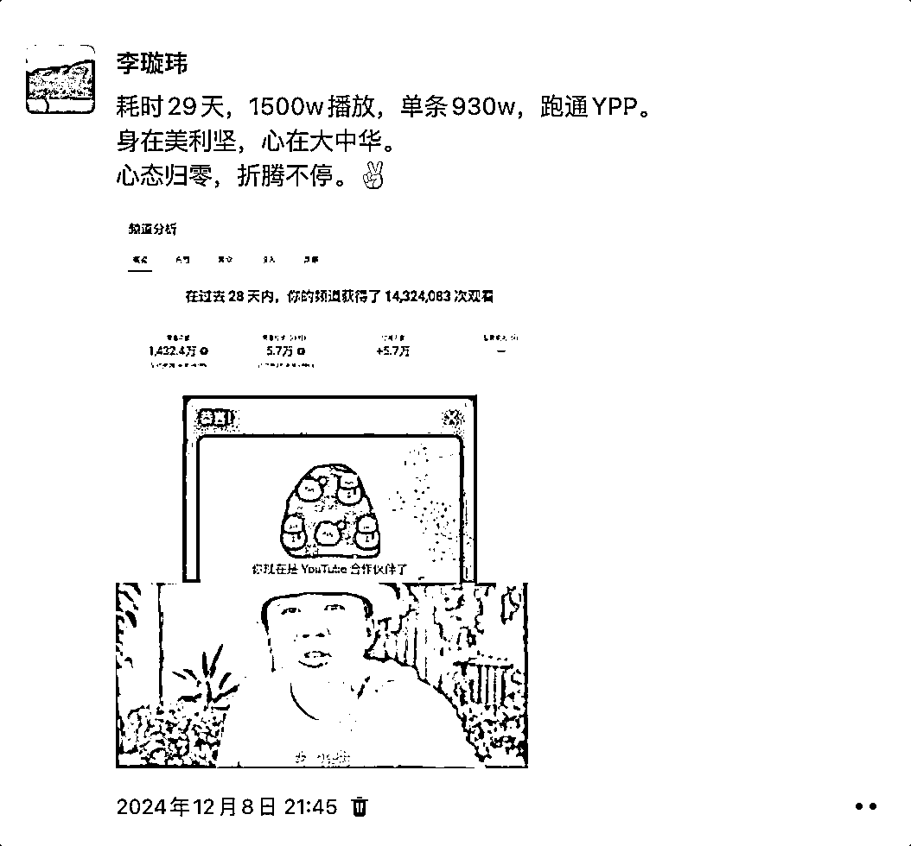
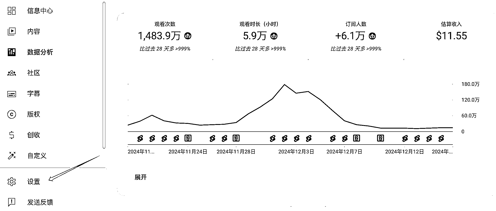

# 小白 29 天 YouTube Shorts 开通 YPP 复盘（男保姆版）

> 原文：[`www.yuque.com/for_lazy/zhoubao/gx4zga8perpixorq`](https://www.yuque.com/for_lazy/zhoubao/gx4zga8perpixorq)

## (精华帖)(75 赞)小白 29 天 YouTube Shorts 开通 YPP 复盘（男保姆版）

作者： 李璇玮

日期：2024-12-18

耗时 29 天，1500w 播放，单条 1070w，跑通 YPP。

身在美利坚，心在大中华。心态归零，折腾不停。

大家好，我是@**李璇玮** 。

来生财快两年了，一直潜水学习各位优秀圈友大佬。

首次发帖，措辞如有不当之处，多包涵。

这次分享，主要出于两点：

一是给自己初次做出海账号，做个深度复盘，也顺便给大家提供一些航海和其他圈友可能没提到的小细节。

二是想给大家打打气、泼泼水，让大家更明白自身状态。

在这，特别感谢三位圈友的分享，帮助很大：

**@方波妮** 分享的起号 SOP

**@老馬****🐎****内容出海** 分享的选赛道方法论

**@书情小跟班** 分享的关于 YPP 风向标

这也是我想分享的缘由之一，利他即利己。

放两张图：

具体大家移步飞书吧，排版更顺眼，祝大家阅读愉快：[`ntb7l7i3sy.feishu.cn/docx/CNnYd18U6oTmyexRLYPcznYJnjb?from=from_copylink`](https://ntb7l7i3sy.feishu.cn/docx/CNnYd18U6oTmyexRLYPcznYJnjb?from=from_copylink)

* * *

评论区：

方波妮 : 一如既往的优秀[强]

李璇玮 : 感恩～🫰

程序员赤小豆 : 优秀[强]

忧愁小松鼠 : 圈友真棒

李璇玮 : 感谢～

李璇玮 : 一起生财～

土豆君 : 太优秀了[呲牙]

allen : RPM 多少，最近感觉整体流量都在跌~