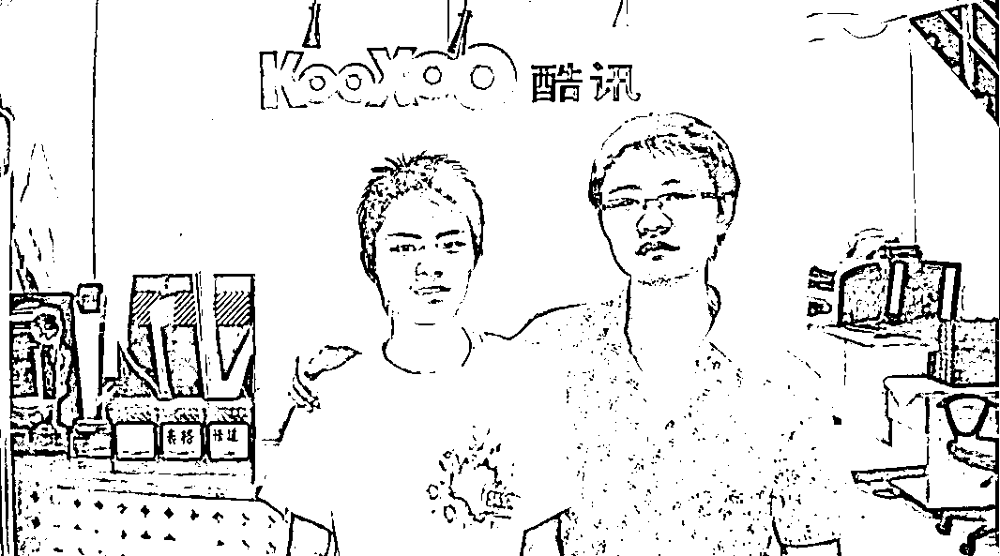
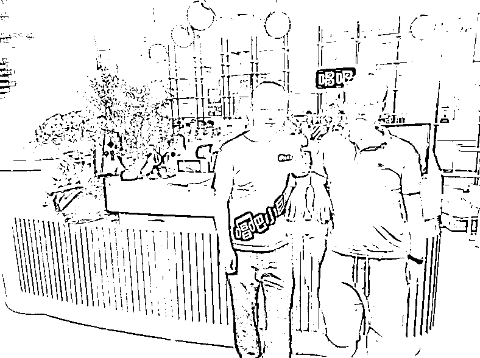
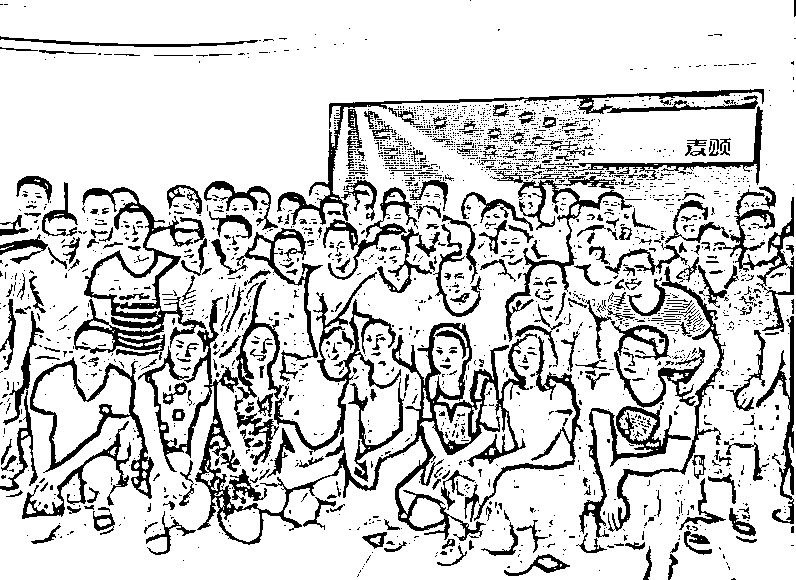
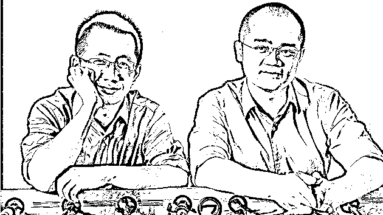
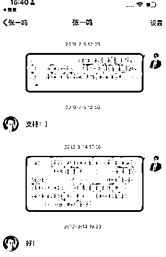
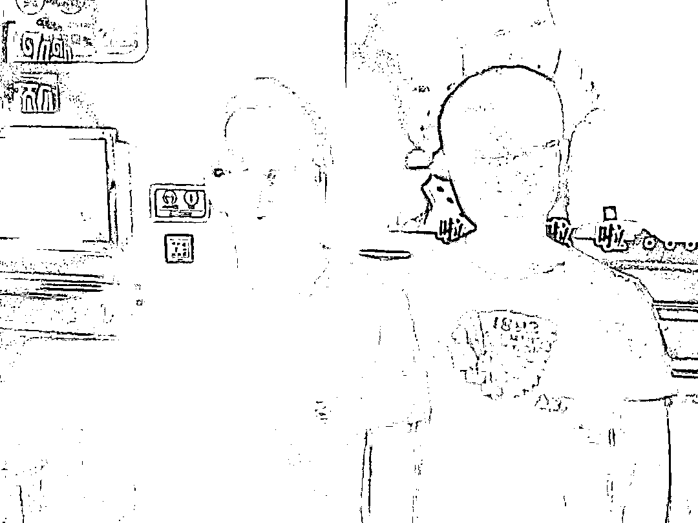
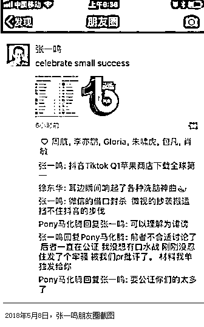

# 酷讯半年工作经历回顾与感悟

> 原文：[`www.yuque.com/for_lazy/zhoubao/arbvwf72g250zbgy`](https://www.yuque.com/for_lazy/zhoubao/arbvwf72g250zbgy)

## (28 赞)酷讯半年工作经历回顾与感悟

作者： 牟长青

日期：2024-12-16

相比在 360 整整两年的工作经历，在酷讯的时间比较短暂，只工作了半年，但在酷讯的半年的工作经历却很丰富多彩，和部门同事也建立了比较深的感情。现在回想起来，我结婚那年，真正来重庆参加我婚礼的北京老同事，两个都来自酷讯。

**入职酷讯的故事**

**  **

因为 06 年开始写博客，因此慢慢在网上有点名气，在 360 的时候，推广工作也做得不错。07 年我还在 360 的时候，就受老同事许飞的邀请，去酷讯市场部做了一场个人经验分享。也是那次分享，认识了我后面在酷讯市场部的领导郭瑞雪。

老同事许飞，在 360 的时候是新闻搜索产品经理，后面跳槽去酷讯任职酷讯机票事业部总经理，而当时的机票事业部也是酷讯最赚钱的一个部门。之前 360 无忧城市的产品经理张海军，也跳槽去了酷讯，任酷讯的产品副总。

07 年底离职 360，经历了失业和失恋的双重打击后，在重庆休息了 3 个月，08 年初开始继续找工作。因为在酷讯的那次分享，让我想起这家公司，然后在两位老同事许飞和张海军的推荐下，我去了酷讯面试。

这次直接就是应聘的经理级别的岗位，因此一开始就是酷讯创始人陈华面试的我，可能因为过往的业绩，还有许飞和张海军两位 VP 级别的推荐，因此很自然的就入职成功了。

08 年徒弟胡忠来酷讯见我，给我保留了在酷讯公司唯一的影像

**  **

**初入酷讯，急于做出业绩，提前转正**

**  **

北漂时候的我，属于特别要强的那种，北京的公司正常都是 3 个月后转正。但每次我都希望通过自己的能力，让公司给我提前转正。

我在 360 的推广主要做流量交换比较成功，而 360 门户，那时候本质上就是个图片网站，而且其中不乏差边的内容，只要选些火爆辣眼睛的图片广告，流量交换的效果就特别好。

而酷讯是个旅游搜索网站，因此不可能有任何差边的内容，因此也不适合做流量交换的推广，从而让才进入酷讯的我有点犯愁，该如何做出业绩，提前转正了。

记得当时看同事的工作记录，和几十个相关的网站互换 BD 位进行推广，也就才几百的 IP，可以说是惨不忍睹。如果我也继续用这个推广方式，很难做出业绩。

那时候可能年轻，脑瓜子真的很够用，当时我发现很多网址导航站，都有在首页收录“列车时刻表”这个工具，点击就是进入一个第三方的网站。因为酷讯当时算一个新网站，因此大部分网址导航推荐的列车时刻表，都不是酷讯做的。

我在进入酷讯前，就写过 TOP50 导航站的数据分析文章，因此很快就找到了这些导航站的负责人。用自己的商务口才说服他们改用酷讯的列车时刻表，然后用其中一个点，打动了他们。就是换成酷讯的列车时刻表，头尾的页面还是用他们的，中间的内容用酷讯的网页，再加上酷讯的产品不错，因此好几家 TOP10 的导航站都被我成功说服。

当时通过导航站每天能给免费给酷讯网新带来 1 万 IP 的精准流量，现在看来，这个业绩已经非常棒了，已经远远对得起酷讯给我的待遇。但当时的我，在 360 都是一天做几十万 IP 的业绩，所以觉得这点业绩，还远远不够。

2021 年我去北京出差，去拜访了陈华

离开酷讯后，和陈华一直保持着联系，记得还在酷讯在职的时候，因为接受了一个媒体的采访，分享我的推广经验。导致一堆人去问陈华，这个人是不是你们公司的。让陈华很尴尬。

因为唱吧另外个合伙人徐微，都是市场部的同事，因此去北京，唱吧公司去过好几次。可以说见证他们从小办公室换到了更大的办公室。

**把友情链接做到极致，也能做好 SEO**

**  **

虽然通过导航站推广做出了点业绩，但也很快就有瓶颈，毕竟有流量又愿意合作的导航站太少。能不花一分钱从导航站获取 1 万多 IP 已经不易。这时候了，我也没什么事情做。领导就临时安排我负责酷讯各个频道的友情链接交换，要求不高，把每个频道换 20 个左右就行了。

在负责友情交换的过程中，我发现交换友情链接对频道关键词的排名感觉帮助挺大。因此就突发奇想，写了一个针对列车时刻表频道的 SEO 计划发给相关领导，并成若在多少时间内，做到多少排名，获得多少流量。后面经过了 10 来天的努力吧，把列车时刻表这个关键词，从百度排名第 10（有 1000 左右的流量）做到百度排名第 3（有 7000 左右的流量）。就优化这一个词就让网站增加了 6000 的针对性流量。让我第一次发现做 SEO 推广，带来的效果比别的方式快多了。

因此就再写了一封酷讯全网的 SEO 方案，因为“列车时刻表”取得了效果，因此我的“SEO 方案”也受到了酷讯高层的高度重视。后面就让我全权负责酷讯的 SEO，并让我招募 3-4 个 SEO 链接专员，单独成立个 SEO 小组，更有效率的做这事情。

当时在酷讯，SEO 是酷讯技术部门负责的，记得当时还和技术部总监谢欣交接了工作，而当时的张一鸣是酷讯的首席技术，并不做具体的管理。多年以后，谢欣也加盟了字节跳动，现在是飞书的 CEO。

在酷讯负责了 3 个月的 SEO，效果最好的时候酷讯所有主流频道的关键词都做到了百度第一页。比如“特价机票”“酒店预订”“机票查询”“列车时刻表”等等流量很大的关键词。给酷讯每天新增了 3W 多 IP，我算过一笔账，如果公司花钱去买竞价排名，而且旅游的关键词价格又比较贵。3WIP 至少价值 3 万元，也就是通过 SEO，帮助公司每个月节约了 90 万元的推广费用。

现在回想，我给酷讯创造的价值，是远远大于酷讯给我的待遇。因为这些流量，是我去酷讯后，凭空产生的。在 360 做流量交换，虽然业绩很好，但至少还需要 360 要拿流量出去。

**酷讯公司的失败，酷讯人的成功**

**  **

那时候我虽然做出了业绩，但酷讯公司已经陷入一片胡乱。投资方和两个创始人产生了严重的分歧。在我刚入职几个月后，吴世春和陈华两位创始人，就先后离开了，投资方从外面找了个职业经理人进来当 CEO。

具体的原因，当时我也不清楚。现在回想可能投资方觉得陈华和吴世春不作为，比如我上篇文章有提到，酷讯作为创业公司，周末都不加班的。后面有听到八卦，说那时候老板爱打牌，而且其中还有某歌星 WF，经常打通宵之类的。我就说后面陈华做的唱吧，这个歌星 WF 还给代言过，可见私交是挺好的。

在这样的混乱下，我空有业绩，但在酷讯也升职加薪无望，因此工作半年后，我就跳槽去了另外一家做旅行的上市公司艺龙网。记得那时候为了离职，我还跟张海军说，我爸爸生病了，要回去照顾。那时候我爸爸确实生病了，但没严重到，因为生病需要离职。

当时的酷讯和去哪儿齐名，公司规模和网站流量数据都差不多，甚至因为我加盟酷讯后，酷讯的 SEO 数据已经反超了去哪儿。最终多年后，去哪儿上市了，酷讯这公司已经消失不见，域名都打不开了。

酷讯这公司虽然失败了，但因为酷讯这公司倒闭得早，离开酷讯的人，在最好的时间纷纷创业，还出了好几家独角兽公司。其中最知名的，就是张一鸣的字节跳动，还有吴世春的梅花创投，陈华的唱吧，还有陈驰的小猪短租等等。

当时张一鸣是酷讯的首席技术，说明在酷讯也属于重量级的骨干成员，如果陈华和吴世春不放弃酷讯，张一鸣自然也不会去创业。如果酷讯有一天上市了，可能就是去哪儿现在的水平，但大家就看不到现在的字节跳动了。

2016 年老酷讯人聚会，大部分人已经是创业者

**  **

**低调的张一鸣**

**  **

我基本和张一鸣同时从酷讯离职的，在 08 年 9 月份的时候，张一鸣以技术合伙人的身份加入了王兴团队，负责饭否和海内网的搜索。我也是在 9 月份加入艺龙网负责推广。

张一鸣和王兴同是龙岩老乡，相信张一鸣来北京不久，就和王兴认识了，所以离职酷讯后，会第一时间去老乡的公司。想到我才到北京的时候，也认识了一个重庆老乡杜均，因为一次活动上结识，因为是老乡所以来往得更频繁。我离开北京的那天，还是杜均请我吃饭送行的，现在杜均成了币圈的大佬，常驻新加坡。

那时候我也挺喜欢玩海内网，一个算职场人的社交网站，因为在海内网的活跃，也引起了王兴的注意，后面王兴还单独请我吃过一次饭，向我请教一些问题，有机会，我也可以分享下我和王兴的故事。

张一鸣在酷讯的时候就是埋头做技术的，社交很少，也很少出现在北京的各种圈子里的活动。这个跟同样做技术的王兴和王慧文不同，早期在北京，我在线下多个场合见过王兴和王慧文，后面王慧文也单独请我吃过一次饭。

周鸿祎，张朝阳，雷军，李彦宏这些大厂老板，经常能在北京很多会议上看到，我身边不少老朋友都能翻出和这些大佬在会场的合影。但字节跳动成功后，张一鸣也鲜少出席各种活动，可以说是非常低调，因此导致很多人基本没机会见到张一鸣，就别说合影了。之前因为 28 推的活动，我也经常接触到字节官方的小伙伴，我都会问他们，见过自己的老板张一鸣没，基本都回答没见过。

**我和张一鸣的过往**

实话说在酷讯那半年，我和张一鸣基本没接触过，那时候去张一鸣所在的技术部，都是和谢欣沟通比较多。

对张一鸣开始有印象，是他自己创业后，也知道我在网络推广这方面的知名度，因此我们很早就在新浪微博有互关。那时候他的微博认证就是九九房创始人，到现在这个认证都没变化过。

2010 年当时我在百度，负责百度有啊的官方微博，当时会组织一些营销活动，会找身边一些朋友帮忙转发。当时就找过一次张一鸣，后面 2012 年我自己创业后，也找张一鸣帮忙转发了一次微博。印象中这两次他都真的转发了的。毕竟那时候的张一鸣还没现在的成绩，还是非常好说话的。

再到后面微信也互相加了好友，张一鸣做九九房的时候，在微信里给我留言，让我推荐做 SEO 的高手去他公司，如果推荐成功，送手机一部。如果我知道张一鸣有今天，我当初就毫不犹豫把自己推荐给他了，哈哈哈哈哈哈哈哈哈。

记得 2014 年，今日头条已经非常火了，当时我在微信给张一鸣留言，问如何注册,我现在都记得张一鸣给我回了一个网址：mp.toutiao.com

在 2015 年底我在筹备 28 推首届大会，想到头条也算新媒体的一个平台。因此我找到张一鸣，问他能否来我们大会做分享嘉宾。他当时还很客气的回复，说那时候人不在国内，因此无法参加。如果 2016 年，28 推首届大会，张一鸣真来做了分享嘉宾，可能 28 推现在推广也没那么难做了。

2016 年的首届大会，虽然张一鸣没来，但另外位前“女首富”币圈一姐何一来我们大会做了分享嘉宾，并且连续做了两年的分享嘉宾。因为当时何一在一下科技，而一下科技的创始人韩坤，在上篇 360 周鸿祎的文章我也提到过，在 2006 年就和韩坤成为了好友。因此何一是代表韩坤来 28 推做了两次分享。

再然后就是 2016 年底，酷讯组织了 08 年之前的老同事聚会，也就是陈华和吴世春离开酷讯前的老员工。当时聚会的地点在陈华的唱吧，因此才有了我和张一鸣在 KTV 的合影，每次发这张合影的时候，我都特别解释，是在量贩 KTV，让大家别乱想。

那时候是 2016 年，抖音才刚刚推出，还没现在的火爆。早在几年前，在国内基本就看不到张一鸣出席任何活动了，目前长期定居在新加坡，在国内的时间都很少。

张一鸣在很早前也不用微信了，记得有一年，张一鸣在朋友圈说，以后微信停用，改用飞书，并在朋友圈留下了自己的飞书号。当时因为我没下载飞书，因此也就没加张一鸣飞书号。

张一鸣后面放弃使用微信，跟在 2018 年 5 月份，和马化腾在朋友圈发生了一次口水战是否有关系。

**一些别的小八卦**

**  **

陈华是酷讯的创始人，而张一鸣是酷讯最早的骨干，因此我想他们私交应该是不错的。有段时间，我看唱吧非常愁推广的事情，徐微还来请教我，也安排过同事参加我们大会和社群。

有一次我就问陈华，抖音火起来后，是否对唱吧有过特别的照顾。陈华回答我说，张一鸣是个特别理性的人，所以不可能有任何特殊的照顾，一切还是只能靠他们自己。

这个月底 28 推要在厦门做视频号大会和私董闭门会，让我想起了另外一个定居厦门的酷讯老同事。他是张一鸣的发小，最早 douyin.com 和 toutiao.com 两个域名就是他代张一鸣去购买的。

因为在域名圈就是如此，需要域名的公司一般不亲自出面去买，因为怕对方漫天要价。后面去厦门，基本每次都和这个老同事见见，一起回忆在酷讯的往事，也通过他了解张一鸣更多的趣事。

记得我通过他的推荐，加上了抖音总裁张楠的微信，但加上微信后，对方基本就没回过一句话。让我明白了一个道理，如果以后想认识字节跳动的人，级别太高的还是别直接接触，毕竟很难有共同语言。

**最后感想**

**  **

今天这篇文章内容，大部分内容是上周就构思好的，虽然只写了几个小时，但内容却想了好几天了。

从 06 年开始写博客至今，坚持其实很不容易，最近几年，我也基本断更了。因为发现偶尔认真写的文章，数据也不行。

08 年的时候，也是我正式写独立博客的日子，那时候独立博客一篇文章最少都是过万阅读，过百的评论。而且同步发 10 多个平台，可以说每篇文章的曝光都接近 10 万。而现在局限于微信公众号，曝光反而变少了。

主要那时候年轻，什么都没，唯一的爱好就是写博客，因此在推广上花的心思更多。而现在什么都有了，反而就变佛系了。

原创不易，希望大家多多支持

* * *

评论区：

小毛驴 : 图里有个人像亦仁[破涕为笑]