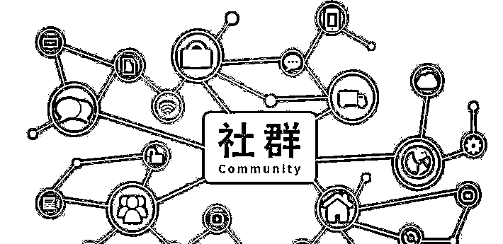
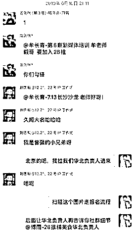

# 我眼中的副业，群响，山顶会，和私下一些不为人知的故事

> 原文：[`www.yuque.com/for_lazy/zhoubao/zeqcptylogkp6t3g`](https://www.yuque.com/for_lazy/zhoubao/zeqcptylogkp6t3g)

## (24 赞)我眼中的副业，群响，山顶会，和私下一些不为人知的故事

作者： 牟长青

日期：2024-12-19

在之前写周鸿祎那篇文章里，我提到过，因为周鸿祎对我的影响，后面自己做一个新项目，都会先研究同行的产品，然后想办法在这基础上去优化和创新，从而少走弯路。

因为 28 推公司从成立之初，社群一直是主营业务，因此在了解同类社群上面，我是花了很多心思。因此如果写产品案例分析，社群案例应该是我最熟悉的，也最能保证相对客观，真实。

在最早做 28 推精英会，当时财神大咖会，和触电会比我们先成立，因此这两个社群算是我早期研究的对象。疫情后，传统的社群模式开始走下坡路。而各种私董会如雨后春笋般冒出。而生财，群响都比 28 推先做私董会，因此在刚做 28 推私董会的时候，也有去了解了圈子里几乎所有主流的私董会。去年我还写过一篇文章“[各个私董会收费门槛，人群规模，活动特色分析](https://mp.weixin.qq.com/s?__biz=MzAxMTAzNzc4Ng==&mid=2650267411&idx=1&sn=b27560c03f8ca3ac6d2156c7f6851530&scene=21#wechat_redirect)”

生财，群响，山顶会是目前圈子里社群里做得比较好的，或者说知名度相对比较高的。因此对这三家，我做过很多各个层面的了解，问过很多同在这些私董会的朋友的体验感受，而自己也是生财多年会员和私董，在山顶会也三年了。

今天这篇文章，主要给大家分享这么几个点，首先是这三家在我眼中的一些优缺点，还有同样都是做社群的，28 推相比这三家的差异化。

我在网上看过不少对三家社群的点评，我敢说都没有我这篇内容来得更真实。所以希望大家有耐心看完，今天写了 6 个小时，一共 12000 字。

**先说说生财有术**

**  **

**1：产品为导向的生财有术**

**  **

生财有术让大家广而为知，就是他们在知识星球的生财有术这个圈子，特别是前几年 418 的时候，朋友圈基本都是他们的年度报名的海报刷屏。因此我身边哪怕没有直接需求的老板们，都会忍不住报名。因为稍微迟一会，价格就又变化了，在当时的势能下，可以说把饥饿营销做到了极致。

我曾经在生财有术的圈子，特意搜索过很多 28 推圈子里大佬的名字，大部分人的 ID 我都有看到，但同样这群老板其实并不是生财有术的目标人群，因为他们在知识星球基本也不会发一篇内容，后面可能 app 都不会打开了，只是短暂的过客。

这个就得从生财有术的产品定位有关了，因为里面大部分内容是帮助普通人寻找一个副业，因此门槛不能太高，从而导致天花板就会比较低。因此很难吸引这些已经赚到钱的大佬们了。

但我也觉得这是生财的优势，毕竟这个社会想赚钱的普通人更多，从而生财的目标人群基数也更大，这也是生财能做目前累积 6 万多付费会员的原因之一。当然最重要的是生财有术确实也帮助了很多人成功。特别现在的大环境下，失业率特别高，生财这样的圈子，可以帮助很多想赚钱的普通人改变当前的困境。在我看来花这 3000 多元是非常超值的。

相对来说 28 推服务的是圈子里已经很懂的老板，我们想做好这群人的服务，真的很不容易。他们要么觉得自己不需要学习了，要么觉得自己在圈子里多年，人脉很丰富了。当然这只是他们的以为，还有些人是业务不好做的时候，才会想到 28 推。

其实曾经的 28 推论坛和生财有术很像，也是交流经验，也会分享赚钱的业务。只是在那个年代，知识付费的概念很淡，虽然我们做了几十万的会员，但因为是免费的，因此也赚不到钱。所以我后面走向了另外个极端，只做老板的生意。

生财的推广主要是靠口碑推荐，特别是在分销机制的加持下，把口碑推广做到了机制。其实当年 28 推论坛也做过类似的事情，只不过我们是免费论坛，帮忙推荐最多是有虚拟积分，没现金来得那么有动力。后面我们因为是资源对接为主的社群，所以我一直不愿意做分销，因为怕这样来的人，不好把控质量，毕竟资源对接的隐藏风险更多。

曾经我也学习生财做过一个 28 推的知识星球，但后面发现我们的人群，不适合这样的产品，最终还是放弃。让我也想明白了，影响什么人群，做适合他们的产品才是最好的。

**2：我眼中的亦仁，和不为人知的故事**

**  **

生财，群响，山顶会的几个创始人我都算熟悉，整体来说亦仁算接触得最多的，主要是觉得我和亦仁在性格上相对比较接近。我们都是做产品为主，不爱拍短视频，不爱直播，偶尔写写文章，也不太喜欢线下的应酬。只是亦仁在线下这块，感觉比我更佛系。

我和亦仁同时在好几个私董会，感觉亦仁很愿意加各种圈子到处看看，但可能是因为他性格的原因，我基本没见到他参加过别的私董会的活动。唯一的有次印象中他参加过杭州一个私董会的游学活动。

亦仁可能觉得在群里就可以了解同类产品，但真正要了解一个社群，还是要走到他们的线下活动。比如 28 推，如果只看我们的线上，做得很一般，但我们的精华都在线下活动。

亦仁早期也加过 28 推精英会，但非常的低调，默默的潜水。后面也加入 28 推私享会，但也是很少说话，也没参加过一次线下活动。感觉亦仁是了解了各个社群线上的精华，但线下都没接触到，而私董会是一个非常重线下的产品。

但亦仁是个很好的产品经理，生财有术的这个产品也证明他的实力，同时也是因为他早期做过很多网赚项目，所以才有经验基础做这个产品。就像我早期也是做过很多网络推广的实战，所以后面才能做 28 推这个网络推广交流论坛。

记得和亦仁最深的一次交流，是在生财西双版纳闭门会，当时去郊区一个景点，在大巴车上我们坐一起。当时我就问了他后面对私董会的规划，他提到会做转型，最终这个转型产品就是生财航海家。但在我眼中吧，还是因为线下这块不是生财的强项，航海家最终还是有点不温不火。

**3：名存实亡的生财私董会**

可能因为亦仁性格比较内敛，不太爱线下的社交，也注定了生财私董会很难做起来。其实山顶会的李波也是类似的人，但李波有田园，所以补上了这个短板。之前总有同在山顶会的私董跟我说，28 推公司缺个田园这种负责运营的，我说不是 28 推缺，是外面的私董会都缺个这样的人：）

当时负责生财私董会的光合，感觉跟亦仁差不多，也是性格内敛。如果换成是田园操盘，可能生财私董会说不定还活着。

生财才开始做私董会的时候，定位很高，收费高达 6-7 万，也提供了很多服务。我在 2021 年做的第一个私董会，就是学习的生财，提供了类似的服务，只是价格收的 4-5 万。做了一年，我就坚持不下去了，直到后面我进入生财私董会，才知道是我学习错了对象。

我当时是很认可生财提供的服务，我觉得也值这个收费，所以我才开始做私董会才会像生财学习。但最终实践发现，很多服务只是我们的一厢情愿，大部分服务私董并没用上，而我和亦仁都属于比较有责任感，脸皮薄的人。因此在这样的情况下，生财私董会招募了 100 多人后，就暂停纳新了。

总结来说，生财这家公司，很擅长做线上的社群产品，但线下这块，因为创始人亦仁的性格原因，加上也没合适的合伙人操盘，因此偏线下活动为主的私董会这类社群产品，就相对运营吃力一点。

**4：我个人在生财的收获**

**  **

其实我身边不少朋友都有在生财，或者说是我去生财后才认识的朋友。比如我在生财最大的收获之一，就是认识了盗坤。当时进入生财私董会，100 多人的群，只有盗坤是在重庆创业的私董。

然后没过两天，盗坤就来 28 推公司拜访我，然后报名了 28 推私董会。随着我对盗坤的了解，也觉得这个小兄弟非常的优秀，有丰富的实战经验，口才也好，因此在 28 推很多重要会议上邀请他作为分享嘉宾。后面做 28 推私享会，盗坤也帮忙推荐 10 多个朋友进来，可以说能在生财认识盗坤，让我觉得加入这个圈子就已经很超值了。

这个就是社群的魅力，虽然我和盗坤都在重庆创业，甚至我们的办公室相隔不到 1 公里，但一直互相不认识。如果不是加生财，我和盗坤的相识可能还会再晚几年。

而盗坤也因为在 28 推，在重庆不再孤单寂寞，因为他以前在重庆基本没一个互联网老板朋友。加入 28 推后，认识一群重庆本地的互联网老板，不少人都成为了盗坤的好大哥，对盗坤这两年的发展起了一些帮助。

进入生财私董会后我也发现，里面做个人 IP，知识付费的私董相对较多。而这类私董和生财影响的人群非常契合，因此他们在生财的获益也不小，因此也是生财非常坚定的铁粉。

生财的活动我一共参加过三次，一次私董闭门会，两次生财龙珠大会。因为加入生财私董会比较晚，就参加了一次西双版纳闭门会。虽然聚会只有几十个人，但质量还是可以的，毕竟当时生财私董会费用是 6-7 万，因此参加闭门会的老板整体实力不错，从而更能同频交流。那次闭门会认识的好几个私董，后面也加入 28 推私享会，比如狗哥，当下，妖怪，郭拽拽等等。

相对来说生财龙珠聚会，对我来说意义不大，去了两次，感觉人群很泛，公司规模大的很少。特别记得第二次参加的时候，我特意在 VIP 嘉宾群里组织了一个小房间交流，当时来了几十个人，我让每一个人做了自我介绍后，让我绝望了，因为发现大部分行业不对口，公司规模也相对比较小，跟 28 推的人群，可以说完全不匹配。所以后面生财的大会，哪怕给私董提供免费门票，免费住宿，我也没动力去了。

**再说说群响**

**  **

**1：知识付费为主的群响社群**

**  **

提到群响，就不得不提到刘思毅，相比亦仁的性格，刘思毅是另外个极端。很多人可能是因为先知道生财有术这个产品，才知道亦仁这个创始人。但在群响这边，可能很多人都是先知道刘思毅，才知道群响。

刘思毅作为北大传媒系毕业的学生，确实在营销方面非常有天赋。年轻，鸡血满满，感觉就像一个永不停歇的小马达。抛开个人因素，我还是挺佩服刘思毅这个人的，够拼，敢说，能有现在的成绩，也是理所当然的。

只是在我眼中，群响不像一个社群，更像一个知识付费的产品，特别是在这两年特别明显。

我看群响每次搞一天的大直播，都能卖大几百份会员，我看现在对外宣称的会员数已经过万。提供的主要交付就是线上的课程和线下的会议分享，其实就是知识付费的交付，在我的理解，社群更应该是偏重会员之间的链接。但以群响现在的会员数，如果还做会员链接，群响的工作人员是忙不过来的。

以前的群响的口号是找流量来群响，主要面向新电商人群，但因为这两年刘思毅个人 IP 的破圈，好处是会员规模上去了，坏处是会员人群变泛了。

但在我看来，群响普通会员的收费并不算贵，可以说性价比挺高的，对于想学习新媒体，想了解新媒体的还是非常值得加入的。作为一个新媒体入门的知识付费产品，我觉得刘思毅做得挺用心的。

**2：再说说群响私董会**

**  **

群响私董会第一年是 49800，续费多少钱不太清楚，因为问了多个人，给我的数字都不一样。所以我现在也不知道群响私董会具体的续费政策是如何的。

刘思毅坚持每天日更，每天 10 多条朋友圈，大家是否发现，提到群响私董会的内容越来越少了。相比生财私董会的果断暂停，28 推私董会转型私享会模式，山顶会专注的做私董会，群响私董会在中间其实充满了尴尬。但我并不觉得群响私董会的服务不行。

很多时候有对比就有伤害，其实我以前站在外面看，并不觉得群响私董会如何，但因为杭州还有个更差的，但收费差不多的私董会，然后我再看群响私董会，觉得刘思毅还是花了心思的。

但私董会的模式整体都再走下破路，因此私董会的续费其实比想象中难。我问过至少 10 个在群响私董会的朋友，说愿意续费的大概在三成，不愿意续费的有七成，其实在群响私董会的客单价，这个成绩并不差。山顶会续费高，是因为续费价格只有第一年的 1/5。关于山顶会的模式，我后面再细说。

在杭州还有一家私董会，我就不说名字了，我也问过了 10 多个朋友，但 10 个人里 9.9 个人都说不续费了，所以对比下来群响私董会还是不错的。至少群响私董会还是组织了不少小规模的交流活动。比如国外游学，国内的闭门会等等，还是有认真在做交付。

记得去年底在 28 推南澳岛闭门会，我也问了几个也在群响私董会的老板，当时有老板说，现在群响私董会冲着创始人 IP 进来的越来越多，导致人群比以前泛了，里面的一些做品牌电商的私董都没续费的动力了。

但刘思毅很早就意识到这一点，最开始他想把私董会做到 1000 人，后面发现这个不可能做到，就对外声称专心运营好 500 人。而且知道私董会模式走下坡路，他再努力也没用，但公司还得寻找更多出路啊。所以现在群响业务更偏向卖两年的群响会员和线下培训课程。我看最近还准备让一个合伙人做 IP 服务。

总体来说，群响今年发展得更好，因为刘思毅够拼，人也聪明，总能找到新的增长点。

**3：生财，28 推和群响的恩怨情仇**

**  **

这段属于八卦环节，我之前写文章八卦了张一鸣，周鸿祎，因此今天也自我八卦下，其实也都是一些过去的小事情。

我才加入生财私董会的时候，在里面认识个私董是生财的铁粉，每次我跟他讨论起群响，他都咬牙切齿的说群响这公司快倒闭了，但群响一直却没倒闭，反而发展得越来越好了。

当时生财和群响的关系很僵，虽然都在杭州，但属于完全不往来的。关于这个问题我问过生财内部的人，为何会这样了。得到的回复是，刘思毅才做群响的时候，生财和亦仁对群响有过很多帮助，但群响做起来后，把生财当成假想敌，从而关系变得很微妙。

但前段时间，我看刘思毅去拜访了亦仁，还发了一个采访视频，相信这段小插曲也翻篇了。

我才知道群响的时候是 2019 年，是钱钰给我推荐的，说这个社群做得不错。结果没过多久，刘思毅就在我们成都一个会员的引荐下，报名了 28 推精英会，还是一下子报名了 3 年。

刘思毅报名 28 推社群的时候，公司还在北京

后面我也安排了一个公司助理报名群响社群，想着也是支持下，也学习下别人的优点。但有一次我同事分享了一篇 28 推访谈老板的文章到群响会员群里，然后就直接被群响工作人员踢了。

当时这个事情，我挺生气的，但我没去问刘思毅，因此到现在我也不知道是刘思毅的意思，还是下面工作人员的操作，但这个事情却让我记在了心里。因为换位思考，我们也是做社群的，就算有会员在群里发了广告，我们最多也是先警告，再不济关两天小黑屋，不可能直接踢人的。

因为当时也是 28 推社群最红火的时候，不知道群响是不是也把我们当成是竞品，所以对我们过于敏感。后面群响的合伙人 Allen 报名我们的戈壁徒步活动，就被我们同事以当年这个事情为由，拒绝了 Allen 的报名，我们宁愿不赚这个钱。

只是现在回想，我觉得这些都是小事，因此去年还和群响交换了普通会员的权限的资源互换合作。也就是互相送一个会员名额，我之前和生财私董会其实也是这么操作的。

**4：再谈谈刘思毅这个人**

对于刘思毅这个人，在网上有很多争议，比如喜欢粗口，未婚生子，恋爱取向等等。特别是后两个，我觉得是别人的私事，我更多是尊重。毕竟在现在这个社会，大家都是思想解放的新一代，没必要还这么保守。

在我眼中，刘思毅真的很拼，坚持日更文章，发 10 多条朋友圈，拍短视频，动不动就直播一整天，这些都是我做不到的，所以我更多是佩服。

但唯一让我不喜欢的，就是刘思毅在某些场合下喜欢夸大其词，因为这个跟我的价值观多少有点违背，所以无法接受。前几天，我看到龚文祥解读刘思毅的一个老视频，里面也提到刘思毅习惯夸大数据，比如千人会议说成万人会议，龚文祥说刘思毅什么都喜欢放大 10 倍说。放大 10 倍，可能夸张了点，但对于我的价值观来说，放大 2 倍说，都是不道德的。

我以前从来没公开说过这事，但龚文祥都能发视频说，我想刘思毅应该也不在意这些。

记得早在 20 年的时候，有同事说群响的会议搞得不错，说有机会去看看。正好那个月我们在杭州搞峰会，然后第二天就是群响号称的 5000 人大会。因为群响的活动，报名都是免费的，因此就和几个同事去现场看看了下。

我去别人的会议，都有个习惯，先数会场的座椅数。当时会场座椅数也就只能坐下千人，并且还没坐满。所以那场活动最多就是千人规模。但会后，刘思毅还一本正经的在朋友圈复盘，说这次有 5000 多人报名，来了现场的也有 5000 人。

还有一次是我们广州大会结束，第二天是群响的广州会议，只针对群响会员的，号称有千人规模。其实我当时就想，如果只针对会员，哪怕是免费活动，能来千人，不太可能。因此让两个合伙人也去了现场，她们正好也是会员。结果发现现场就 200 人。但刘思毅还是一本正经的在朋友圈说，今天会场来了 1000 人。

为何我觉得这个事情不道德了，因为群响的会议大部分是免费的，因此会务收益主要靠赞助商和后续的会员转化。但会议的真实规模，直接关系到赞助商的效果。如果虚报参会规模，是对赞助商的不负责。当然这个可能也是我想多了，群响的赞助商压根不在意这个。

我们自己搞了 7 年活动了，从来不虚报，记得去年搞短剧大会，本来预计 300 人的活动，结果来了千人，但我们还是按 300 人规模收的赞助费。

刘思毅夸大其词的方式，从营销的角度确实很有效果，但这种事情，我和亦仁这种脸皮薄的，真永远做不出来。当然这个只是站在我的角度，可能别人不觉得这个是什么缺点。刘思毅还有一点我不喜欢的，就是看人下菜，但这个具体案例我就不公开说了，有点敏感。

在这里不得不再提到龚文祥，其实我以前对龚文祥没什么负面观感，但后面成为微信好友后，经常看他为了营销自己，说了非常多误导他人的言论，好几次真的都想去骂人了，想想还是算了。龚文祥不光是自己经常发布一些夸大的言论，还给自己一众刚刚入行的会员背书，说对方是某某领域第一，然后去误导更多的人。我觉得做人高调没问题，但不能为了目的，去乱说啊。

28 推会员找我录视频背书的，我基本都拒绝了，因为在不了解具体的情况下，我不想去误导别人。

**最后说说山顶会**

**  **

**1：团队作战的私董会**

**  **

山顶会是这三家里面，在社群业务里，唯一专注做私董会的，也可以说是私董会里做得最成功的。而成功的关键，就是有一个很好的团队。

28 推同时在山顶会的私董也不少，他们经常跟我说山顶会的成功，就是没有短板。创始人李波做 IP,负责推广，合伙人田园负责社群运营，另外个合伙人江洋负责营销转化。在这三个方面，都可以说做到了极致。

山顶会的公司规模也是最大的，听说多的时候光销售人员就有 200-300 人。这一点跟生财，群响，28 推都不一样，我们这几家公司团队规模最大的时候，也就几十人，而且应该都没全职的销售人员。

山顶会大概的销售链路是，通过李波作为 IP 输出，然后吸引想做新媒体的传统老板，先是参加线下培训，再从培训人员里面转化成客单价更高的私董。每次培训会分成很多个小组，每个组除了参加培训的新学员，还会安插两个对山顶会认可的老私董，帮忙做口碑推荐，里面也有全职的销售负责人。

因为我没去过现场，这些都是在山顶会的私董给我的转述，大概就是这么个流程，不一定完全对。

写这篇文章前，我也没具体去问这三家怎么做的，我怕去问了后，写出来的内容就不客观了。

因为山顶会的工作人员多，因此成本压力也是最大的，虽然有李波和两个人合伙人，但肉眼可见的辛苦，所以他们能赚这个钱，我也从来不眼红。

**2：山顶会的运营诀窍**

首先田园是个非常优秀的运营负责人，曾经我还一度让公司的运营人员学习田园是怎么发朋友圈的，后面跟别的私董会创始人聊天，发现他们也做过类似的事情。

田园的记性特别好，基本能记住每个私董的名字和做什么的，从而让私董感受到了重视。当然这记性好的背后，可能是田园私下做了很多功课。而且也会主动给私董做一些链接，让他们感受到了家人的关怀。

田园在早期不辞辛劳，给山顶会创造了一个很好的家人文化，或者说田园通过自己的努力，给了很多私董比较高的情绪价值。我曾经问过很多同时在 28 推和山顶会的私董朋友，他们对两家私董会的感受区别。

其中让我印象最深刻的是成都私董可期，他说从业务角度，28 推私享会对他的帮助更大，但从情绪价值的角度，他在山顶会感觉更有归属感。

其实加入一个私董会也就是看这两点，要么能获得对公司业务的直接帮助，要么能在里面获得情绪价值。就像我这边有一些私董，其实来 28 推，也不需要对业务有帮助，但他们觉得来 28 推的活动非常的开心，也就是情绪价值满满，因此也愿意每年续费。

可能因为我是重庆人，加上我们的戈壁徒步，在 28 推更多是有点江湖的兄弟文化。比如我上次参加山顶会的重庆聚会，其中有个私董大鹏，也是我们 28 推的 V4 私董。他当时就说了，在山顶会的活动基本没人组织喝酒，但在 28 推的活动，每次必有酒局，但他也说，如果不能喝酒的，大家也不会硬劝的。

山顶会的活动也非常丰富，经常会组织线下小范围的交流活动，同时每次还会在线上直播，从而让更多人有学习机会。但这种模式是建立在山顶会是个学习型的私董会。

比如同样是做茶话会，我们和山顶会的茶话会模式完全不同。山顶会的茶话会每次是找一个人做 PPT 分享，并且同步在腾讯直播给更多山顶会私董在线学习。一般 2-3 小时就能结束。

而 28 推的茶话会是每次 8-10 人，进行长达 8 小时的深入交流，为了保证大家畅所欲言分享干货，因此我们都不会做同步直播，因为这样就违背了私密茶话会的初衷了。

其实对比下来，山顶会的茶话会模式更轻，并且线上直播同时交付了更多爱学习的人。28 推的模式相对更重，但深入其中收获会更大。

这两年山顶会的新私董，70%都是传统老板为主，他们进来第一目的是学习，因此山顶不会学我们的模式，因为如果 10 个人，7 个人是来学习的，这个茶话会就开不下去了。同样 28 推的老板，能做 PPT 分享的很少，我们找不到那么多老板做 PPT 分享，因此山顶会的模式也不适合我们。而且我一直觉得私下的交流，才更容易出现干货，所以大家的模式没有谁的更好，只能说对自己的私董更好。

**3：我对山顶会的偏见**

**  **

为何这么说，因为这个只是我个人角度，觉得山顶会做得不让我开心，但不代表他们这么做不对。

记得加入山顶会第一年，他们在广州搞年会，其实当时我准备去的，但后面发现报名还需要单独交 1300 元，并且只提供一顿晚餐，从而让我打了退堂鼓。

毕竟当时我真金白银交了 2 万的费用，我想私董会的内部聚会，就算不提供食宿，但也不至于还要另外收费吧。因为那时候同类私董会，这种内部聚会，大部分还提供食宿的。特别是那时候我刚做私享会，收费 5980，每年还提供两场包吃包吃三天两夜的闭门会。

所以当时听说还要单独缴费，让我一时有点想不开，并不是说差这点钱，反正就是难于接受。为此当时我还和田园通了电话，说了我这个疑惑。田园的反馈说，搞会议成本太高。我好在也搞过几十场大型会议，所以这个理由她说服不了我。

因此那次就没去山顶会的年会，改去了杭州，参加了生财的龙珠聚会，因为生财给私董至少安排一晚的住宿，记得那次我和盗坤住的一个标间。后面盗坤也介绍我认识了孤狼，孤狼邀请我参加他们的私董闭门会，因此那次我直接在杭州待了 9 天，因为生财龙珠聚会和孤狼的活动相隔了七天，我索性就留在杭州不走了。

最近几天山顶会也在广州搞内部分享会，也是要单独缴纳报名费。但其实这次没去的原因，并不是因为报名费，主要是我觉得现在山顶会传统老板的比例越来越高，感觉很难同频了，因此觉得去现场怕也找不到多少共同语言的人。

**4：我个人在山顶会的收获**

**  **

记得在山顶会第一年到期的时候，田园主动给我来电话，问续费的事情。但当时加入山顶会一年，我没参加过山顶会任何一场活动，也没听过任何一场线上分享。其实这种情况下，如果是在 28 推，我的同事都不太敢跟这种私董提续费的事情，就更别说直接打电话说了，当然这也是我佩服田园的地方，希望我公司的负责私享会的合伙人，脸皮也能再厚点。

但最终我续费了，因为当时通过山顶会认识了一个重庆的私董苏海明，后面苏海明直接在 28 推私享会续费了 10 年，成为 28 推私享会唯一的 V10 私董，因此就这个业绩，就让我愿意给山顶会续费。

只是前两天和苏海明聚会，他说最开始是听到小黑哥跟他推荐的 28 推，只是通过山顶会加了我的微信。

山顶会平时的小活动，我觉得这么远去不值得，年度聚会虽然更值得去，但因为要收费，又过不了自己心理那关。从而导致在山顶会三年，我没参加过一场山顶会重庆之外的活动。

第二年我是让米峰进去的，因为我想山顶会里面的私董姐姐比较多，米峰这种爱健身，又会谈吉他的小帅哥进去，会不会能跟里面的姐姐更好沟通。但后面我发现，这些姐姐没那么肤浅，当然也可能是米峰在山顶会也不够活跃，没能引起姐姐们的注意。后面第二年山顶会付费的年会也让米峰去了，也没什么收获。因此后面第三年，还是换成我继续在山顶会，我想姐姐们应该还是喜欢成熟有内涵的创业者。

当然除了苏海明，通过山顶会认识，然后加入 28 推私董会的没有 20 个，也至少有 10 个，因此还是挺有收获的，这也是会一直续费的原因。只是山顶会传统老板的比例越来越高，确实不是我的目标对象，再加上我又不能去线下活动，所以第四年我多半不续费了。

因为没参加山顶会的活动，就很难感受到更多的情绪价值，因此就能单纯看对公司业务有帮助没了。其实我更喜欢加入那种专业度更高的私董会，里面大部分都是我的目标人群。比如我置换的另外一个社群，里面都是做电商的大佬，光那个社群，我转化的私董没有 50 个，也有 40 个，roi 算下来可比山顶会高多了。

但去别人的社群从来都不会跟里面的会员，赤裸裸的推荐我们的业务。一般就是加上个好友，发个自我介绍，然后就顺其自然。不少人都是加上好友 1 年，2 年后，突然有一天主动找到我加入了 28 推。因为当他们对我们有需求的时候，就会主动跟身边在 28 推里面的朋友了解我们，而我们多年来口碑一直非常好，从而很自然的就转化了。

**5：山顶会续费高的核心原因**

**  **

虽然田园很优秀，虽然山顶会的服务也做得很到位，活动组织得频繁，会员之间不少人也有家人的感觉。但这些都只是基础，山顶会最聪明的地方是，首单报名费很高，但续费价格却很低，但这招很多私董会学不来，也无法学。

山顶会第一年是 49800，但第二年续费只要 1 万元，但第二年获得的服务和第一年没任何区别，因此在我看来，在这样的情况下，如果都不续费，那不是打自己的脸吗，毕竟当初 49800 都花了。

因为我进山顶会早，第一年只花了 2 万元，如果我也是花 49800 进去的，可能我后面也会继续花 1 万续费多年。

而且山顶会很聪明，不会提供免费的吃住活动，年会也要单独收费，从而保证虽然续费单价下来了，但成本并没增加。

但在我心中，对于真正需要的人，这 49800 肯定是值得的，我并不觉得山顶会收费贵。就像我们现在收费 9980，我也没觉得多便宜，只是因为同行都是 29800 起，所以对比下来，28 推的收费就便宜了。

而对于山顶会来说，公司这么大的团队，还要付费推广的成本，第一年不收费 49800，多半公司是要亏钱的，所以只有这样的收费，才能维持公司正常的运转。至于后面续费只要 1 万，毕竟后续的没有推广和销售的成本了。

我也一直想学习山顶会的续费模式，所以努力的把 28 推私享会从 5980 涨价到了 9980，然后续费一年只要 7980，如果一次性续费三年，只要 6980，并且还提供更多的服务。但相比山顶会第二年续费只有第一年的 1/5，因此对用户的刺激程度还是不够大。但通过这个方式，也成功让 200 位私董，提前续费了 4 年。

为何群响不能学山顶会的模式？因为群响跟 28 推一样，要提供包吃包住的闭门会，如果续费价格太低，那公司是亏钱的。如果我今天说 28 推私享会续费只要 2980，肯定续费率也会直线上升，但这个费用，连人工成本都不够。我们一场闭门会的人均成本就是 2000 元了，还别说给员工还要发工资这些。

其实这个已经不是价格的高低，而是对人性的把握了。按说山顶会就算续费 1 万元，还比我们首单贵 20 元了，我们还提供包吃包住的闭门会，但为何续费还是没山顶会好了。就是因为续费价格没比首单低多少，让需求不太强的私董，就没有续费的冲动。

有人看到这里可能会说，那你们为何不首单收更高了，并不是我认为 28 推私董不值更多的钱。其实在我心中，现在 28 推私享会的价值，和当初收费 49800 的私董会提供的价值其实更大，虽然某些服务少了，但提供的服务更接地气了。

但我们没有山顶会的实力，当前的个人 IP 影响力我远远不如波波，运营我几个合伙人加起来也比不过田园，至于销售我们就没有人。有太多的短板。

不收费这么低，也不会有 1000 多个私董，如果勉强做收费 49800 的私董会，可能公司第二年就倒闭了。相反做低客单的私董会，我们不做什么推广，也能吸引 1000 多人报名，虽然私董会不怎么赚钱，但有了人，我们每个月还能继续做峰会，通过峰会，公司还能有微薄的盈利。

所以最终的总结是，如何收费，并不是一味的模仿，还是要看自身团队的实力，适合什么样的收费模式。

**6：我和李波的过往**

加李波的微信挺早，因为在 2016 年他就参加 28 推首届大会，因为那时候报名的人都要加我的微信转报名费。后面在 2017 年李波也报名了 28 推第四期培训，为何这两个事情我能记住，是因为重要的活动群，我都会给里面的人打上标签，因此事隔多年，这个人参加过我们什么活动，我都一清二楚。

再后面李波到广州创业，才开始并不顺利，那时候搞了个知识付费产品，波波来了，分享他采访的行业大咖。当时也来采访我，想到我在重庆，让他过来太辛苦，因此我在深圳出差的时候，他和田园来禾葡兰总经理的办公室做了这个访谈。

记得当时访谈了四小时，我把自己如何运营社群，如何做线下活动的经验都分享了出去。后面李波这段采访内容做成了文章和视频，真的比我自己做自我介绍都还更清楚，当时就挺佩服李波的总结能力。

后面李波在广州做创业者大会，还邀请我去做了分享嘉宾，去之前跟我说是千人大会，后面到了现场，目测应该就 300 人。那时候李波公司听说是亏钱的，毕竟波波来了这个产品，那时候只收费 300 多元，做付费会议报名费也不高，会议规模也低。

再后面在疫情期间，李波通过坚持在视频号直播分享，突然破圈了，每天都是上千人在线。也是在那时候，我也邀请李波在我们广州大会做了分享嘉宾，就是分享他如何把视频号直播做起来的。

有了个人 IP 后，再到后面李波的事业就越来越顺利了，做起了创始人 IP 的培训，再然后就有了大家看到的山顶会。

李波这个人，我是非常佩服的，作为一个连续创业者，拖着一家老小来到广州重新创业，非常的能吃苦。今天的山顶会有这样的成绩，其实我由衷为他感到开心的。说明天道酬勤，只要肯付出，早晚都会有回报。

**最后总结**

说实话，我没想到今天这篇文章会写这么多字，可能每个社群单独介绍会更好。只是内容都写好了，再弄成三篇文章不是我的风格。

为了内容尽量有看点，我今天也说了一些以前从来不敢公开说的观点，但不管是夸的，还是不好的，都是真实感受，我们就主打一个真诚吧。

社群做到今天，其实每家社群影响的人群差异化越来越大，本质上来说现在都谈不上是竞品。

最后再说句内心的话，这三家社群，做得越大，其实我内心越开心，因为大家是一起在培养这个市场。可能有一天，当他们社群的会员需要更多差异化交流的时候，也会想到 28 推。因此他们规模做得越大，对 28 推来说并不是坏事。

原创不易，希望大家多多支持

* * *

评论区：

亦小亮 : 公众号刚看过，哈哈

贤雅 : 财神大咖会加入过， 不知道现在还有没有

牟长青 : 没有了

黄承德 : 哇，写的好详细，娓娓道来[强]

胖大魔（AI 提效版） : 昨天朋友还在跟我说，他在财神会待过