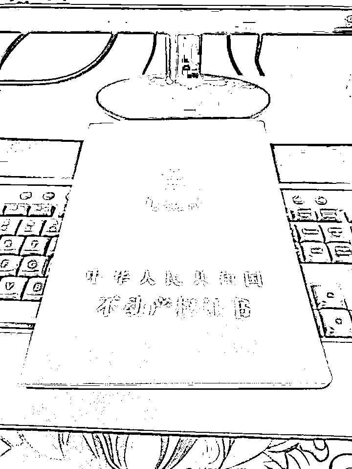
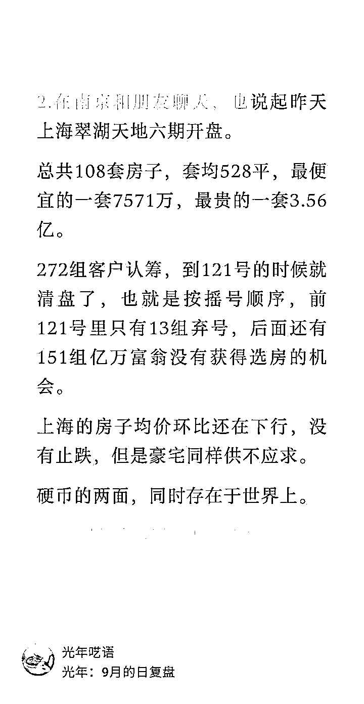

# 投资失误：三年亏损百万的房产交易

> 原文：[`www.yuque.com/for_lazy/zhoubao/dgifv9l0o2rc2u4g`](https://www.yuque.com/for_lazy/zhoubao/dgifv9l0o2rc2u4g)

## (17 赞)投资失误：三年亏损百万的房产交易

作者： 光年

日期：2024-12-16

最近又卖了外地一套房子，这两天过户了，等尾款到账。

2021 年买入，总价 200 万，首付 4 成 80 万，贷款 120 万。当时的贷款利率高达 5.9%，对比当下利率，相隔三年，是不是很难想象。

纯投资，远程看着资料选定，大湾区二线城市的新区，有规划、有家门口在建的跨海大桥，一桥通达港澳。选房没到现场，收房也没到现场，找当地朋友帮收的房。这次卖出也不用到现场，签合同、过户都可以网上办理。

卖出价格不到 120 万，到手房款还清贷款，约等于不剩什么钱。总价净亏 80 万+，加上几年的贷款利息成本，净亏 100 万+。

作废的房产证，刘老师要留作亏损 100 万的纪念

所以，轻松亏掉 100 万的一个路径就是，在周期高点买入一项高估的资产，安静的持有，如果再加上点杠杆，可以更轻松、快速的达到。

达成亏损的时间，取决于资产总额和杠杆大小。今年有个说法，**最近这几年，但凡上进心强的，都负债累累。** 在一线城市上轮高点买入的房产，很多亏掉的不止 100 万。

## **亏钱的故事和亏钱的方法讲完，聊一聊花这 100 万+学到的经验教训。**

现在回头看，都知道了 2021 年是房地产的历史大顶。但在当时，房地产长达 20 年的牛市，教育了几乎所有人，从多空分歧互道傻逼，到涨到几乎所有人都服了。

**上一笔财富的获得方式和体验，决定了人们会相信什么。**

当分歧的声音越来越少，房地产市场还是一幅烈火烹油的景象，曾经持有房子获利的人，还想继续重复这个财富增长的路径，没有房子的人，担心的是上不了车，被甩开更远的距离。

无脑买房子，几乎是那个时段看起来的最优解。区别只在于有钱人在买改善买豪宅在囤房子，年轻人在动用六个钱包，再押上自己未来 30 年的现金流。相同的是，大家都会上杠杆，都还认为房贷是普通人能贷到的最优质贷款。

而如果把例子换成一个做制造业开工厂的老板，从一穷二白起家，靠的是不断扩大产能、增加生产线、更新设备，做对了无数个决策，积累了一个亿身家。他用这一个亿做抵押，又借了一个亿，投入了一个新项目或者新品。杠杆只有 2 倍，但当投资品出现回撤，亏损 50%时，他就已经变回了穷人，资不抵债，一夜清零。

上面的例子，在传统生意领域里是不是很常见。而买房子的首付，可以是三成，可以是两成，也就是 3 倍杠杆、5 倍杠杆，极端操作甚至可以 0 首付，全部是杠杆。在房子上涨期，杠杆能放大的利润，在下跌期，也会放大亏损。

**资产会缩水，但负债不会。**

所以随着这轮房地产的大幅下跌调整，很多家庭的资产负债表严重恶化了。

我们有 5000 年的历史，但其实建国才 70 多年，市场经济真正从深化开始算，只有 30 几年，这些年里我们见证了中国奇迹，逐渐有了大国的自信。

但是我们可能缺少对市场和周期的认知，我们以为我们不一样，有我们的国情，有我们的特色，而实际上，我们也会经历别人走过的发展周期，也会面对我们的困难。

**经历过周期的教育以后，希望我以后可以减少对单一叙事的相信程度，减少路径依赖，在资产配置和投资决策上留出更多的容错空间。**

**每一笔投资，不要只是想，如果涨到多少会赚多少，而是先想，如果亏没了会怎样。**

## 当下的时点，要不要买房/卖房？

国家近期重新树立了房地产的支柱产业地位，定调要稳住楼市股市，救市政策层出不穷。从几个一线城市来看，成交量持续维持在高位，价格上有企稳的迹象。

在这种时间点，我仍然在坚定的卖房，短期没有重新买入的打算。是因为从我的感受来看，楼市以后会进入彻底的分化行情。

**不仅仅是城市级别的分化** ，比如一二线和三四线的房地产，一线和强二线城市，未来依然会是人口聚集区域，房地产在周期回暖后可能依然拥有独特的价值，而绝大多数三四线城市，将不存在真正的房地产市场了。

**也包括一个城市内地段和产品的分化** 。哪怕是上海，从内环、中环、外环、郊区，从一手房、次新房、豪宅、别墅、老破大、老破小，每个区位每种产品都有它独立的行情。哪怕周期回暖，市场普涨的情况也很难出现了。

翠湖天地开盘，套均要一个亿的房子，众多亿万富翁都排不到选房的机会。而同时上海五大新城、郊环的新房、哪怕是内中环的老破大、老破小，都是哀鸿遍野，根本卖不掉。

**从供需的角度来说** ，供应端，每个城市的房子供应量都可以是巨大的，以前觉得稀缺是有在控制土地供应，而现在哪怕是一线城市，可供开发的土地也是巨大的。需求端，当购买群体没有了上车的急迫感和对资产升值的不真实追求以后，就会回归到居住的属性，开始追求品质和居住体验的改善。

以及我之前写过的，新一代的年轻人，要么是从小就在地段、品质都不错的商品房里成长起来的，对于老破小、偏远房子根本不会接受，要么是觉得享受当下更重要，傻子才背一辈子贷款去接盘你们的老房子呢，租房生活一样快乐。

而且，保障性租赁住房，也是国家的政策，和稳楼市是一个文件里的。受冲击的，依然是老破小和普通住宅。

**回到我依然在卖出房产的逻辑** ，就是我怎么看，我那个房子所在区域也变不成核心区，规划的内容离落地还很遥远，周边的一手新盘供应依然是天量，产业和人口都没有新增。我不认为这个房子是行情持续分化后可以位于上游的房子，所以我选择卖出。

至于政策是不是能把楼市在这个阶段稳住，重新走回上升通道。我不知道，但我上面说了，我觉得不会再有普涨，而且也不会有迅速的拉升暴涨。在混沌期，时间还是站在买方的一边，观望和等待不是坏事。

**如果有买房或者置换的打算，** 那么我的建议是，一定要问清楚自己的真实需求，首先从满足自己的居住需求出发，不用因为之前楼市上涨形成的肌肉记忆支配自己，担心再次踏空。

**关注改善需求** ，老房子、小面积、偏远区域，包括学区属性，未来都会被抛弃。房龄、面积、物业，都要考虑，如果当下的预算买不到满意的房子，也可以考虑下租房生活呢，总好过买入房子后承担资产贬值。而且从财务角度计算，租房更多时候其实是更佳的选择，只是需要克服另一个长久以来形成的要有自己房子的心理。

以上，只是我个人的分析和思考，不构成任何投资建议。**但绝对真实，且言行一致。**

在这个价值混乱期，可能是风险，也可能是机会，自己和自己家庭的抉择，终归还是要靠自己。

* * *

评论区：

小祎 : 看完你的分享，我觉得《金钱心理学》这本书的含金量还在上升！