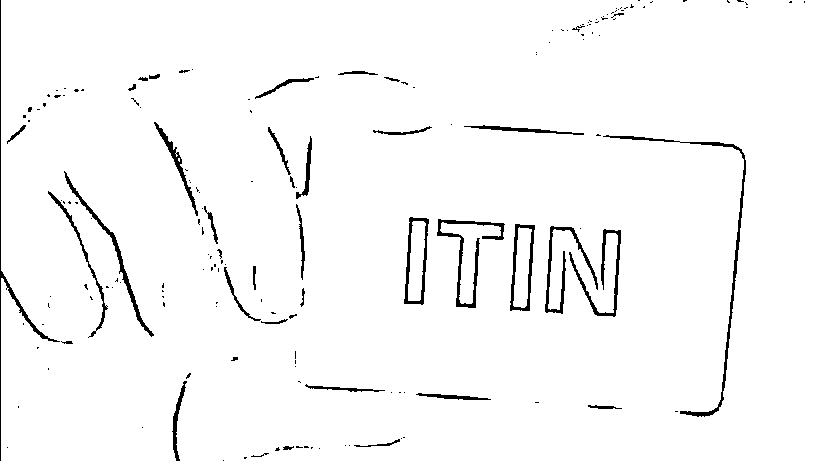
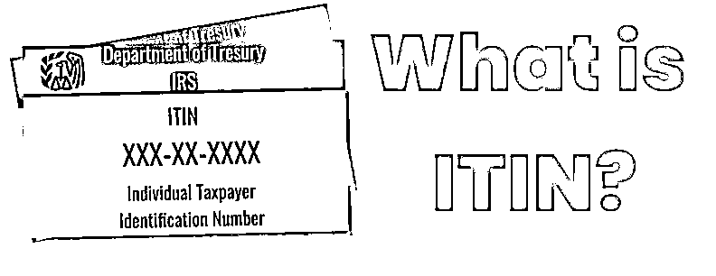
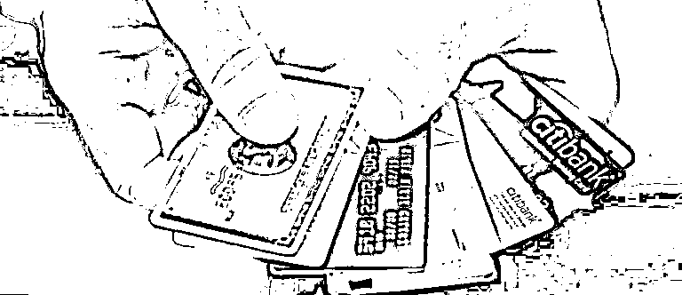
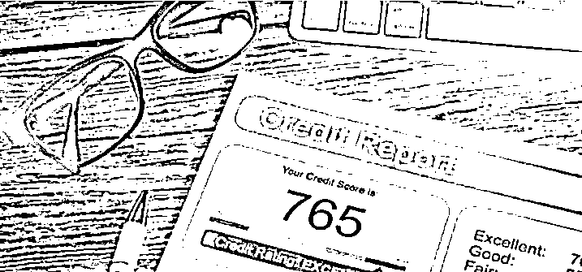
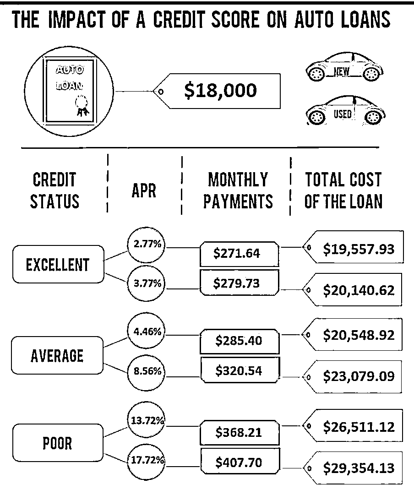
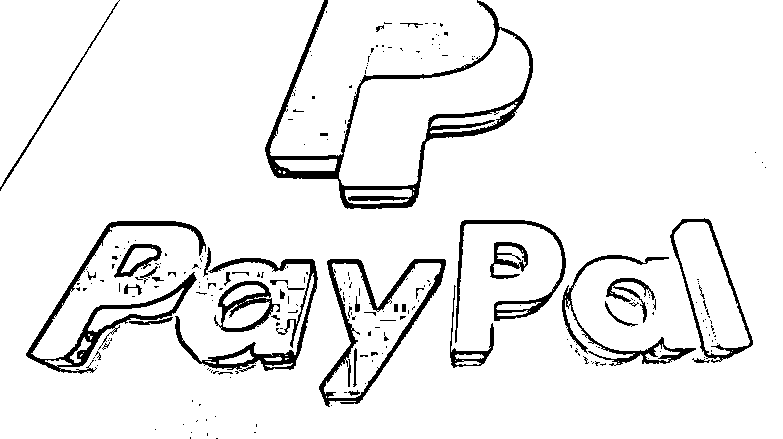
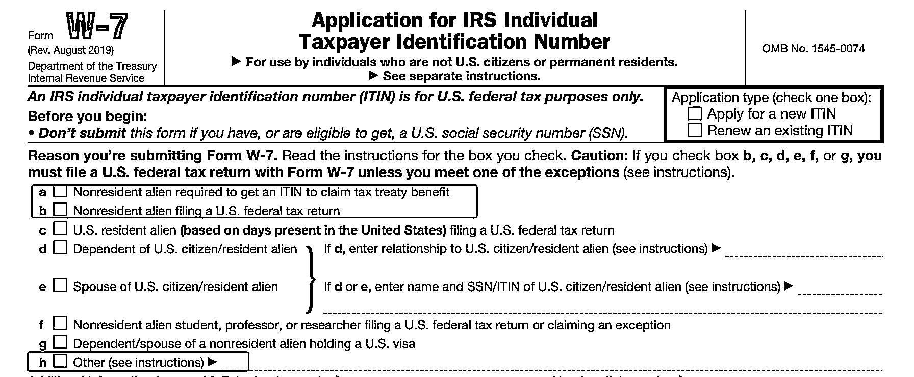
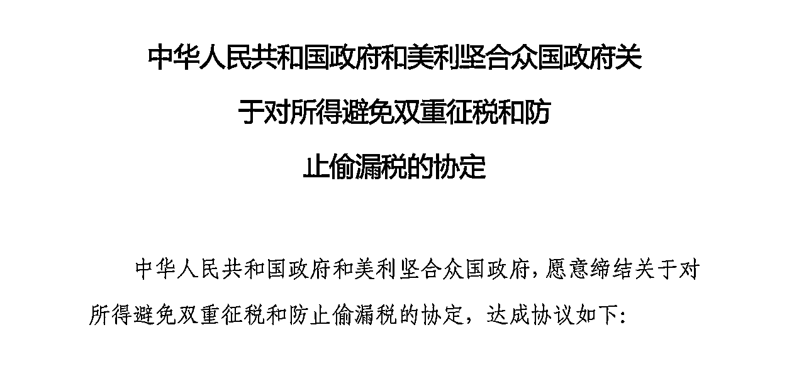
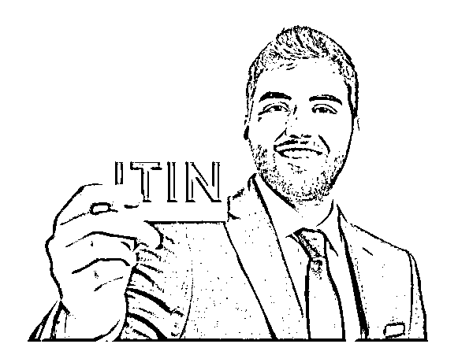
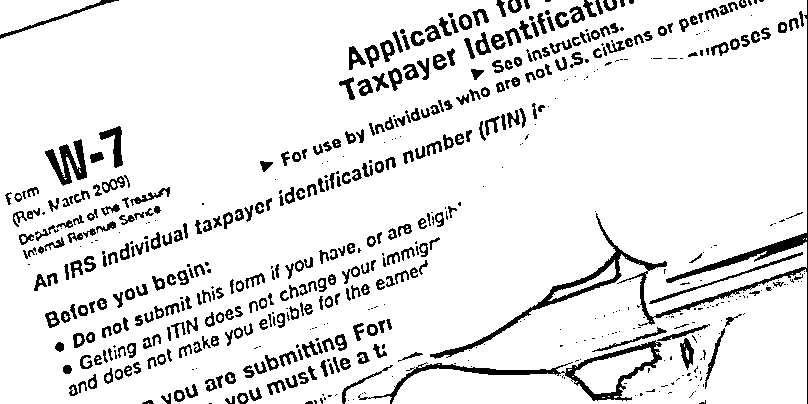

# 跨境出海必备神器 ITIN

> 原文：[`www.yuque.com/for_lazy/zhoubao/wxggg3qfnnzuddc1`](https://www.yuque.com/for_lazy/zhoubao/wxggg3qfnnzuddc1)

## (16 赞)跨境出海必备神器 ITIN

作者： 国民弟弟的跨境十年

日期：2024-12-17

**今天给大家科普跨境出海必备神器:ITIN**

1.你是否海淘无法支付？

2.是否美区 paypal 被封？是否想 Stripe 独立站收款更稳定？或者有收款 POS 机呢？

3.是否想要一张漂亮国信用卡而没有门路？无法薅美帝信用卡羊毛？

4.是否想在中国积累你的漂亮国信用？

来来，走过路过不要错过，ITIN 了解一下？

包治疗各种不服！

> **1.ITIN 是什么？**

**ITIN 是 Individual Taxpayer Identification Number**

个人报税识别号码 (ITIN) 是由漂亮国国税局颁发的税务处理号码。国税局签发个人报税识别号码的对象是那些没有且没有资格（英文）从社会安全局
(SSA)（英文） 取得社会安全号码 (SSN)，但是需要有 ITIN 的人。

简单一句话，你要给漂亮国交税他就给你发！是专门发给外国人的。

> **2.ITIN 有什么好处呢?**

1. 解决独立站各种收款验证问题

2. 办理漂亮国银行卡和信用卡，目前强制要求填 ITIN.

3. 接入所有的独立站收款平台，甚至刷卡 pos 机申请也需要 ITIN.

4. 积累漂亮国信用

5. 还有你知道和不知道的地方，都可以用。

**简单举例子：**

通过 ITIN 可以办理到漂亮国真实的 BANKCard

能够帮你获得真的可以用来自己返利的漂亮国信用卡，薅漂亮国人的羊毛。5%甚至以上的返利，1W 刀的花费就是省 500 刀。估计有些朋友采购个几万到也是常有的事情。买的少的，慢慢买到 1W 刀也是常有的事情。

所以说，有漂亮国 BANKCard 有点厉害哟。

积累漂亮国信用！

漂亮国是一个信用国度，贷款买车买房，买 iphone 都可以靠信用。而这个信用高低就决定了你贷款的利率的差异。

通过开 Card，有了漂亮国的信用分数积累，这个你积累一年，基本都是很好的信用。到时候真的可以当钱花。如图请看下图：

1.8W 的车，信用分不同的人最后还贷款的情况，会是有 1W 刀的差异。6.3W 人民币的差异。

所以，如果你有其他漂亮国投资的需求，如房产等，这个就是一个很好的安排。提前去做就好了！

还有疫情结束，去漂亮国玩，有这个估计租车和其他需要信贷的业务都可以给到他们，更方便。

> **3.PP 更低汇率收款!**

做生意的独立站老板们？

天天想解决稳定支付通道的问题，这个也是能帮你解锁一个完整版的漂亮国 PP,

方便收款，且省钱！

如果你是漂亮国 PayPal 用户，提现到关联 BANK 账户是完全免费。在漂亮国通过在线交易，收取交易金额的 2.9％，加上 0.3 美元手续费。对比漂亮国之外的国际用户，则是收取交易金额的 4.4％，加上 0.3 美元手续费。费率足足高出 1.5%的。可以查看这里，详细了解 PayPal 漂亮国用户收费标准。

#### 你以为，省 1.5%的有什么特别？

#### 实际上有很多独立站大佬的这么一个省，多一辆车也有可能。

> **4.你是否资格申请 ITIN？**

从 ITIN 申请表 W-7 表格可以看到

我们大部分可以基于

a/b/h 条款进行申请。

**简单翻译下，大家申请的理由大致如下：**

1. 基于 z 美税收协定，比如某些收入，美股股息收入，漂亮国 zf 要我先交 30%税，然后我是一个中国公民，可以找漂亮国 IRS 退税。

让我这个小平民瞬间高大上了，我们申请个 ITIN 搞得很隆重的样子。

1. 你有漂亮国公司要给漂亮国 zf 交税

2. 其他情况要给漂亮国交税

知道了这些情况，你可以知道自己是否可以办理。

> **5.如何办理？**

1. 自己办

当然可以自己办，只是你需要寄送你的护照原件到漂亮国国税局，然后人家平邮给你寄送回来。同时记得还要填好 1040NR 的税表。

IRS 的平邮又不挂号，丢不丢看人品。

护照快过期的，愿意省钱的，可以一试。

2.找代理

一般代理会看你的情况，让你填一个简单的表格，看你的是否属于 Non-resident Alien 的法律地位。然后会给你安排申请。

**代理分 CAA 和 AA**

AA（Aceeptance Agent）是需要邮递护照至漂亮国的。价格略便宜，不建议使用。

CAA(Certifying Aceeptance
Agent)是可以直接做视频验证，大致 5 分钟之内，简单验证你的是个活人和护照对得上。我也认识些做 CAA 的代理。价格比 AA 贵些。价格也是正常且比大部分同行价格,也可以找我提取。

Tips:市场价格大致在 200 多刀，太低的大家就不用去选择了。

反正我知道，有跑路的很多，因为申请流程非常长，任何平台收款 2 个月内就自动打款给第三方了，最终人家跑了，你亏钱且耽误了两个月。而且很多平台要你经过漫长的投诉才能拿到退款。

> **总结：**

愿意手动的，护照快过期的可以自助申请，然后给一个漂亮国转运地址，这样好歹不会跨国丢件。

省心省力的使用代理，申请中，推荐使用 CAA，选择不用寄送护照的代理就好了。

> **时间周期？**

问过代理，看 IRS 忙碌情况

有些 2 个月，一般在 3 个月，有些人 6 个月。

所以提前办理

> **有效期？**

3 年？ 永久？5 年？

The Protecting Americans from Tax Hikes (PATH) Act affects taxpayers who use
an Individual Taxpayer Identification Number (ITIN), rather than a Social
Security number, to file their tax returns. If you use an ITIN, it will expire
unless you used it at least once during the previous three-year period.

大致翻译下：基于（PATH）法案，3 年需要做一次税务申报。否则过期。

有效期是 5 年。

5 年世界会变化很多，先拿一个用用吧。5 年后再来就好。

记得申请下来了，有空找代理做一个税务申报使用，给他续命 3 年。

以上！

**国民弟弟相关创业的故事文章推荐：**

**跨境电商认知分享，个人创业者从 0 到 1000w+**

[`articles.zsxq.com/id_8n2o7gax71fr.html`](https://articles.zsxq.com/id_8n2o7gax71fr.html)

**3 分钟搞定美国公司，150 美金，超简单**

[`articles.zsxq.com/id_exggkcb30j69.html`](https://articles.zsxq.com/id_exggkcb30j69.html)

* * *

评论区：

暂无评论