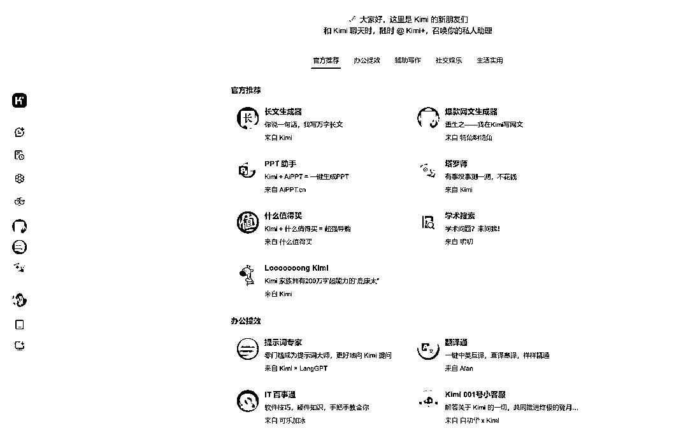
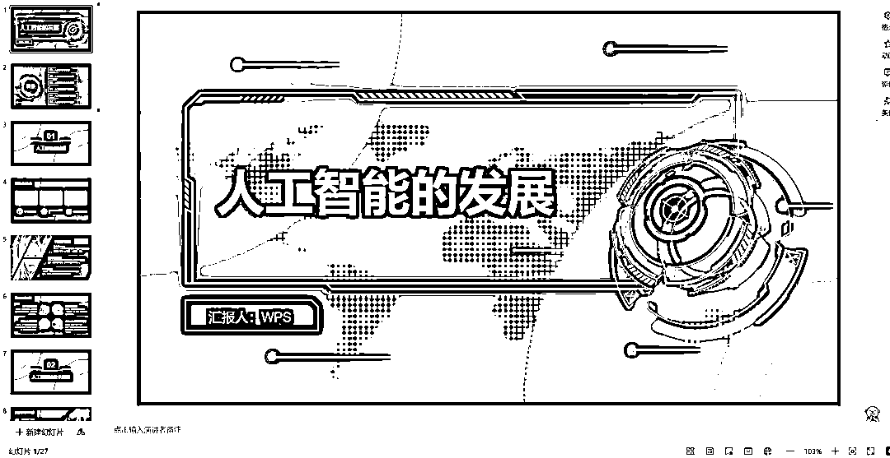
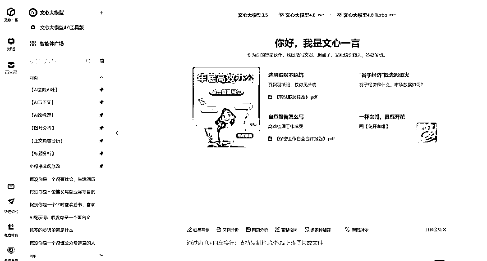
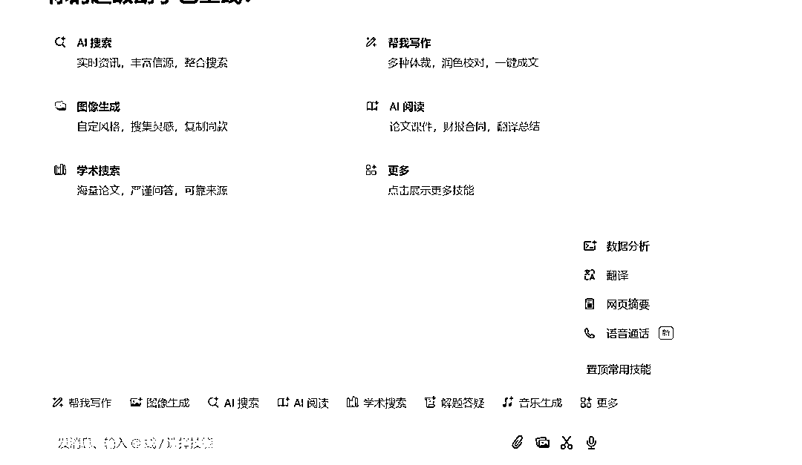
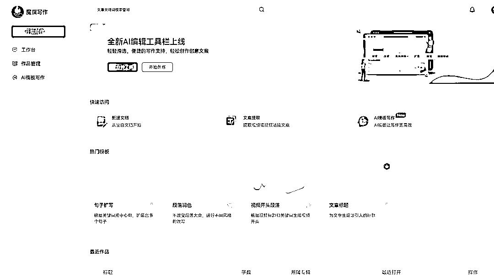
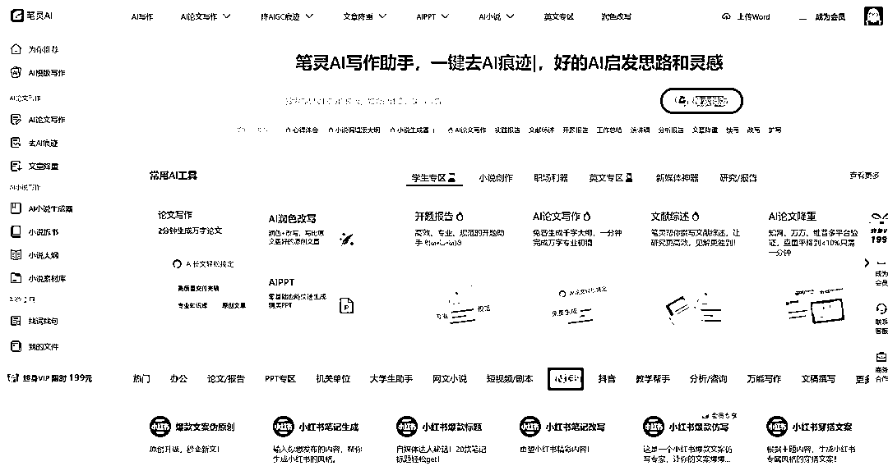
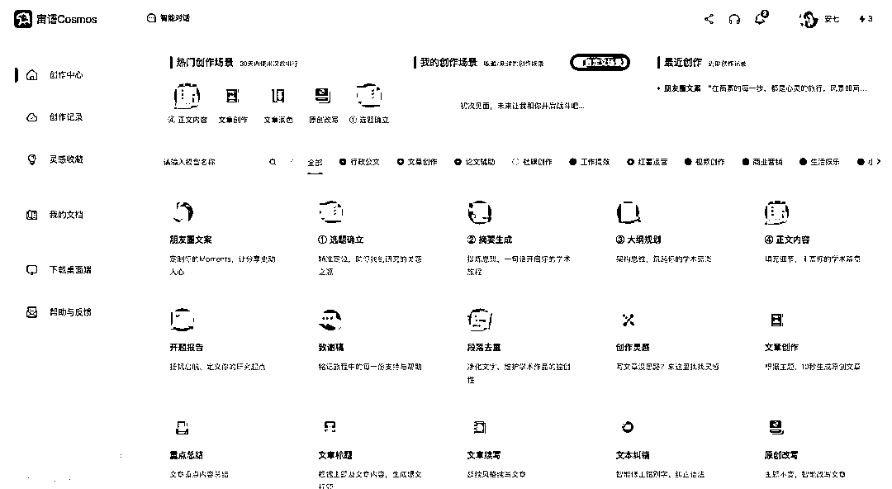
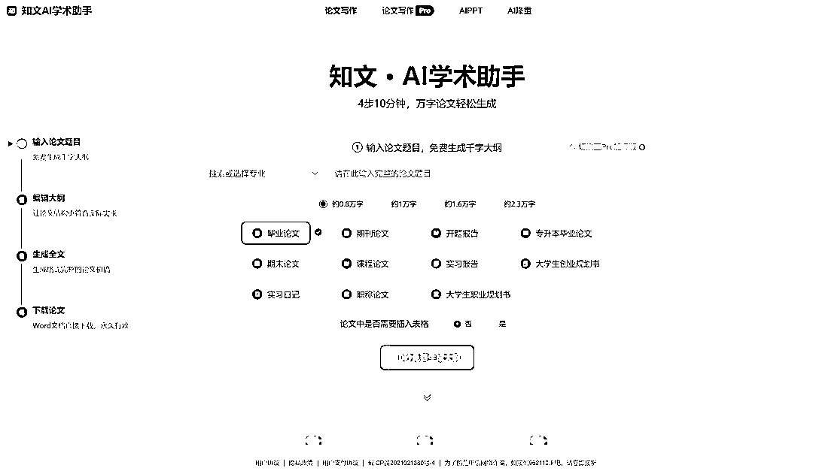
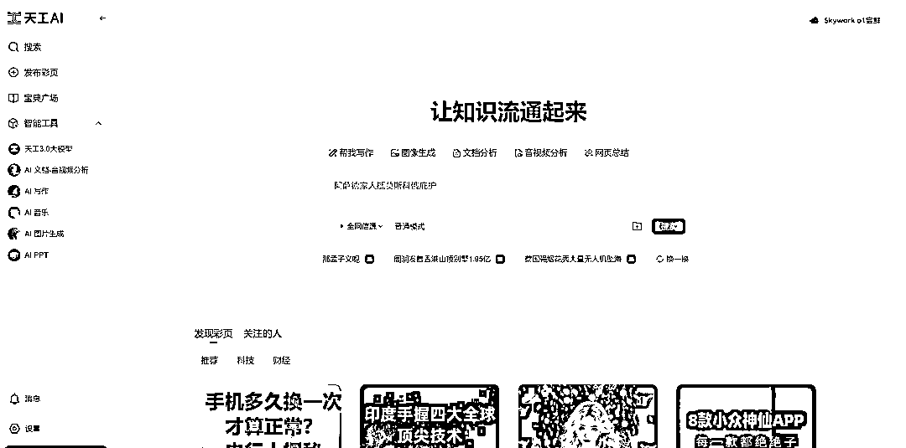
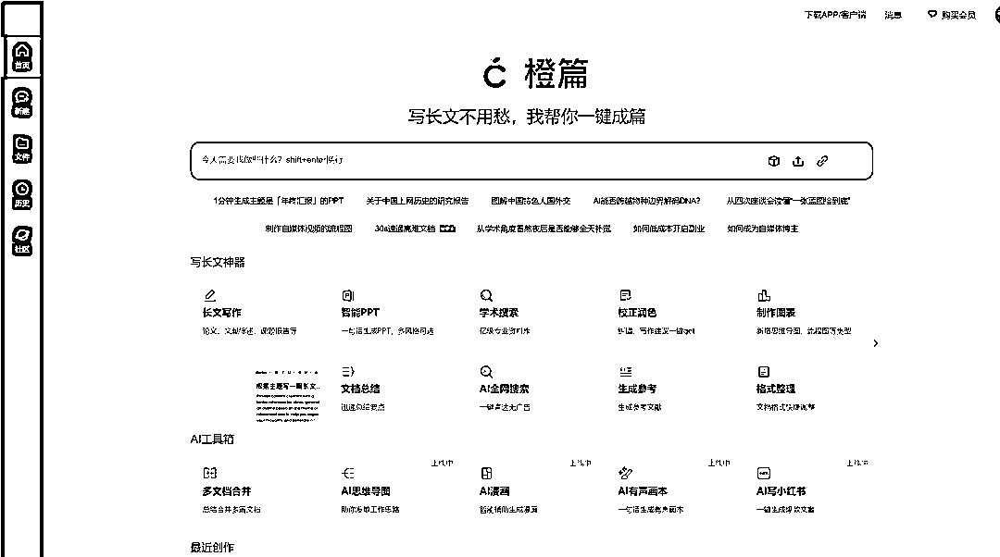

# 2024 年 10 个国产免费 AI 写作工具盘点

> 原文：[`www.yuque.com/for_lazy/zhoubao/zopap25ui74bgp07`](https://www.yuque.com/for_lazy/zhoubao/zopap25ui74bgp07)

## (41 赞)2024 年 10 个国产免费 AI 写作工具盘点

作者： 安七

日期：2024-12-09

嗨，你好，我是安七，主攻 AI+写作。

今天这篇盘点一下，2024 年我用过的很哇塞的**10 个 AI 写作工具** ，关键是：国产、免费！

# **01_**

**-Kimi-**

**  **

Kimi 是由月之暗面科技有限公司开发的智能助手，擅长 中英文对话，

能够处理复杂的搜索问题，个人觉得**它的对话体验感是很不错的（能听懂人话）** ，

而且它还能**识别链接、提取文档要点** ，总结归纳能力不错。

比较适合需要进行中英文写作、内容创作和信息整理的用户。

官网链接：[`kimi.moonshot.cn/`](https://kimi.moonshot.cn)

# **02_**

**-WPS AI-**

**  **

一个我平时容易忽略，但是用了觉得“真香”的工具。

WPS AI 是金山办公推出的智能写作助手，支持文本润色、智能推荐、语法检查等功能。

它让我觉得眼前一亮的是 **AI PPT** 功能。

就是你跟它说一句关键词/一句话，然后它根据你的这个做个大纲，哪里有问题直接改哪里，

没问题就点击“挑选模板”，可以在线转化为 PPT，30 秒，非常快！

##### 如图，这是它做的，很精美）

使用建议：适合需要在不同设备上进行文档创作和编辑的用户。

官网链接：[`ai.wps.cn/`](https://ai.wps.cn)

# **03_**

**-文小言-**

**  **

一个我一直在用的**写作 AI 工具** 。

虽然它的对话感没有 Kimi 好，但是写作方面是我用了这么多个 AI 工具下来，还是觉得不错的一款工具。

只要你的**提示词** 写得好，它能**满足 80%甚至更高的写作要求。**

**  **

官网链接：[`yiyan.baidu.com/`](https://yiyan.baidu.com)

# **04_**

**-豆包-**

**  **

豆包我也挺喜欢，页面简洁，舒服。

它里面的**“智能体”** 很适合当朋友一样聊天，而且还能给点建议。

如果说，你平时有什么不太好找别人聊的话，或者你想找人出谋划策但没有遇到，那它可以当你的军师。

“语音通话功能”很强大，挺好的。

官网链接：[`www.doubao.com/chat/`](https://www.doubao.com/chat)

# **05_**

**-魔撰写作-**

**  **

魔撰写作这个我个人用的相对来说少，但是里面的功能我也挺喜欢。

它提供**AI 智写、AI 润色、AI 改写、智能纠错** 等功能，而且还能自动**提取音视频文案。** 还是比较适合需要全能 AI 写作助手的用户。

官网链接：[`x.moyin.com/article?to=aiTemplate`](https://x.moyin.com/article?to=aiTemplate)

# **06_**

**-笔灵 AI 写作-**

**  **

笔灵 AI 也是一款国产的中文 AI 写作工具。

里面页面就更多、选项功能也很齐全。

可以通过深度学习和自然语言处理技术，帮助进行高质量、高效率的文本生成、文章优化、AI 问答等操作。

它会更适合需要进行**学术论文、营销广告创作、社媒文案创作** 的用户。

官网链接：[`ibiling.cn/template`](https://ibiling.cn/template)

# **07_**

**-宙语 Cosmos AI 写作工具-**

**  **

这个写作神器可以提升中文写作的效率和质量。

里面有超多丰富的模板，有 200 多种不同类型的格式可供选择。

其中它的**“朋友圈文案功能** ”我个人比较喜欢，有时候没灵感了会来这里找找。

如果你需要快速准确地完成写作任务，而且希望作品展现你个人风格，那这个不错。

官网链接：[`ailjyk.com/pc/creation/model?channel=DVCXBQVT`](https://ailjyk.com/pc/creation/model?channel=DVCXBQVT)

# **08_**

**-知文 AI 学术助手-**

**  **

这个 AI 操作起来比较简单、高效。本科生、硕士生和博士生写论文一定不要错过。

它支持快速生成清晰的大纲和全文，而且定位就是**“学术助手”** ，还是很了解你有什么需求的。

官网链接：[`ykoai.com/?user_sn=14440103`](https://ykoai.com/?user_sn=14440103)

# **09_**

**-天工 AI-**

天工 AI 还是比较全能：支持搜索、写作、对话、文档分析、画画、做 PPT 的全能型 AI 助手。

可以借助它来检索信息、多语言翻译、写论文、写代码、写方案、写汇报、做 PPT、归纳总结。

适合需要全能型 AI 助手的用户。

官网链接：[`www.tiangong.cn/`](https://www.tiangong.cn)

# **10_**

**-橙篇 AI-**

如果你经常刷 AI 工具之类的，应该会发现橙篇出现的频率还挺高的。

我也用了一下它的**AI PPT** 功能，体验感也很不错~如果说你用 WPS AI 不习惯的话，可以试试它。

里面的选项和功能也很丰富，根据自己需要的去玩。

官网链接：[`cp.baidu.com/`](https://cp.baidu.com)

上面就是初步筛选后，觉得还不错的 10 个国内免费、靠谱好用的 AI 写作工具，希望对你的写作有帮助~

* * *

评论区：

🌊达师姐 : 学习了太适合我这种小白又不想动脑子的人了

安七 : [呲牙][爱心]

上上签 : 来的及时，正需要