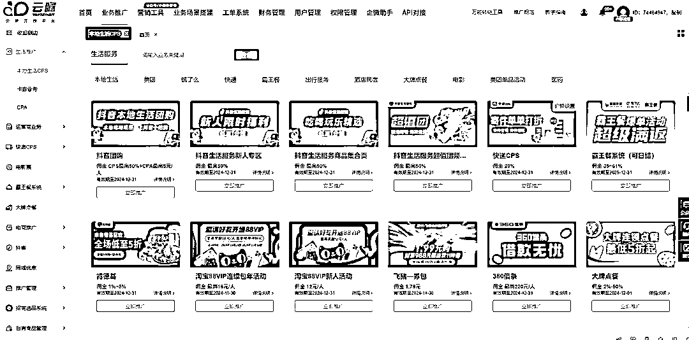

# 中年危机：互联网从业者的失业困境与反思

> 原文：[`www.yuque.com/for_lazy/zhoubao/iye8uduz5akkzh4q`](https://www.yuque.com/for_lazy/zhoubao/iye8uduz5akkzh4q)

## (18 赞)中年危机：互联网从业者的失业困境与反思

作者： 牟长青

日期：2024-12-09

前天晚上在家里看了徐峥的新片“逆行人生”，让我感触良多，因此对中年失业这个话题再次产生了兴趣。然后去知乎上面，刷了大量中年失业的真实故事，看完后让我陷入了沉思，导致那天晚上都失眠了。

作为一个 80 后，我也到了中年的年龄，上有老下有小。其实在自己 20 多岁的时候，就思考过这个问题，如果自己人到中年，失业了怎么办。因此那时候就很有危机感，从而让自己有了更多努力的动力。

我以前觉得互联网行业是个讲资历和积累的行业，应该失业的几率很低。但看了知乎的那些中年失业的案例后，我觉得自己想天真了。因为里面不少中年失业故事的主人公都是互联网从业者，不少人还在知名大厂工作过，带过上百人的团队。因为年龄大，被裁员后，才开始都是信心满满，觉得自己再找个工作不不难。后面投了上百封简历，都没了回音，才意识到中年再就业有多困难。

今天这篇文章主要分享 5 个点，为何中年失业找工作困难，自己是否有失业的可能，简单说说自己经历，分享中年失业了该如何破局。如何从一开始降低失业的几率

**1：为何 35 岁以后找工作就那么难？**

**  **

对于用人单位来说，会思考是招一个 35 岁以上有经验的，还是招个大学才毕业的性价比更高。

从用人单位的角度看，35 岁+的人，最大的优势就是有丰富的工作经验，但可能也是唯一的优势。但缺点却是有一大把，比如不好管理，待遇成本高，能否熬夜，能否连续出差，家庭琐事多。因为上有老下有小，更容易被家庭的事情所影响。其实从这个角度，职场歧视中年从业者，跟歧视女性从业者的理由差不多。

大环境不好，企业想要活着，社会很现实，因此 35+的中年人就成了最容易失业的群体。很多人感叹，年轻的时候没经验找工作难，现在经验丰富了，但年龄大了为何找工作还是难了？

相比下才毕业的大学生，虽然经验尚浅。但一张白纸，可塑性强，对待遇要求不高，年轻身体好有吃苦的本钱。因此自然会是大部分企业的首选。

**2：反思自己，是否有失业的可能性**

**  **

我的打工生涯都是做市场推广，BD 合作为主，如果当初我在北京的时候，没做副业也没写博客，只是按部就班只做好自己手上的工作，到今天我有很大的几率失业。

大环境不好，自然推广的需求也会下降，假设我还在北京，年薪应该 50 万以上了，但这个时候我精力已经有点跟不上了，也没有 20 来岁的小伙子更有想法。当公司想优化的时候，自然会先考虑我这个工资成本高，但已经没了拼劲和想法的老人。

我今天能做社群这个事情，最大的原因是，我从 06 年就开始写博客。如果我只有在互联网大厂的工作经验，很大几率我就是废了。这几年我做过两次实体行业，一共亏了百万。公司也尝试了多个新项目，也都是清一色亏钱。

因此假设我失业了，很大几率是不敢创业的，只能退而求其次，降低薪水标准，去一些小公司看能否谋求工作的机会。

**3：简单说说自己的经历**

**  **

假设 22 岁开始工作，到 35 岁也就是 13 年的时间。而能做到真正 35 岁以上不失业的人，往往要么是创业成功，要么是成为公司核心管理层，但这样的比例往往只有 10%，还有 90%的人都有中年失业的风险。

我就是 22 岁开始进入互联网行业的，但在进入这个行业前，其实我已经混了好几年的日子。高中读的 2 年制职高，然后读了普通的专科，因为都是很差的学校，因此读书基本没听过课。只是大学期间，经常去网吧通宵，实践电脑操作。

因为高中和大学都是二年制的，因此 19 岁我就大学毕业了，然后家里介绍去了一个事业单位做合同工，又混了 3 年的时间。直到 22 岁的时候，我担心这样下去，以后老婆都找不到，才果断离职，去成都找电脑相关的工作，然后进入了互联网行业。

我年轻的时候，一直特别有危机感，因此在 05 年做第一份互联网工作开始，我就开始做副业。记得那时候我工资一个月才 800，但用业余时间做个人网站，广告收入最高一个月有 2000 元。

06 年开始北漂，因为全身心做好新工作，那时候副业收入下降，一个月只有几百元。记得 09 年我在百度的工资才 8000，因为已经坚持写了 3 年博客，在行业有点名气，杭州的一个老板请我做推广顾问，每月给我 1 万，从那时候副业收入已经超过了工资。

因为做副业，我积累了更多的推广经验和人脉资源，才有了我后面做现在这家公司的基础。如果我跟大部分人一样，只按部就班做手上的事情，我现在可能也很惨。中年失业大军里，应该我也在。

**4：中年失业了后该如何破局**

实话说这块我目前还没有太成熟的建议，只能说给大家分享下我的想法。

其实在目前在中国这个社会，只求个温饱不难，但习惯了在办公室的白领，中年失业后很难放下自己的体面，去做这些工作。

比如体力三件套：快递，外卖，滴滴，做得好的也能月入过万，最差拿个 3-5 千还是不难。

比如吉祥三宝：保安，保洁，保姆，这些工作门槛相对也不高，没有年龄限制，也能混个温饱。

还有足疗按摩行业，只要愿意放下身段，去学习下保健按摩，月入 5000 以上不难。我去按摩店，喜欢问这些技师的待遇，因此还算了解。哪怕是上了年龄的大妈，普遍也是 5000 以上。如果年轻一点的技师，一般月入过万。

在知乎的案例里，我看到不少中年失业的都是曾经年薪几十万的，也曾风光过。因此大部分中年失业白领，是放不下曾经的体面，去做这些工作的。如果有机会还是愿意找个办公室工作，哪怕工资只有以前的一半不到，从双休变成了 996，也要咬牙上。

如果可以很多人宁愿在家里做个自由职业，因为听着更体面。可能收入不稳定，但也有一飞冲天的可能性。

让我想起上上周带私董去成都做的一场游学活动。游学的公司是做 CPS 变现平台的，也就是一个副业平台。记得游学公司老板在台上分享，说一个宝妈，如果跟着他们平台做，月入 2 万没有问题。有一些跟着他们做得久的老用户，甚至年收入几百万。

当时听到这个数据，我非常敏感，直接就提问说，如果这么容易到 2 万，你公司的人应该都离职了。因此在我看来想到 2 万应该很难。这类平台做副业，月入小几千还是完全有可能的。

当时我就跟游学公司老板说，你做的这个事情非常好，现在大环境这么差，失业的人那么多，如果普通人能从你这个平台，不说月入 2 万，就算月入几千，那你这个平台也是大有前途，而且也算为社会做了大好事。

为了写这篇文章，我特别去这个平台注册了个账号研究了下。发现里面各种吃穿住行相关的 CPS 推广链接，而且都是互联网知名企业，因此有一定的背书信赖。

我以前以为只有外卖这些有 CPS，了解云瞻这个产品后，发现居然快递都有 CPS。这种确实也是普通人都可以做的副业，但真想月入几千，还是需要有一定的推广经验才行。只是靠自己的朋友圈资源，应该还是很难。

CPS 变现我之前也实践过，抖音，快手极速版一直在做类似的新用户下载返现的活动。疫情期间没有事情做，也带着一些学员推广抖音极速版，我分享给身边的家人和同学，也赚了 1000 多元。记得当时做得好得学员也赚了几千元。

后面我又去尝试了一些游戏 CPS 的变现，一个游戏也能赚 10 多元，但感觉比较费时间。当时因为测试游戏 CPS，反而导致我在一个游戏里充值了不少钱。

因此在这里不能不提到一个社群“生财有术”，可能对于我身边一些新媒体老板来说，看不上生财里的小项目。但很多普通白领，确实通过生财有术这样的圈子，增加了做副业成功的几率。但前提也是自驱力强的人

我个人觉得，那些有互联网从业基础中年失业人员，完全可以加入生财这样的圈子，虽然现在报名费 3000 多，我觉得也是值得的。总比自己埋头摸索会更好。因为做过互联网，相信学习能力会更强点。

生财有术更多是一个论坛，里面有人会分享自己一些项目赚钱的经历，官方也有大航海这样的产品，带领生财的会员学习。对于少数学习能力强，自驱力强的人，通过这些小项目，月入几千，几万确实是可以的。

**  **

**5：最好还是从一开始就避免自己失业的几率**

**  **

相信今天看这篇文章的，要么是圈子里的老板，要么是行业里的年轻人。老板们应该不担心失业的问题，但年轻人未来还是有一定失业的风险。

因此从一开始就避免自己失业的几率才是最靠谱的，曾经有段时间我喜欢看咪蒙的文章，特别是关于职场的。记得有一篇是提到优秀的职场人的行为变现，发现里面提到的优点，我年轻的时候基本全占了，因此注定我这类人是不可能失业的。

在我那个年代，并没有咪蒙这样的人给我洗脑，完全是因为个人的性格原因，非常有危机感，因此特别努力。

我表弟目前在我公司，但 28 推这家公司吧，相对来说业务并不复杂，而且也不需要加班。当然在我们公司也能学到很多东西，如果有自驱力，也有很大的上升空间。

表弟从小家庭条件就不错，大学毕业又来 28 推这样的公司，我个人觉得其实并不好。如果可以，未来还是想给他介绍个 996 的互联网工作，年轻人吃点苦并不是坏事。

但现实是，有自驱力的年轻人太少了。有时候看到下面的人，只会按部就班的工作，我内心其实为他们着急的，但毕竟和我无亲无故，我没必要关心那么多。对于大部分普通年轻人，更需要一个强硬的工作环境，促使他们成长。少看点网上的心灵鸡汤。

记得北漂的第一家公司是在 360，一家很变态的公司，部门开会永远是用下班时间和周末。甚至很多部门都是强制要求加班，当时很多同事充满了抱怨。但正是经历了 360 这种变态的公司，后面再去别的公司后，大家会觉得新工作游刃有余，充满了自信。

我曾经有多次劝公司的几个骨干，尝试下做个人 IP，比如写文章，拍视频，站台分享等等。但最终能坚持下来的，我一个都没看到。前天晚上的失眠，我不是担心自己中年失业，我是担心他们中年失业。毕竟跟了我 7.8 年的骨干，最终还中年失业，我也觉得没面子啊。所以我在思考，是不是应该坚持干到 50 岁了。

可能大家觉得有 28 推公司的平台和人脉，离开 28 推公司找个工作并不难，比如公司有 5 个员工离开 28 推后，都入职了重庆最大的新媒体公司麦芽传媒。但谁能保证，自己中年后，不被公司的年轻人所取代了？那些年薪几十万，当上了公司高管的互联网精英都会失业，因此一切皆有可能的。

我做互联网的时候，还是 PC 时代，因此做副业都是做个人网站和写博客，这些并不影响我的本职工作，反而也因为副业，我的本职工作做得更好。而现在是移动互联网时代，短视频时代，AI 的时代。现在的年轻人做副业可以选择做短视频，AI 等等。记得曾经公司还组织过同事，用下班时间做副业，但最终还是没能坚持。说实话像 28 推这么奇葩的公司，我在外面也不多见了。

千万不能让自己完全闲着，如果除了按部就班的工作，就是吃喝玩乐，你中年不失业，谁失业了：）

* * *

评论区：

cc : 工资越低，越不怕失业

冰是睡着的水 : [强]

小军同学 : 这个确实，反而太多选择[捂脸][捂脸][捂脸]