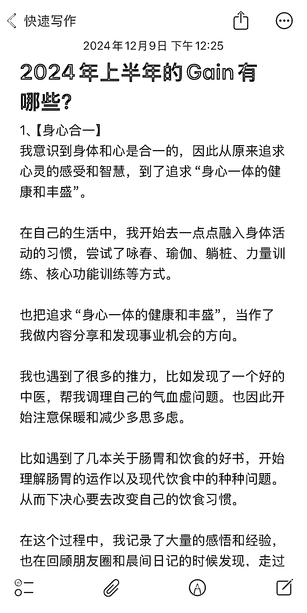
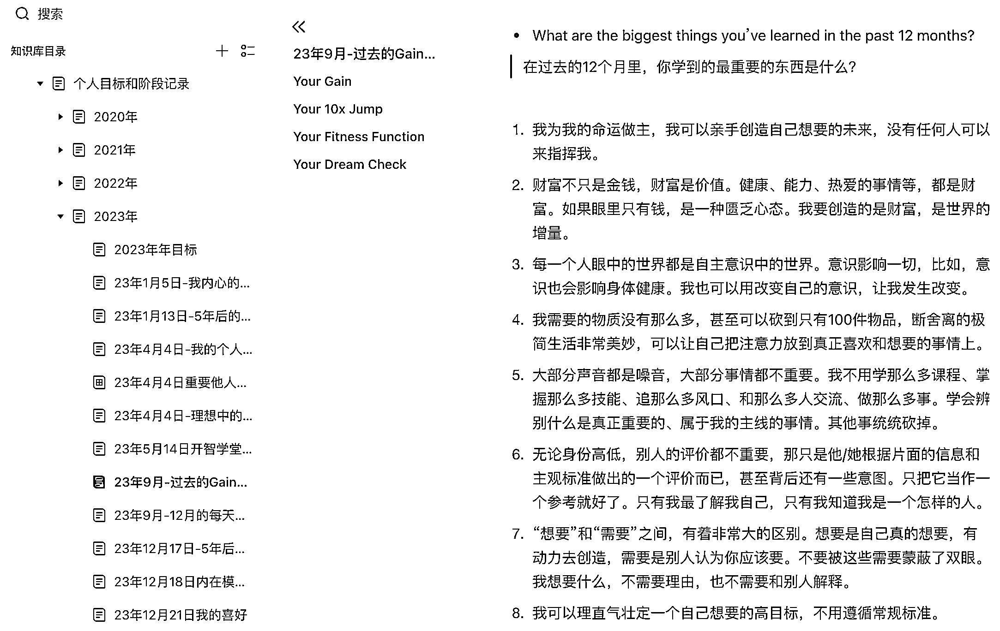
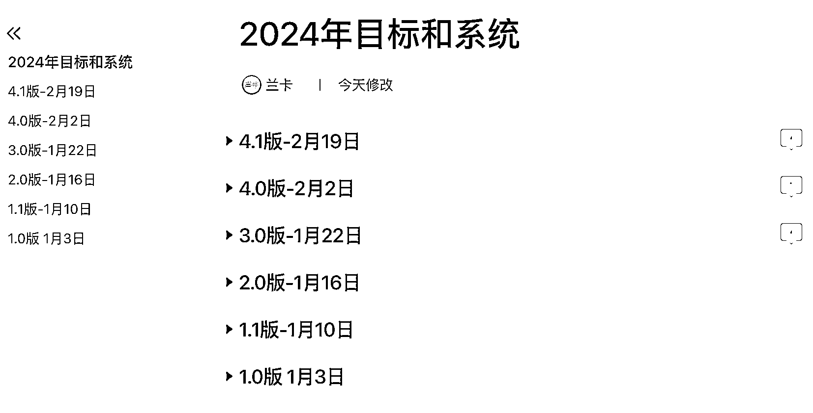

# 90 分钟轻松完成年复盘，找到影响人生幸福的深层规律

> 原文：[`www.yuque.com/for_lazy/zhoubao/ar4noglazvglxr0h`](https://www.yuque.com/for_lazy/zhoubao/ar4noglazvglxr0h)

## (24 赞)90 分钟轻松完成年复盘，找到影响人生幸福的深层规律

作者： 兰卡

日期：2024-12-09

快到年下了，可能大家陆陆续续有了写今年年复盘的想法。

一听到年复盘，我不知道你是什么感受，我的第一下意识反应，是压力。

是一想到要去回溯一年的记录、整理冗长复杂（还有可能散落在各个地方）的信息、再经过大量脑细胞死亡得出结论的痛苦。

尤其是很多人，到了年末本来就很忙，各种赶进度，还要百忙之中抽出时间写复盘，确实有些挑战人性。

然后这个结论还不一定下一年能用得上多少。

啊，何必如此为难自己呢？

于是在收藏几篇怎么写年复盘的文章后，就没有然后了。

或者是经历了各种内心慢性折磨和拖延后，终于找个良辰吉日，开始郑重动笔，在此之前可能都已经把这事在心里掂量两三周了。

我自己也经历了这样的挣扎很多年。每次写年复盘，花的最多的精力不在于写，而在于内耗。

而且有 3 个问题始终在困扰我：

1、为什么每一次写年复盘都搞得这么复杂这么内耗？

2、每年的年复盘，下一年好像也没怎么用上，那还写它干嘛？

3、怎么每次写出来的复盘，都觉得好像按部就班讲了什么，但又差点什么，感觉没太大价值，自己也没什么惊喜感？

过去两年，这 3 个问题不再困扰我了。

我把我摸索出来的经验分享一下，少则 1 小时就能把年复盘搞得差不多了，多则一个下午收工，还每次做复盘都非常有触动和惊喜，希望能给到你一些启发。

（PS 以下方法，更加适用于个人年复盘。业务年复盘可以参考部分原则和方法。）

* * *

要搞定这件事，首先要有一个清晰的标准。**一般标准清晰了，怎么做顺带也就有谱了。**

那么，什么是好的年复盘？

我自己摸索出来的经验是，一个好使的、让自己写完后很珍惜的年复盘，应当满足 3 个标准：

# **

**

# **一、轻松感**

**  **

启动成本低，且写的过程中感受比较好。不谈过程中能发现很多惊喜和感悟，至少没那么挤牙膏一样痛苦。

我是个普通人，普通人的一大特性就是，懒。所以事情尽可能简单轻松点。

这就意味着我们在写年复盘的时候，要尽可能去找最小阻力之路。而不是完全追求写得尽善尽美，更高更快更强。

这样启动成本小，做完后也不会有气血两亏的感觉。

题外话，凡事只追求更高更快更强。而不顾及自己的能力范围和感受，很容易让自己提早报废。

80 分万岁，给自己留有余力，往往能更长久地做好事，过好生活。

更重要的是，**等做了一两次年复盘后，再想到这件事，感受是好的、舒适的、满意的，那就更有可能每年写下去，蹭蹭蹭积累复利。**

具体到年复盘的执行上，就意味着：

不用追求复盘得那么精密，虽然很多教程是这么教的。

因为现实情况很有可能是过去的记录散落不全，自己也不想全部回溯一遍。

抓取最重要的一些记录，其实就很不错了。

所以，**写年复盘的第一步，请你把氛围搞得轻松点。**

如果条件允许，建议在一个放松的场景下，用一种不那么正襟危坐的姿势完成。比如找个咖啡馆边喝边讲，比如在公园的草坪上坐着聊，比如在家里的沙发上瘫着，旁边放点茶水和小饼干。

再不济，先听两首轻音乐，再开始写。

主打一个怎么轻松随意怎么来。

**年复盘的第二步，可以是：语音随口聊。**

如果你用 Iphone 手机，请直接打开你的备忘录，语音输入，如果你用安卓手机，可以打开飞书妙计或任何一个语音转文字记录软件（或者语音记录，事后再转文字），就聊一个问题：

**“我今年最大的收获有哪些？”**

然后，不用长时间思考，要的就是想到哪讲到哪。

小嘴叭叭叭，一会儿就讲完了。

于是一篇年复盘的初稿就出炉了。

备忘录真的贼好用

是不是很粗糙？是不是觉得这算什么年复盘？是不是觉得这都是我的主观感受？

是的，但不要紧，因为第一，**一旦你开始做了，拖延症就消失了。**

动动手打开语音输入，讲出第一句话的时候，写年复盘的收获已经在来的路上了。

第二，**你在随口说的过程中很有可能感觉，我的天，我去年一年怎么干了这么多事？怎么有这么多收获？**

那种惊喜感就好像搬家的时候意外从箱子底扒拉出来一堆宝贝，你不需要把整个家整理完才能扒拉出来，只需要凭感觉去收拾几个最有可能藏东西的地方就行了。

这种惊喜感，就会很大程度上支持你去把这个备忘录笔记，再修补细化一下，比如打开去年的几个文档，看看有没有遗忘的重要事项，或者对某一件事的细节记得是不是准确。

第三，**心比头脑的计算程度快多了。**

有可能，你凭着记忆和感觉口头聊了一堆收获后，再去翻文字记录后会发现，要做的是查漏补缺，因为之前口头已经把 80%的重要事项和收获讲出来了……

那些完全记不住没印象的事情，就要问问自己，为啥忘了？

是不是这件事，其实对我没那么重要呢？

为什么就问“我最大的收获是什么”这一个问题？

因为很多精细化的年复盘问的问题，今年最重要的事有哪些？最高光的时刻有哪些？最大的成就有哪些？最深刻的感悟是什么？等等，都可以包含在这个问题里。

而要严格按照那些年复盘教程的要求一个个回答问题，其实挺麻烦的，一是容易纠结某一件事的分类，而是很容易重复回答。

干脆只回答一个问题，从记忆里一个个翻捡回忆就好。

# **二、可复用**

年复盘不仅仅是下一年宝贵的参考经验，还承担了一个很重要的作用，就是**提炼规律。**

第一个原因，**一个人的生命轨迹，一定是有迹可循的。**

比方说，当你把两三年、甚至四五年的记录摆在一起的时候，就会很意外地发现，很多现在已经很容易做成的事，是四五年前在烦恼的课题。而那个时候，会觉得挑战怎么这么大这么难，完全找不到解法。

现在栽的坑、后悔的事情，则可能在多年前就有了蛛丝马迹。

过去 5 年的个人成长记录

所以，有意识地去回顾自己过去发生的事情，就很有可能提炼出：

**我在反复经历什么样的课题？**

**在这样的课题下，我在反复运用什么样的模式？**

这一点非常非常有价值。

当然，如果你感觉自己过去的记录不多，也不必感到有压力，可以现在就快速回忆过去的重要事情，也是一种回溯的方式，量力而行即可。

举个例子，前年我做年复盘的时候，从过去五年零零散散的日志、复盘、心得中就能看出一点：

**  **

**我绝大多数的痛苦，都是在关系课题上的痛苦。**

而人对待所有关系的方式都是一样的。对待他人什么样，就对待自己什么样。

所以归根结底，还是和自己的关系课题。

在这种困境下，我会反复重演一些模式，比如：

对自己要求严苛，达不到就全盘否定自己这个人；

盲目和他人比较，实际是不了解自己的特质和想要；

和妈妈经常吵架，搞得两个人都很生气，事后又后悔；

总是忽略自己的感受，强迫自己去努力、去完成脑子里设定的目标，搞不定就责怪自己执行力不行；

经常产生自责情绪，根本没意识到心里骂自己骂得有多狠；

在亲密关系上回避型依恋，很难让自己大胆去爱、不计后果，一想到将来可能还要结婚，就对和另一个人走进婚姻感到恐惧；

对健康很漠视，对自己的身体也很陌生，虽然嘴上讲着要健康，但其实对自己身体的不健康程度感受并不强烈，也很回避去直面现实情况，每年根据体检的时候脑子里想一下，我要对健康重视一下，几天后就忘了；

……

看到这么明显的事实摆在纸面上，我才意识到，很多工作和生活上的不顺，背后都是内心的课题。

虽然过去多年的惯性思维还很强大，但我已经到了用技术手段没法解决根本问题的时候了，我得认真面对关系课题了。

因此才下定决心，给我自己去年定下唯一的年目标：

**解决关系课题，让我和自己的关系质量极大提升。**

于是就开始了去学个人成长教练、去大量看心理相关的书、去参加各种身心相关的活动，去写晨间日记……的路程，直到今天。

**人生不过百年，从几十次到一百次的年复盘中，就能发现最重要的规律，最影响自己人生质量的规律。**

这些规律包括但不限于：

**我反复在追求什么？**

**  **

**我在用什么方式喂养我的欲望，但每次感受并不好？**

**  **

**我在哪里一直碰壁，但之前没有意识到？**

**  **

**我通过什么品质和支持，趟过了过去的各种挑战？**

**  **

**有什么高频发生的事情，一直在内耗我自己？**

**  **

**每当我做了什么，就会让我的生命力更加旺盛，不做什么就会萎缩？**

**  **

**在什么情况下，我发现不需要那么努力也能有好的收获，甚至比起努力有更好的结果？**

**  **

**过去真正让我每次回忆起都感到感动、幸福、自豪、珍惜的记忆是什么？我真正在乎什么体验？**

**  **

**我做了什么明智的决定，给我的生活带来非常深远的影响？是什么让我做了这个决定？之后能不能继续支撑我做出下一个明智决定？**

**  **

**有谁给我带来了非常大的影响，成为了我真正的贵人？是什么让我能遇到 TA，并被 TA 影响？**

**  **

**每当我放下什么后，我的内心会轻松释然很多，并让我不再被某件事卡住，可以往前走？**

**  **

**有什么事，我希望自己可以做得更多，有什么事，我希望自己可以做得更少？如果我总是会这样想却没有做到，是什么在反复干扰我？**

**  **

**我在很多事情上，一直在恐惧什么？这种恐惧，给我带来了什么影响？**

**  **

**每当我做哪些事，我就会更加有能量和精神？**

……

这些问题，也可以是我们每次做年复盘的时候，可以选几个提问自己的问题。

那我们具体怎么做呢？

我们之前说过了做年复盘的前两步，也就是：

1、创造一个轻松一点的氛围

2、口头讲一遍“我在过去一年最大的收获有哪些？”

这里再增加**第三步，就是挑选几个自己有触动的问题，尝试着去回答。**

只选几个自己想回答的就好。

因为你可能需要回忆，也可能需要从过往的一些记录里回溯，工作量因人而异。

选择回答的问题可以少则一两个，多则七八个。如果没有你感兴趣的问题，也可以不选，去找 AI 对话，让它给你一些灵感。

比方说，对我来说，“反复经历的课题、反复运用的模式”，就是非常重要的问题。因为我很喜欢反思自己。

但“我反复在追求什么？”我就不一定会每一次都问自己，因为在过去的觉察中已经有了比较清晰的线索，也在很笃定地往这个方向走。

不必贪多，每个问题都回答，也挺累人的。

还是回到好的年复盘的标准上，轻松点，放过自己。

# **三、抓重点**

复盘的最后一步，往往都是总结今年的经验教训和展望明年。

我有两个让自己好过很多的经验：

### 1️⃣**“我只讲三点。”**

**  **

不管是总结今年的经验和心得，优化点和下一步行动，还是明年目标，最重要的一个标准就是，**过几个月还能记得。**

但凡写了一两个月就忘得精光的，写也没太大意义了……

因此，只总结最重要的，放下 80%没那么重要的，就行了。

不管是经验总结、优化点、来年目标什么的，最多写三点，都是一个很好的参考原则。

【今年的经验和心得】

**什么是最重要的经验？**

1.  **在事情的应用上最高频**

2.  **对自己影响程度最深**

3.  **影响自己最长时间**

比如我之前给自己总结了两条经验：

“我一旦开始创作，就有好事发生，一旦停止创作，生命力就开始枯萎”

“定目标时给自己多留一倍时间”

前者就明显比后者更重要。

因为前者直接影响了我的事业方向，让我进一步下决心成为终身创作者。后者是在具体执行时的一个细节，不仅作用的场景较少，即使没有改进，对一个人工作的我来说影响也没有那么大。

可以试一试，能不能从总结 10 点，精简到总结 5 点，甚至强制要求自己，就总结 3 点。

如果心疼自己总结出来的经验舍不得删，可以把它单独放到一个“年复盘备忘经验”的文档里，看看来年是不是能用得上。

然后把更多精力放在思考，这留下来的 3 点经验如何最大化发挥价值上。做少得多。

【优化点和下一步行动】

不用绞尽脑汁写明年要优化的 10 大要点。能真的改进三点就不错了，吊打 90%的人了。

对自己诚实很重要。一个有效检测方法就是，写完复盘后，看看自己的承诺，发自内心问自己 3 句话：

**  **

**明年我真的能全部都完成吗？**

**我承诺的时候，身心合一吗？**

**我的身体会感到抗拒和有压力吗？**

《精要主义》带给我的一个启示就是：

**“如果一件事不是一个百分之百的 Yes，那就是一个百分之百的 No。”**

如果这件事你不是百分之百想做，那就先放放。

我的切身感受是，如果真的尊重自己的承诺，真的想做就直接做，还真的做到了，哪怕只有一次，自己对自己的肯定和信心都会大大增强。

也才会真的在每次定目标的时候，感受到对未来画面的憧憬，有强烈动力去实现它。

【明年年目标】

看明年的目标哪些是最重要的，也可以问自己一个问题：

**“明年发生什么事，就会让我觉得是无比满足的一年？”**

如果这个目标还差点意思，那也先放放。

当然，你也可以单独开一个文档，下一次再写年目标。

我一般会在写年复盘的时候就写一个初步思路。其实也大差不差了。

**因为定目标最重要的价值，是让你现在感觉更好，改善你现在的行动。而不是一定要完成。**

所以有一个航行的方向，这个方向让当下的自己心生向往，感觉行动更有劲了，力量更往一处使了，就很好。

毕竟是个人年目标，倒也不用搞得那么精确，经过大量严密的逻辑推理什么的。

毕竟情况随时在变化，自己也会在实践的时候产生新知，何必被定死的目标束缚住呢？

我 2024 年小幅迭代的年目标

### 2️⃣  **肯定自己占七成**

**  **

**复盘，不是一场自我批判，而是对过去一年生活的觉察和接纳。**

**  **

应该 70%是对自己的肯定，30%是优化的空间。

我们毕竟活这么多年了，每年都能解决一些新问题、经历一些新事情，怎么可能没有两把刷子呢。

那肯定是要拿出来表扬的，不然咋意识到自己这么棒，咋加强自己的优秀品质？

学会欣赏和肯定自己，本来就是一门功课。

### 3️⃣  **庆祝很重要**

做完年复盘后，还可以给自己来个庆祝仪式。

耶！我把年复盘做完了，我好厉害！我今年发现了自己这么多做得好的地方，我可牛逼坏了！我还更加擅长欣赏我自己了，我又进步了！

然后高调地犒劳一下自己，比如去按摩+吃大餐+找家人朋友分享一下去。

**庆祝，本身就是完成一件大事的最后一环。**

**  **

庆祝是一种情感印记。创造积极的感受，会帮助我们强化及时复盘-优化动作-完成目标的习惯。

就像宝宝学走路的时候一样，当迈出第一步第二步的时候及时鼓励和庆祝，即使过了一段时间后宝宝自己已经不记得当初的庆祝，但潜意识里一想到走路，感受会很好，会意识到自己会走路是个很了不起的成就，也会更习惯于一直走下去。

如果你看到这里，意味着你已经在脑子里大致过了一遍写年复盘的思路了。

而脑子里先构思一遍，其实这件事已经启动了。20%的进度完成！

* * *

那最后总结一下写年复盘的整体思路：

**先启动：**

1、创造一个尽可能轻松的氛围

2、打开语音备忘录，回答“我今年最大的收获有哪些？”（其实能完成这一步，就已经是个完整的年复盘了，如果你不想继续，完全可以到此为止。）

**  **

**再追问：**

3、从文章中有触动的问题列表中挑选一两个到七八个（也可以自己找其他的问题），尝试着提炼影响自己人生质量的规律

**  **

**后总结：**

4、总结今年最重要的经验，最多三点

5、总结下一步行动和优化点，最多三点

6、提出明年的目标，最多三个（也可以不提，年目标另外再说）

收尾仪式：

7、给自己好好庆祝，大力肯定

最后想说，我的经验非常个性化，建议大家从分享中找到自己适用的点，自由组合即可，只要能在当前自己写复盘的思路上加进去那么一丢丢优化点，就很好。

祝大家都能写出让自己爽的年复盘，年年岁岁都能从年复盘中挖到宝藏，都因为写年复盘而感到幸福。 ：）

* * *

评论区：

小毛驴 : 关系那一段，很多现代人都这样[流泪]

心净亦如心镜 : 年末总结复盘，顺便在制定新一年的 flag

高岛岛 : 好棒好棒！这篇文章澄清了我过去对于年度复盘的很多误区，写的很用心

兰卡 : 哈哈谢谢你的反馈！

静墨🍬 : 感谢分享 收获很大！