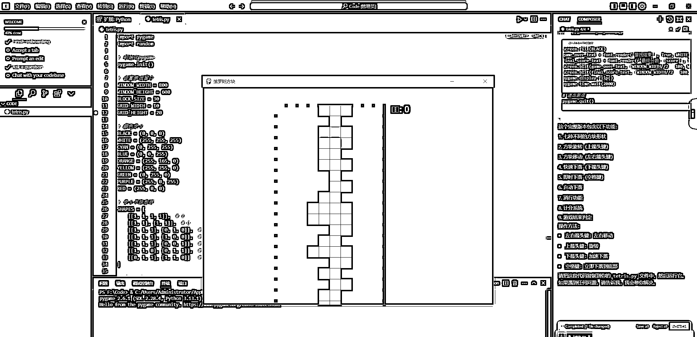
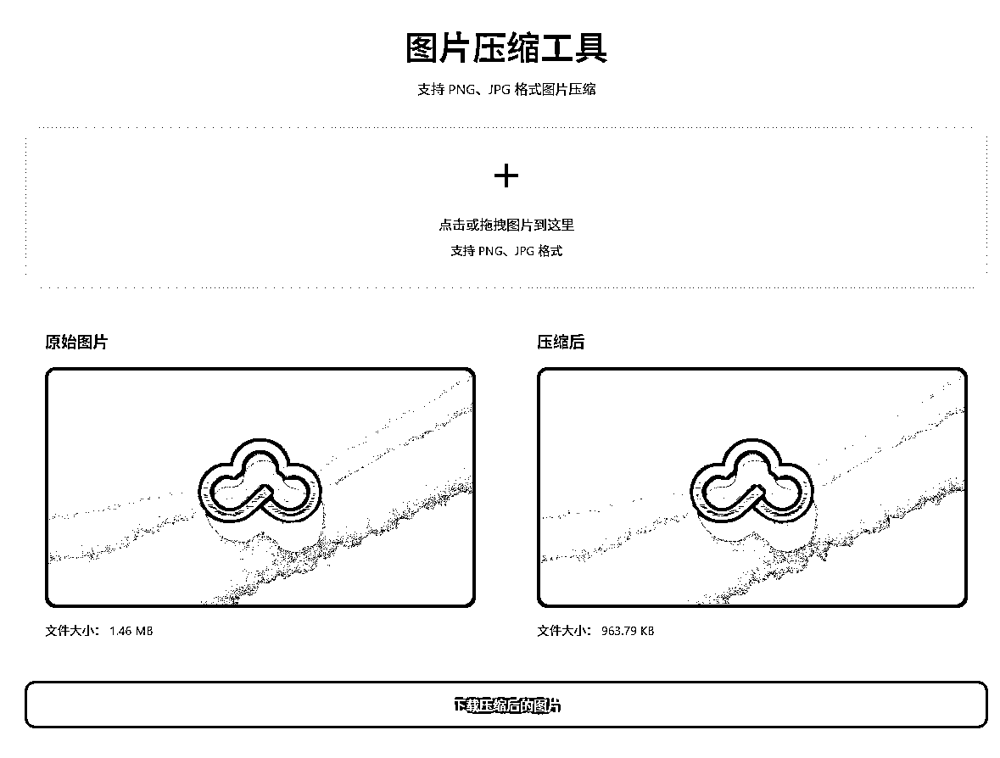
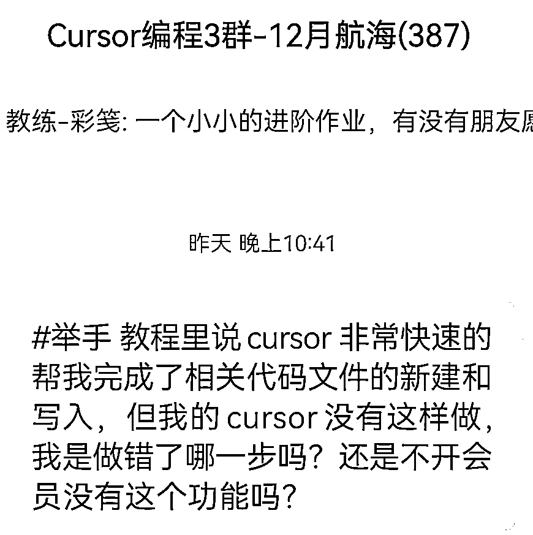
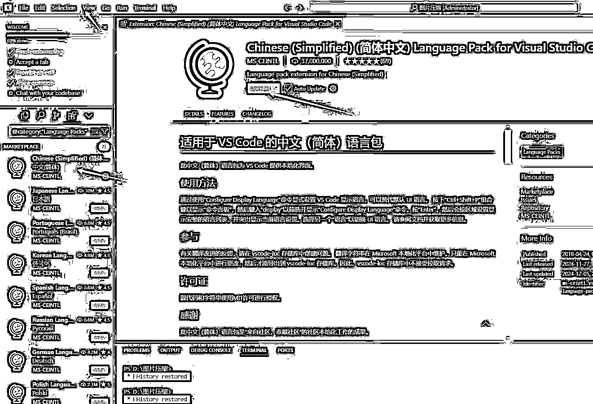
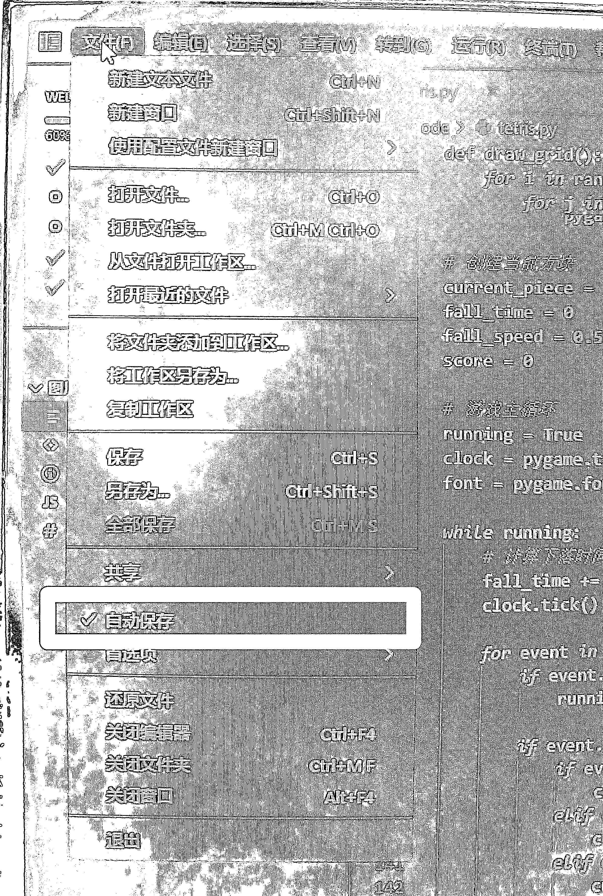
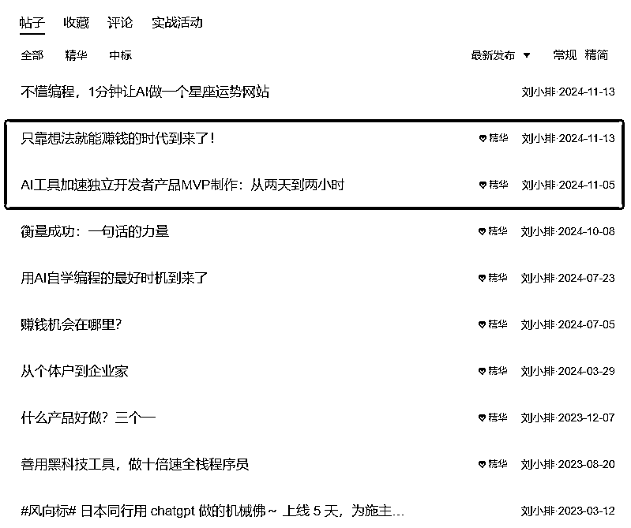
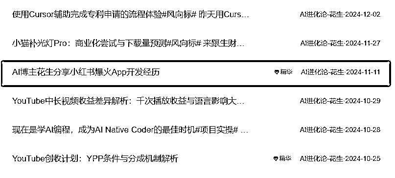

# 新手小白用 Cursor 快速开发俄罗斯方块游戏和图片压缩网页

> 原文：[`www.yuque.com/for_lazy/zhoubao/pzf429zv4t98tsmy`](https://www.yuque.com/for_lazy/zhoubao/pzf429zv4t98tsmy)

## (32 赞)新手小白用 Cursor 快速开发俄罗斯方块游戏和图片压缩网页

作者： 云珞 YunL

日期：2024-12-09

你好呀，我是云珞。

对于如何做游戏，如何做网页，什么是编程，我是一个新手小白，零基础，一点也不懂。

前天，我用 Cursor，40 分钟做了一个简单的俄罗斯游戏，45 分钟做了一个简单的图片压缩网页，太好玩了，强烈建议大家去学 Cursor，用 AI 做编程。

先给大家看看我做的成果。

第一个，俄罗斯方块游戏。

它成功运行了，而且我还可以通过键盘箭头按键控制它的移动方向。

第二个，图片压缩网页。

它可以使用，我下载图片，看了一下，确实 1.46MB 的图片变成了 963KB，图片确实被压缩变小了。

就是说，以后我若是有压缩图片的需求，我不用打开别人的网站压缩图片了，我用自己做的网页就压缩图片，完全告别广告。

如果我想让别人使用我的图片压缩网页，我可以用 GitHub+Vercel 的方式实现，不过，目前我还没有这个想法，所以说我没有做。

那我在做出这两个功能的时候，我遇到了什么困难？

我可以给大家简单说一下，打消大家对使用 AI 做编程的畏惧感。

真的很简单，很快乐，让人很有成就感。

我用了 40 分钟，做出了一个俄罗斯方块游戏，没有计算下载的时间。

我完全是一个新手小白。

比如，Cursor 让我下载某个软件，我打开网站之后，本来以为很简单，毕竟我下载过很多软件的电脑版，当时我就在想，只要会上网，那肯定会下载软件呢。

没想到，连下载软件我都不会，然后我直接问 cursor。他就帮我指导了，步骤更详细了。我按照它的步骤，成功下载了 python。

又比如，我在进行某个步骤的时候，我看他出现了红色，我感觉不太对，我就把那些符号复制过去，问他，这是怎么回事。他就告诉我为什么出错了，又告诉了我解决方法。

又比如，在教程里，有的方法，我没有看到，但是我看到了下一个步骤，我直接跳过教程里有，但我没有遇到的步骤。

再比如，他让我安装某个插件，我不明白为什么要安装这个插件，我就提取文字，修改一下错别字，然后问他为什么要安装这个插件，他就告诉我按键插件的原因，Cursor 太有意思了。

也就是说，我遇到了任何编程上的问题，我完全可以问 Cursor 怎么解决问题。

我用了 45 分钟，做出来了我的图片压缩工具网页，这次花了还包括我在群里提问的时间。

第一个问题，教程里说，按照他的步骤之后，有的代码就自动出现了，但是我的一直没有出现。我在群里提问后才发现，原来是这个原因，我之所以出错，是因为我用的 chat 输出的指令，原来该用
composer 输出指令。

第二个问题，“为什么压缩文件后，文件变大了？”这是我使用图片压缩网页后发现的问题，我继续向 Cursor 提出这个问题后，他帮我修改了，但是依旧有错误。

这是第三个问题。我问他为什么出现“此网页显示，当前 PNG 图片已经优化，无法进一步压缩”。我提出这个问题后，他帮我修改了，然后我下载图片看了一下，确实 1.46mb 的图片变成了 963kb，确实变小了。

也就是说我提了两个问题，Cursor 都帮我修改好了，做好了。

整个过程，不论是注册 Cursor，还是做一个俄罗斯方块游戏、一个图片压缩网页，我只在群里提了一个问题，其他时间，都是我看教程做出来的。

它根本没有我想象中那么难。

那我具体是怎么学习的呢？

第一天，我简简单单看完了一遍教程：[`scys.com/view/docx/YIvBdL38ConF89xdBvAckZBPn5e#QnYXdIPxxoHUlPxkCFLcDpB0nng`](https://scys.com/view/docx/YIvBdL38ConF89xdBvAckZBPn5e#QnYXdIPxxoHUlPxkCFLcDpB0nng)

第二天，我按照教程注册了 Cursor，中途我遇到了一点小问题，也解决。

我还把语言设置成了中文。

代码保存可以按保存图标，也可以按 Ctrl+S 保存，还设置了自动保存。三选一。

第三天，我用 1.4 小时，开发了一个俄罗斯方块游戏和一个图片压缩网页。

那我为什么想要学习 Cursor 呢？

一是我在生财看到了刘小排老师，对 AI 做编程很感兴趣。

二是我看到了花叔关于小猫补光灯的复盘。

他用 Cursor1 小时开发的 App，靠小红书成为百万爆款，登上了 AppStore 排行榜 Top20。

之后，他做了一个小猫补光灯 Pro 收费下载的商业化尝试，短短 6 个小时之后，「小猫补光灯 Pro」版本登上了所有付费应用榜的第 1 名。

安卓跟风出现了很多盗版。

火到小红书官方账号之一数码薯都推荐了他的小红书帖子和账号。

这是我学习 Cursor 最主要的原因。

在学习 Cursor 12 月航海手册之前，我真的很担心我学不会，我会遇到很多困难。

没想到，我用 1.4 小时就开发了一个游戏和图片压缩网页。

我没想到这么简单，这么容易，我真的对 AI 学编程产生了浓厚的兴趣。

强烈建议大家去学 Cursor，用 AI 做编程。

* * *

评论区：

宋忻 : 虽然之前也看到 CUTAOR 的文章，但不知怎么滴，看了你的开头后我萌生想法：如果我学会了，就可以带着孩子一起去制作游戏，这可比孩子闷头玩游戏强多了！

云珞 YunL : 加油，看着 cursor 航海手册，很容易