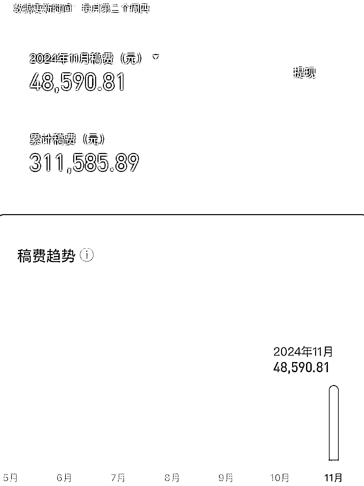

# 利用 AI 自动化写小说，一个月成功签约 100 篇短篇小说，月入四位数

> 原文：[`www.yuque.com/for_lazy/zhoubao/cy04alqdkx3g6f3d`](https://www.yuque.com/for_lazy/zhoubao/cy04alqdkx3g6f3d)

## (39 赞)利用 AI 自动化写小说，一个月成功签约 100 篇短篇小说，月入四位数

作者： Ai 联盟

日期：2024-12-13

大家好，我又来了，上个月我分享了如何靠写短篇小说慢慢变富的帖子。

很多圈友加我想了解百家号付费订阅的事，我也做了解答，但是很多人发的信息，我都要第二天才回复，不是我没看见，而是这半个月太忙了，忙着测试新的项目，希望大家见谅，今天在这里给大家做一个统一的汇报。

老规矩，先看数据，小说短篇稿费

文章图片内容有点多，请大家看飞书

[`szxb4qbve7.feishu.cn/docx/ArZHdgfKdozG8ExxHeOconZLnQb?from=from_copylink`](https://szxb4qbve7.feishu.cn/docx/ArZHdgfKdozG8ExxHeOconZLnQb?from=from_copylink)

* * *

评论区：

翻斗花园 : 老哥，这个真棒，但是我已经实操啃起来了 就是达不到老哥这个效果

行者阿吉 : 请问一下，百家号每个号是否都需要实名呢？