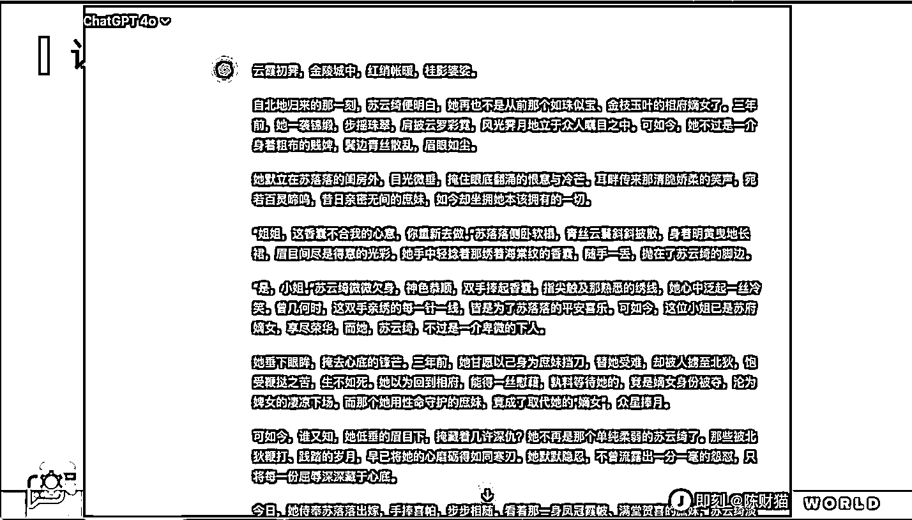
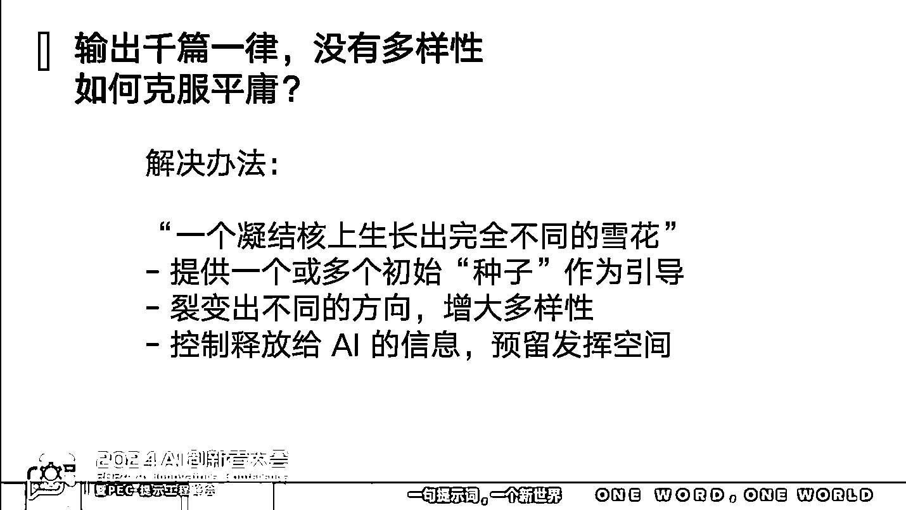

# AI 顾问经验总结：大厂商业化成果与内容创作启示

> 原文：[`www.yuque.com/for_lazy/zhoubao/kacw43qvo0hst2tr`](https://www.yuque.com/for_lazy/zhoubao/kacw43qvo0hst2tr)

## (34 赞)AI 顾问经验总结：大厂商业化成果与内容创作启示

作者： 陈财猫

日期：2024-12-09

大家好，我是陈财猫。这是一篇很值钱的文章，是我给某大厂当 ai 顾问的经验总结，我们都赚了不少钱。我们目前拿到了很多结果，标题所言的“商业化水平”绝对不是虚言。这篇文章花了我非常多的心血和时间，全文大约 1.3 万字，事实上，我推荐每个搞 ai

*   内容创作的朋友都看看。

另外做个自我介绍，我是一个提示工程师，目前在 AI 赛道创业中，也许是国内第一批提出提示词框架的人（在 23 年 2 月底发明了提示词框架 BROKE），做的 GPTs 在全世界三百多万个中排过前 100，做的 prompt
AI 游戏上过 Github
trending，用搞科研态度写的提示词工程教材霸榜过当当人工智能新书榜榜 1。我最近刚加入生财有术，这是我第一次在生财有术发帖，也许国内在 ai 圈的小伙伴会认得我。

这篇文章是 11 月在北京举办的提示词工程峰会的演讲稿。祝你阅读愉快。

下面是飞书链接：

[`richcatai.feishu.cn/wiki/Y3QmwtYWUiqslIk5RmNcssMcnjg?from=from_copylink`](https://richcatai.feishu.cn/wiki/Y3QmwtYWUiqslIk5RmNcssMcnjg?from=from_copylink)

 images.zsxq.com/Fu2WKW32tCXbsXUIXLcw8A0AQKev) images.zsxq.com/FikXjNEwTmTAuRQAEJI8gD0_9BvW)

* * *

评论区：

暂无评论