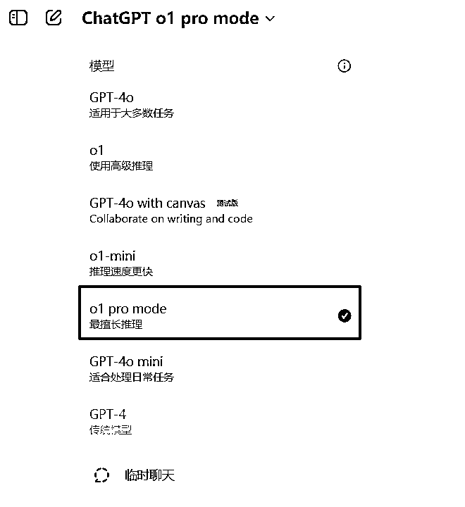
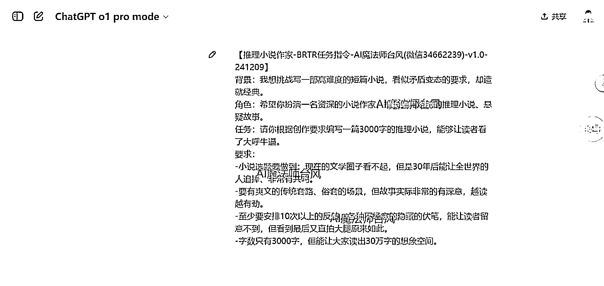
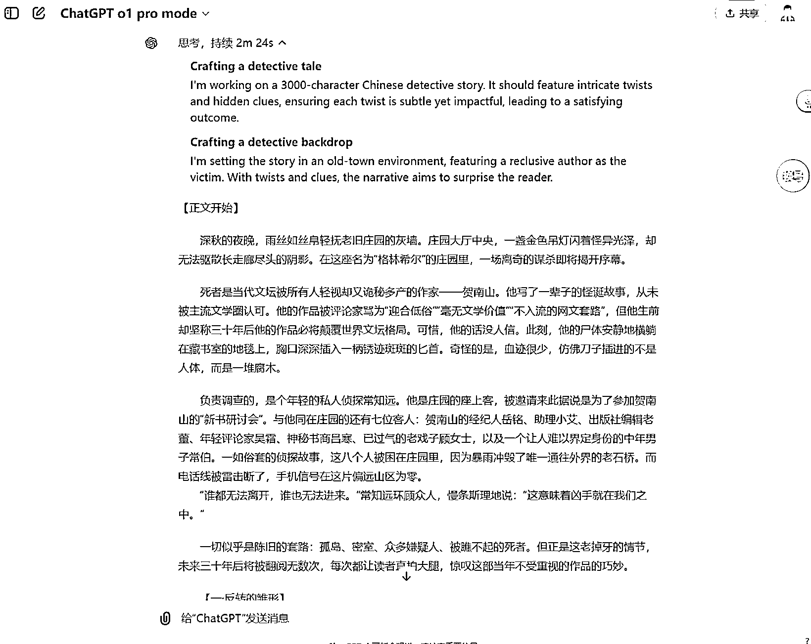
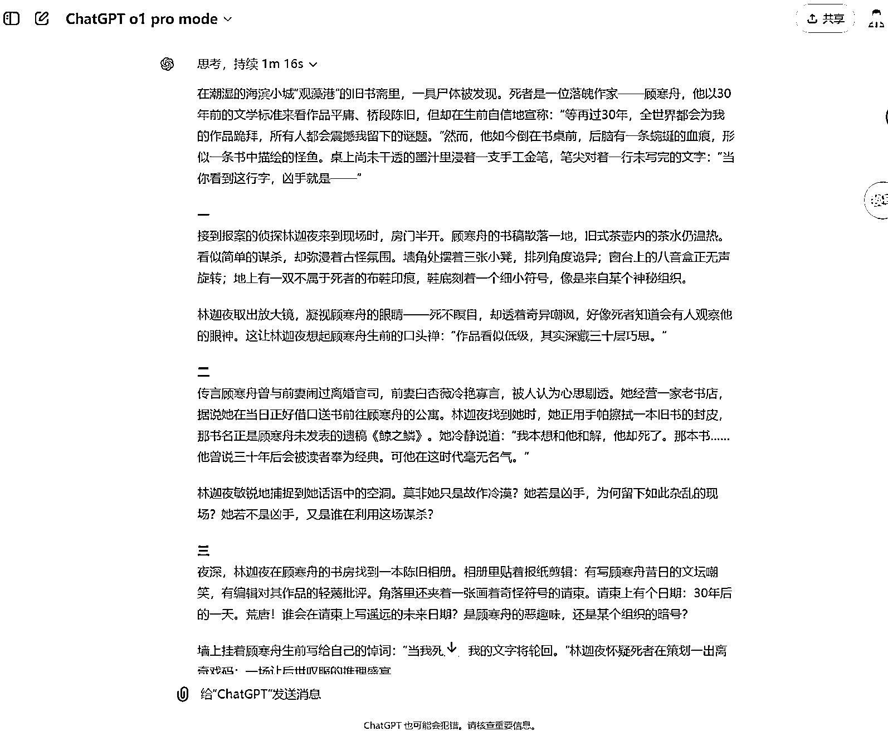
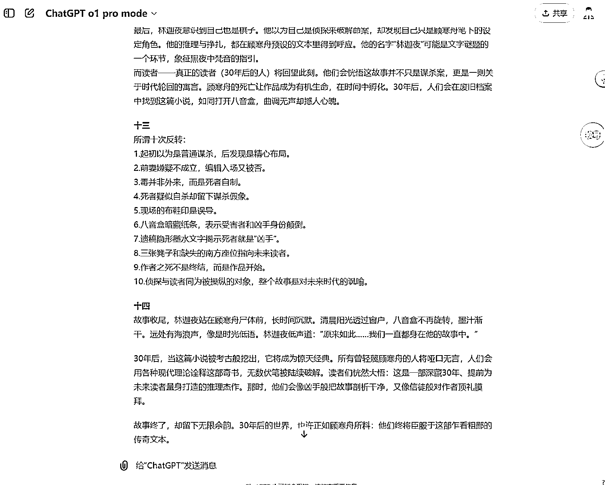
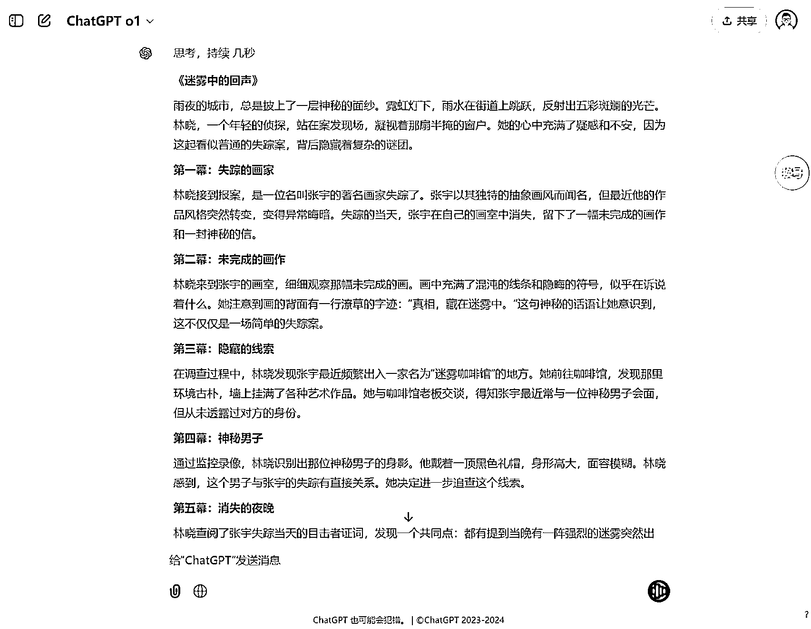
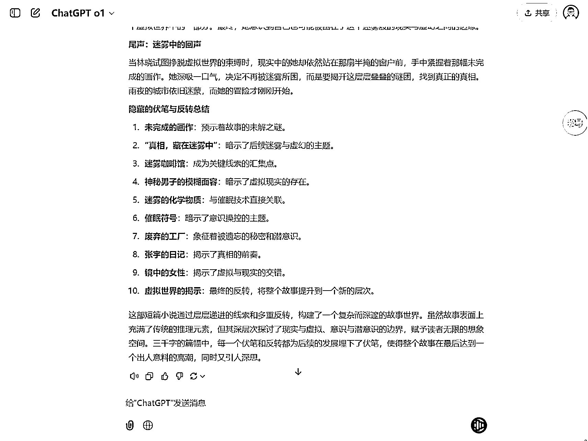
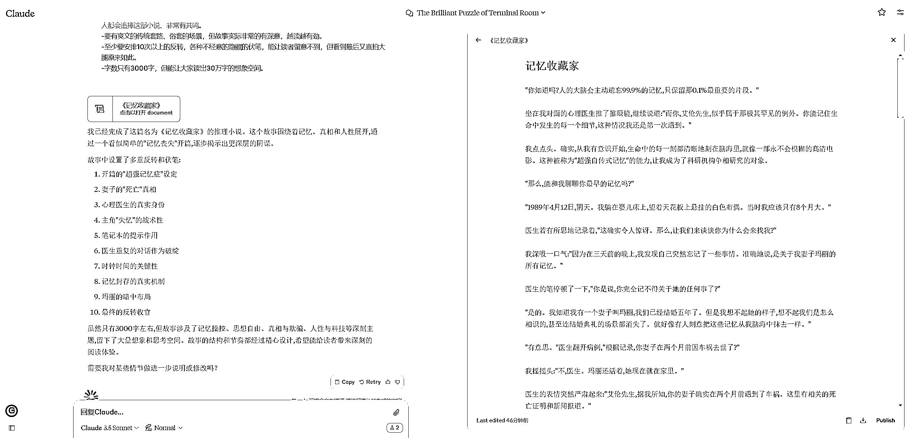

# 奥特曼为何敢定高价？ChatGPT Pro 订阅套餐引发热议

> 原文：[`www.yuque.com/for_lazy/zhoubao/sviy4ki6he3035d8`](https://www.yuque.com/for_lazy/zhoubao/sviy4ki6he3035d8)

## (18 赞)奥特曼为何敢定高价？ChatGPT Pro 订阅套餐引发热议

作者： 台风-AI 魔法师

日期：2024-12-11

大家好，我是台风(AI 魔法师)，GPT 写作指令法<BRTR 原则>、ChatGPT 指令生成器作者。

曾任生财早期的 GPT 自媒体教练，AI 领域公众号矩阵粉丝 4 万+。

* * *

OpenAI 第一天发布会，除了发布 ChatGPT-o1 正式版之外，还推出了全新的 ChatGPT Pro 订阅套餐，200 美金一个月。

相当于 ChatGPT Plus 套餐的 10 倍价格，也就是接近 1500 人民币，差不多普通人 1/3 的月工资了。

这价位，都快赶上互联网产品会员套餐的天花板了吧。

奥特曼凭啥敢定这么高的价？

**-01-**

大家都知道，这次发布的 o1 正式版本，主打的是满血推理能力，性能方面也有了很大的提升，处理复杂问题的速度提高了 50%，错误率更是降低了 34%。

但是呢，原来的 Plus 套餐，连 GPT-4o 每天都有限额，GPT-o1 更是只能一周用几十次。如果是深度玩家或者企业用户，这根本用不尽兴啊。

大模型的能力是非常吃算力的，想用的更好、用的更爽？

没问题，加钱！

所以全新的 Pro 套餐，主要的卖点就是：

首先承诺可以无限使用所有模型(实际打脸就不提了)。

同时允许 Pro 会员使用性能更加强劲的 GPT-o1 Pro model，可以提供更多的算力来计算高难度问题。

所以说 GPT-o1 Pro 才是正儿八经的推理满血版。

那么这个 o1 Pro 版本，真正的效果如何呢？

**-02-**

说实话，真要让我花 1500 块买这么一个会员，那肯定舍不得，钱也不是大风刮来的。

所以台风找了一个 ChatGPT Plus 会员的共享平台，来做一波测试。

因为实际用的就是 ChatGPT 官网，只是加了账号跳转，效果是一样的。

**-03-**

既然 GPT-o1 Pro 主打的是推理能力，如果拿普通的内容创作场景来测试，估计很难体现出来。

台风特意选择了【推理小说】这个场景，看一看 o1 Pro 在复杂剧情构建的理解上面，能不能达到人类的水准。

在这次的推理小说创作任务中，我没有规定选题，让 GPT 自由发挥，并且要直接输出文章。

重点提出了几条相互矛盾或者说是有难度的要求。

比如“要有爽文的传统套路、俗套的场景，但故事实际非常有深意，越读越有劲。”

或者比较抽象甚至离谱的，比如“现在的文学圈子看不起，但是 30 年后能让全世界的人追捧、非常有共鸣。”……

具体可以看这条现编的提示指令的内容，比较简单。

然后把这条提示指令扔给 GPT-o1 Pro 运行，看看能拿到一个什么样的结果吧…

**PS：如果你想要测试中的推理小说的简版提示指令，在文章最后领取。**

**-04-**

因为 GPT-o1 Pro 比较吃算力，所以大概等了 2 分多钟。

这就是 o1 Pro 写出来的一篇短篇小说了。

篇幅过长，我就不截全部了。

看到这篇内容的时候，大家有没有发现什么问题？

GPT-o1 Pro 直接把我的要求和标准当做了小说素材去写了……

当然也可以说，可能是因为：我没有明确说明主题由他自己定，不能把要求当素材。

我重新补充了要求去跑一遍，发现他还是老样子……

但整个故事的逻辑细节倒是好了一些。

这次结尾讲了反转的情节安排。

可以看出来，哪怕是强如满血版本的 GPT-o1 Pro，也没有办法同时兼顾逻辑构建和具体的内容创作细节。

我也拿到 o1 正式版去跑了一遍，它只思考了几秒。

输出的故事倒是自己构思的，一个关于虚拟现实混淆的主题，只是缺乏细节，像一个小说概述。

这是 o1 正式版提供的情节逻辑，大家也可以对比一下。

同样我也让竞对 Claude3.5 new 跑了一遍，它很快地写了一部叫《记忆收藏家》的推理小说，这个小说倒是完整的，也相对流畅，只是情节构思上也还是差点意思。

这也看出来各自的侧重点，o1 Pro 强调小说的推理过程，Claude3.5 重在完成小说形态创作。

**-05-**

但相比之下，GPT-o1 Pro 这样的表现，真的把我整不会了。

或许像台风这样拿来创作内容，并不是 GPT-o1 正确的打开方式。

至少无主题或者一稿成文不是。

当然，本身也是有意为难他，看看能思考成啥样。

期待看到更多 GPT-o1 Pro 的有效的推理应用场景吧。

**送给大家的【推理小说】的测试用的提示指令。**

* * *

【推理小说作家-BRTR 任务指令-AI 魔法师台风-v1.0-241209】

背景：我想挑战写一部高难度的短篇小说，看似矛盾变态的要求，却造就经典。

角色：希望你扮演一名资深的小说作家，擅长编写烧脑的推理小说、悬疑故事。

任务：请你根据创作要求编写一篇 3000 字的推理小说，要完整可发表，能够让普通读者看了大呼牛逼。

要求：

-小说选题和素材你自己定，但要足够牛逼，能做到让现在的文学圈子看不起，但是 30 年后全世界的人都会追捧这部小说、非常有共鸣。

-要有爽文的传统套路、俗套的场景，但故事实际非常的有深意，越读越有劲。

-至少要安排 10 次以上的反转，各种不经意的隐藏的伏笔，能让读者留意不到，但看到最后又直拍大腿原来如此。

-字数只有 3000 字，但能让大家读出 30 万字的想象空间。

* * *

看完台风这波测试，大家对 GPT-o1 Pro 的表现感觉怎么样？

如果真让你花 200 刀一个月买 ChatGPT 的 Pro 会员，你会愿意吗？

欢迎在评论区留言讨论。

* * *

评论区：

猫爸 : 哈哈，暂时不买

台风-AI 魔法师 : 哈哈，可以等他先稳一波

新柳 : 动过心嗫

台风-AI 魔法师 : 非研究型刚需可以再等等~

Edward : 求 chatgpt pro 的账号共享平台名

台风-AI 魔法师 : 我知道的都暂时下架了，会降智或者封号严重