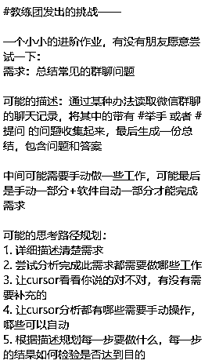

# 如何用 Cursor 开发提取聊天记录问题的工具及解决 BUG 的方法

> 原文：[`www.yuque.com/for_lazy/zhoubao/bgdh4cim32eru659`](https://www.yuque.com/for_lazy/zhoubao/bgdh4cim32eru659)

## (20 赞)如何用 Cursor 开发提取聊天记录问题的工具及解决 BUG 的方法

作者： 大臣

日期：2024-12-09

圈友们好，我是励志要在 21 天航海，做出 21 款工具的男人。

目前进度 5/21

这篇文章记录的是如何用 cursor 开发一款提取聊天记录问题的工具，里面提到了我在解决 BUG 时一些好用方法。

这个程序的灵感来源于前几天 cursor 航海群发布的挑战。

当时我完成这个挑战后，突然想到我以前在做线上教培时，会有很多学员在直播间提问，但讲师可能不每个都解答到，讲清楚。

如果可以把学员们的问题都采集起来，给出专业的解答，我想学员的学习效果会好很多，而且也方便后来者参考。

所以我打算做这个问题采集小助手，但当程序开发完之后，我发现

**小了，格局小了** 。

这哪是问题采集小助手啊，只要修改提示词，分析什么文本不行，所以它也就从问题采集小助手，变成了信息采集小助手。

飞书链接：[‍​​​‌‬​​‍​​‬​⁠​‍​‬⁠​​​‍​‌​⁠‍‌​​‍‬​​⁠​‍如何用 cursor 开发一款聊天记录问题分析工具 -
飞书云文档](https://wm1881zs6s.feishu.cn/docx/Vlshd9gWZo3G0jxmXuwcLwhenog)

* * *

评论区：

知秋 : 没有访问权限

大臣 : 抱歉，忘记开了，现在呢

知秋 : 现在已经能够访问，谢谢你

大臣 : [胜利]

海伦 : 优秀优秀，大臣加油