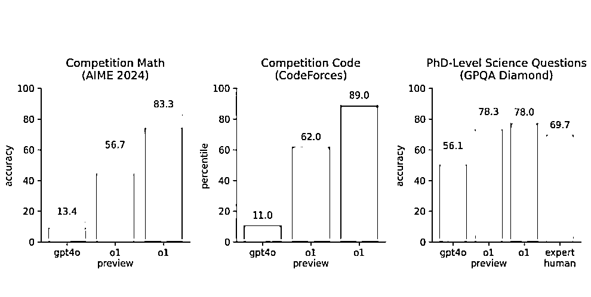

# OpenAI 发布 ChatGPT o1 正式版：性能大幅提升，错误率降低 34%

> 原文：[`www.yuque.com/for_lazy/zhoubao/liqi1iz1ccdgprd7`](https://www.yuque.com/for_lazy/zhoubao/liqi1iz1ccdgprd7)

## (9 赞)OpenAI 发布 ChatGPT o1 正式版：性能大幅提升，错误率降低 34%

作者： 台风-AI 魔法师

日期：2024-12-10

大家好，我是台风(AI 魔法师)，GPT 写作指令法<BRTR 原则>、ChatGPT 指令生成器作者。

曾任生财早期的 GPT 自媒体教练，AI 领域公众号矩阵粉丝 4 万+。

* * *

OpenAI 连续 12 天的发布会，第一天就发布了 ChatGPT 的 o1 正式版，还推出了每月 200 美金的不限量的 PRo 套餐。

趁着这股热乎劲，台风也体验了一把正式版的 o1。

**01**

按照惯例，先简单看看 o1 的参数吧。

官方介绍说，新版本性能有了大幅提升：处理复杂问题的速度提高了 50%，错误率更是降低了 34%。

在数学和编程方面表现尤其亮眼，拿 2024 年国际数学奥赛预选题来说，正确率高达 83%！这可把 GPT-4 的 13%和预览版 o1 的 56.7%远远甩在了后面。

o1 这次还加了不少实用功能，比如能根据问题难度自动调节响应速度，还支持图片识别功能。

**02**

当然台风更关注它在内容创作这方面的表现。

于是现编了个简单的国学鸡汤指令来做个测试。

o1 只思考了几秒就开始输出，速度快多了，感觉比 GPT-4 还快一点。

给出的字数有点夸张，达到了 1800 字。我只要求了 1200 字…

看了一遍内容，o1 明显是知道国学文章该怎么写的，内容结构基本符合国学鸡汤的框架雏形，整体内容逻辑性也比较强。

像国学文化、经典名句、故事等元素，只是在角色定义里提到了是要熟悉的技能，o1 内容里基本都用上了。

文章之所以那么长，是因为 o1 自己做了发挥，论述主题之后，还给出了相关建议，衔接结尾之前还有承上启下的一段话，结尾再回顾主题，结构安排上还算可以吧。

虽然提示词简单，但效果还行。也可以看出，只要大模型能力足够，就可以很好地理解这种看起来抽象实则也算精准的要求，写出 70 分以上的文案。

**03**

但我们创作文案，不能只看逻辑，还得重点关注表达风格。

全文看下来确实没有明显的 AI 味，只是显得相对正式，像个研究员的口吻。

相比之下，用同样的提示词，Claude-3.5-new 的表达就自然多了，更口语化。

总的来说，o1 在逻辑方面表现稳定，符合预期。可能正是因为太注重这一点，反而在表达风格上显得偏弱了。

现在官网上 plus 会员使用 o1 每周还是有限额的，大概几十次，肯定是没法满足创作需求的。

200 美金/月的 Pro 套餐呢，不仅不限量，还支持使用更强大的 o1 Pro 模式，计算能力更强，思考更深入。

个人感觉，可能更适合需要用到科研或者做方案的场景。

**04**

台风之所以能成为一个 AI 超级个体，完全是因为 ChatGPT 带来的流量红利。

我很感激，在 2023 年是 ChatGPT 让我感受到了 AI 的魅力。

本来这篇文章是打算用 o1 来扩写润色的，但生成了两遍，我都不大满意。

因为它生成了太多超出要求的东西，甚至是结尾生成了一大堆莫名其妙的东西，像什么标签、版权、联系我们…

看起来似乎是想多为我考虑一些，但说实话，过犹不及啊，最后还是放弃了，换回我最爱的 Gemini。

嗐，回首两年过去了，我和 ChatGPT 却有了渐行渐远的感觉。

无论如何吧，还是得说一声：

ChatGPT 加油！谢谢你。

大家都不要辜负一个如此美好的 AI 时代。

一切都刚刚开始，一切都会越来越好。

**One MoreThing**

附上测试用的简版国学鸡汤指令，由于是为了测试自由发挥的能力体现，所以很简单。

【国学简版-BRTR 任务指令-AI 魔法师台风-v1.0-241206】

角色：希望你扮演一个国学文化爆文作家，熟悉传统国学文化、经典名句、故事等，擅长编写中老年人爱看的国学鸡汤观点文章。

任务：帮我编写一篇标题为“父母犯三错，子女一生穷”：有的穷，是父母造成的”的文章。

要求：1200 字，要煽情、感人，表达口语化。

**大伙有什么想法，欢迎评论区交流。**

* * *

评论区：

暂无评论