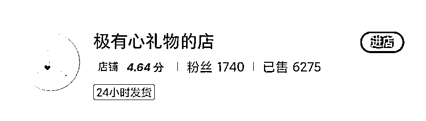
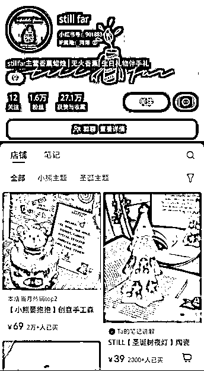
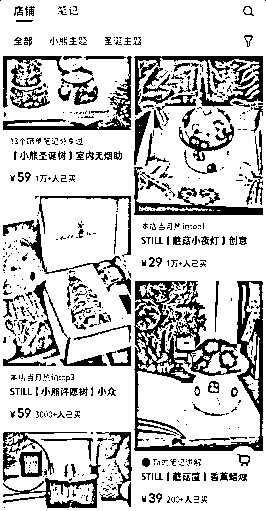
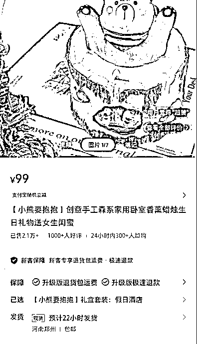
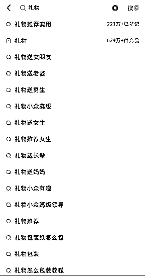
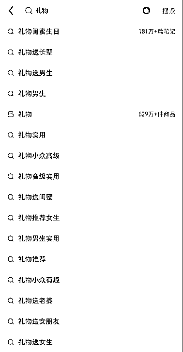
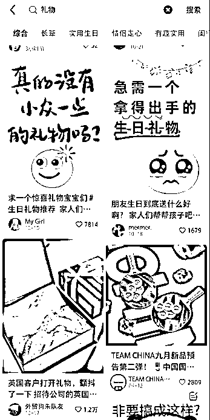

# 小红书礼物赛道的独特优势与市场潜力

> 原文：[`www.yuque.com/for_lazy/zhoubao/agnnuu2mqt4ph85a`](https://www.yuque.com/for_lazy/zhoubao/agnnuu2mqt4ph85a)

## (37 赞)小红书礼物赛道的独特优势与市场潜力

作者： 古辛

日期：2024-12-10

小红书是一个比较独特的电商平台，不同于淘宝和拼多多等平台以搜索流量为主，小红书还是一个有推荐流量的内容平台，所以，小红书有一些独属于自己的，蓝海赛道，今天古辛就跟圈友们分享一下，独属于小红书的蓝海赛道——礼物赛道！

小红书礼物赛道古辛自己也在做，也分享给过古辛星球的兄弟们，因为这条赛道非常大，可以容纳很多人，所以古辛就来分享给生财的圈友们，如果大家目前也在做小红书，并且还没有选到适合的品，那么可以考虑一下，小红书礼物赛道。

古辛觉得，礼物赛道在小红书上的市场如此之大的原因，主要有两个，一个是小红书上的用户以女性为主，而礼物的主要用户也女性，这俩的用户群体是重叠的。

二一个是因为小红书是种草平台，很多创新礼物，在电商平台很难卖动，主要就是因为没人知道，但小红书不同，小红书是种草平台，就算用户不知道这个礼物，也有机会被平台推荐，也可能看到，从而购买。

小红书上的礼物市场很大，可以容纳很多店铺，同时，礼物店也比较好做，比如上图这个店，就是做礼物垂直店的，991 个粉，卖了 7318 单。

这个店也是礼物垂直店，1740 个粉，卖了 6275 单。

今天拿做案例给兄弟们看的，是上图这个店，古辛觉得这个店，具有代表性，值得模仿。

礼物垂直店走的是垂类路线，就是一个细分类目的品，都可以往这个店放，就不走单品路线。所以几乎所有的礼物垂直店里，都会有很多个品。

礼物垂直店还有一个特点，就是低，中，高客单的品都做，不局限于只做高客单的品，当然，如果只做高客单礼物垂直店，古辛觉得也 OK。

对于礼物垂直店，算单个链接的毛利润，就没啥意义，因为这类店的品贼多，看的是总的毛利。

每个平台都会有属于自己平台的特色赛道，古辛认为礼物垂直店，就属于小红书这个平台的特色赛道，如果想要礼物市场，小红书绝对是国内最好的平台，没有之一。

如果圈友们想要做小红书礼物赛道，需要注意以下三点：

**1****.** **用好小红书搜索栏下拉联想词**

无论是选品，还是做笔记，都要用好小红书搜索下拉联想词，这些词既可以帮助我们选品，又可以帮助我们理解这个品类，以及获得更多的流量。

比如我们在小红书搜索“礼物”，下拉框就会出现很多联想词，这些词都是“礼物”在小红书搜索量很大的长尾词，每个都需要好好利用。

大家有没有发现，这张图很怪异，因为他的联想词排第一的是送女朋友，排第二的是送老婆，这很明显是站在男性视角推的联想词，和小红书主流用户群体，以及我们想做的目标用户群体，是不相符的。

原因就出在账号的性别上，上图这个号，他的性别是男，所以搜索的联想词，才会站在男性视角来推荐。

用性别为女的小红书账号来搜索，联想词就对了，排第一的是闺蜜生日，其次是长辈，再然后才是送男生。

用性别为女的小红书号来搜索，得到的词才有价值，用性别为男的小红书号得到的词，没啥参考价值，反而可能让大家走错方向。

**2****.** **找准用户的痛点**

礼物这个品和其他品还不一样，其他品的购买者，基本也是使用者；但礼物的购买者和使用者是不同的人，所以，我们要找用户的痛点，主要找准购买者的痛点，谁下单，谁才是我们的客户。

那我们的客户有什么痛点呢？这个赛道的客户，最大的痛点，就是自己不知道该买啥？很多客户，自己是不清楚该买什么礼物的，小红书恰好又是一个种草平台，能够帮她们解决这个问题。

这也是为什么小红书的礼物赛道，比其他平台都好做的原因，淘宝是必须客户自己搜索，宝贝才会出现，小红书就算用户自己不知道想买啥，宝贝也会出现。

其次，我们的客户送礼，大多都有同样的心理，就是希望自己的礼物能够小众一点，不是烂大街的，而且还能给收礼者惊喜，这点也说明了，为啥昨天提到的海螺蜡烛，销量会那么高？

**3****.** **贵=好**

礼物赛道还有一个特殊性，就是可以激发“贵=好”这条潜规则，如果这个品是自己用，可能大多数人会选择便宜一点的，但如果送人，会选择贵一点的，因为“贵=好”是刻在人潜意识里的一个信息。

虽然我对这个品不懂，但我知道，好的肯定贵，那么我只要买贵的，就一定差不了，所以，礼物赛道，特别是送长辈的礼物，定价高一点，要比定价低一点，更好卖。

小红书礼物赛道，在古辛的眼里，目前就是一个纯粹的蓝海市场，有很多古辛知道很适合小红书用户群体的品，在淘宝每月有几百的销量，但在小红书目前是搜不到的，这意味着什么，相信有过电商经验的兄弟们都懂！

如果圈友们在小红书礼物赛道发了财，别往了给古辛点赞，哈哈。

* * *

评论区：

上上签 : 要不在讲讲具体的操作，喂个饭

古辛 : 这是核心机密，护城堡垒。。。。。得加钱[旺柴][破涕为笑][破涕为笑][破涕为笑]

阿路 hh : 因为我有个朋友是这个赛道的，小红书 top10，我 11 月份导过数据，发现 7 月份过后数据反馈不太理想，一开始以为是礼物赛道上半年优于下半年，但环比 23 年，确实整体数据下滑挺大，感觉这个赛道消费的模式有所转移

BLUE : 喂饭到掌勺

小花 : 小红书应该是从 8 月份开始调整了流量政策，所有行业都受影响，要投流了。

老彭 : 啊啊啊啊！！！快到圣诞节了，看了一晚上小红书，还是不知道要送女朋友什么礼物！！要死了