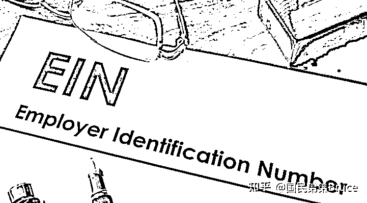
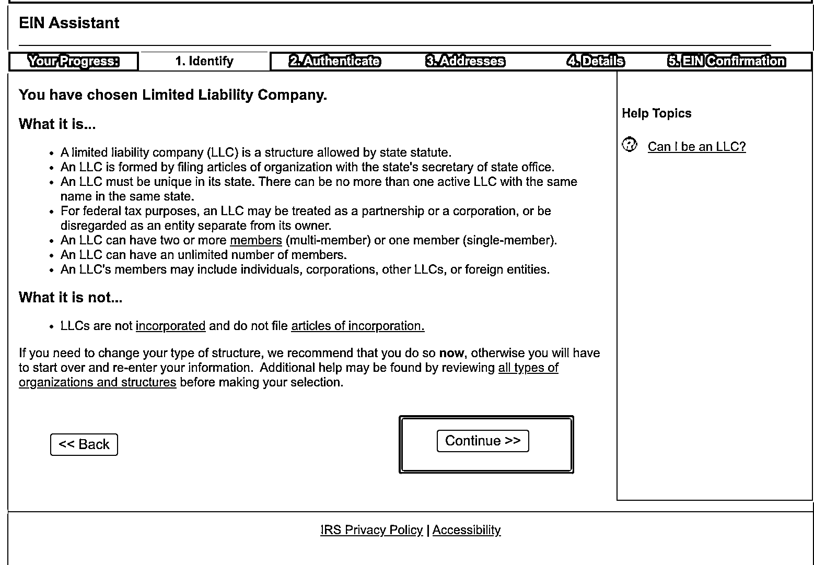

# 美国公司申请 EIN 教程：揭秘申请路径

> 原文：[`www.yuque.com/for_lazy/zhoubao/sq6l4zzhidao88zc`](https://www.yuque.com/for_lazy/zhoubao/sq6l4zzhidao88zc)

## (23 赞)美国公司申请 EIN 教程：揭秘申请路径

作者： 国民弟弟的跨境十年

日期：2024-12-12

**美国公司申请 EIN 教程史上最全-国民弟弟跨境十年出品**

之前讲过超低成本注册美国公司。

可以看之前这篇文章：**3 分钟搞定美国公司，150 美金，超简单**

[`articles.zsxq.com/id_exggkcb30j69.html`](https://articles.zsxq.com/id_exggkcb30j69.html)

但是用他们家申请 EIN 费用确实很贵，200usd，而且要 2 个月。着实不推荐。

那么这里揭秘下申请 EIN 的路径。

> **什么是 EIN?**

**EIN 是 EmpolyerIdentificationNumber**

简单理解就是类似中国企业的税号。

雇主身份号码(简称 EIN)又称联邦税识别号码，用来识别企业实体。一般而言，企业都需要一个 EIN。

关于 EIN 的具体内容，可以看 IRS 官网。

<[`www.irs.gov/zh-hans/businesses/small-businesses-self-`](https://www.irs.gov/zh-hans/businesses/small-businesses-self-) employed/employer-id-numbers>

**先说下自己申请的条件：**

1）有 itin

可以看之前这篇文章：**2022 关于中国人开美国公司的问题指南，史上最全**

[`articles.zsxq.com/id_01qkizckwh9c.html`](https://articles.zsxq.com/id_01qkizckwh9c.html)

这个在大陆也能远程找 CAA 办理，相对简单容易。就是要等 1-2 个月。

如果有朋友没有，可以看上记文章或找我。

2）有刚注册下来的美国公司。

> **EIN 的费用？**

1.中国代理的价格都会比较贵，不信自己去淘宝问下就可以。

2.找美国代理

大部分美国代理价格都在 50-200usd 左右。

我沟通了两家美国税务事务所。

对方知道我是博主，我就说我的粉丝多，能不能拿个最低折扣。

最后压到 20-30USD 一个税号，税号在 1-2 个工作日可以拿到。他们平常至少 50usd。这两家需要的报国民弟弟索取。

3.自己在线申请。钱比较少，相对繁复了些，时间周期 2-8 周都有。比较费力，不过我也会解释下。

> **EIN 如何申请？**

1.美国国税局官网在线申请：

您可以在美国国税局（IRS）的官方网站上在线提交申请。访问 IRS 的网站，[点击进入]

[`sa.www4.irs.gov/modiein/individual/index.jsp`](https://sa.www4.irs.gov/modiein/individual/index.jsp)

选择对应的公司类型

按具体情况填写

这里要写 SSN 持有人信息。

如果你的 ITIN 填报的时候报错，那么估计是 ITIN 刚拿下来比较新，要等几个月才好用。

填入 itin/ssn 后会选择这个 LLC 的具体信息。

填入公司的基础信息。

这里都写 NO

选择对应的行业类型

一般是 Retail

电商一般选择这个

确认基本信息：

确认没有问题

就点下图 submit

然后就是签发出税号。

这个是确认副本，可以打印或者截屏。作为证明。同时 EIN 的确认信会向你注册地址发过去，一般是 2-4 周就有信件确认函。

现在申请界面会同步跳出一个电子档，让你下载。类似这样，大功告成。

其他 bug

如果报错，原因挺多的，问过美国税务师。他们的说法是，这样的情况。需要通过电话和 IRS 沟通申请，一边电话，一边传真，还真是费时费力。

**其他的申请方法。**

通过传真申请，一般需要填 ss-4 表格，需要费时 2-8 周时间。这里就不细说，对比 20-30 刀的成本，这个时间不值得浪费。

最终这个 EIN 信件，在部分平台是可以作为地址证明使用，如 Stripe 申请的时候，部分审核情况，要传 EIN 信件。

内容干货，又细节。还不收藏下，需要的时候还能找到哦。国民弟弟让你又至少省了 100 刀。

以上

**国民弟弟相关创业的故事文章推荐：**

[`articles.zsxq.com/id_8n2o7gax71fr.html`](https://articles.zsxq.com/id_8n2o7gax71fr.html)

* * *

评论区：

暂无评论