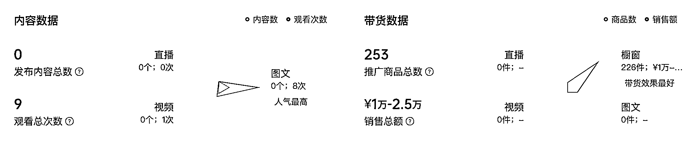
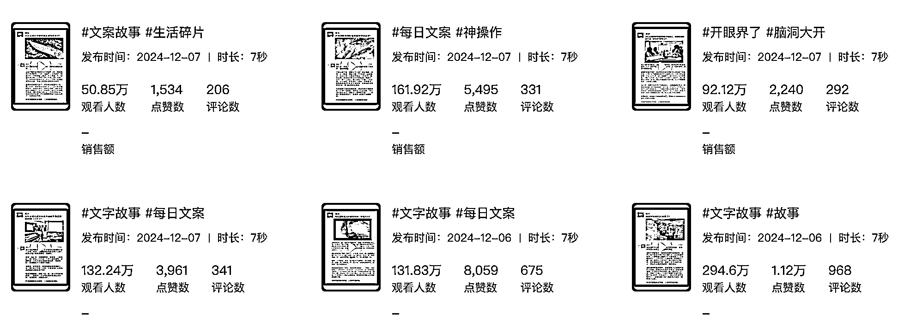
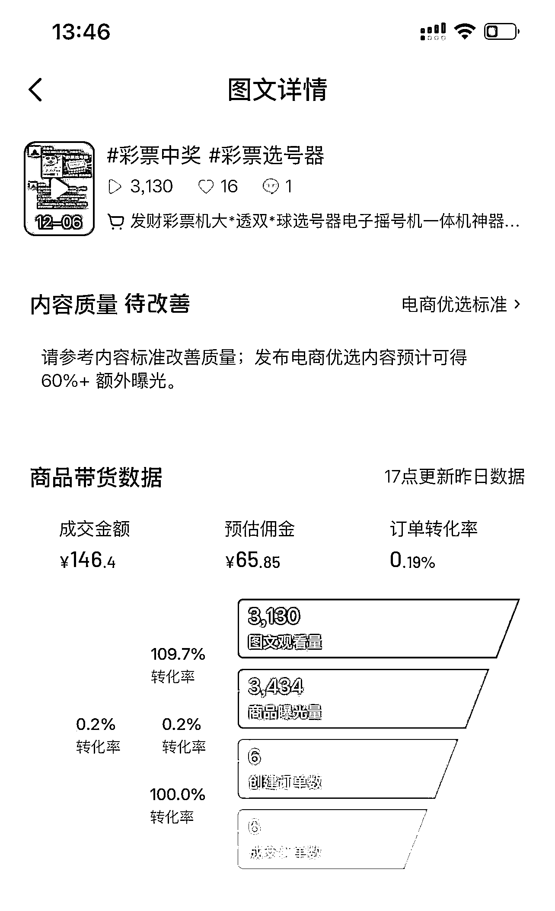
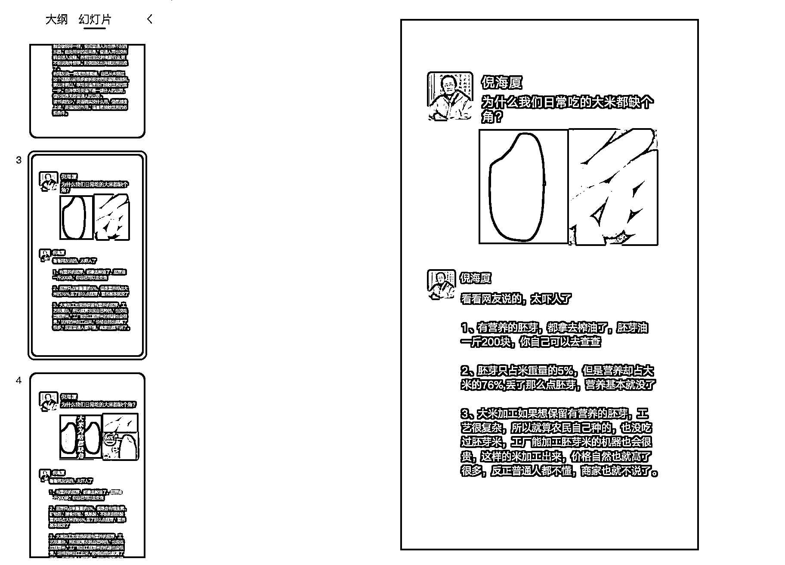

# 一个月 3 亿播放，在抖音能赚多少钱？

> 原文：[`www.yuque.com/for_lazy/zhoubao/sf3yg719qzgnkrq6`](https://www.yuque.com/for_lazy/zhoubao/sf3yg719qzgnkrq6)

## (33 赞)一个月 3 亿播放，在抖音能赚多少钱？

作者： 张集慧

日期：2024-12-10

很多人应该见过这种，朋友圈形式的图文，流量很大，一条视频，动辄几百万，千万级播放也不算罕见，那这样的视频，变现情况怎样呢？

大部分的账号，变现都不理想，也不稳定，就像图中这个账号，30 天 GMV 不到 2w，佣金也就几千吧。

 EeCP5LpIX2Ju0RXS2ugkEdP) images.zsxq.com/FhQd21aBHbbT4wzO2coeD9XLAJTU)

最初看到这样的内容，我就在想，既然这么有流量，变现不好，那就提高转化率，这类内容，有流量是有流量，但是流量很泛，根本不可能带出来用户的购买欲望，要想卖货，就在文案上下功夫。

要想带货，还要内容有流量，那必须遵循几个原则：

1、有话题性，这个是有流量的第一核心

2、产品与内容的融合，怎样将产品融合到内容中，融合好了，转化自然就来了。

按着上面的思路，于是我试了几条文案。

1、胚芽米

用生活中的常见的大米，挖掘出来一个吸引人的点，为什么大米好好的会缺个角？很多人会好奇，完后引导出不缺角的大米是胚芽米，缺掉的角是有营养的胚芽，这样购买的点就出来了。

 images.zsxq.com/Fl36MCvpXsoB1y9eGVulKQ9K0Vvw) images.zsxq.com/Fl58Be0MlRutaoD1CmHXEDz6d7GL)

2、彩票摇号机

买彩票发财是很多人的梦想，就那么几个数字，怎样提高中奖率，是彩票人梦寐以求的核心，一个小小的彩票摇号器，是不是真的有用吧，最起码在大奖面前，很多人还是愿意相信的。

 _b9aT)

这样的一张图内容制作起来也很简单，在 PPT 里面做好一个模板，有新的内容以后，只要换张图片，换个文案，导出图片形式就好了，都不需要什么作图软件。

这样简简单单的图片带货形式，不知道大家看了能不能赚到钱

* * *

评论区：

晓光 : 这种号流量分成多吗？

老彭 : 抖音现在没有图文流量分成了