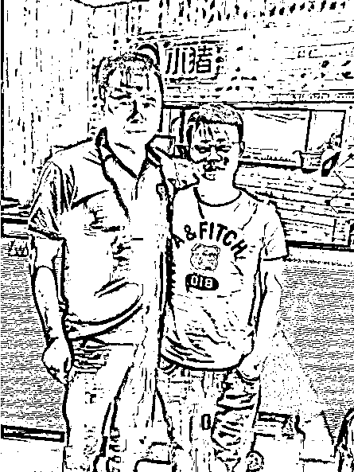
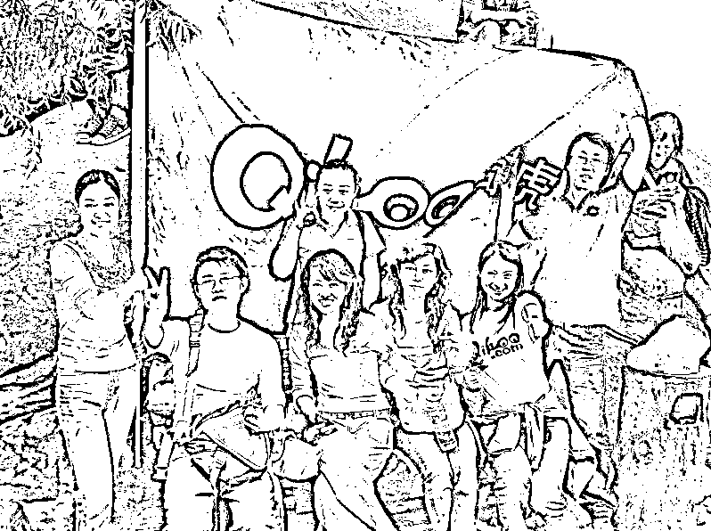
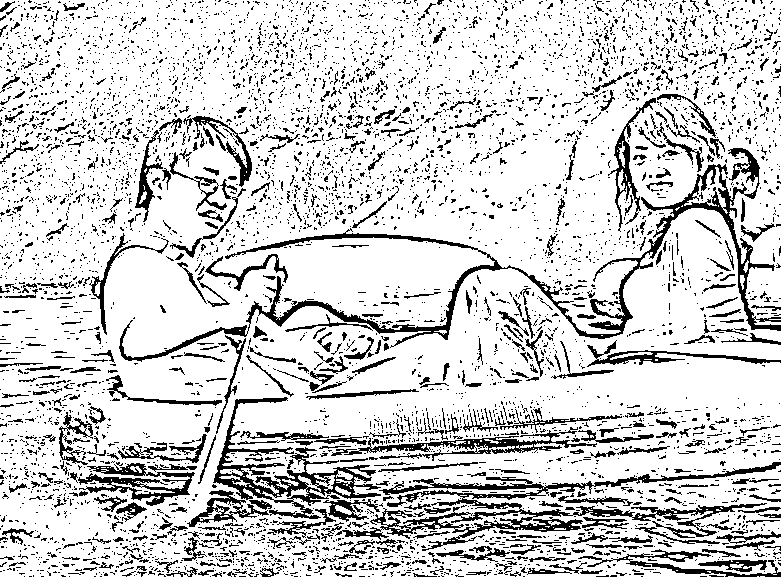
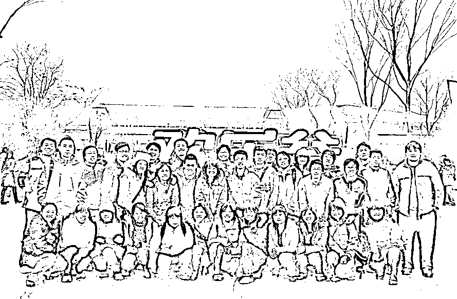
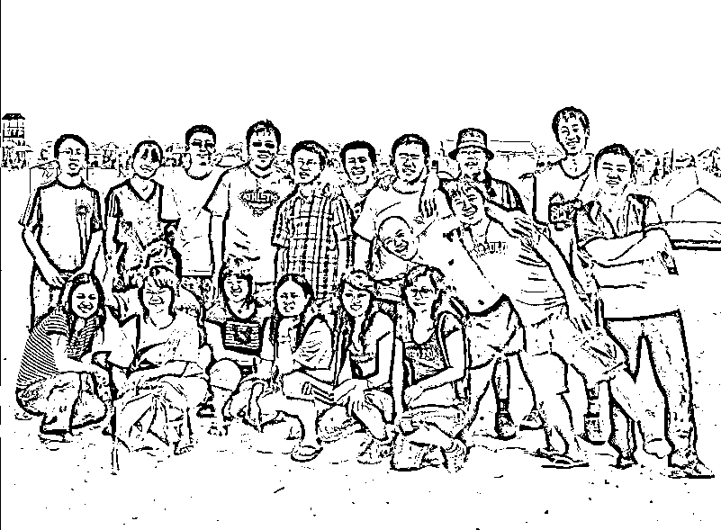
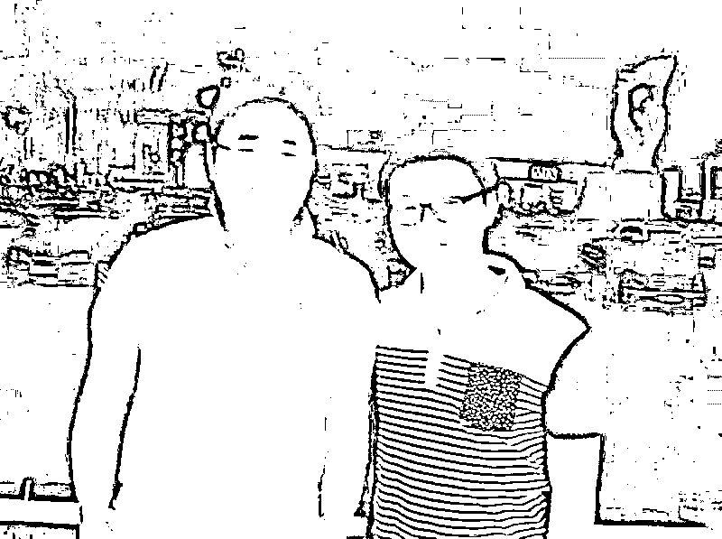
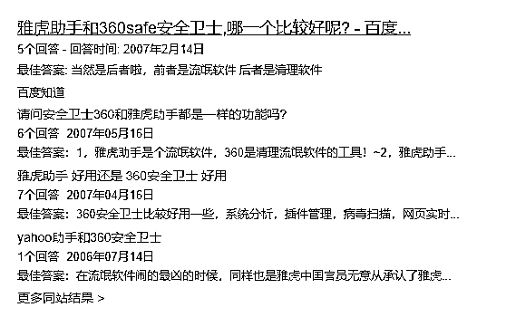

# 我在 360 的经历与对周鸿祎的观察

> 原文：[`www.yuque.com/for_lazy/zhoubao/tz6rywkmdxg3oga1`](https://www.yuque.com/for_lazy/zhoubao/tz6rywkmdxg3oga1)

## (63 赞)我在 360 的经历与对周鸿祎的观察

作者： 牟长青

日期：2024-12-12

06 年我开始北漂，其中第一家公司就是 360，在那里工作了整整两年，前后换了 5 个部门，发生了很多不为人知的故事，也和周鸿祎有多次的接触。

最近红衣大叔周鸿祎在互联网又开始非常活跃，最近甚至还拍摄了一部短剧。昨天看完短剧，让我又想起了在 360 工作两年的点滴，还有和周鸿祎接触的一些故事。正好最近又打算继续写博客，就给大家谈谈我在 360 的故事和我眼中的红衣大叔周鸿祎。

今天的这篇内容会比较长，我希望通过自己的真实经历，让大家对早期的 360 公司和周鸿祎这个人有更多的了解。昨天我看到另外一篇文章，介绍了周鸿祎完整的 54 年的经历，阅读量还挺高。说实话里面的不少内容都有偏差，我作为 360 最早期的员工，知道更真实的一些内幕。

**1：如何入职的 360**

05 年底，我在成都结束自己的第一份互联网工作，做了短暂的全职个人站长。无意间在一个站长论坛加上了当时 360 联盟的负责人胡少宇，她得知我在找工作，就把我的简历推送给了当时 360 的副总王航。

王航看了我简历后，当天就给我打了电话，然后又让两个部门负责人在 QQ 视频面试了我。然后在 06 年 1 月份让我去北京面试，并且报销来回的卧铺车票。

那时候的我刚满 23 岁，还没出过远门，也没坐过飞机，还特意买的一张机票去的北京，在面试后，才发现机票忘记带过来，连忙又赶回临时住处，拿了机票到 360 公司报销了费用。因为怕不第一时间报销，又没录取我怎么办。

06 年 2 月份春节刚过，我拖着一个行李箱直接到了 360 公司，成为了 360 前 150 个的初始员工。当时来得匆忙，租的房子都还没找好。王航把我安排跟 360 各个区域的销售总监住在一起。其中有一个是西南地区的销售总监陈驰，因为是四川人，因此算半个老乡，因此更加熟络。陈驰后面也自己创业，和 360 另外个销售总监王连涛做了小猪短租这个产品。

**  **

**2：360 的派系之争**

当时自己只是一个才做了互联网半年的新人，其实很难理解一个才 100 多人的公司，为何会有派系的说法。

刚入职 360 我是在论坛搜索产品部门做产品专员，后面公司高层觉得我有想法，未来可以培养成产品经理，因此调我去搜索引擎测试部门。我现在都记得王航对我说的话，说网络推广在任何公司都能做，但搜索产品经理，只有 360，百度等少数几个公司有这个机会，因此让我试试。昨天写中年失业的那篇，看了一些互联网中年失业的案例，发现产品经理是最容易中年失业的，还好我最终没做产品经理：）

当时 360 每个副总，都有自己的嫡系，也就是所谓的自己人。而我是王航招聘进来的，理论上就是王航的人。但我在测试部门屁股都还没坐热，王航和胡少宇离职去创业了，也就是做了现在的好大夫在线，相信很多人知道这个产品。胡少宇也是好大夫在线的联合创始人，也是那时候在 360 公司，对我最照顾的姐姐。后面去北京，也约见过好几次。

从此我在 360 里就成了无根的野草，没人罩着了。王航当时在上岛咖啡单独请我吃饭，表示让我跟着他一起创业。当时我比较纠结，没完全答应。其中有个小插曲，我以前从来没分享过。就是当时测试部门并不太受公司待见，被周鸿祎还是齐向东群邮件批评了一次。王航让我等等看，如果这个部门被 360 裁员了，我去他那更顺理成章，毕竟他也不想这么赤裸裸的挖老周的墙角。后面和王航也保持了比较好的关系，2016 年我筹备第一届 28 推大会，王航还友情录制了祝福视频。

但医疗网站并不是我兴趣方向，因此婉拒了王航的好意。后面在测试部门我待着也非常难受，给部门领导表达了离职的想法。（为何难受，后面的内容会提到）

也就在这个时候，当时 360 的 CEO 齐向东把我叫去了他的办公室，说知道我一直想做网络推广相关的岗位，问我愿意去 360 联盟部门不。当时我想在 360 快半年，都没能发挥自己网络推广的特长，就这么离职了确实不甘心，因此就答应去 360 联盟部门，齐向东还爽快的给我放了几天假，让我回重庆放松了下心情。

在入职 360 开始，我就开始写博客了，那时候以优酷，酷 6，土豆为代表的短视频网站很火。因此我也写了一些短视频网站的行业分析的文章。被酷 6 网的创始人李善友看到，然后安排酷 6 副总韩坤来找我面谈。为了让我快速融入酷 6 的大家庭，韩坤还邀请我参加了酷 6 全公司在呼伦贝尔的三天团建旅游。

后面因为类似的原因，08 年还参加过优酷在上海的活动，优酷给我安排的机票住宿，并且活动结束，还和优酷创始人古永锵在 KTV 唱歌，当时就坐我旁边。我现在都记得，当时古永锵唱了一首张惠妹的听海。

后面韩坤让酷 6 网另外一个站长出生的木蚂蚁杨波跟我对接，但和杨波的接触过程中，感觉他并不太希望我去酷 6，因为我们都是草根站长出生，属于同类人，因此后面我就放弃了去酷 6 的想法。

正好这个时候 360 推出了短视频搜索，我想既然 360 也有短视频相关的业务，我何不就留在 360 做短视频的事情一样。因此半夜给 360 产品总监陈杰写了封邮件，表达了我对短视频行业的一些看法，并表达想去短视频产品部门的想法。

而当时我在 360 联盟的业绩很好，因此陈杰愿意我过去，但 360 联盟又不放人。最终这个事情闹到了周鸿祎那里，也是因为这个事情，第一次被周鸿祎单独面谈，最终在他的首肯下，我成功去了 360 产品部门。

也是那一次，我才明白了 360 公司有派系之争，因为离开 360 联盟之前，部门经理跟我说了这么一句话，你不是在换部门，而是在选领导。因为当时 360 联盟属于齐向东直管，而 360 产品部门属于另外个副总石晓虹直管。

**3：因为不懂站队，虽有能力却不得重用**

**  **

那时候年轻，我只懂做好眼前的事情，不懂职场的那些潜规则。比如说陈杰这个人，后面成为了高级副总裁。但其实在 360 产品部门的时候，大部分产品经理都不喜欢陈杰，觉得陈杰没什么能力，唯一的优点就是听老周的话，老周说什么，陈杰就执行什么，也不管这个目标是否靠谱。

最终这些产品经理陆续都离开了 360，但陈杰却扶摇直上，最终成为了 360 的高级副总裁。直到我自己创业后才能理解，听老板话这一个优点，就可以掩盖多少缺点了。

那时候我在短视频搜索部门负责推广，陈杰每个月都会给每个产品部门订流量目标，在各个部门负责人看来，这个目标基本都无法完成。但因为我过人的网络推广天赋，那时候每个月的流量目标只有短视频部门完成了。

在这里可以给大家简单分享下自己的推广心得，因为 360 短视频搜索，是类似百度一样的产品，最终搜索结果会导向各个短视频网站。那时候流行流量交互。就是网站之间互相导流。因此我就同时找到土豆，优酷，酷 6，56 等等短视频网站交互流量，土豆那边过来的流量，通过 360 短视频搜索导给优酷，我再把优酷的流量导给酷 6，酷 6 的导给 56 网，56 的流量再导给土豆，弄成了一个循环。最终我空手套白狼，在这些短视频网站每天获取了 30 多万 IP。

另外和短视频网站合作能这么顺利，跟我那时候写博客有很大关系，因为写过大量的短视频行业分析文章，导致各个短视频网站的人都主动找到我，可以说当时国内所有主流短视频网站都向我表达让我跳槽的意向，包括后面才成立的爱奇艺。因此我和短视频公司里面的管理层都很熟悉，自然谈这种流量合作也是水到渠成的事情。按当时优酷的高管私下跟我说的，当时因为我的文章，甚至影响了他们能不能顺利拿到新的融资。

因为在短视频部门的优秀表现，后面让我负责 360 门户全网的流量互换，而那时候负责门户的老大是另外个副总裁刘峻，而刘峻后面也是字节跳动最早的投资人，早已实现财富自由。

很多时候有对比才有伤害，在短视频部门负责推广只有我一个人，因此也看不出我是否真的优秀。但在 360 联盟，门户全网，做推广的同时有几个人。基本上我一个人的业绩，比其余同事加起来还多一倍，但那时候可没有奖金的说法，业绩不管高低，待遇是一样的。我努力做业绩，只是想看自己的极限在哪里，从而进步速度能更快，并没有别的太多想法。但因为自己业绩太好，一个部门的同事却不开心了。

后面出现个很离谱的事，因为我的业绩太好，导致另外个同事被降薪了，因为当时她是经理级别进来的，后面换岗跟我做一样的事，因为业绩只有我的 1/4，从而公司觉得她不值拿经理级别的待遇。

王航离开后，虽然我先后的大领导从齐向东，石晓虹，再到后面的刘峻，但我只是公司最基层的员工，也不懂去和这些大领导拉近关系，因此也不算他们嫡系的人。

王航的离开，就注定了我在 360 的职场很难有太大的发展。虽然做出了过人的业绩，每半年都有申请涨薪，虽然也给我涨了，但涨薪三次也只多了 1000 元。其实最核心的原因，还是周鸿祎当时并不看重推广，觉得产品才是核心。我另外个老同事贾健强（现在 6 人行旅游网创始人），当时表现出来了产品的天赋，从一个普通员工，很快成为了最重要的内容产品的负责人，待遇也翻了好几倍。

在 360 工作了快两年，比我先进来的普通员工都分到了期权，后进来的管理层也分到了期权。而我不但没期权，职位和收入也一直没变化，因此让我有点心灰意冷。说实话，论推广能力，当时整个 360 公司没有一个人能说比我强，而且当时我学习能力也特别强，精力异常充沛，经常凌晨 3 点还给部门领导发小作文。可以说没有自己做不好的推广。现在回想，自己除了管理能力差点，光从业务能力角度，让我做个推广部门总监搓搓有余。

**4：谈谈我眼中的周鸿祎**

**  **

相比有些互联网公司的大佬，周鸿祎算是比较亲民的，基本每天都会在公司各个办公区域转悠，看看大家的工作进度。不像我在百度工作两年，基本没在办公区域见到过李彦宏。

但因此也给了很多部门负责人压力，年轻时候的周鸿祎脾气并不好，在 360 的时候我就听过一个传闻，除了齐向东没被周鸿祎直接骂过，其余的中高层都没少被骂，一些女性管理层还经常被骂哭。

那时候圈子里称周鸿祎是最好的产品经理之一，但现在回头再看，早期的产品，除了无心插柳的 360 安全卫士成功了，其余的产品全部歇菜，所以周鸿祎真的是一个好的产品经理吗？我现在表示怀疑

可惜那时候我没有现在的认知，要不可以把 360 产品的各个缺点给老周罗列一堆。周鸿祎还有个怪癖，比如外面的人给他发邮件，夸 360 的他一律视而不见，但如果是给 360 产品提 BUG 的，却会比较重视。

记得当时我已经人在百度，360 导航这个产品上线不久，我给周鸿祎发了封邮件过去，指出了 360 导航的一些问题。结果没过多久，负责 360 导航的老同事就找到我了，说有什么建议直接跟他提，害他又被老周批评了。

年轻时的周鸿祎，在我眼中是一个斗士，面对再强的同行，也不怕惹事。曾经同时得罪了雅虎，百度，腾讯等互联网巨头公司，大家也知道后面很出名的 3Q 大战。当初 360 安全卫士这个产品做出来，就是单纯恶心雅虎助手的，第一目的就是把雅虎助手在互联网清理了。所以我前面为何说无心插柳柳成荫了。

虽然我现在并不认为周鸿祎是非常好的产品经理，但周鸿祎做产品的一个思路，一直影响着后来的我。就是周鸿祎说一个好的产品，就是在同行的基础上，做出更多的创新，就是更好的产品。

后面我做大部分项目，也是按照这个思路去做的，因此也少走了很多弯路。但周鸿祎那种不怕得罪人的做事方式，我一直没能学会，虽然我说话也算直接的，但做不到他的程度。

**5：周鸿祎喜欢用身边的人**

**  **

因为在 360 工作，也知道一些不算秘闻的秘闻。很多在 360 的高层都和周鸿祎有非一般的关系。比如当时招我进 360 的副总王航，传言就是周鸿祎的小学同学。360 的副总石晓虹是周鸿祎的大学同学。当时 360 的首席技术谢耿是周鸿祎的大学的学弟，360 的首席架构师李钊，是周鸿祎在方正工作时候的同事，好像曾还是周鸿祎的领导。记得后面李钊还成为了 360 的首席科学家。这让我想起百度的首席科学家，曾经也是李彦宏在美国时候的领导。

还有 APUS 的创始人李涛，在 3721 时代就跟过周鸿祎，后面 2009 又回到 360 担任副总裁，传说是周鸿祎的小舅子。印象在重庆的一次互联网大会，还见过一次李涛，当时是作为 360 的副总是会议的分享嘉宾之一。

还有个比较有意思的事情，看早期网上的报道，周鸿祎都声称自己是湖北人，确实祖籍是湖北。但周鸿祎是在河南驻马店出生，并且小学，初中，高中都是在郑州读书，可以说是生在河南，长在河南，后面大学在西安交大。

我曾经在猜想，是不是因为在那个年代，还有比较明显的地域歧视。07 年的时候我在北京，也短暂谈过一个河南的女朋友，当时她就跟我表达过，因为河南人的身份，经常会听到一些流言蜚语，内心还是挺难受的。

**6：和周鸿祎的几次正面接触**

**  **

06 年底，360 经常有新产品上线，因此公司内部开展了一个针对全公司的捉虫计划。就是让所有员工，给产品找 BUG，然后有一个找 BUG 排名，排名靠前的有奖励。

当时我在 360 联盟部门，但因为有在测试部门的短暂经历，因此我比别的同事更擅长找 BUG。因此拿了好几次捉虫计划的第一名，在一次全体员工大会上，周鸿祎直接点名表扬了我，因此让全公司也知道了有我这么一个人。

再后来就是从 360 联盟调岗到产品部门那一次，因为不光是换部门，而是换大领导，一边不愿意放人，一边要我过去。因此闹到了周鸿祎那里。第一次，也是唯一的一次，去了周鸿祎办公室做了单独的谈话。

周鸿祎那时候也喜欢看网上的各种 IT 博主，公司一些产品经理，以前就是写 IT 博客的，然后被周鸿祎发现，觉得这人有想法，然后叫来了 360 工作。但周鸿祎，并不喜欢在职员工写博客，可能他也担心，有和他同类的人来挖公司的员工。

而 06 年，07 年正是我刚开始写网络推广博客，最有激情的时候。因为写博客这事情，周鸿祎给我发过三次邮件，让我少追求外面的虚荣，少写博客，多在公司做事。但其实那时候，我在公司内部也写了大量的文档分享，只是他看不见而已。那时候正是我写博客比较有热情的时候，因此我并没在意周鸿祎的劝阻，继续写博客。现在回想，还好没听他的，如果听他的，就像我上篇文章说的一样，可能就中年失业了。一边不让我写博客，却又没给我更好的职场发展机会。

当时我写过一篇关于站长统计的博文，里面提到我对论坛数据统计的一些想法。结果被周鸿祎看到了，直接给我打来电话，说让我跟当时的前端部门负责人沟通下产品思路，记得当时的前端负责人叫左文健，也一起沟通了几次，但不知道为何后面没有下文了。也是那一次我手机存了周鸿祎的电话，后面离职了，每年春节还给老周发新年祝福，期间老周也客气回复过。

从 360 联盟调去产品部门后，每周 6 会参加一个产品例会，这个产品会周鸿祎，齐向东，石晓虹，刘峻每次都在场，然后就是产品总监，各个产品经理，产品专员。

每周都会有几个人分享自己部门的产品或在外面看到的产品。我人生中的第一次 PPT 分享，就是在这个产品会上。当着周鸿祎和齐向东的面，分享自己如何做论坛推广的。后面百度视频搜索推出，我还做了一次百度和 360 视频搜索的对比分析。这个经历让我每周都有和周鸿祎，齐向东等公司高层面对面交流学习的机会，可以说是受益匪浅。当然因为只是个普通专员，大部分时候是默默坐在墙角的位置，也不怎么敢发表自己的观点。

最近的一次和周鸿祎的直接接触，是 2018 年我做社群最巅峰的时候，当时掌握了国内大部分的公众号资源。我加上了周鸿祎的微信，给他介绍了我创业的现状，结果周鸿祎的第一句话就是，能不能这让些公众号推广 360 的产品。当时我大脑一下子短路了，不知道如何回答，以为他想白嫖。现在回想还是自己反应太慢，如果现在我肯定会回复他，当然可以，钱到位就行。

这个月 28 推杭州短剧大会，360 旗下的鲁大师赞助了我们活动，我也算再一次赚到了老东家的钱。为何周鸿祎自己要拍短剧，我觉得也是在给自己旗下短剧公司造势做准备。

**7：为何说 360 是一家变态的公司，但我却感到庆幸**

**  **

360 是一家加班文化特别严重的公司，周鸿祎曾经在员工大会上说过，公司如何有机会超越那些大厂，就是别人在看世界杯的时候，我们在工作。别人回家过春节了，我们在加班。

在 360 测试部门的时候，基本是每天加班到 10 点半以后才能走，甚至因为新产品即将上线，加班到凌晨 1 点半才下班。但任劳任怨的测试部门，因为一次产品 BUG，那天正好 10 点左右就下班了，结果第二天被全公司通报批评。吓得我们测试部门的经理，让我们后面哪怕没有事情，也要 10 点半以后才能走。

那时候我才 23 岁，正值身体最佳的状态，但因为高强度的工作，开始出现眼花头晕的症状了。所以最终给部门领导提了离职想法，才有了被齐向东调去 360 联盟部门的转机。

在 360 门户部门的时候，部门领导也是直接说，每周至少加班两天。那时候身边同事有非常多的抱怨，觉得 360 这个公司太变态了。但那时候其实对我没什么影响，因为我本来就是每天 9 点半以后才离开公司。

因为公司 8 点的时候提供晚餐，9 点半以后打车可以报销。因此我就把公司当成了免费的餐厅，免费的网吧。当时我单身狗一个，回出租屋也是上网，在公司学习效率还更高一点。

在 360 部门开会永远都是下班后，或者在周末。比如我前面提到每周 6 有个产品例会。身边的同事其实有很多怨言，难得一个周末，都不能陪陪女朋友。但我却很开心，很多时候，心态决定了一切。

因为在 360 高强度的工作，只有离开的人才能理解里面的难能可贵，因为后面再难遇到 360 这么变态的互联网公司，离开 360 的同事，再去别的公司都能快速适应，游刃有余。

特别记得我从 360 离职后去了酷讯网，也就是吴世春，陈华，张一鸣所在的公司。才去的第一个周末，准备去公司加班，发现公司大门锁着的。当时我挺难理解一个创业公司，居然周末没人加班，可能酷讯网的倒闭，从那个时候就成为了必然。

有机会我再给大家分享在酷讯工作的经历，还有和张一鸣的一些故事。如果不是因为这段工作经历，后面我也没有和首富有合影的机会。

**  **

**8：360 人性化的一面**

360 从一开始就学习谷歌文化，给员工提供早中晚餐，并且每个小部门每月都有团建预算，每一个季度大部门还会组织去周边旅游。甚至如果你加班太晚，公司还提供了临时的宿舍。临时宿舍我没享受过，当时不懂这个，如果当时多住几次临时宿舍，我可能就升职了：）

部门组织爬山活动，当时还拿了第二名，算男子第一名。现在我都不敢爬山了，哎。

因此在 360 期间和同事们有非常多的互动，特别是我前后待了 5 个部门，基本和每个部门的人都打过交道，可以说早期的老同事，每一个人都认识我。比如在测试部门的时候，会频繁和前端技术部门，后端技术部门，美工部门有非常多的接触。

跟部门里的重庆老乡组队划船，也是当时公司公认的第一美女

最开始在论坛搜索部门的时候，身边同级别的同事，基本都是刚毕业的大学生，但我年龄却是最小的，但已经有了半年的互联网工作经验。因此那时候跟部门同事其实没什么共同语言。能同频交流的，基本都是各个部门的产品经理，很多时候不是故意为之，很自然就向公司更优秀的人靠拢了。

和产品部门的同事在欢乐谷

在北京虽然先后待了 4 个公司，甚至在百度的工作时间更久，但和 360 的老同事感情最深，认识的熟人也更多。后面去酷讯，所在的市场部因为每个月都有团建，同事之间的感情还不错，但公司没组织过大的团建，因此别的部门同事基本都不太熟悉。在百度这个情况就更严重了，工作两年，印象中没有一次大部门的团建，所在的市场部就几个人，偶尔就是一起吃个饭。而且市场部有 3 个人，都是以前 360 的老同事，也是我后面会去百度的主要原因。

和 360 联盟和编辑部门的同事在河北海边

**  **

**9：关于网上的一些报道的错误解读**

昨天正好看到一篇介绍周鸿祎的详细经历的爆款文章，里面把周鸿祎从出生，到读书，到工作，创业各个阶段的经历都描述了一遍。

所谓外行看热闹，内行看门道，至少我亲身经历的那个时间阶段，这篇文章的描述就和事实有很大的出入。

文章提到周鸿祎离开雅虎，是因为马云突然收购了雅虎中国，因此周鸿祎才辞职去 IDC 做了投资合伙人。因为想做搜索引擎，所以在 2006 年投资了奇虎公司。

圈子里其实都知道，奇虎这个公司，是早在 2005 年周鸿祎就提前画的一盘棋。奇虎这个公司前身确实是重庆的一家创业公司，但早在 2005 年就已经是周鸿祎的公司。毕竟我都是 2005 年底给 360 公司投的简历，周鸿祎怎么可能 2006 年才投资了：）其实我还知道更多不为人知的内幕，就不在这里展开了，毕竟都是过去的事。

那篇文章提到 360 安全卫士最开始只有 4 个人，记得那时候 360 安全卫士部门就在我工位旁边，印象中那个时候应该就有 10 个人了。当时 360 公司还有个活动室，里面有一些健身器材，还有一个乒乓球台。当时我和傅盛还经常在活动室打乒乓球。

前几年在北京某酒吧门口和傅盛偶遇

**10：360 和雅虎中国的恩怨情仇**

在做 360 之前，周鸿祎的创业项目是 3721，相信老一代的互联网人都不会陌生。在 2003 年底，33 岁的周鸿祎以 1.2 亿美元的价格将 3721 卖给了雅虎中国，出售前马云也代表阿里巴巴向周鸿祎报价了 6000 万美元收购 3721。

在 33 岁的年龄，在 2003 年中国房价还是大白菜的时代，可以说周鸿祎已经实现了财富自由。2004 年 3 月，周鸿祎正式出任了雅虎中国的总经理，但在 2005 年 8 月雅虎中国被杨致远悄悄卖给了阿里巴巴，周鸿祎从而辞职去做了投资人。可能在周鸿祎眼中，在马云下面做事，是不能忍受的。

也是在这时候和雅虎中国的仇接上了，或者说和马云的恩怨吧。为何我会这么说了，因为当时在 360 的时候，有一个让我记忆犹新的事情。在一次员工大会上，齐向东坐在上面痛诉马云的各种罪行，说马云就是地痞流氓，不给 360 留活路。但同时表示不怕雅虎中国，也不怕马云。也是在那时候，360 安全卫士和雅虎助手打得火热。

最终过程中我记不得了，但大家能看到最终的结果，360 安全卫士后面越做越大，但雅虎助手早就看不到了。

在百度搜索了下，提到雅虎助手的还是 0607 时候的百度知道，看这当时的舆论环境，雅虎助手完全就落了下风，被定义成了流氓软件。

后面更知名的 3Q 大战，我已经入职了百度，算是成为了 360 的敌对公司。记得在百度工作的时候，工作电脑是不允许安装 360 卫士的。只是那时候百度更多是在旁边看戏，拿旗助威，还是看 QQ 和 360 硬刚。

今天这篇文章，从早上写到现在，快 6 个小时的时间，我尽最大的全力，做到真实和客观。希望大家能从另外一个角度，了解早期的 360，和现在的红衣大叔周鸿祎。

后面如果有机会，我再分享下在酷讯网的工作经历，还有和张一鸣的一些故事。

* * *

评论区：

周彦充 : 哈哈哈，刚刚看了你写的一篇吃瓜的文章，1.2 万字，关于生财，群响，山顶会的[呲牙][呲牙][呲牙]，没想到就看见你在生财发帖了。

牟长青 : 生财内容官说，我这些文章也可以来生财分享下[呲牙]

牟长青 : 那你说说 1.2 万那篇吃瓜文，分析得可对

周彦充 : 很对，很深刻，也中肯，哈哈，我没加私董，加的会员。

周彦充 : 这些内容都挺有意思的，我喜欢，哈哈，真实

星辰君 : 吃瓜文章在哪里看啊？

周彦充 : 大佬公众号文章

牟长青 : 我发现你在小红书的软文，下次提到付费社群的时候，麻烦把我们也加上..