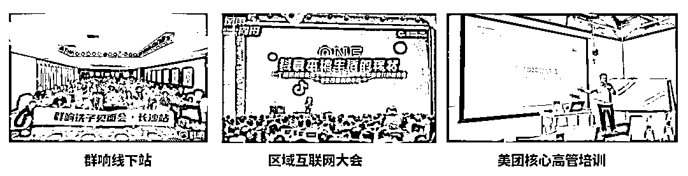
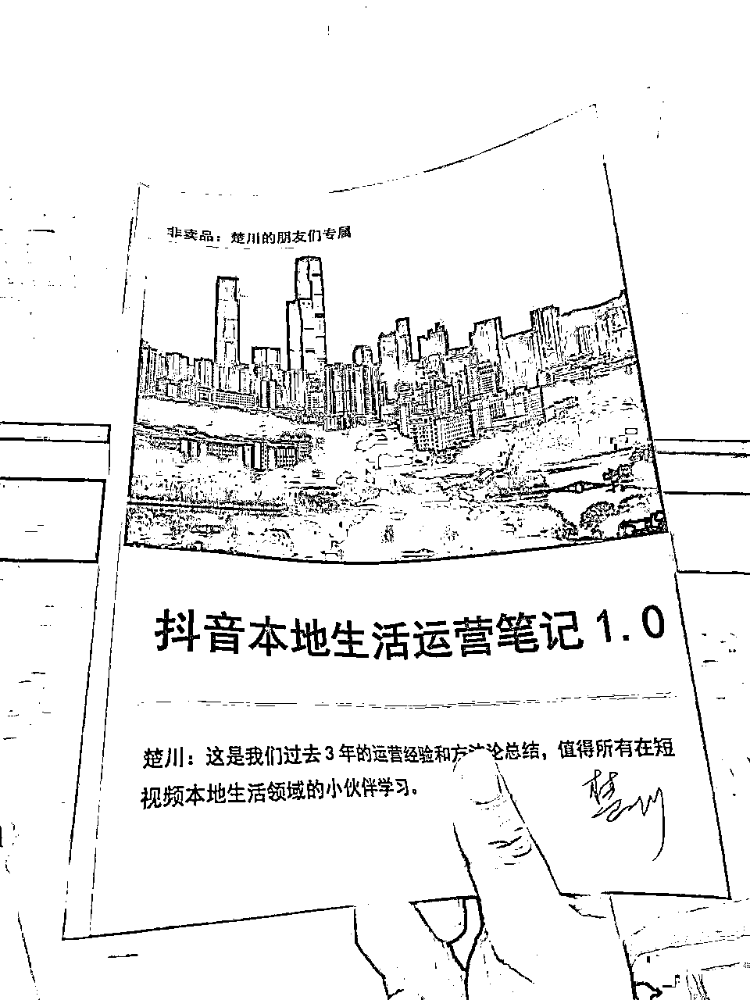
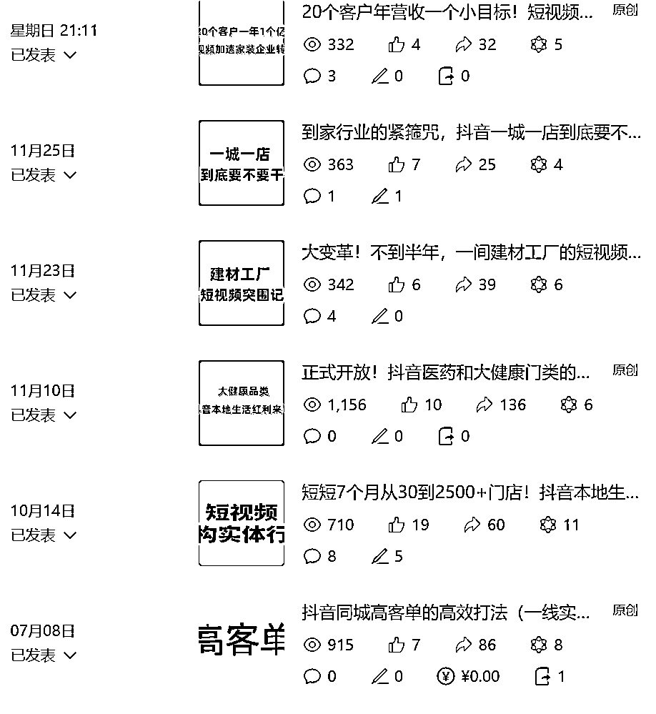
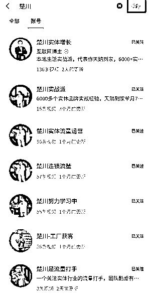
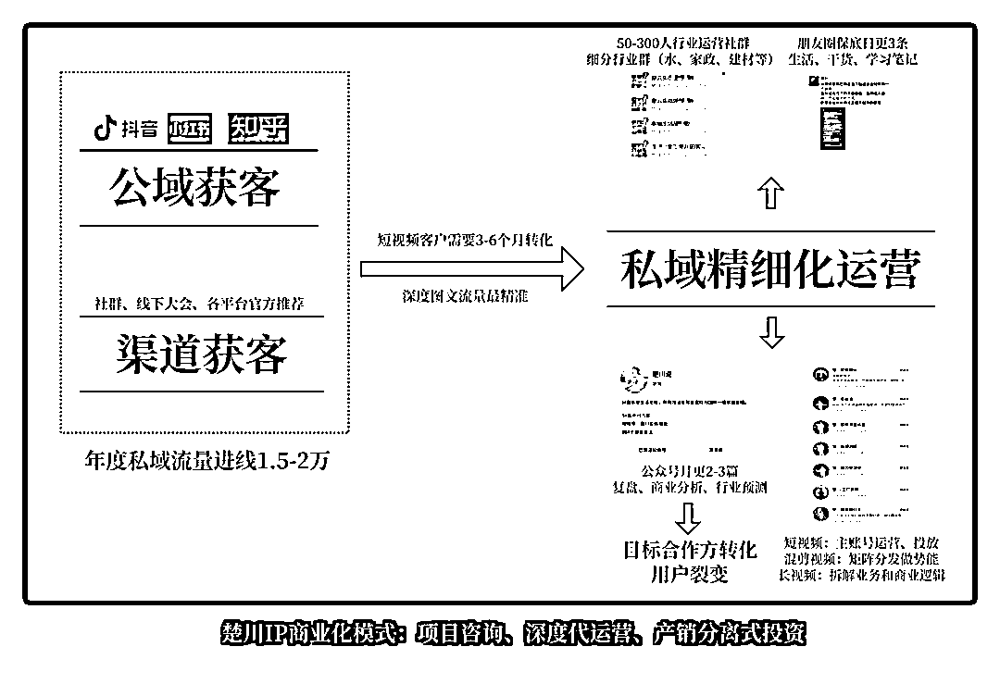

# 从 IP 卖课到商业挑战：老板们的血泪史与教训

> 原文：[`www.yuque.com/for_lazy/zhoubao/uhpq3cgp12sy1bcv`](https://www.yuque.com/for_lazy/zhoubao/uhpq3cgp12sy1bcv)

## (精华帖)(65 赞)从 IP 卖课到商业挑战：老板们的血泪史与教训

作者： 楚川

日期：2024-12-12

关注楚川应该都还记得，上一篇文章我就说过，要分享我个人做 IP 的血泪史。**这篇文章适合 500-1500 万年利润的老板借鉴。**

上一篇文章>>>>[企业家与时代变革：从直播带货争议到与时俱进的挑战，新旧生产力的冲突](https://articles.zsxq.com/id_dbr7dtc7un5b.html)

这年头什么生意都不好做，但在 2024 年老板站出来做 IP 卖课：**教人创业、做生意，看上去成了一件可行、性感的事情。**

不过，今天楚川要以自身经历来打脸了。

这篇文章将从楚川观察到的商业案例、个人亲身经历的事，** *跟大家说一说做 IP 卖课这件事，看完至少给想做 IP 的老板少踩 100 个坑，少亏 100 万！***

**  **

**PART1.**

# **创始人做 IP 卖课不会发大财，也很难会东山再起**

众所周知，分众传媒创始人江南春先生都在财富自由阶段签约博商做 IP 卖课，**尽管两位大佬希望传递的观点是中国企业家精神的传递，还是被各路博主喷成筛子。**

怎么看待这些问题？站出来做 IP、直播卖课的老板超过了中国 99%的企业家，做了很多老板不敢做的事情。

但背后视频的所讲所说，均来自于服务公司，那么文案和视频就缺少灵魂。真正传递出去的声音，空洞且乏味，对自身企业的品牌和销量是 0 加持，只是为第三方卖课公司做嫁衣而已。

那做 IP 卖课能东山再起吗？

**答案也是不能！**

坦白说，很多大佬过去的成功是天时地利人和的结果，现在天时地利已变，仅靠 IP 和粉丝难以再获成功。

目前做出来一个 IP 比考清华北大的概率还低，那通过简单 IP 卖课变现几乎是不可能。

麻辣诱惑的韩东先生因为冲击 IPO，遭遇“系统性崩盘”，从 18 亿身家到负债 5 亿。东山再起做 IP，通过卖课、走穴，希望找到机会翻身；太子奶创始人李途纯先生、安琪月饼创始人梁翰辉等商业远古大神都在积极用 IP 这件事破局，找新的机会。

但这件事对于曾经的大佬来说，成功率几乎为 0。

当下的环境，一个 IP 的起势需要高能量、高付费的团队操盘，才能拿到大结果，对曾经的大佬而言，这是一件不可能的事情。

**那对于一个互联网原住民的楚川，持续在行业拿到结果的能成为一个好的 IP 卖课吗？**

**接下来我用直接损失 100 多万的经验告诉你：****不能！**

# **PART2.**

# **是大佬就能做 IP 卖课？真不是！**

2021 年，服务完将近 5000 个客户服务的时候，我第一次站出来在行业中做分享，享受到了流量的追逐。

接着在各大社群，作为本地生活大佬和专家的身份去做分享（美团、群响、区域互联网大会等），**这是几年创业的高光时刻，也让我有一种错觉：****我已经是大佬，真正穿越周期的创业者。**

**既然都是大佬了，那么是不是我也可以来做知识付费卖课？**

于是，我在 2022 年第一次尝试做社群，开始输出内容，结果可想而知，还是被不少人喷。

哪怕是用心在输出，还是会被很多人吐槽，理解不了我们的内容，对我们的产品不满意，**实际上也让我深刻意识到自己的不成熟，对于知识付费的理解过于片面，甚至也在这种模式上高估自己的能力** 。

服务团队在拍视频上，更多是鼓励输出、努力习惯拍短视频，面对镜头要讲**“如何创业、人生观、财富观等”** ，对于 30 岁的我实际上很多时候难以说出口。

以及在社群和相关付费产品的搭建，让我感觉是在纯收割市场的行为。

这种照葫芦画瓢的 IP 操盘让我自己很难相信这件事能再做下去，于是很快叫停、止损。

这个过程我深度思考的问题是：** *我是一个行业运营专家，但不是一个拿到了大结果的商业 IP，甚至还没真正穿越过创业周期的人，谈何真正教大家赚钱呢？所以流量放大是一个伪命题。***

于是回归用心做短视频和公众号的阶段，在这段沉淀自己的阶段，**也写出了第一本运营笔记（见下图）** ，在几个大厂都有扫描版流传，这样持续在做大了影响力。

2023 年 9 月，我们接手天鹅到家、心理咨询、求职辅导、门窗建材等细分赛道都拿到行业 TOP1 的位置。

这时候身边朋友也在劝我说：**楚川应该去做 IP 卖课，前端赚钱再做代运营升单。**

然后我的内心又开始了骚动，因为这似乎也成了最优解，或者是让团队盆满钵满的唯一通道。

尽管我在很抗拒，认为创业者应该是做自己的事情，实打实穿越周期，不借用虚无缥缈的影响力。

但这件事还是因为一些内外部的复杂情况给推动下去，并且引入一个成熟的 IP 运营团队，从 IP 的包装、内容质感、服化道、私域和商业化变现都做完整规划，当然投入也较高。

从 2024 年 5 月正式开始冲刺个人 IP，做私域引流、主推线下课。

不过貌似再次犯了同样的错误：**年轻的操盘团队会错判我和团队的商业价值，所以在内容和打法都会流于表面，而没关注内核，所有的营销环节就必将做不深。**

尽管成绩不差，6-7 月的两次线下课学费收了 50 万，升单代运营合作超过 100 万。

但我自己一点都不开心，**我能深刻感受到自己公众号的内容，没有人在看，没有人转发，因为都会认为这是一个卖课的内容。**

朋友圈的内容被折叠的次数也变多，很多内容自己都没有欲望写下去。甚至有朋友主动问到我，**楚川以后都是在卖课，不接合作了吗？**

大家的疑问是不好好做主营业务，去做卖课收割，哪怕我们初心的通过线下课找到我们的合作伙伴。

但这都是想当然，**我们在这一年这块的成本已经高达 120 万。** 这是一个不可思议的事，小两个月简单的折腾吃掉我们 10%的利润。

这种状态让我自己主动在 8 月叫停，持续思考了 2 个月。

我们拥抱了数字人，做 IP 矩阵，在公域获取私域流量；重新开始写公众号，深度分析商业；朋友圈到处跑，学习和取经，慢慢的私域又重新被激活了；我自己的状态也恢复了，将公司的运营体系和方法论都做了深度整理。

**但很难接受的是这个持续踩坑周期将近 1 年。**

2024 年 10 月，我们的客户和合作方重新找回我们。这是大获全胜的一个月，我们业绩做到全年最高，并且这种增速看起来会持续一段时间。

**这个经历让我反思，做 IP 到底要实现什么？**

很多机构的初心没有问题，都是帮助创始人变现。但所有的打法都大同小异，前端卖课、卖资料变成私域流量池，再做持续转化。

绝大部分 IP 操盘手是没有真正去理解每一位创始人的初心，核心竞争力是什么，甚至无法理解 IP 和背后公司的商业价值。

# **PART3.**

# **一条创始人 IP 的方法论总结**

**1.支持所有老板参与视频、知识付费和网红经济的潮流，因为流量意味着商业机会，但出路的背后更要做好整条链路合理、科学的规划。**

首先，一个创始人站出来做 IP 的决策肯定是最难的，就代表难迈出第一步，那必须克服心魔开始习惯拍剪短视频，学会表达、刻意练习。

其次，要想好用流量做什么，流量从各大平台获得后，做好流量线索漏斗数据跟踪，进私域长期转化。这个过程有太多变量，对团队考验极大，尤其是初期人手稀少的阶段（楚川起盘内部 5 个人，外部有单独拍剪团队），任务量是超负荷。

如果没有全盘做合理且科学规划，项目扑街概率接近 100%，因为赛道已经处于白热化的竞争状态。

最后，不要有虚假人设，不需要特意用外部元素显得自己有钱和地位，而是高价值、真想法、高认知的输出，获得的流量和私域用户才是同频的人。

**不然可能交流 5 分钟，就能识别一个 IP 在吹牛和撒谎，这也是这么多 IP 不断塌房的原因。**

**2、一个 IP 起盘一定要做定位，再多平台运营，借助 AI 的力量，从文案、素材、剪辑、矩阵等做全面提效，也释放 IP 的精力。**

第一，创始人做 IP 一定是需要有定位的环节，类似于品牌定位。老板和团队要亲自分析自身的内核，在市场的独特点，再针对性梳理出要卖的产品，并且做成体系。

第二，不同平台的内容接受程度不一样，初期需要多平台运营，提高短视频的营销效率。

第三，必须借助 AI 的力量把单账号的 IP 能量放大，从 AI 找爆款、拆解到文案撰写，素材整理和视频剪辑，都要全面提效。再用数字人做场景克隆，持续用矩阵把内容发布出去，提高 IP 势能，这样才能提高效率的同时，也释放老板的精力。

**最后，楚川踩过坑后，用 100 多万、自杀式损害自己私域流量的后果证明：创始人做 IP 其实就是一个对外放大业务的窗口。**

**一切打法应该归零，都以放大自己的商业价值，公司业务为第一目标，不存在任何曲线救国的方法。**

**创始人千万别陷入一个 IP 漩涡：****你在做一个业务创新，你在做大流量，最终再为自己公司赋能，这是伪命题。**

** _  _**

* * *

评论区：

小熊 : 认同啊 创始人做 ip 其实是一个对外放大业务的窗口

楚川 : 并不是模式的创新，踩过坑才明白

可爱多 : 小白学习了。高价值、真想法、高认知的输出吸引同频。

亦仁 : 核心是定位不清晰

旭宏 : 感谢你分享剖析和反思失败的教训！生财讲成功的帖子太多了，这样的帖子也很有价值。 不知道为什么，我个人对“做 IP”这个词有点反感
我觉得换成：“老板要不要亲自出来做流量？”、“老板要不要亲自出面搞品牌宣传？”是不是更准确一点。
因为做 IP 是一个伪命题，一个老板是不是 IP 其实是客观的，做不做=要不要把本来就有的客观事实展示给客户
那么，这个问题就可以深入地变成：老板对公司的价值最大部分是不是搞流量？如果是，就肯定是出来做最好，但如果老板核心能力是做产品的，那就需要看看有没有人比老板本人亲自出来搞流量更高效？
如果亦仁、马化腾这种产品经理型、管理型老板出来搞流量，那他们的产品就会失去他们的长时间注意力的聚焦。
时间一场，产品的迭代没有竞争对手强的话，做 IP 搞来的流量越大，反而反噬会越大。
因为，流量大只是知名度大，还不是美誉度大，只有具备美誉度的产品，叠加知名度（流量）才能健康发展。
个人觉得小公司的老板还是应该专注在优化产品上，搞流量（做 IP）是只要把自己的工作客观展示给用户，或许就够了。
产品足够好，就可以去 KOL 型的客户私域里面去宣传（在别人私域里面做 IP)，比挑战公域做 IP 效率更高、效果更好。 貌似生财早期也是这样做的？

楚川 : 都是知识的诅咒

楚川 : 是的，所以我做了弱 ip+矩阵，降低我在 ip 侧的精力消耗

nni : 我不知道我的理解是不是准确。老师的经验是，做 IP 是为了放大现有业务，给现有业务更多曝光量；而不是新增一条产品线，去为了卖课而卖课。