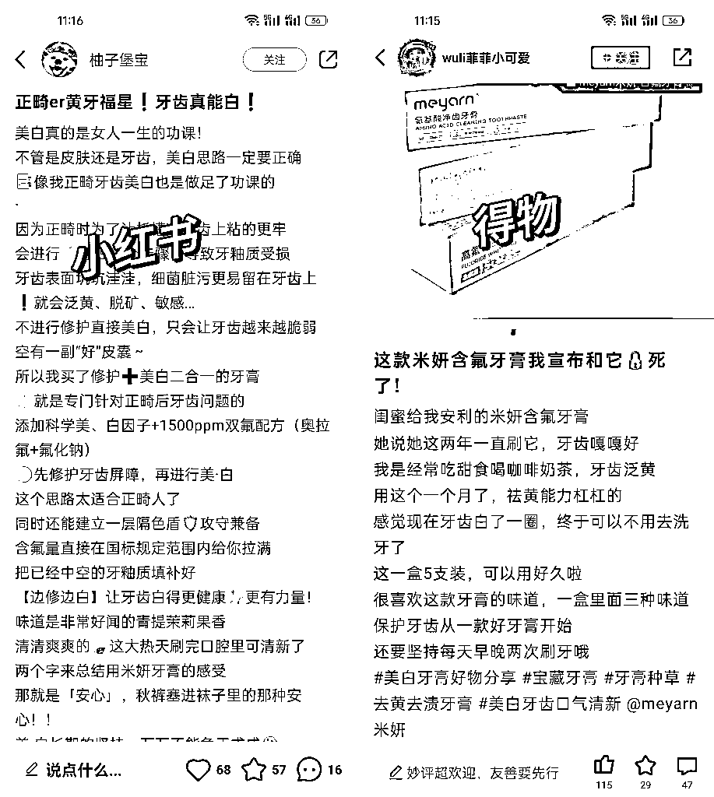
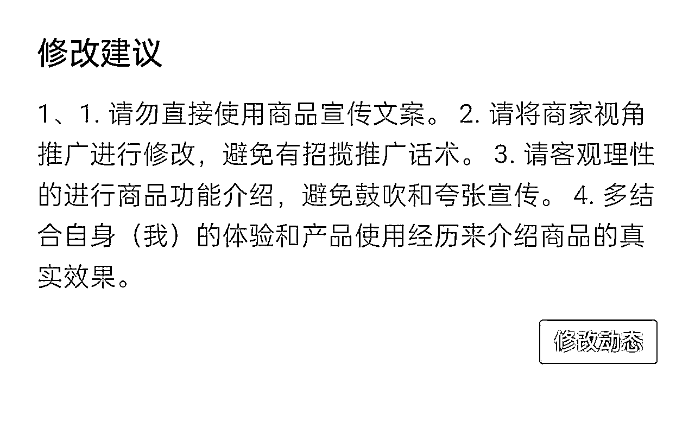

# 得物平台月入 4 位数，在家可做，新手小白友好！（附保姆级教程）

> 原文：[`www.yuque.com/for_lazy/zhoubao/gtvgn6lf07uw8fdb`](https://www.yuque.com/for_lazy/zhoubao/gtvgn6lf07uw8fdb)

## (44 赞)得物平台月入 4 位数，在家可做，新手小白友好！（附保姆级教程）

作者： 韩北樱

日期：2024-12-13

在家带娃的宝妈如何利用空余时间做点副业补贴家用？

学生党如何在课余时间多赚点零花钱？

打工人下班后还可以做什么轻副业增加收入？

那么你一定要看完这篇八千字的干货帖，非常适合现在的你去做。我利用空余时间做得物已经五个月了，有个 1w+的收入，其中产品价值
9000+，佣金 3000+，并且随着拍照和文案水平的提升，收入每个月都逐步增加。

今天的分享主要是我做得物的复盘，以及摸索出来的经验，对于平时空余时间多，想要做一个小而美的副业的圈友，是一个不错的选择。

对于普通人来说，得物有两大优势。

1、门槛低：0 粉就可以获得种草赏金和视频激励，账号 14 天内发布的内容，其中 12 篇阅读量≥500 就能开通品牌合作。

2、难度小：不需要特别专业，更多的是站在已买人的角度，来分享自己的产品使用体验。

这一点可以对比小红书，同一个产品，得物种草会比小红书种草要求低很多，更适合普通人去做。

比如一款含氟牙膏好物种草：

像小红书这种比较专业的，纯从产品角度去推荐的，是不被得物平台所鼓励的，品牌合作也过不了。

由此可见得物的好物种草真的非常简单。

**那么得物适合哪些人群去做呢？**

**  **

大学生、宝妈、平时不经常加班的打工人都可以做。

一个合作，是 4-8 张图+300 字以内的文案，会拍图了半个小时就可以完成一个合作了。利用空余时间做做得物完全没问题，每天在得物投入 1-2 小时，长期下来也是一笔不小的收入～

具体内容还请移步飞书：[`uiok1bi2iw.feishu.cn/docx/HN33d3tu3ovQdcxMMoUcngIonZe?from=from_copylink`](https://uiok1bi2iw.feishu.cn/docx/HN33d3tu3ovQdcxMMoUcngIonZe?from=from_copylink)

* * *

评论区：

小花 : 已全文拜读，用时 23 分钟，小姐姐写作思路清晰，文字掌控能力极强，是少有的踏实接地气不浮夸的精品分享贴。佩服佩服！

阿宝 : 收学员吧 变现最快 最多[呲牙]

韩北樱 : 感谢认可！希望对你有帮助[愉快]

韩北樱 : 看完这篇大部分人都可以直接上手啦，也算是帮大家省学费了[偷笑]

莉莉周 zxl : 10 月开始做得物的，到现在一个半月还没有见到收益，视频收益也就只有一块多，看不到成绩真的有点沮丧，但是考虑到沉没成本还是决定坚持下去，祝我成功[呲牙][呲牙][呲牙]

韩北樱 : 加油！现阶段你可以多参加广场的活动，增加曝光拿流量券，找一些热度比较高的商品发动态，这样阅读量上涨快

韩北樱 : 一定会成功的！！！

LJ : 无论是拍视频还是图文，产品都要自购吗？