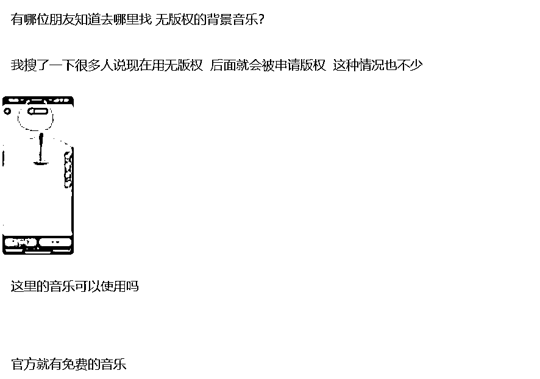

# 使用有版权背景音乐的视频处理策略

> 原文：[`www.yuque.com/for_lazy/zhoubao/bkv0gprwk64e1cd2`](https://www.yuque.com/for_lazy/zhoubao/bkv0gprwk64e1cd2)

## (3 赞)使用有版权背景音乐的视频处理策略

作者： 书情小跟班

日期：2024-12-09

关于音乐版权的问题，我们假设一个场景

情况描述：如果你在发布的视频中使用了背景音乐，后来发现这个音乐是有版权的。

目前，你的后台暂时没有收到版权警告。如果哪天收到了，

你的疑问：

是不是只需替换或移除背景音乐就不会影响到你的收益，还是说最好把整部影片都删掉？

当你使用了背景音乐，但没有受到版权主张。这里需要注意，"警告"不是一个准确的表达，更专业的术语是"版权主张"。

在我推荐的那本书《油管公式》在第一部分：平台 的第二小结 YouTube 生态系统，中注意版权问题这一小章节，看了之后你会对版权有一个更深的理解。

回到我们的问题来，当你后来发现音乐是有版权的，其实不需要等到发现。除非音乐已经过了版权保护期，进入公共领域，否则它始终是有版权的。我们现在常用的知识共享许可是一种特别的许可，并不意味着音乐无版权，而是版权持有人允许大家免费使用。

因此，免费和无版权是两个完全不同的概念。有些音乐既免费又无版权，有些则是免费但有版权，而绝大多数音乐是有版权且不免费的。

重要的是，对于版权不清晰的音乐，不要等到最后才发现它有版权。应该假设它有版权，并使用那些明确无版权或有版权但允许免费使用的音乐，这才是安全的做法。

当你发现音乐有版权时，通常需要付费使用。如果音乐在 YouTube 的版权库中，上传时可能会被匹配到，进而产生版权主张。

版权主张的常见结果是，你使用该音乐所赚取的视频收益将归版权持有人。当然，还有更严格的情况，比如对方不收你的钱，但禁止你的视频播放。而最严厉的情况是，你未经授权使用了他的音乐并赚了很多钱。在这种情况下，他不会仅仅通过版权主张来维护自己的利益，因为在他提出请求之前，你已经赚了很多钱。

因此，他会直接到法庭起诉你侵权，要求赔偿。比如，你用他的背景音乐制作了一个广告片，并从中获得了 500 万的广告费，他就会到法庭上告你侵权。

回到版权主张的问题上，可能的情况是，这个音乐在 YouTube 的版权库中，当你上传视频时，系统会立即检测到并发出版权主张。也可能在上传时没有任何侵权报告，就像你表述的情况，你的后台没有收到任何通知。然而，将来某个时候，如果这是一个非免费的有版权音乐，你可能会收到版权主张。

如果你收到版权主张，通常情况下，在版权主张发出之前，视频赚到的钱归你所有，而在版权主张确立之后，收益则归版权持有人。

对于大多数人来说，使用版权不清晰或错误使用的音乐作为背景音乐上传视频，可能在某个时候会收到版权主张。如果之前没有赚到多少钱，那么有人可能会问，是否可以替换掉或移除这个背景音乐。

如果 YouTube 在线提供这样的功能或工具，允许在线替换背景音乐，那是完全可以的。不过，并不是所有视频都有这个选项。因为有些视频中，背景音乐与旁白或口播内容紧密结合，可能就不会提供替换选项。当然，如果有这个选项，你可以替换掉音乐。

然而，替换音乐或将某段静音等在线编辑操作，可能会影响视频后续的推荐。也就是说，视频在收到版权主张前，可能每天能赚 5 块钱，但替换背景音乐后，可能每天只能赚 5 毛钱，视频的推荐可能会大幅减少。我所描述的这种情况是可能的，但不是必然的结果。

从技术上讲，你可以通过这种方法解除收到的版权主张，但无法确保视频还能像以前那样持续赚钱。因此，与其使用版权不清晰的音乐作为背景音乐，不如一开始就使用版权清晰且得到授权的音乐，这样干净利落，不给自己留下变数。

当然，刚开始做频道时，可能不了解这些技术细节。

你的处理方式：如果将来出现版权主张，你可以选择将视频的收益给对方，或者干脆删除视频。这些都是合理的选择。

一个建议：使用版权清晰的音乐。

当然，凡事都有例外。如果你使用未经授权的音乐是为了蹭热门音乐的热度，那么你可以这样做。无论现在还是将来，如果发生版权主张，你就接受并将赚到的钱全部给对方。

这样做的好处是什么呢？你可以通过这些视频吸引大量粉丝。这种方法就是主动抱大腿，主动帮别人赚钱，同时自己也能涨粉。

我之前写的帖子的合集

做 YouTube 的一些常识

[`rlwxa0zgke.feishu.cn/docx/P2DYduGbkoW0nqxcRZgcL6xKn7I`](https://rlwxa0zgke.feishu.cn/docx/P2DYduGbkoW0nqxcRZgcL6xKn7I)

* * *

评论区：

酷拉皮卡 : 请问，不是开通以后官方会优先分一部分收益给版权方吗？是全部啊？[发呆]

书情小跟班 : 音乐版权是别人的，难道音乐版权的收益不是别人的？