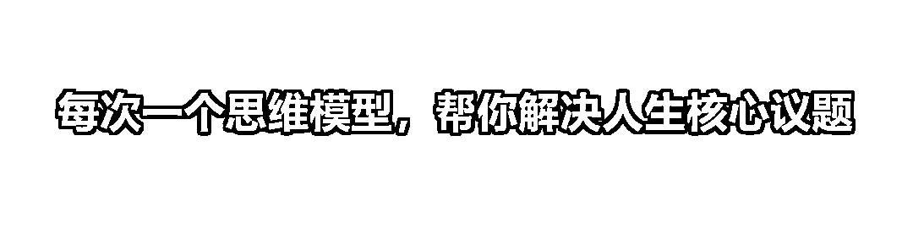
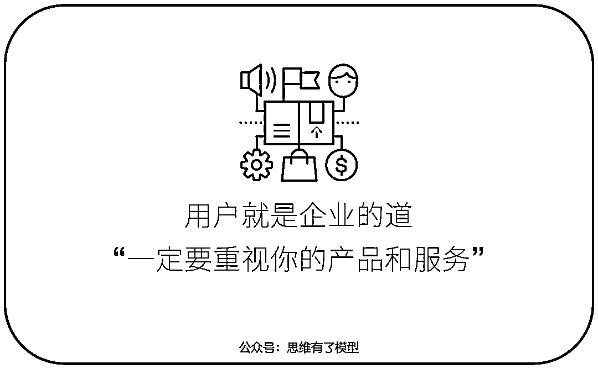
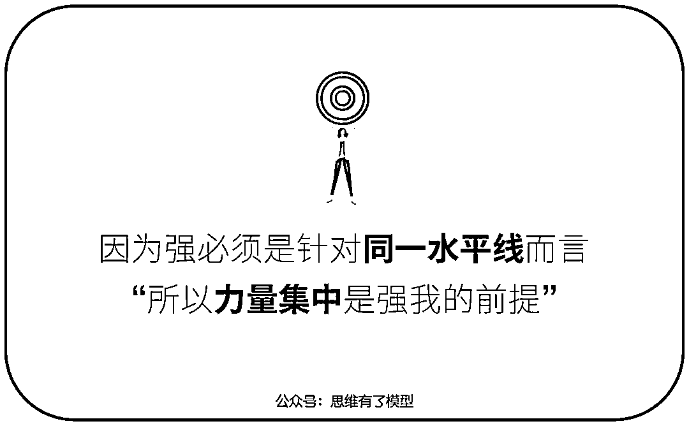
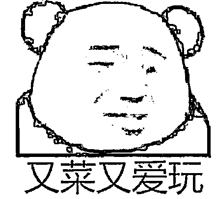

# 以弱胜强的本质：从竞争模型到生态位的思考

> 原文：[`www.yuque.com/for_lazy/zhoubao/vfecvi1yl4vqwut1`](https://www.yuque.com/for_lazy/zhoubao/vfecvi1yl4vqwut1)

## (20 赞)以弱胜强的本质：从竞争模型到生态位的思考

作者： 兰陵王

日期：2024-12-02

​

**所有的以弱胜强，都是以强胜弱。**

这是战争之道，也是商业竞争之道。

我从大四的时候开始研究竞争，得到了 4 个模型「深耕细作、与众不同、错位竞争、成为第一」，并根据这 4 个模型，一举拿下了学习方法这个生态位，成为了这个领域的小巨人。

当然，我那时候还不知道「生态位」这个概念。

毕业之后，我开始接触生物学，偶然得到了「生态位」这个概念，突然一下子把之前的 4 个模型打通了，得到了一个更本质的模型。

但我后来逐渐发现，生态位并不是竞争的本质，它只是生物在自然选择之下，为了生存，试出来的一种**最优解** 。

最优解并不是本质，它只是一种现象，一种策略，一种方法，只不过它是生物给出的最优解方法。

那么，生态位的本质是什么呢？

一个偶然的契机，我接触到了兵法，我在兵法中找到了答案——**以强胜弱** 。

兵法就是研究**「战胜」** 的本质的，它既是战争之道，也是竞争之道。

这篇文章我们就来看看，到底什么是兵法？我们能够从里面得到什么启发？战胜的本质到底是什么？竞争的本质到底又是什么？

## **竞争激烈的时代，**

## **人类应该何去何从？**

近两年有个词非常火，内卷。

它描述的是一种「恶性竞争」的社会现象，虽然每个人都变得比以前更努力了，然而社会整体的收益却并没有得到任何的增加。

最经典的案例就是之前的教培行业，虽然有些人在上完补习班之后考出了更好的成绩，但是由于每所大学每年所招收的学生数并没有增加，所以单从“考大学”这个指标来说，学生并没有取得任何的新收益，这就是内卷。

不过把“内卷”用来概括今天所有的竞争，却是一种误解。

因为我们今天的很多竞争都是有好处的，它能倒逼企业变得更好，它能提升社会的整体效益。

不过即使我们明白这一点，也丝毫无法减轻我们内心的焦虑。

**因为竞争确实是越来越激烈了，我们的生存难度正在变得越来越大。**

**  **

为什么会产生这样的现象呢？

这其实是一种**自然的演化趋势** ，并不是“哪个坏蛋”或者“哪群坏蛋”刻意而为之，它是一种自然发展规律，每个人只是想要活下来，想要活得更好而已，它就变成这样了。

而且，更糟糕的是，这种趋势似乎是**不可逆** 的。

也就是说，未来的竞争情况还会**更激烈** 。

除非人们找到新的生态位，比如新的可用能源、比如新的宜居星球等等。否则，只要资源是有限的，生物之间就会存在竞争，这是自然的铁律。

这有点类似王东岳的递弱代偿理论。

当人们之间的竞争越来越激烈的时候，人们的生存难度就会变大，这个时候如果我们想要保持我们原来的生存优势，就不得不提高我们的生存能力。

而当每个人的生存能力都提高之后，竞争又变得更激烈了，于是生存难度又变得更大了。

因为人们的生存难度变得更大了，所以我们又不得不再次提高我们的生存能力。

**……**

你发现没有，这是一个无解的死循环。

也就说，竞争一定会变得越来越激烈，这是一条不可逆之路。

那怎么办呢？两条路：

**1、从人类的角度来说：** 人类必须去寻找新的生态位，比如新的清洁能源，比如移民火星，比如探索宇宙等等。因为竞争的源头来自于资源的有限性，所以我们必须从源头解决这个问题。

**2、从个人的角度来说：** 不要扎堆竞争，每个人都要去寻找自己的生态位，跟别人形成错位竞争，这能一定程度上减轻个人的竞争压力。

针对个人的竞争之道，针对个人的生存之道，后来我写了《[成为第一](http://mp.weixin.qq.com/s?__biz=MzUzNTExNjk2Mw==&mid=2247486118&idx=1&sn=8300c56be18627f34205014db6d0ba92&chksm=fa8b276acdfcae7c55f6822d8f0f995912728e155598beee8d652022ca15db7ec590e58ebf7e&scene=21#wechat_redirect)》、《[深耕细作](http://mp.weixin.qq.com/s?__biz=MzUzNTExNjk2Mw==&mid=2247486230&idx=1&sn=0def356d3b910eb29cdb6de5b75af49a&chksm=fa8b26dacdfcafcc8a96c2affc399ad2969aced167d643077d1016568ce666bbe28ae3d60fc3&scene=21#wechat_redirect)》、《[与众不同](http://mp.weixin.qq.com/s?__biz=MzUzNTExNjk2Mw==&mid=2247486299&idx=1&sn=862f29df0ba9698d8bb05517e0235f82&chksm=fa8b2697cdfcaf819974e4a52efb303625f5ffe670e981b3cbbf25bd40537103ab857383d8a6&scene=21#wechat_redirect)》、《[生态位](http://mp.weixin.qq.com/s?__biz=MzUzNTExNjk2Mw==&mid=2247487609&idx=1&sn=6f47d37110bcb1851739bdcdfc764969&chksm=fa8b3db5cdfcb4a31edbdc2c62b2fdc6a3aea418558638363dd7fc95efc3758fc9c6b749e4d3&scene=21#wechat_redirect)》这几篇文章。

但我最近发现，其实错位竞争也好，生态位也好，它们并不是竞争的本质，它只是竞争的方法论之一。

竞争的本质其实在战争里面，而且孙子早在 2500 年前就已经给出了答案，这个答案就写在《孙子兵法》里面。

叫做**「以强胜弱」** 。

## **竞争的本质是，**

## **以强胜弱。**

这个世界根本就没有以弱胜强。

**因为所有的以弱胜强，本质上都是以强胜弱。**

一直以来，人们都非常热衷于看那些“以弱胜强”的传奇案例，比如赤壁之战、官渡之战、巨鹿之战等等。

因为这能满足人们对英雄、对谋略的向往之情，毕竟谁不喜欢“谈笑之间，樯橹灰飞烟灭”呢？

但可惜，历史上根本就没有以弱胜强的案例，不仅人类历史上没有，从逻辑上来说，整个生命史上都没有。

**所有的以弱胜强，在逻辑上来说，都是以强胜弱。**

我的证明如下：

假设，有两股力量，一股叫做力量 A，一股叫做力量 B，力量 A 大于力量 B，如果这两股力量在同一条水平线上碰头，谁会获胜呢？

答案当然是：力量 A 获胜。

那么历史上那些以所谓弱胜强的案例都是怎么发生的呢？

**很简单，弱的一方面找到了或者制造了某种势，在这个势里面，“弱”的一方面比“强”的一方更强，所以弱****（其实是强）****的一方获得了胜利。**

我举几个例子：

**1、官渡之战**

参战兵力：曹操 2 万兵力，袁绍 11 万兵力。

伤亡情况：曹操 8 千兵力，袁绍 10 万兵力。

单从数字上来看，这绝对是一次经典的以弱胜强的案例。但事实上真的是以弱胜强吗？

**曹操的强：**

**①集中兵力：** 不是分兵把守黄河南岸，而是集中兵力，扼守要隘，重点设防，以逸待劳，后发制人。（类似企业的深耕细作）

**②名正言顺：** 挟天子以令诸侯，名正言顺。（我是正当企业，而对方是灰色企业）

**③信息优势：** 袁绍的谋臣许攸投靠曹操，并给曹操带来了信息和计谋。曹操采用了许攸的建议，偷袭了袁绍的乌巢，烧掉了袁绍的粮草辎重，断掉了袁绍的补给。

**④敌将投奔：** 张郃、高览听闻乌巢被破，于是投降了曹操。

**④声东击西：** 曹操听从了谋臣许攸的建议，声东击西，分散了袁绍的兵力，致使关羽斩杀了袁绍的大将颜良，袁军溃散。（这一招类似企业的错位竞争，我深耕细作，而对方分散多元）。

**袁绍的弱：**

**①决策无能：** 相比曹操，袁绍实在是差太多了，尤其是在决策上，屡次失误，他手下的谋臣，比如沮授，多次给他提出了极好的策略，结果都被他否决了。（在今天来说，就是企业的创始人无能，企业的战略不行，虽然资本雄厚，但没卵用）

**②大将投奔：** 谋臣许攸投奔曹操，并给曹操带去了很多机密信息； 张郃、高览听闻乌巢被破，也投降曹操。（类似公司企业高管被挖走）

******③大将被杀：** 颜良、文丑、淳于琼三位大将都被曹操用计斩杀。（类似企业高管纷纷离职）

******④补给被断：** 乌巢被曹操偷袭，粮草辎重被断。 （类似企业现金流被断）

******⑤军心动摇：** 大将投奔的投奔，被斩杀的被斩杀，一战接一战的失利，粮草辎重还被烧了，导致军心动摇，失去了气势。（类似企业员工彻底失去了工作动力）

……

以及各种因素，就不一一列举了。从这些点可以看出，曹操并不弱，袁绍也并不强。

**这里面的核心在于，士兵的数量并非强弱的“唯一指标”。**

就像今天的企业，不能单纯以资本论强弱一样，企业的创始人、企业的战略、企业的组织能力、企业的产品、企业的服务……这些都是重要因素。

所以强弱是各种指标的综合，曹操虽然在兵力上比袁绍弱，但在其他方面都远远强于袁绍。用一张图来展示就是这样的：

**2、赤壁之战**

参战兵力：孙刘联军 5 万兵力，曹操 20 万兵力。

伤亡情况：曹军战死数万，病死十余万。

**孙刘之强：**

**①以逸待劳：** 相对于操军的长途跋涉，孙权的部队可以说是非常的安逸了，体力充沛，此为第一强。

**②地利优势：** 孙权的军队熟悉水战，而曹操的北方士兵都不善于水战，长江天险极大地提升了孙刘联军的战力，这为后面的火攻打下了基础，此为第二强。

**③信息优势：** 曹操熟读《孙子兵法》，一定不会不知道对方可能会用火攻这一计谋，但曹操依然信心十足，因为他在信息上缺失了，他不懂气候学，洞庭湖一代因为地形风的原因，可能会吹东南风，而这一点周瑜是知道的，此为第三强。

**曹操之弱：**

**①舟车劳顿：** 曹操远道跋涉而来，而且长期征战，士兵的身体早已疲惫不堪。（正如公司长期加班不是长久之计）

**②水土不服：** 导致曹操赤壁之战大败的最大元凶就是这个，曹操攻打孙刘联军的时候，正值瘟疫盛行，孙权的军队具备一定的免疫力，而曹操的军队从北方而来，水土不服，染上了疾病，死伤大半，再加上饥寒交迫，更是雪上加霜。（正如身体健康是革命的本钱）

**③组织能力：** 新收编的刘表部队，虽有七八万之众，然而还没有来得及磨合就上了战场，士兵心怀猜疑，
士气不足。（类似于企业刚刚新招员工，就让新员工投入战斗）

**④不善水战：** 北士卒不习惯坐船。（类似企业刚刚踏足一个新领域）

**⑤士气不足：** 初战失利、不善水战、战船被烧，疾病侵袭，饥寒交迫， 死者大半，一系列原因导致曹操的军队士气低靡。（类似企业员工对未来失去了信心）

还有一系列因素，可以看出，虽然曹操兵力雄厚，而且谋略过人，但因为天时地利人和都不占，导致他的军队看似强大，实则虚弱。

更可怕的是，曹操的虚弱还被周瑜给识破了，在信息上也失去了优势，导致谋略上处处被动。

**这里面的核心还是在于，强弱并非只在于兵力这一个指标，甚至也不完全在于主公谋略。**

曹操个人的领导才能没得说，而且也深谙兵法，但是组织能力不行，新收编的军队还没磨合，而且长途跋涉，还不熟悉水战，不懂气候学，更要命的是还染上了疾病。

所以，这些指标综合起来，最终导致两方的力量天平发生了倾斜。

以上就是为什么曹操和孙刘能够在各自的交战中以弱胜强的原因，表面上看曹操在官渡之战中是弱势的一方，孙刘在赤壁之战中也是弱势的一方，但实际上，二者都是强势的一方。

**当然，这种强，并不完全是一开始就具备的，有的强是在谋略的制造下体现出来的。**

比如曹操采用声东击西，分散袁绍的兵力，从而达到了以强击弱的效果；比如孙权借助诈降、火攻、东南风，烧毁了曹操的战船。

这就是战胜的本质**「以强胜弱」** 。

它在逻辑上是无懈可击的，它就是不证自明的公理。

什么是逻辑？什么是不证自明？回到刚刚这张图：

**  **

**在同一水平线上，根本不可能出现以弱胜强，如果某一方获胜了，那么那一方必定是强的那一方。**

这就是逻辑，这就是宇宙法则。

如果没有这样一条法则，那么这个世界就会完全乱套，就会失去规律，因为任何的强不再具有意义。

希望大家再认真体会一下红色字体那段逻辑，它就是整个「战胜」的第一原理。

为什么要体验逻辑？逻辑真的这么重要吗？

在西方部分哲学家的眼中，他们甚至认为，只有逻辑才是绝对真实的，只有逻辑才能通往宇宙的终极真理。

因为现实会欺骗我们，眼见未必为实。你以为你看到的是颜色，其实根本没有颜色，只是你大脑对光波的加工而已；你以为你听到的是声音，其实根本没有声音，只是你大脑对声波的加工而已……

**只有逻辑能触达真理。**

西方最厉害的演绎思维，非常核心对一点就是，它必须基于绝对正确的起点。那么如何才能保证起点绝对正确呢？

答案还是逻辑。

以正确的逻辑为起点（也叫不证自明的公理），才能进行正确的演绎推理。

比如著名的**「在同一平面（二维），两点之间，线段最短」** ，这就是绝对正确的逻辑起点。

在这种绝对正确的逻辑起点上去做演绎推理，才能得到一套稳固的知识体系，否则你可以想象一下，如果今天的某些数学知识是错误的，那对建筑、机械、科技、航天来说，将是毁灭性的灾难。

而「以强胜弱」就是这样一条类似于欧几里得五大公理的逻辑，而且它还是被孙子、曹操等人实践过了的逻辑，具有绝对的真实性。

又因为它是逻辑，是战胜的本质，所以它不仅适用于战争，也同样适用于竞争；而且它不仅适用于地球，也适用于地球与外星人之间的战争，甚至适用于整个宇宙。

总之，宇宙间一切的对抗、竞争、竞技，都需要遵守这一法则。

但是上面那段逻辑，其实还有个 bug，什么 bug?

其实也不算 bug，逻辑好的读者可能看出来了，我加了一个限制条件**「同一水平线上」** 。

**在现实世界里，我们很难找到完全处于同一水平线上的对抗，很难找到力量都能集中到同一水平线上的对抗。**

在现实世界里，我们一般都有多股力量，而且它们分散在各处。

那么这个时候，刚刚那个第一原理还有用吗？

当然有用，这就是第一原理的强大之处，所有东西就是基于它的延伸和演化，掌握了它就可以解决一切与之有关的问题。

比如我举个例子，为什么现实世界里会出现“以弱胜强”的案例？

**就是因为弱的一方找到了某种势，或者制造了某种势，这个势就是一条新的水平线，在这条新水平线上，弱者成了强者，强者成为弱者，于是以弱胜强就发生了。**

但是你知道，其实是以强胜弱，只不过是在一条新的水平线上发生罢了。

声东击西就是一个典型的案例：

正面抗争肯定打不赢，因为在这条水平线上，对方比你强，你必败无疑。

那怎么办呢？

分散敌人的兵力，然后逐个击破。虽然正面抗争打不赢，但是我先把你力量分散，然后再打击你的脆弱部分，在这条新的水平线上我比你强，我就能战胜你。

**所以，本质上还是以强胜弱。**

**  **

这就是战胜的本质，也是《孙子兵法》的核心思想。

《孙子兵法》开篇第一章就讲“计”，什么是“计”？

注意，这个“计”不是计谋的计，而是**计算** 的计。

计算什么？计算各自的力量，看看是否满足以强胜弱的条件，满足了才能打，不满足绝对不能打。

当然也不是绝对不能打，打还是可以打的，但是如何才能打呢？

这就是后面的谋，通过谋略来达成以强胜弱。

但注意，即使是谋，也还是要计算，谋略以后计算发现还是无法满足以强胜弱，那也不能打，只有等到以强胜弱这个条件满足了才能打。

所以，《孙子兵法》绝对不是一篇关于奇技淫巧的兵法，谋在实力计算后面，打在计算后面，打是最不重要的，其次是谋略，核心是计算，计算什么？计算是否满足以强胜弱的条件。

《孙子兵法》称之为**「先胜而后战」** 。

什么意思？就是满足了以强胜弱的的条件才能打。

可见孙子的智慧，他不仅是个军事学家，更是一个逻辑学家。

他深刻地洞察到了「从逻辑上来说，根本就没有以弱胜强这一说法，虽然在开战之前，确实会有强弱之分，但是在开战中间，一定是强胜弱，这是自然法则，这是自然铁律」。

所以，要满足了以强胜弱的条件才能打。

此之谓**「先胜而后战」** 。

太精彩了！

建议大家抽空一定要用模型树去看看《孙子兵法》，其思想极其深刻，对今天的我们来说，具有极大的启迪性。

正如英国著名战略家李德哈特对《孙子兵法》的评价：

**世上只有两部军事战略书籍，这两本书超越所有其他兵书战策，就是《孙子兵法》和克劳塞维茨的《战争论》，而《战争论》比起《孙子兵法》来说，还是过时了。——英国著名战略家李德哈特**

## **如何才能以强胜弱**

那么，如何才能以强胜弱呢？

如果我现在没有别人强，我怎么才能战胜他呢？

如果我现在已经是最强，我如何才能巩固住这个地位呢？

很简单，还是回到刚刚那条第一原理**「在同一水平线上，只有一方能获得胜利，就是强的这一方面」** 。

我们死死抓住这句话。

获胜的关键，就是想尽一切办法创造出这样一个条件：在某个水平线上，让我比对方强。

不过，第一步还不是这个，孙子的厉害之处在于，他敏锐地洞察到了，在“谋”的前面还有一个步骤，叫做“计”。

### **一、计**

计谋，计谋，我们经常把这两个字合在一起念，但其实在《孙子兵法》里面，“计”和“谋”是两个意思。

《孙子兵法》开篇第一章就讲“计”，什么是“计”？

这个“计”不是计谋的计，而是**计算** 的计。

计算什么？计算各自的力量，看看是否满足以强胜弱的条件，满足了才能打，不满足绝对不能打。

当然也不是绝对不能打，打还是可以打的，但是如何才能打呢？

这就是后面的谋，通过谋略来达成以强胜弱。

但注意，即使是谋，也还是要计算，谋略以后计算发现还是无法满足以强胜弱，那也不能打，只有等到「以强胜弱」这个条件满足了才能打。

**这就是计的重要性，计是谋的前提，更是打的前提。**

千万不能瞎谋，更不能贸然进攻，一定要先计算清楚，看看敌我双方的形式。

所谓知己知彼，百战不殆。意思不是说，知己知彼就能百战百胜，而是说知己知彼，看看是否满足「以强胜弱」，不满足就不打，满足才打，这样就永远不会失败。

孙子将其浓缩成一句话「**先胜而后战」** 。

而如何才能先胜而后战呢？

答案就是计，计算双方的实力。

**1、计算实力**

但注意，这个计算实力不是瞎计算，一定要紧紧围绕**「在同一水平线上，只有强者战胜弱者这一种结果」** 这个第一原理。

所以，我们首先要看看对方**有多少水平线** 。

比如赤壁之战，周瑜就不能单看兵力这一个水平线，他还要看天时、地利、人和这些水平线，要看到各种水平线。

这就是周瑜的厉害之处，其他大臣都只看到兵力这一条水平线，所以个个都劝孙权早点投降，但是周瑜不同，他看到了曹操在兵力之外的虚弱。

他看到了在其他水平线上，自己能够以强胜弱的可能。

这就是优秀军师的强大之处，他能看到别人看不到的维度。

在这个基础之上，我们才能去做强弱对比。

**记住，一切抛开水平线谈强弱的行为，都是耍流氓。**

回到我们今天的商业竞争，就是要看到对方的每一个生态位，要看到对方的领导者、组织、战略、产品、服务、品牌、资本、供应链、渠道商等等这些维度。

然后再去看，在每条水平线上对方的实力如何，孙子兵法把这个叫做**「虚实」** 。

如果对方在某条水平线上或者某几条水平线上比你弱，你就可以从这些点切入进去，实现以强胜弱。

这就是《孙子兵法》里面所讲的「避实击虚」，避开对手强劲的部分，去打击敌人虚弱的部分。

简而言之就是一句话，计就是计算自己与对方在各个水平线上的实力，看看自己在哪些地方满足以强胜弱，哪些地方不满足以强胜弱。

然后从那些满足以强胜弱的地方切入。

但如果摸不清敌人的虚实呢？

这就很难办了，在战争里面最重要的东西就是信息，信息不足或者信息错误，就无法摸清敌人的虚实，从而就很容易出现以弱打强的局面。

不过《孙子兵法》也给了一些方法，比如先虚晃一枪，看看对方的反应，然后再根据对方的反应来判断敌人的虚实。

在拳击上，也经常会有这样的虚拳，就是想看看对方的反应，从而判断对手的虚实。

除此之外，斥候和间谍也是获取信息的重要方式，尤其是间谍，一个优秀的间谍，其对战争的贡献不亚于一个优秀的军师。

巧妇难为无米之炊，一个优秀的军师，没有信息也很难做决策。

以上就是关于计算实力最重要的几点。除了计算实力，我们还需要计算一个东西——代价。

**2、计算代价**

并不是满足了「以强胜弱」就能打。

**你还要计算代价，如果付出远小于收获，那就不要打。**

古人常讲「穷寇莫追」，为什么？

给人家留条活路，对方是亡命之徒，要硬啃下来是会付出很大代价的。

但也不是不能追，而是要巧追。

东南西北先留条活路，让对方逃命，打消敌人的拼死之心，然后等对方跑累了，再设计歼灭他。

反正核心就是尽量减小获胜的代价。

这里面有个原则非常重要，叫做**求全思维** ，孙子非常重视这一点。

什么是求全思维，就是能不打就尽量不打，**不战而屈人之兵才是上策** 。

保护好对方的财产与人民，因为投降之后，对方的财产也是你的财产，对方的人民也是你的人民；而且，你自己的财产和军队也能得以保全。

项羽就没做到这点，为了泄愤，他攻入咸阳城的第一件事就是杀人，并烧掉了阿房宫，据《史记》的记载「烧秦宫室，火三月不灭」，大火足足烧了 3 个月。

以上，就是关于计算代价的全部内容。

核心就是想尽一切办法减小战争的代价，如果代价太大，即使满足以强胜弱，也不要轻易打。

而且即使是打，也要尽可能地**求全** ，能不战而屈人之兵，这是最好的结局。

王阳明晚年就很好地做到了这点，每次剿匪之前都要给匪徒写一封信，对方看完信就直接投降了。

这就是用兵的最高境界。

总结起来，计就两点：**计算实力** +**计算代价** 。如果满足以强胜弱，而且代价也合理，那就可以放心地打了。

但如果条件不满足怎么办呢？那就得靠**谋** 。

### **二、谋**

什么是谋？

谋就是我们经常所说的谋略、计谋。

那么谋什么呢？核心还是那四个字**「以强胜弱」** 。简而言之就是，找到或者制造某种势能，让我们在同一水平线上比对方更强。

那么如何才能让我们在同一水平线上比对方更强呢？

我们可以把它拆分为两部分来分析：**强我+弱敌** 。

**1、强我**

首先是强我。

什么是强我？强我就是「**基本盘** 」，就是「**打铁还须自身硬** 」。

很多人喜欢耍小聪明，很享受那种「虽然实力不济，但是我机智过人呀」的感觉。

这是用兵的大忌。

聪明如越王勾践，回到越国之后，也不是立马对吴国发动攻击，为什么？因为自身实力不济呀！

这也是《孙子兵法》有别于《三十六计》的地方。

《三十六计》所谓的谋，更多是弱敌之策，这是二流的谋。那什么是一流的谋呢？一流的谋就是**先强我** ，先让自己变得强大，先让自己处于不败之地。

昔之善战者，先为不可胜，以待敌之可胜。不可胜在己，可胜在敌。故善战者，能为不可胜，不能使敌之可胜。——《孙子兵法》

什么意思？

**牛叉的人应该是先让自己处于不败之地。**

简单来说就是，你管得了自己，管不了别人。

为什么？因为管别人是一件很难的事，需要满足各种条件，而且有概率在里面，但是管好自己却很容易，所以要先管好自己。

赤壁之战，如果曹操敌军队不得病，或者如果曹操知道东南风，那么历史又将是另一种结局了。

正如杜牧所说的「东风不与周郎便，铜雀春深锁二乔」，如果没有东南风，铜雀台恐怕就要多添两位美女了。

所以孙子反复强调，**先让自己强大起来，这才是基本盘！**

善战者，立于不败之地，而不失敌之败也。是故胜兵先胜而后求战，败兵先战而后求胜。——《孙子兵法》

道德经也在强调类似的理念：

夫不争，则天下莫能与之争。——《道德经》

这就是谋的基本盘——先强我，即先让自己处于不败之地。

那么具体应该如何强我呢？

《孙子兵法》给出的答案是**五事七计** ：

兵者，国之大事，死生之地，存亡之道，不可不察也。故经之以五事，校之以计而索其情：一曰道，二曰天，三曰地，四曰将，五曰法。道者，令民与上同意也，故可以与之死，可以与之生，而不畏危。天者，阴阳、寒暑、时制也。地者，远近、险易、广狭、死生也。将者，智、信、仁、勇、严也。法者，曲制、官道、主用也。凡此五者，将莫不闻，知之者胜，不知者不胜。故校之以计而索其情，曰：主孰有道？将孰有能？天地孰得？法令孰行？兵众孰强？士卒孰练？赏罚孰明？吾以此知胜负矣。——《孙子兵法》

我来翻译一下：

道：即政治。

天：即天时。

地：即地利。

将：即将帅。

法：即法制。

主孰有道：军民一心

将孰有能：将帅有才

天地孰得：天时地利

法令孰行：法纪严明

兵众孰强：兵力强大

士卒孰练：训练有素

赏罚孰明：赏罚分明

这就是《孙子兵法》所强调的基本盘，对应到今天，就是一个国家的**政治** 、**经济** 、**科技** 、**军事** 、**文化、教育** ，做好这些就能立于不败之地。

诸葛亮就是输在政治和经济上，明明阿斗扶不起来偏要扶，六出祁山，劳民伤财，最后硬生生把蜀国给拖垮了。所以司马懿骂他这是逆天而行，意思就是不遵循天道。

这就是基本盘的重要性，这个没做好，再聪明也没用。

对应到企业我认为就是三个方面：

**（1）对外：用户**

用户就是企业的**道** ！

很多企业喜欢整天盯着竞争对手，这是大忌，企业的道是用户而不是竞争对手。

那么用户看什么呢？

**产品** 和**服务** 。

有的公司是产品驱动，比如苹果；有的公司是服务驱动，比如海底捞。这都可以，它们的本质是一样的。

但是有些企业却不这样想，他们认为营销才是最重要的，这是不对的，如果你的产品是个垃圾，越大力营销越会让更多人知道你的产品是垃圾。

可口可乐之所以以营销为主，因为可乐本身就是一个无敌的产品。即使这么久了，也依然没有能与之抗衡的产品，可见其产品的无敌。

在我看来营销其实是产品的放大器，营销是 00……00，而产品是 1，没有 1 的 0 没有意义。

服务同理，如果你的公司以服务为主，那么服务就是你的产品。

**（2）对内**

对内则要复杂一点，它涉及到企业的方方面面。

比较核心的有这些：

**企业文化：** 决定企业的凝聚力和企图心，类似政治对国家的重要性。

**组织能力：** 包括管理、制度等等，类似孙子所说的法令孰行、兵众孰强、士卒孰练、赏罚孰明等等，当然，现代管理学比这个更完善。

**企业战略：** 核心是生态位，决定了企业做什么和不做什么，是一切的根基。

**企业创始人：** 企业的精神领袖，也是战略的主要制定者，类似军队的将帅。

**（3）时机**

大概可以分为三个层面：时代趋势、国家政策、欲望发展。

**时代趋势：** 比如理论的发展，牛顿力学、电磁学、相对论、量子力学；比如技术的进步，蒸汽机、电、计算机、手机、互联网……

**国家政策：** 比如改革开放、碳中和……

**欲望发展：** 比如人们对美好生活的追求，人们对懒惰、快乐、快速的追求等等，从书籍——碎片文章——短视频——虚拟现实，就是一条欲望发展之路，人们总是在追逐更快的、更强的刺激。

时机这东西，早一点不行，晚一点也不行，要刚刚好才行。

贾跃亭曾经提出来的东西，后来都应验了，但是他提得太早，时机未到，不好做。

当然，他的失败还跟贪婪有关，做的东西太杂，没有一个深耕细作的，如果他专心做好一个，乐视现在可能是个伟大的公司。

这就是强我的另一个超级重点，我将其称之为**「深耕细作」。**

《孙子兵法》称之为**「集中兵力」** ，这点跟毛主席当年的一个军事战略非常相似**「集中优势兵力打歼灭战」** 。

为什么深耕细作是强我的一个超级核心呢？

因为我们前面讲到，抛开“同一水平线”讲“强弱”的行为都是耍流氓。

**简单来说就是，即使你的整体实力很强，但是如果你的力量太分散，那么在每一条水平线上你可能都是弱者，会被敌人逐个击破，最终一败涂地。**

乐视就是极好的案例。

**所以，力量要集中，这是强的前提。**

**  **

反应到企业来说，就是要找准你的生态位，然后在里面深耕细作，高筑护城河。

这些护城河可能有哪些呢？

可能有规模优势，可能有先发优势，可能有主场优势，可能有渠道优势，可能有经验优势……在你深耕细作这条路上，你会积累很多这样的优势。

这些优势，这些护城河，就是你能否立于不败之地的关键。

反应到个人来说，也是如此，一定要找到自己的生态位，然后在里面深耕细作，不断积累。

千万不要「这里一下，那里一下」，否则最后你会发现「自己一事无成」。

**2、弱敌**

强我讲完了，下面讲讲弱敌之策，这可能也是大家最喜欢的部分。

首先，我想告诉你一个原则**「不论你是强者还是弱者，都要尽可能地去弱敌」** 。

为什么？**因为我们要尽可能地减小获胜的代价！**

我小时候就不懂这个道理，为了在同龄人面前装逼，彰显自己的拳头很硬，打架的时候经常喜欢拿自己的拳头去打别人的拳头。

这是很傻叉的行为。

而李叫兽就很聪明，他从小就懂得以强胜弱这一点，他说「打架的第一原理，就是拿自己最坚硬的地方去打敌人最脆弱的地方」。

你看，多聪明，人家那么小就深谙《孙子兵法》。

这是对于强者而言，那么对于弱者来说呢？

那就更要想尽一切办法弱敌了（当然，要在强我的基础上，因为强我才是基本盘），本身就比对方弱，还不弱敌，那就真的一点获胜的可能都没有了。

那么如何才能弱敌呢？

我把弱敌分为三类：找势、造势、等势。

**（1）找势**

什么是找势？

所谓找势，就是找**「我强敌弱」** 的点。

用《孙子兵法》的话来说就是**「避实击虚」** ，找势就是找敌人虚弱的点。

夫兵形象水，水之形，避高而趋下；兵之形，避实而击虚。——《孙子兵法》

用兵就像流水，水是从高往低流，用兵是避实而击虚。

《孙子兵法》的虚实篇非常重要，是用兵的核心，大家一定要好好看看。

正如唐太宗对其的评价：

**朕观诸兵书，无出孙武。孙武十三篇，无出虚实。夫用兵，识虚实之势，则无不胜焉。——李世民**

翻译一下就是：我读过的所有兵书，没有超过孙子的，而孙子的《孙子兵法》又以虚实为核心，用兵能识虚实之势，则战无不胜。

简而言之，用兵的第一原理就是**「以强击弱」** 。

《三体》之所以如此精彩，就是书中的主人公罗辑等人，在一场看似绝望的对抗中，找到了敌人的虚实，最终在一条新的水平线上，完成了以强胜弱。

那么三体人的弱有哪些呢？

首先，三体人不能撒谎；更重要的是，在对宇宙社会学的洞察上，三体人并不比地球人有优势；而且三体人在歌者文明面前，跟地球人在歌者文明面前，并没有任何区别。

凭借这三点，罗辑等人把战场从**“拼科技”** 这条水平线，拉到了**“拼宇宙社会学的洞察”** 这条新的水平线上，完成了一场力量悬殊到绝望的「以弱胜强」。

着实令人大呼精彩！

当然，以强击弱并不是个秘密，这一点懂兵法的人应该都知道，但难就难在如何准确找到敌人的弱点。

那么如何才能快速而且准确地找到敌人的弱点呢？

刚刚我们前面讲了有几种方法：比如火力侦查，虚晃一枪，看看敌人的反应；比如斥候，派探子去打探情报；比如间谍，深入敌人内部，获取一手信息。

这些都是战争中比较常用的手段，但到了现代战争，基本上都是拼科技了，二战中图灵通过计算机破译了德军的大量情报，为二战的胜利做出了极大的贡献，这就是现代信息战的典型案例。

除此之外，在商业竞争中，我认为企业创始人的认知也是极为重要的。

如果你能够洞悉人性，能够洞悉商业的本质，就能够快速根据竞争对手的业务布局，找到他们的弱点。

当然，要良性竞争，不要做违法之事。

什么是良性竞争？我提供一条计谋**「错位竞争」** 。

现在很多人都在提错位竞争，什么是错位竞争？

很简单，就是《孙子兵法》里面所说但**避实击虚** ，看看对手的生态位是什么，看看对手哪些地方是实的，哪些地方是虚的，然后避开对手的实，把对手的虚作为自己的生态位，这就是错位竞争！

我举个例子：

京东就是典型的错位竞争（避实击虚）的案例。淘宝早期的时候，啥都做，鱼龙混杂，品质很难保证，所以品质难以保证就是它的虚，就是它的弱点。

刘强东敏锐地洞察到了淘宝的这个弱点，做了自营，仅仅通过这一条就抢走了淘宝的很多追求高品质的用户，这就是错位竞争。

黄峥也如法炮制，做了拼团，抢走了淘宝的很多追求性价比的用户，这也是错位竞争。

当然，这也不怪淘宝贪心，因为它本来是最强者，最强者就应该占据最肥沃的生态位。不过它的命运就是，很容易被其他竞争对手逐个击破。

现在像“得物、唯品会、小红书、抖音”等这些平台，也都在对电商领域虎视眈眈。

**根据我个人的洞察，商业的发展趋势，就是不断细分市场，不断深耕细作，不断与众不同的过程。**

这是大势所趋。

因为后者来只有通过这样的策略，才能完成对强者的颠覆式创新。

所以，作为先来者，作为最强者，你必须要自己革自己的命，自己去颠覆自己，去分化新的公司做细分市场。

李善友教授把这种创新称之为边缘创新，在我看来也不叫边缘创新，**本质其实很简单，就是在新的水平线上，完成对大公司的以强胜弱。**

**  **

OK，以上就是关于找势的部分。

但如果已经尽力了，还是找不到敌人的弱点怎么办呢？

或者说找到了敌人的弱点，但敌人即使是弱点的地方也还是很强怎么办？

那就要造势了。

**（2）造势**

如果说找势是一种佛系的弱敌之策，那么造势就是一种积极的弱敌之策。

什么是造势？

**就是用尽一切办法去制造某种势能，在这个势能之上，使得我强敌弱。**

具体来说，造势可以分为两种：

1.  **削弱敌人的整体实力**

2.  **分散敌人的整体实力**

我们一个一个来看。

**①削弱敌人的整体实力**

在战争里面比较常用的有这么几条。

**以逸待劳：** 我先跑到前面休息，此为逸，等敌人跑过来累得不行，此为劳；或者是经常去骚扰敌人，折腾敌人。

反正就是不要让敌人太安逸，不要让敌人休息。

佚而劳之。——《孙子兵法》

毛主席总结红军的战术，核心也是这个。

敌进我退，敌驻我扰，敌疲我打，敌退我追。——毛主席

**除敌首领：** 在战争中经常比较用的还有离间计，简单来说就是把敌人的谋士或者将军全部离间掉，项羽就中了刘邦这招；除此之外，还有直接斩掉敌将的首领，官渡之战，关羽就直接斩掉了颜良的首级，没有了将军的士兵立马就会乱做一团。

亲而离之。——《孙子兵法》

擒贼先擒王。——《三十六计》

反应到商业上一般体现为挖人，直接把对手的骨干都挖走了。

**松敌防备：** 在战争里面，没有防备是一件很可怕的事。所以，很多用兵之策都是用来削弱敌人的防备的。

比如《三十六计》中的隔岸观火、笑里藏刀、暗度陈仓等等；在《孙子兵法》兵法里也有很多描述，比如：

攻而必取者，攻其所不守也。——《孙子兵法》

要想做到攻无不克，就要攻击敌人没有防备的地方。

不过把这一点发挥到极致的还是《三十六计》，它怎么做的呢？

利用我们神经元的一个机制，这个机制跟**习惯** 有关，一件事如果**老是重复** ，我们就会习惯这件事，防备心就会下降。

此计就是三十六计中的瞒天过海。

公元 589 年，隋朝大举攻打陈国。战前，隋朝将领贺若弼因奉命统领江防，经常组织沿江守备部队调防。每次调防都命令部队于历阳集中，还特令三军集中时，必须大列旗帜，遍支警帐，张扬声势，以迷惑陈国。

果真陈国难辨虚实，起初以为大军将至，尽发国中士卒兵马，准备迎敌面战。可是不久，又发现是隋军守备人马调防，并非出击，陈便撤回集结的迎战部队。如此五次三番，隋军调防频繁，蛛丝马迹一点不露，陈国竟然也司空见惯，戒备松懈。直到隋将贺若弼大军渡江而来，陈国居然未有觉察。隋军如同天兵压顶，令陈兵猝不及防，遂一举拔取陈国的南徐州。

**调虎离山：** 如果敌人占据有利地形，或者其他有利的势能之众，要把他从那个势能中调出来。

这招在战争中也经常用，但核心在于如何才能把对方调出来，这是个难点。

《孙子兵法》给出一计「攻其所必救」，简单来说就是跑去偷敌人心爱的、心疼的东西。

比如打王者荣耀的时候，跑去偷敌人的老巢，就是一种攻其所必救。

除此之外还有很多计谋，比如利用敌人的贪婪，先送他一点“肥肉”，等对方出来取，再一举拿下。文丑就是中了曹操这一计谋，被偷了人头。

**弱敌气势：** 如果敌人气势正强，一定不要正面硬刚，先削弱敌人的气势，再进攻不迟。

曹刿论战就是经典案例：

夫战，勇气也。一鼓作气，再而衰，三而竭。彼竭我盈，故克之。——曹刿

这一点《孙子兵法》也经常提到，比较经典的案例就是「穷寇莫追」。

为什么穷寇莫追？可能很多人都不知道原因。

其实不是不能追，而是要巧追。

原因我其实在《[恐惧与逃避：关于拖延的一切](http://mp.weixin.qq.com/s?__biz=MzUzNTExNjk2Mw==&mid=2247488417&idx=1&sn=95feb46bdcaaf6d5754d59a5217b78ae&chksm=fa8b3e6dcdfcb77bf7c5932fbce66d471961020397b27784f179ce98d26746a89ea5ff76c455&scene=21#wechat_redirect)》已经揭示了，如果敌人没有活路，他就会立马从逃跑状态转变为硬刚状态，所谓狗急跳墙就是这个道理。

这个时候敌人都气势很强，千万不要硬刚，要给他留条活路，让他逃，等敌人跑累了，气势没了，再设计一举歼灭。

归师勿遏，围师必阙，穷寇勿迫。——《孙子兵法》

从商之道也是，做事不要做绝，把别人逼上绝路就不好搞了。

关于如何削弱敌人的整体实力就讲这么多，方法论是讲不完的，大家自己去举一反三。

下面我们讲讲如何分散敌人的整体实力，这才是最强的计谋。

**②分散敌人的整体实力**

前面说到，战胜的本质是「以强胜弱」，准确来说就是**「同在一水平线上，只有强者能获胜」** 。

一定要死死抓住“**同一水平线** ”这几个字，抓住了它，你就抓住了通往「以强胜弱」的钥匙。

那么这几个字的精髓在什么地方呢？

精髓就在于，它透露出了一个秘密：

**即使敌人的力量再强，但如果敌人的力量是分散的，或者我制造条件让敌人的力量分散，那么我就可以集中力量打歼灭战。**

这个东西在商业里面的变形，就是**错位竞争** 。

我举个最经典的案例「田忌赛马」，这就是典型的错位竞争。

背景：田忌跟齐威王赛马，一共有 3 场比赛，但是田忌的 3 匹马都比齐威王要略逊一筹，所以老输。

策略：孙膑看完后给田忌献了一计，以自己的下等马对战对方的上等马，以自己的中等马对战对方的下等马，以自己的上等马对战对方的中等马。

战况：

下等马 VS 上等马：输

中等马 VS 下等马：赢

上等马 VS 中等马：赢

三局两胜，田忌赢得了比赛。

太精彩了，孙膑完全把「以强胜弱」这条法则发挥到了极致。

从整体实力来看，田忌比齐威王弱，没有胜的可能。但是比赛并不要求比整体实力，这个比赛的机制使得对手的实力被分散了。

对方有 3 匹马，但对方每次只能出一匹马，那我就可以充分利用「以强胜弱」这条原则来调整我的策略，以上等马对战对方的中等马，以中等马对战对方的下等马。

这就是《田忌赛马》这篇文章背后的深层寓意，它在告诉我们在整体实力不如对方的时候，要懂得错位竞争。

那么如何才能跟对手错位竞争呢？

1.  核心就是：**我的力量要集中，对手的力量得分散** ！

2.  再结合找势里面的一条：**找敌人的弱点，避实击虚** 。

概括成一句话就是：**把敌人的力量分散，找敌人的弱点，然后集中力量，打他最弱的那个点。**

如此，就能够实现弱者对强者的逆袭。

这种竞争策略在商业上有个名词，叫做“**颠覆式创新** ”或者“**第二曲线** ”，它的本质就是上面这个。

然而由于人性里面的贪婪，人们总是想搞个大的，总是这也想做，那也想做，最终导致每一条水平线都不如别人。

最后的结局就只能是，强者被后来者所瓜分或者颠覆，弱者永无出头之日。

这就是大多数人平庸的根本原因：

**总是喜欢「这里一下，那里一下」，最终没有一件事做得好，没有一件事胜过别人，以至于老了才发现，自己竟然一事无成。**

别人都没有分散他，他自己先把自己给分散了。。。

所以，不论是企业也好，还是个人也好，一定要记住这点，战胜的核心之一，就是**「敌人分散而我集中」** 。

但要是敌人也集中怎么办呢？

《孙子兵法》给出的答案是「**分而击之** 」。

那么如何分而击之呢？《孙子兵法》和《三十六计》都给了一些招，比如声东击西、围魏救赵、攻其必救……

核心就是用计把敌人的主力部队骗走，然后去偷袭他的脆弱部分。至于用什么计，这要看情况。

具体就不展开讲了，大家可以自行去百度「声东击西、围魏救赵、攻其必救」这些成语。

下面我主要讲讲第三点「等势」。

**（3）等势**

找完势、造完势之后，有时候还需要等势。

很多人就输在“等势”这一点上，性子急，等不得，最终就坏大事了。所以，耐心也是取胜的关键之一。

那么等势具体等什么呢？

**①等我变强**

前面提到「谋的基本盘是强我」，而强我是很需要时间的。

如果这一点都等不了，那么后面的一切都白谈。

就像很多人，整天就想着如何在哪儿找个秘籍，然后立马屌丝逆袭；却不愿意花时间去积累自己，不愿意把基本功打扎实，因为他急于求成，没有耐心。

这里我一定要提醒一下，**急于求成，是成功路上的大忌。**

基本功一定要打扎实，急不得。

《孙子兵法》把等分为两种：行胜和势胜。其中行胜就是积累自己，让自己越来越强。

越王勾践就是积累自己，等自己变强的典型案例。

卧薪尝胆 10 年，什么概念？你不得不佩服他的忍耐能力。

记得小时候，教室墙上就挂着这样一条语录「苦心人，天不负，卧薪尝胆，三千越甲可吞吴」。

成大事之人，必须要有远超他人的耐心和毅力。

**②等敌变弱**

《孙子兵法》里面有很多是关于等敌变弱的点，比如「锐卒勿攻」，当敌人锐气正盛的时候，不要打，等他兴奋劲、狠劲过去了，等他士气变弱的时候再打。

再比如「归师勿遏」、「击其惰归」也是同样的道理，追击归师他会跟你拼命，不要打；等到对方疲惫的时候，再狠狠的打。

故善用兵者，避其锐气，击其惰归，此治气者也。——《孙子兵法》

再比如「多方以误」也是同样的道理，当敌人实力很强的时候，一定要防备避战，要耐心忍耐，并等敌人犯错，等敌人犯错。

没有人永远不犯错，耐心等，等对方犯错。

当然，你还可以主动引对方犯错，这就是造势了。

**③等待时机**

有时候还需要等待时机。

比如赤壁之战的时候就有两处等待时机的地方，等什么？等疾病流行，等东南风。

所谓「万事俱备，只欠东风」就在于一个等字。

该等的时候能够等下来，才能成就霸业。

姜文说得好「让子弹飞一会」。

OK，以上就是以强胜弱的所有部分，分别是强我和弱敌，弱敌又分为找势、造势、等势。

如此四者下来，敌我两方的实力天平，就会发生极大的倾斜。这个时候再计算一下强弱和代价，如果满足，就可以开打了。

等一下，这里面还漏了一环！

漏了哪一环？

信息。

### **三、信息战**

几乎前面的每一个计谋都需要涉及到信息。

1.  计算双方的实力需要信息；

2.  计算战胜的代价需要信息；

3.  弱敌之策需要涉及信息；

4.  以强击弱需要隐瞒信息。

前面两点很好理解，我主要解释一下第三四点。

前面我们提到了，你懂兵法，敌人自然也懂兵法，甚至比你更懂；你知道以强击弱，敌人自然也知道以强击弱。

所以，当你在对敌人用计谋的时候，当你拿自己的强去打敌人的弱的时候，敌人不会傻站在那儿，等你削弱他的实力，等你以强击弱。

**他肯定会作出反应。**

比如，当你以强击弱的时候，他偷偷把自己的弱切换为强，那你就傻眼了。

**所以，前面这些计谋要想成功，除了「强我」以外，基本上都需要基于这样一个前提——敌人不知道你要 XXX。**

我将其提炼为一个模型**「隐藏信息」** 。

隐藏什么信息？

两个东西：**你的虚实** +**你的计谋** 。

首先，你自己的虚实不能被敌人知道了，否则他也会用以强胜弱的计谋来攻击你；其次，你制定的计谋不能被敌人知道了，否则敌人将计就计，你就麻烦了。

那么如何才能隐藏我们的虚实，如何才能隐藏我们的计谋呢？

大概可以分为这么四个层次：

**1、凡事保密**

首先，自己不要向敌人泄漏信息。

保密做到极致，甚至连自己人都不能透露，因为天下没有不透风的墙，即使是自己人，也可能会泄漏信息。

具体怎么做呢？

只告诉下属做什么、如何做，而不告诉他整体的作战计划。

孔子说：“民可使由之，不可使知之。”也是这个道理，每个人只知道自己的任务，为将者掌握全局。——《华杉讲透〈孙子兵法〉》

如果能做到这点，即使敌人派斥候来，派间谍来，也是毫无办法。

**2、迷惑敌人**

做好保密工作之后，还要去迷惑敌人，引诱敌人犯错。

迷惑敌人的方式有很多，说两个常用的：

**①假动作**

假动作的目的，就是欺骗敌人、迷惑敌人。

比较经典的就是足球赛和拳击赛，经常做**假动作** ，为的就是迷惑敌人。

**②虚张声势+扮猪吃虎**

把自己的弱的包装成强的，把自己的强的包装成弱的。

前者也就是我们常说的虚张声势，后者也就是我们常说的扮猪吃虎。

兵者，诡道也。故能而示之不能。用而示之不用。近而示之远，远而示之近。——《孙子兵法》

兵者，诡道也。因此，有能力而装做没有能力，实际上要攻打而装做不攻打，欲攻打近处却装做攻打远处，攻打远处却装做攻打近处。

不过，这一条如果遇到高手，有时也容易被识破。

那怎么办呢？

**3、猜疑链+博弈论**

别慌，我们有专门对付高手的方法，那就是**「****博弈论** +**猜疑链」** 。

什么意思？

比如还是声东击西，你声张虚势，高手肯定会猜你这可能是在声张虚势；你知道高手肯定会猜到这一层，于是你反其道而行之，把声东改为真的，把击西改为假的；高手也会猜，万一你预判了他的预判呢？你也会猜，万一他预判了我的预判呢？……无穷无尽。

这就是猜疑链。

这种情况，就看谁道高一尺了。

空城计就是猜疑链的经典案例，结果还是诸葛亮道高一尺。

▲《三国演义》

当然，打仗不能全靠猜疑链，这里面存在概率，万一对方不懂这些，直接干上去，那你就傻了。

那怎么办呢？

**4、变化无穷，至于无形**

把隐藏信息做到最极致，就达到了一种「假假真真，真真假假，假中有真，真中有假，真假难辨，变化无穷，至于无形」的地步。

倘若你能做到这一步，那就可怕了，任何人都无法得知你的信息，即使你把信息主动泄露给他们，他们也不敢相信。

正如《孙子兵法》所说的：

形兵之极，至于无形；无形，则深间不能窥，智者不能谋。——《孙子兵法》

杜牧注释说：

此言用兵之道，至于臻极，不过于无形。无形，则虽有间者深来窥我，不能知我之虚实。强弱不泄于外，虽有智能之士，亦不能谋我也。——杜牧

用兵的极致，就是变化无穷，以至于无形。如果能达到这种境界，那么即使敌人有打入我内部很深的间谍，也无法窥视；即使敌人有智谋之士，也无法对我用任何的计谋。

那么如何才能做到这种境界呢？

我认为有两点很重要：

1.  **假中有真，真中有假。**

2.  **变化无穷，至于无形。**

首先，你不能全是假的，那样很容易露馅，要假中有真，真中有假，假假真真，真真假假，让敌人真假难辨。

其次，你还要变化，不变化就很容易让敌人看出规律，一变化起来，信息就会变得混乱，没有规律。

而且，不是瞎变化，而是要尽可能地让你的变化没有规律，这样敌人就无法从里面获取信息。

做到这两者，大概就能在一定程度上做到「变化无穷，至于无形」了。

用孙子的话来说，就是达到了用兵的极致。

## **注意事项**

但是大家在用以上计谋的时候，记得注意一下以下几点。

### **一、同为攻防，主动出击**

**一个人，既是攻击方，也是防守方。**

简单来说就是，你必须主动攻击，同时也要注意防守。

注意防守比较好理解，你打别人的时候，别人也会打你，别人打你的时候你就属于防守方。

那么我们为什么要主动攻击呢？

这一点可能很多人没想明白。

但另一句话大家应该都听过**「进攻是最好的防守」** ，为什么进攻是最好的防守呢？

很简单，核心还是以强击弱，避实击虚。如果你只是被动防御，那么你面对的肯定就是敌人最强的一面，而不是敌人最弱的一面。

但如果你主动出击，那么你就能够用自己最强的地方，去击打敌人最弱的地方。

所以：

1.  **你必须主动出击**

2.  **进攻是最好的防守**

这也是搏斗的底层原理，一定要主动出击，绝对不能只防守。

**因为只有主动出击，才能将「以强胜弱」发挥到最大化。**

**  **

### **二、以最强打最弱**

不仅要主动出击，而且要以最强打最弱。

这一点我们在开头讲计算代价的时候已经讲过，一定要尽可能地减小获胜的代价。

我小时候就不懂这个道理，总是拿自己的拳头去打别人的拳头，这是一件最傻叉的行为。

记住，一定要尽可能地以自己最强的地方去打敌人最弱的地方。

但注意，千万不要做违法的事哈。

### **三、战争跟竞争的两大区别**

另外，还要小心，战争跟竞争还是稍微有些不同的，不同在哪里呢？

**1、摧毁敌人 VS 利益最大化**

战争主要以摧毁敌人或者吞并敌人为目标，说得夸张点，不是你死就是我亡。

竞争则有所不同，他并不追求消灭敌人，消灭敌人并没有多大意义，竞争的目的是为了获得利益最大化，只要你不干涉我的利益，你做啥都与我无关。

基于这点，我们会发现一个秘密：**最强者不错位竞争** 。

如果你是最强者，那么你就应该去占领那些最肥沃的生态位。因为你是最强者，没人能打败你。

所以某种意义上，错位竞争其实是弱者的生存策略。

不过，强者也不是完全可以肆无忌惮，因为弱者并不会永远是弱者，他在跟你错位竞争的时候，会逐步强大起来，最后就可能会威胁到你。

历史上颠覆式创新的案例很多，大公司基本上都是被那些错位竞争的后来者给干掉的。

那怎么办呢？

1.  首先，你要深耕细作，不要盲目地多元化。

2.  其次，你要自己革自己的命，自己颠覆自己，具体参考李善友的《第二曲线》和克里斯坦森的《创新者的窘境》

3.  最后，你可以加入他们，比如买他们的股票。

**2、有退路 VS 无退路**

除此之外，商业跟战争还有一个地方是不同的。

在战争里面是很难有退路的，要么消灭敌人（或者让敌人投降），要么被敌人消灭（或者自己投降）。

但商业却有所不同，这条走不通，我可以走其他路，即使失败也不影响性命，大不了重头再来。

当然，压力过大，跳楼自杀的除外。

所以，基于这条区别，隐藏信息并不完全适合商业。

你需要适当展示你的实力，你需要适当展示你的强大。这是很有必要的，因为别人有退路，如果他发现你实在太强了，他就会打消跟你竞争的念头，进而去进攻其他生态位。

对于一些执着于一定要跟你竞争的人，再采取上面的计谋进行打击。

如此，就基本上能够把战胜之道发挥到极致了。

而对于弱者来说呢，你也不必气馁。

**正是因为商业并非战争，所以我们每个人都并非只有一条路可走，我们每个人都能找到属于自己的生态位，就像自然界的每个物种一样。**

等我们在这个生态位强大了，我们甚至有可能去颠覆那些庞然大物。

这，就是错位竞争，就是颠覆式创新。

OK，此文写到这里基本上算是告一段落了。这是我今年最大的感悟之一，分享与你，希望能够对你有所启发。

最后，我再总结一下：

**所谓战胜之道，战争之道，竞争之道，总结起来无非就四个字「以强胜弱」。**

愿诸君得此兵法秘籍，慎用。

勿要忘记我辈创业之人的使命**「为社会创造价值，为国家变得更强大，为人类文明变得更美好而奋斗」** 。

吾辈勿要把眼光局限于争夺一城一池，我们的未来在星辰大海，在千秋万代。

* * *

评论区：

暂无评论