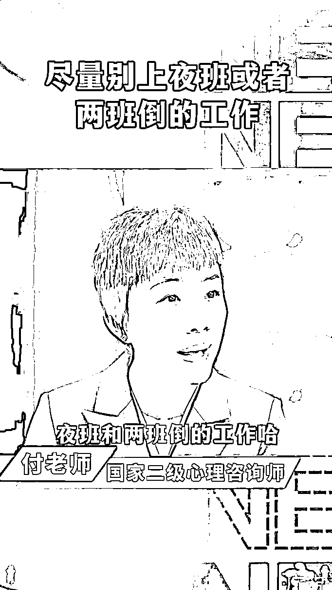

# 如何像素级复刻爆款视频

> 原文：[`www.yuque.com/for_lazy/zhoubao/nixso70fn7fvgnyi`](https://www.yuque.com/for_lazy/zhoubao/nixso70fn7fvgnyi)

## (31 赞)如何像素级复刻爆款视频

作者： 旋子

日期：2024-12-02

**大家好，我是旋子。视频号头部玩家，近半年 300 万 gmv，利润 70W+，100 多个账号，搭过 30 多个直播间，也帮助过 100 多个视频号新人走出第一步！**

现在已经 11 月底了，很快就要迎来双十二、元旦、过年际，熟悉自媒体的朋友都知道，这又是一波风口期，尤其是电商行业的小伙伴。

要想在电商方面顺利出单，模仿爆款视频是非常关键的一步。

只要不断产出高质量视频，被视频号、抖音、快手等社交平台推荐，就能成功达成被动收入，一天赚个小几百没有问题，这是我们团队最近一周的成绩：

目前我们的学员已经达到了：平稳出单、偶尔爆单。

一开始通过在平台上搜索自己带的品，或者一些带货大 V 账号，找到对标好的账号、爆款视频后，我们就要开始进行像素级复刻。

在进行像素级复刻的时候，我们要从文案、画面、语音三方面进行复刻，来达到一个相似度 90%，甚至是青出于蓝的效果。

## **1.****单个视频能爆的核心要素**

**文案**

好的文案能够吸引用户点赞、转发、评论

好的文案能给用户种草商品，让用户产生购买欲望

**画面**

画面用来展现文案，让文案的内更容易被用户接受。对于真人出镜口播视频，画面主要指：

●出镜人的镜头表现力：表情神态、动作

●出镜人的服化道/背景（辅助塑造出镜人的形象）

●混剪素材：辅助提示视频变现力，商品种草

还有一些影响画面表现的因素：

●字幕（重要，一定要有清晰的字幕）

●动画特效

●清晰度

**语音**

视频号的用户人群目前还是老年人居多，他们眼神不好，** *字幕*** 对他们来说很重要，但是** *语音* 的表现力**更重要。

一个好的，有感染力的语音可以给视频加分很多。

## **2.****文案复刻**

对于**流量视频** ：爆款文案直接拔下来，一字不改就可以了。

对于**带货视频** ：带货视频文案往往较长，1 分钟起，长的有 6、7 分钟。而且带货文案往往会可能存在一些违规词，以及一些因为语音识别不到位出现的语义歧义。所以我们需要对带货文案进行简单改写。

简单改写要点：

1、改写明显的时间错误

2、改写语句不通顺的地方

3、改写违规词

**改写案例：红色为删除或改写部分**

**原文**

8 月 7 号，立秋还有不到半个月了，你要是能刷到这条视频，那说明在茫茫人海当中，你绝对是个有福气的人。

那如果你还能耐住性子把这条视频看完，我敢保证，对你肯定有非常大的指导价值。尤其是最后一个，你一定要竖起耳朵听好了。同时呢，也别忘了转发给你相亲相爱的一家人。

你看一下下面这一排，不管是红心还是啥的，随便点一个就行。农业里有说，立秋养生有三忌:一、吃果不吃瓜，西瓜性寒生冷，立秋天气转凉了，易伤脾胃;

2。吃蜜不吃姜，秋冬的天气比较干燥，大量的吃姜啊，容易上火；

3。切勿贪凉，秋季的昼夜温差很大切勿贪凉，伤了脾胃。立秋后，我们要多吃这些食物。

老话说，宁可黄茜当饭，不要鸡鸭鱼蛋。尤其是黄，配上党参、麦冬、西洋参煮水喝。老祖宗称之为元气四宝茶。把这四宝加水煮 20 分钟，每天 1 杯

如果你自己怕买错不会搭配，或者说没有时间煮的话，可以点开我的头像，下方有一个商品橱窗，里面就有科学配比好的独立小包装，一次一包，开水冲泡即可。趁着现在厂家还有活动，抓紧时间带回去，好好爱自己爱家人

**改写后：**

距离 8 月 7 号，立秋还有不到半个月了。

你要是能刷到这条视频，那说明在茫茫人海当中，你绝对是个有福气的人。那如果你还能耐住性子把这条视频看完，我敢保证，对你肯定有非常大的指导价值。尤其是最后一个，你一定要竖起耳朵听好了。同时呢，也别忘了转发给你相亲相爱的一家人。你看一下下面这一排，不管是红心还是啥的，随便点一个就行。

立秋养生有 3 忌。第一：吃果不吃瓜。西瓜性寒生冷，立秋天气转凉了，吃东西要多注意。第二：吃蜜不吃姜，秋冬的天气比较干燥，吃蜜润，吃姜干。第三：切勿贪凉。秋季的昼夜温差很大，切勿贪凉。立秋后，要怎么吃才好呢？

老话说，宁可黄芪当饭，不要鸡鸭鱼蛋。尤其是黄芪配上党参、麦冬、西洋参煮水喝。老祖宗称为元气四宝茶。这四宝加水煮 20 分钟，每天一杯。如果你自己怕买错不会搭配，可以点开我的头像，下方有一个商品橱窗，里面就有科学配比好的独立小包装，一次一包，开水冲泡即可。趁着现在厂家还有活动，抓紧时带回去，好好爱自己爱家人。

## 3.  **画面复刻**

仔细观察对标账号形象，有几个特点：

1、人物形象都是专家、老师形象（穿着正式、儒雅）

2、神态动作自然，很自信，有感染力

3、背景偏暗色系，会进行模糊处理

4、左下角会有人物介绍（注意，写的模糊一点，专业身份信息，最好不要设计心理、医疗等领域，容易违规）

5、

采用上中下布局：顶上标题，下面字幕。字幕较大。

复刻要点：

1、人物形象：参考对标账号穿衣服，人物位于视频中间，正对或者微微倾斜，手部要有动作，这样显得很自然（可以 5-7 秒手动一下）。

2、拍摄时的神态、动作：多练习找感觉。参考课件

3、背景复刻：提前准备类似图片背景，画面调整成和对标账号一样的上中下布局形式。

4、人物介绍、布局、字幕复刻：详细在视频剪辑教程中讲解。

## **4.****语音复刻**

语音复刻是最难的，如果你的语言表现力不好，建议使用爆款语音，可以使用剪映的文字朗读功能或者数字人，但是带给观众的效果肯定没有真人语音感染力强。

我们是模仿，是对标，内容有了，但表达出的效果还是得靠我们自己。

口播所用的语音，我们可以用网络技术，也可以自己私下苦练。

但是提高视频的质感，提升你视频的专业度和可信度，好的背景至关重要。

试想，如果背景杂乱无条理，在拿着你的货说专业生产，也合格证等，带给观众的可信度也不强，成交度就不高。

**背景用得好，能让你的画面从 50 分变到 80 分，就像这样。**

 images.zsxq.com/FmY9pzrhoNJ5bq9_8tsXZ_tzlHcj) images.zsxq.com/FqvLsxgourpPhBIrCNhh6kAi86lo)

希望大家学会之后能立刻执行起来，2024 年的最后一波风口，错过就真的是明年了。

而且它的受众是五六十岁的中老年人，对你的颜值和视频精美度要求不大，小白做起来比较简单的一个项目，我现在做起来的很多学员之前都是宝妈。

把视频做起来后，也可以发到抖音快手等平台上，实现一鱼多吃。

希望这些能激励大家，祝大家早日入手视频号，实现月入过万！

* * *

评论区：

L!N/林林/小林 : 恭喜旋子成功刮起旋风[呲牙]

壹叁捌 : 目前处于眼高手不知道多低的状态[微笑][呲牙]

五阿哥 : 这是数字人吗