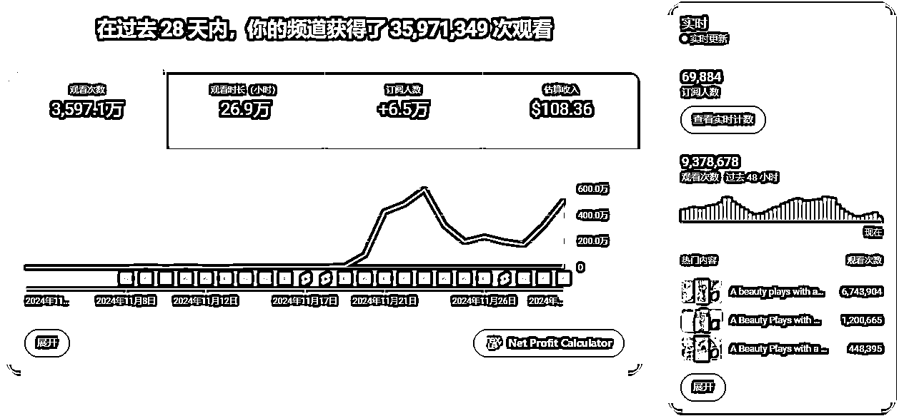

# 人工智能与未来社会：机遇与挑战

> 原文：[`www.yuque.com/for_lazy/zhoubao/mk04bzdy6ik1as97`](https://www.yuque.com/for_lazy/zhoubao/mk04bzdy6ik1as97)

## (精华帖)(122 赞)人工智能与未来社会：机遇与挑战

作者： Gary

日期：2024-12-02

大家好我是 Gary，三年产品，两年解决方案经验，前某国企广东地区大数据业务负责人，一年把业务从两百万干到了五千万。以前也尝试过很多轻创业的项目，但基本都没有拿得出手的结果，这次刚好是离职状态看到亦仁的超级标，又想要往 AI 行业发展，所以就直接冲了。这是第一次在生财发帖，写得有不够清楚的地方还请大家多多谅解！

这几个月时间达人秀变身视频在 YouTube 和国内的视频平台都比较火，**不少圈友的帖子里都有提到过，这里就简单介绍下** 。达人秀变身视频是基于文生图和图生视频技术实现的一类相对简单的 AI 视频类型，很简单，基本内容就是人物+动物变身+美国达人秀评委表情混剪。

在 AI 内容泛滥的现阶段，达人秀变身视频**制作简单、复刻爆款成本低** ，且仍然能够在各个平台（**至少亲测国内视频号和快手是有的** ）获取一定的流量，这一个月在最初版本的基础上多出来很多变种，比如肌肉男变身、赛博科技变身和我自己改良的真实场景变身等等。

目前的成果汇报（11.8 开始发布第一条视频，数据截至 12.2）：

1.  **『24 天』****YouTube：7w 关注 超 3.6kw 播放：开通第四天，收益已经 108 刀啦**

2.  **『20 天』****微信视频号：2w 关注 超 2.5kw 播放：收益 300 元（变身类视频真的很难拿视频号的广告费）**

3.  **『20 天』****快手：1w 关注 1.3kw 播放：收益 0 元，刚刚开通广告（快手叫磁力万合，1w 粉开通）**

本文档包含较多图片和视频，辛苦各位移步飞书阅览~：[《24 天 7w 粉开通 YPP 收益 108 刀，我的 AI 达人秀变身千万播放视频制作流分享》 - 飞书云文档
(feishu.cn)](https://ncnmu5q1eqm9.feishu.cn/wiki/V71Iw4oQNimYN9kWpWNcIWg7njc)

* * *

评论区：

希声 : 厉害 666

Gary : 跟希声大佬学习！

波哥 : 太厉害了！

波哥 : 我这边也是 shorts 不到一个月，还没爆

Gary : 可以根据完播率曲线和对标账号的视频逐步优化下内容结构，我是前期每天至少三个视频慢慢调整之后好起来的，猜测完播率应该是帮助自己判断内容质量的最重要指标了～

许老师～生财投资孵化 : 执行力拉满了[强]

波哥 : 好的， 感谢~！

土豆君 : 太牛啦