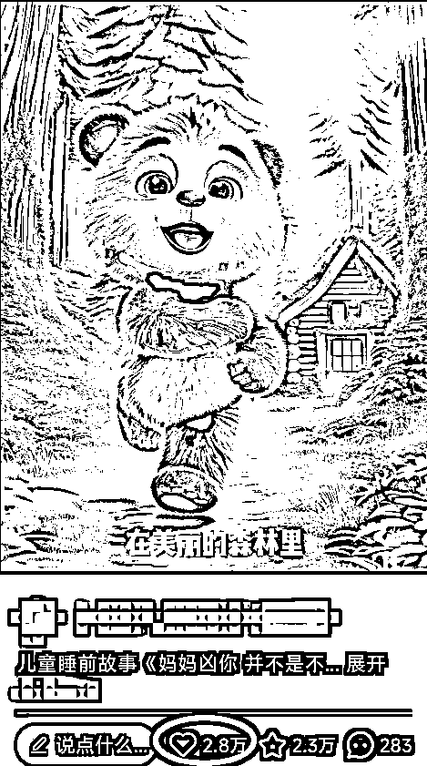
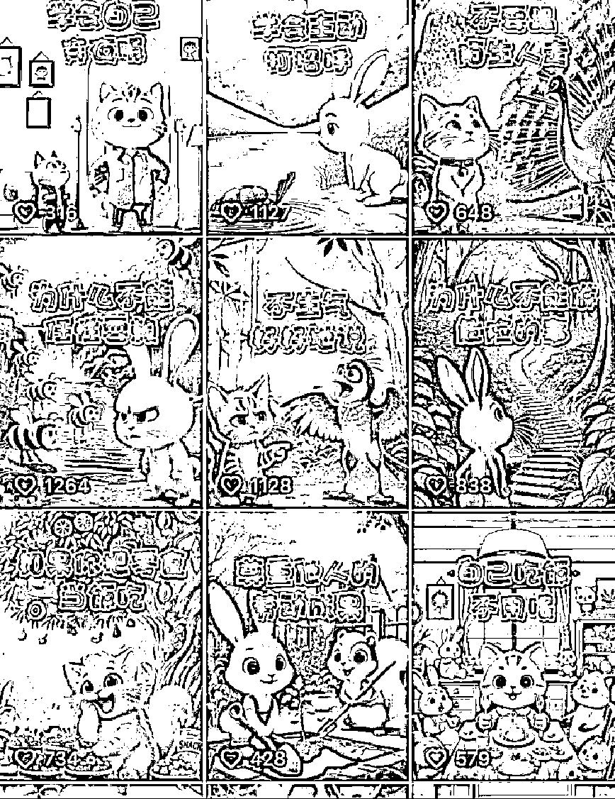
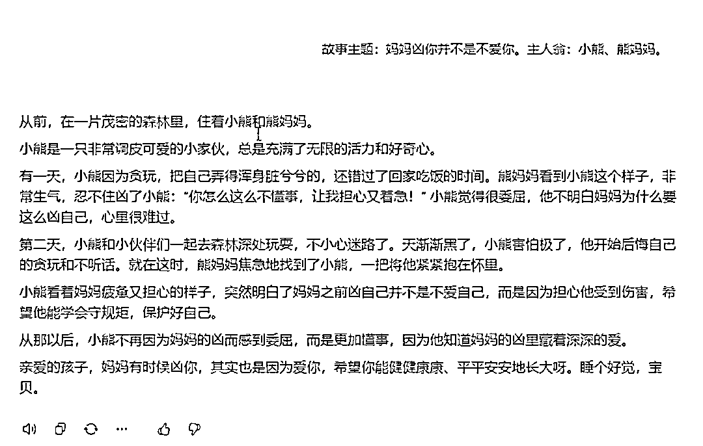
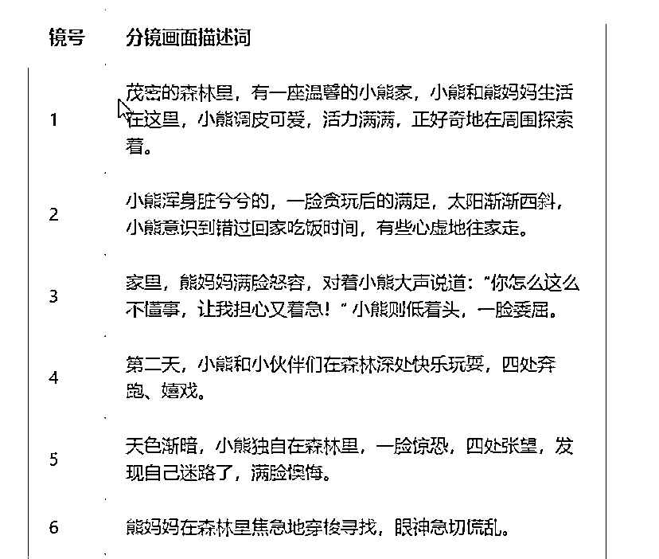
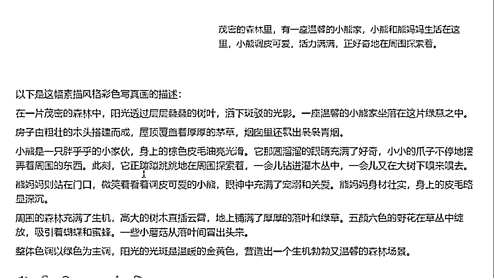
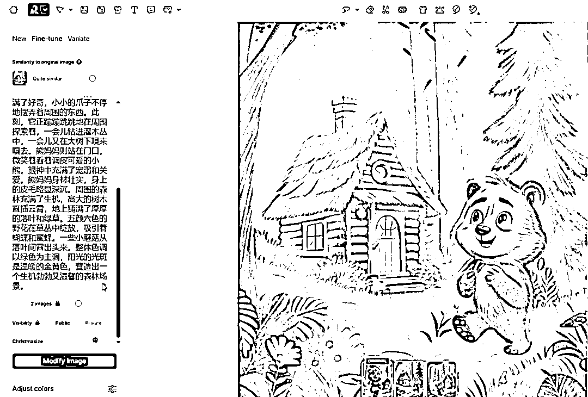
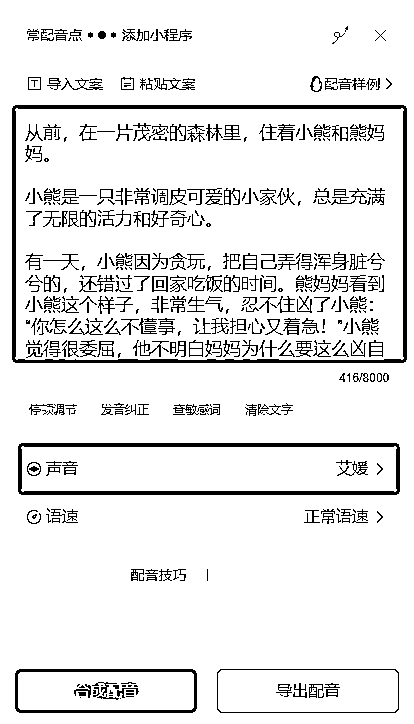
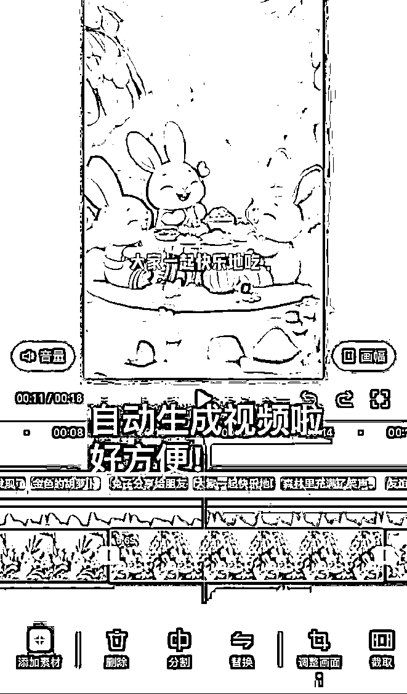
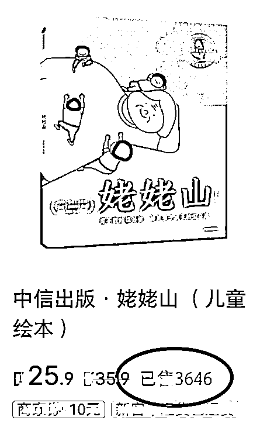

# AI 制作的儿童睡前故事视频：选题与制作指南

> 原文：[`www.yuque.com/for_lazy/zhoubao/kpl71gswu3t8v4yk`](https://www.yuque.com/for_lazy/zhoubao/kpl71gswu3t8v4yk)

## (42 赞)AI 制作的儿童睡前故事视频：选题与制作指南

作者： 高鹏圈

日期：2024-12-03

大家好，我是高鹏。

今天继续分享一个热门玩法。

最近用 AI 制作的儿童睡前故事视频，非常受欢迎。

尤其是小红书上家长也多，讲的故事具有很大的教育启发意义，画面看上去也很可爱。

所以家长和孩子都喜欢看。

关键这种视频，全程都可以用 AI 来制作，并不复杂。

那么怎么样像他一样制作出来这种很有意思，而且非常受欢迎的儿童睡前故事视频呢？

首先就是要找选题，要做这样一期视频，首先要确定这期视频要讲什么样一个故事主题。

我们用到的方法就是对标，直接去找爆款视频，看看他们都做的什么样的选题。

选题要确定两个方面的内容，第一个就是这个故事它讲了一个什么样的主题；第二个就是这个故事里会有什么样的主人翁。

比如说我借鉴了这样的一个爆款，这个爆款视频里讲了一个这样的故事。

叫做妈妈凶你并不是不爱你，围绕这个主题它的主人公，是小熊和他的熊妈妈。

有了选题之后，接下来就是利用 AI 来写原创的故事。

这个用到一款 AI 的智能体，这款智能体就是专门写儿童睡前故事的，我已经帮大家训练好了，文章结尾直接去用就 ok 了。

直接把故事的主题还有主人翁丢给 AI，它就能够直接构思出来一个故事。

从前在什么什么地方住着小熊和熊妈妈，然后小熊是一个什么样的小家伙，有一天什么什么事儿，然后第二天又怎么怎么样，最后再把这个故事升华一下，这个智能体还是非常好用的。

有了故事的文案之后，接下来就是借助这个故事生成相应的描述词。

这个地方我给 AI 的指令是这样的，我说：我提供一篇睡前的故事文案，需要从里边提炼分镜的画面描述词，以表格的形式整理好发给我，然后把故事的原文附在后边。

这样 AI 就帮你 123456 等等，把每个分镜的画面是什么样的，都整理出来了。

这些描述词看上去都是一两句，就比较简单，如果直接拿去投喂给 AI 绘画工具，它可能生成的不太精准。

所以我们还要做一步，就是描述词的细化。

这个地方我们要用到另外一款 AI 的智能体，就是专门帮咱们补充细化 AI 绘画描述词的。

把刚才的分镜头的描述词，直接发给这个智能体，然后它就填充了很多的细节，生成了一大段，这一大段里边你可以挑着去用，还是非常简单的。

有了细化的分镜头的描述词之后，然后就是 AI 文生图，还是用到之前给大家分享过的 AI 绘画工具。

这个地方要用到它的垫图功能，在上边选择导入一张我们的垫图，然后再在下边粘贴刚才得到的细化之后的分镜头描述词，点生成。

然后它就生成了两幅对应的图片，这两幅图片觉得哪个好用就用哪个。

最后就是剪辑成片，先要做的工作就是把我们一开始得到故事的文案配音。

这个配音的时候要注意一下，选择的声音风格，最好是女性的比较柔美的这种感觉，讲出来轻声细语的，就像给孩子讲故事的妈妈的形象，语速就选择正常的语速。

配音搞定之后，把配音和得到的分镜头的多组图片同步导入到剪辑工具里，然后音画同步，这个视频就制作完成了。

像这种号做起来之后，它的商业化模式主要有两种。

第一种就是儿童绘本的带货。

比如说像绘本的带货，这个号他的店铺挂了一本这样的儿童绘本，几十的客单已经售出去 3600 多份了，还是非常厉害的。

第二种就是把这个号跑通了之后，带一些小弟，交给别人怎么样复制你的模式。

今天的分享就到这里了。

关于刚才提到的几款 AI 提示词的智能体，以及 AI 绘画的工具等等，统一放到文档里了：[`svj4gxvm0v3.feishu.cn/docx/PqOQd5ebCoFg8WxsilUc3m0onGb?from=from_copylink`](https://svj4gxvm0v3.feishu.cn/docx/PqOQd5ebCoFg8WxsilUc3m0onGb?from=from_copylink)

我是高鹏，深耕网创 9 年，这是我拆解的第 698 个落地项目玩法，更多项目玩法，欢迎找我聊聊呀~

* * *

评论区：

暂无评论