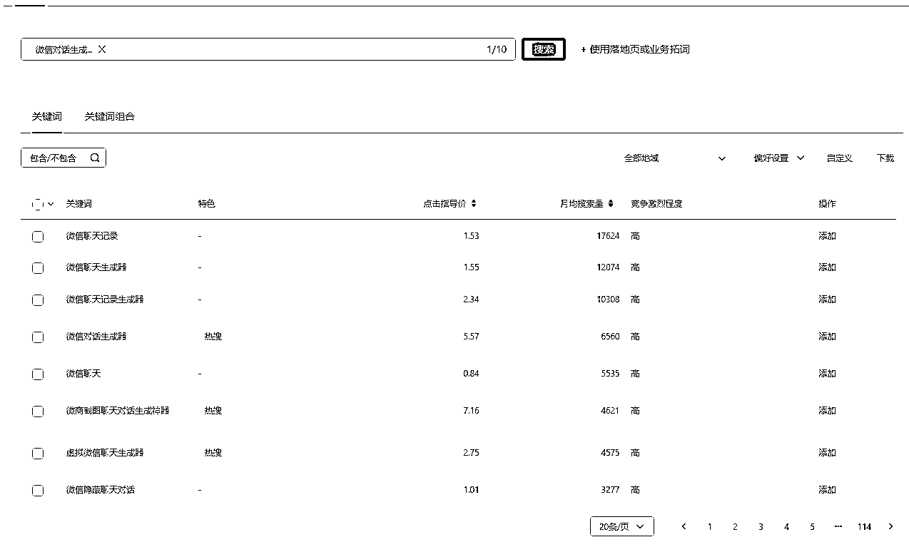
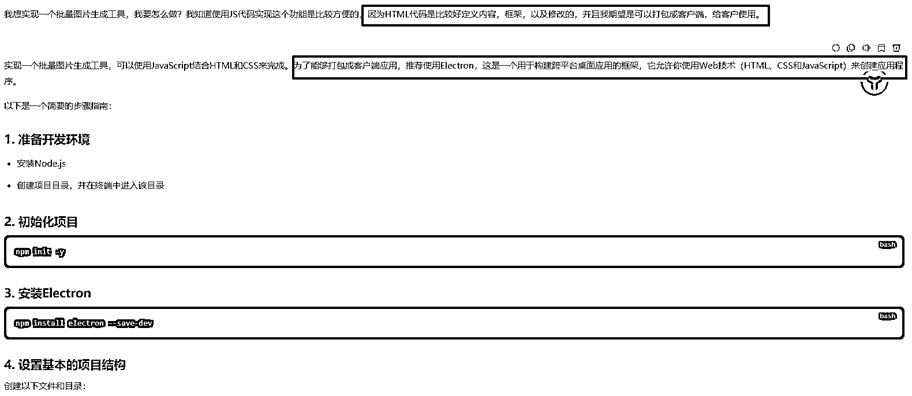
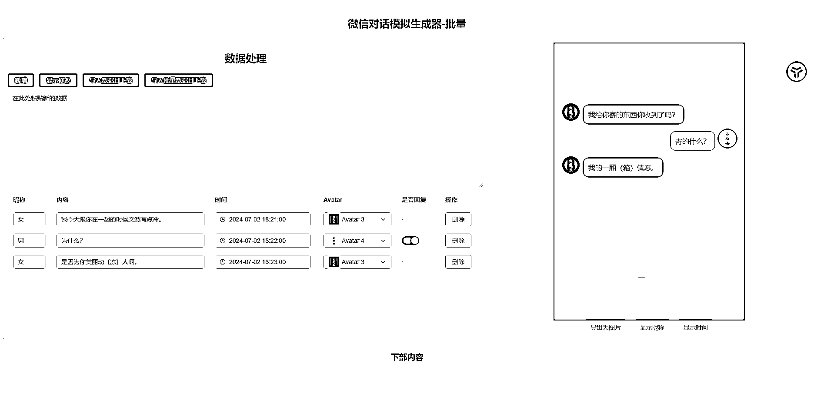
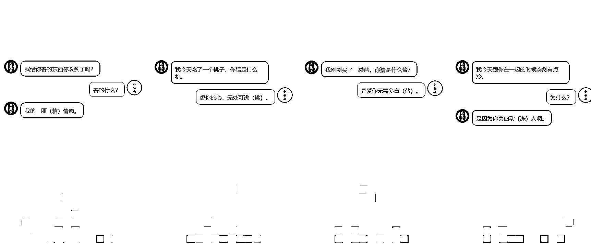
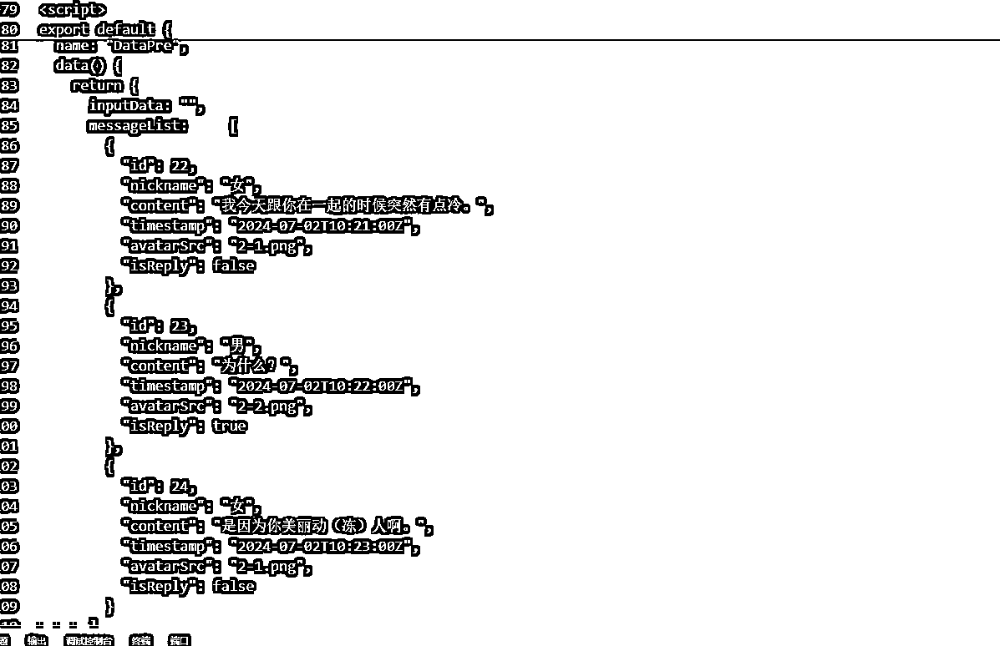
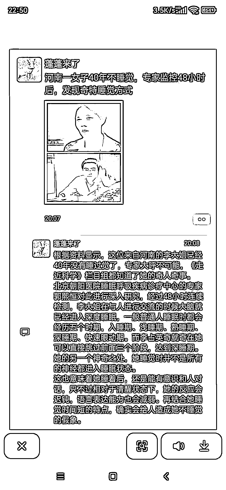
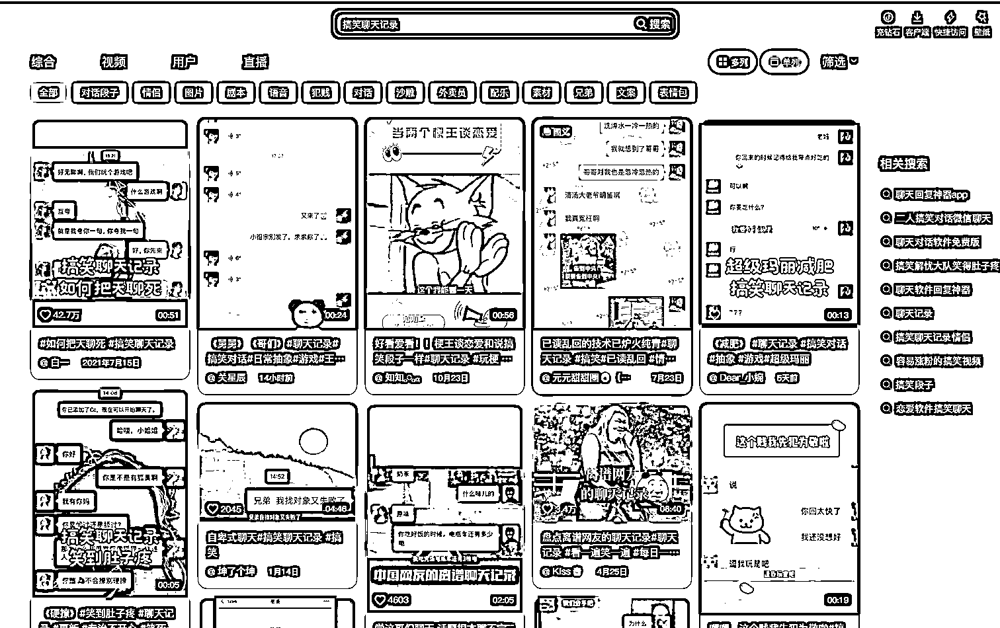
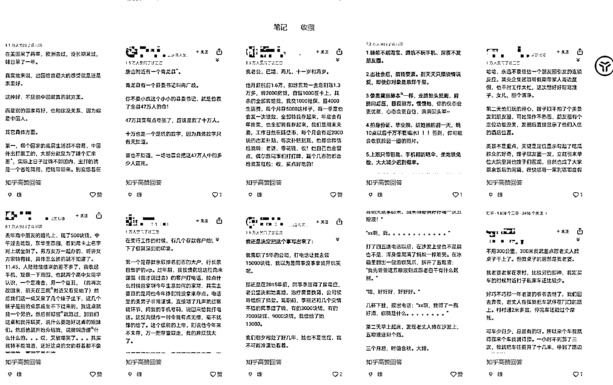
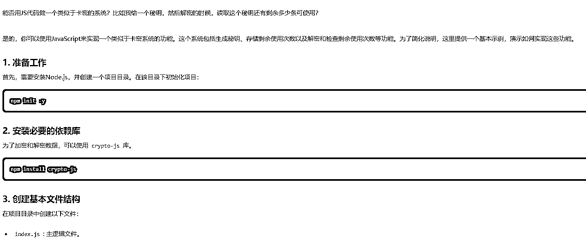
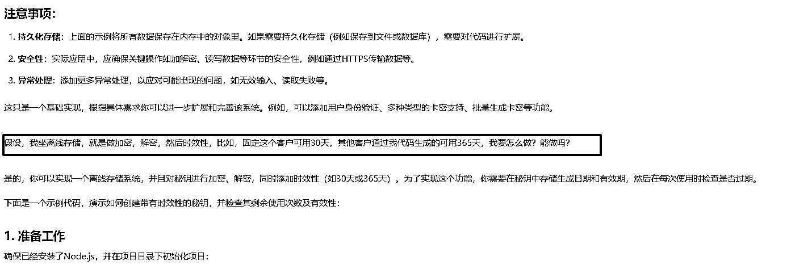

# 微信对话生成器：需求量大、制作成本低、可付费变现的 AI 工具项目

> 原文：[`www.yuque.com/for_lazy/zhoubao/mszbbblfcw86mv37`](https://www.yuque.com/for_lazy/zhoubao/mszbbblfcw86mv37)

## (28 赞)微信对话生成器：需求量大、制作成本低、可付费变现的 AI 工具项目

作者： 侠狼

日期：2024-12-06

亦仁的超级风向标，所有小工具都可以用 AI 再走一遍，自己再做一遍。

**我这里提供一个需求量大，制作成本低，可直接付费变现的项目与思路，具体落地实现** ，就看生财圈友落地去实操了。

这个工具还是比较适合新手小白去试试去做一做的，有难度，难度不会特别夸张，有兴趣的可以折腾。

正常情况下，1-3 天可写完基础内容生成，收费+打包可能会消耗一些时间，正常来说 7 天，你就可以用这个工具去进行收费了，而且需求量非常的高的。

## **1、微信对话生成器。**

做项目之前，我们打开指数查询工具，看一下微信对话生成器这个工具的需求量，可以看到月搜索是有一万多的。

百度上面也有很多的网页版的这个工具，我们都简单浏览一下，打开后会发现，基本都是一个简单的一个页面的代码，部分做的精品一些的，就是收费的了。

而且，都未曾实现，我所需要的，数据批量导入，图片批量导出功能，所以这里就有付费需求了。

只要涉及到批量生成的，就有搞头，减少人工，一般需要批量的工具也是工作室，创业者相关，好，需求落地，开干。

## **2、实现需求**

这个工具主要痛点是，**涉及到批量生成图片合成资源，且批量导出，是非常考验服务器** 的压力的，**对带宽有要求** ，所以**市面上百分之九十九的，都不会给你批量合成且批量导出功能，只能一个一个去生成图片** 的。

所以，这个功能就只能做本地打包的，至于怎么开发打包，具体可以问 GPT，或者 Cursor。

基本需求可实现，就可以实现技术选型了，因为我本人会 vue，所以我用 vue 实现了这个功能，批量导入，批量导出。

按照指定数据格式就可以了，这个工具是我之前写的，我也是昨天才知道，原来 vue 代码是可以使用 Electron 打包成可视化客户端去给用户使用的。

部分批量出来的图片内容，具体的实现的相关代码，就不贴出来了，其实就是一个 json 数据格式，参考如下。

当然，以上只是其中的一个例子，想这个类型的还有非常的多的。

比如最近很火的这个朋友圈类型的。

以及小红书，种草类型的微信对话聊天记录的广告的，有非常的多。

**不仅限于微信，淘宝，小红书，抖音，等平台，这些都可做，越齐全，越可以卖大钱。**

比如，土味情生成。

比如，情感语录。

比如，知乎图文语录类型。

比如，发疯文学。

至于数据怎么来？淘宝有一大堆这种语录，然后合成生成就行。

具体的操作方案其实都很简单，都是批量套用模板的。

## **

**

## **

**

## **3、怎么收费**

如果你是一个完全的新手程序员，想要去单独对接微信支付开发，难度是非常的高，我们简单实现就好。

具体的实现思路有很多，**个人比较建议的是，采用卡密激活的形式来进行存储读取，售卖+自动发货平台，实现自动化** 。

自动发货的平台有很多，具体可以上百度去找，也就是打包成客户端，然后让 Ai 帮你设计一个卡密生成的方案，秘钥，跟解码对得上，那就可以了。

具体的实现，让 Ai 写就可以，我这边为了方便，就用我自己的 GPT 问了，反正思路对的就行。

如果有能力的，是全栈开发的，我的个人建议是考虑，Vue+Python+MySQL。

**使用 Python 实现 Token 令牌接口登录，MySQL 存储这个客户的账号密码信息** ，或者卡密信息，后续客户要迁移，也是比较方便的，售后方便。

并且有 Python 后端的化，还可以提示客户版本更新，不然就是一个完全的离线的，可控性并不强。

## **4、关于一些问题**

工具是离线的，怎么使用时取决于客户，基本上没有太多风险，就是看怎么去进行使用的。

具体的难点解决点就是在于，如何实现批量，图片跟，视频都属于大资源内容，很消耗带宽，如果宽带小了，会导致服务器卡，这就是没人做批量的原因。

但是如果你把这个作为本地工具来用就可以实现批量。

具体的实现逻辑思路，使用存粹的 JS 代码实现后，在打包客户端是最好的解决方案，门槛低。

希望这个文章对各位程序员有帮助吧。

* * *

评论区：

老彭 : 狼来了[旺柴]

侠狼 : 已经躺平了，N 年没更新了。[旺柴]

天扬 : 请问文中开头用的指数查询工具是什么？