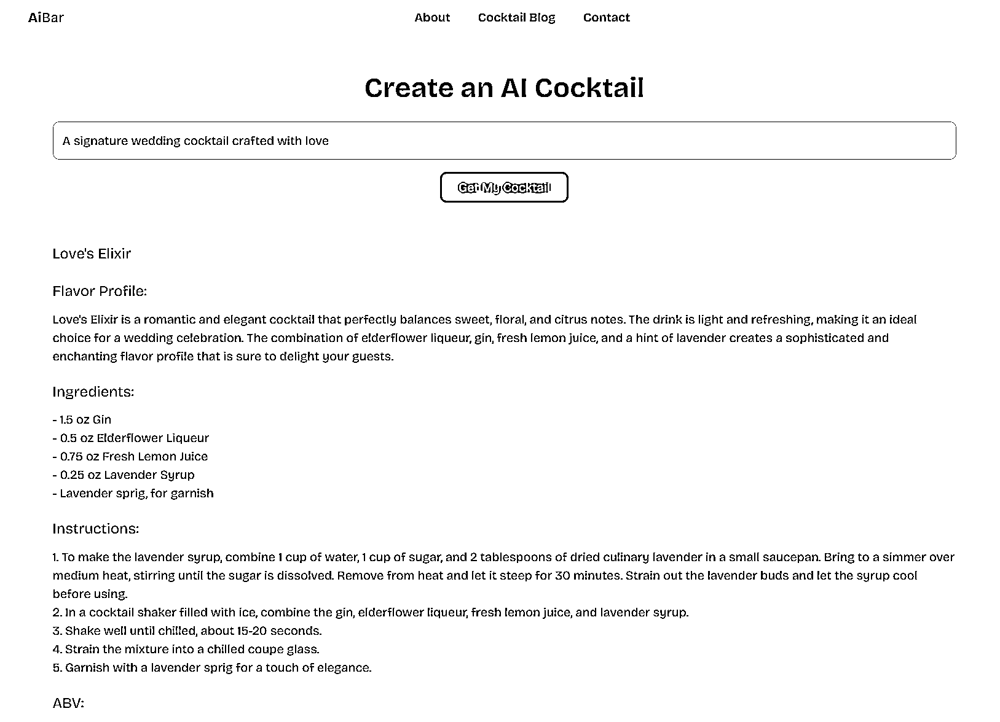
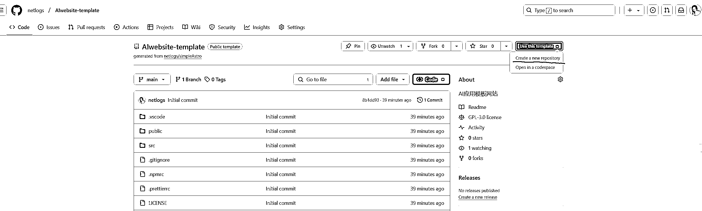
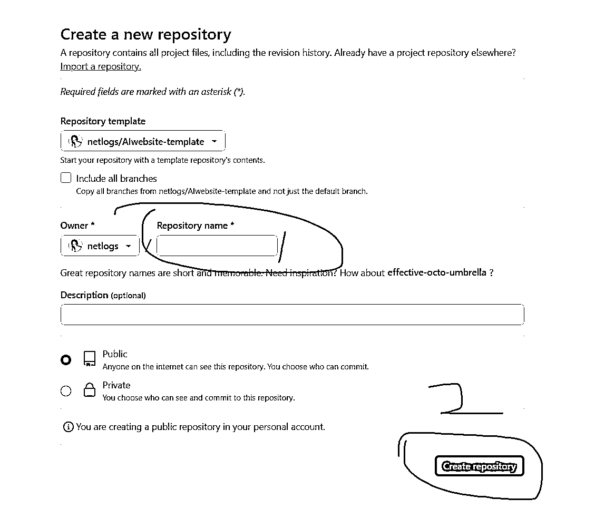
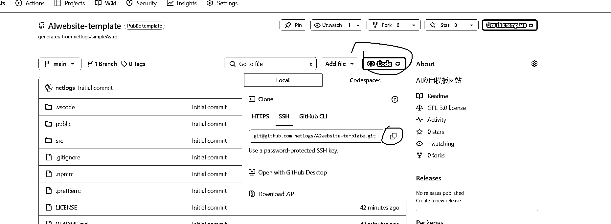
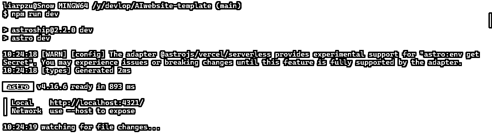
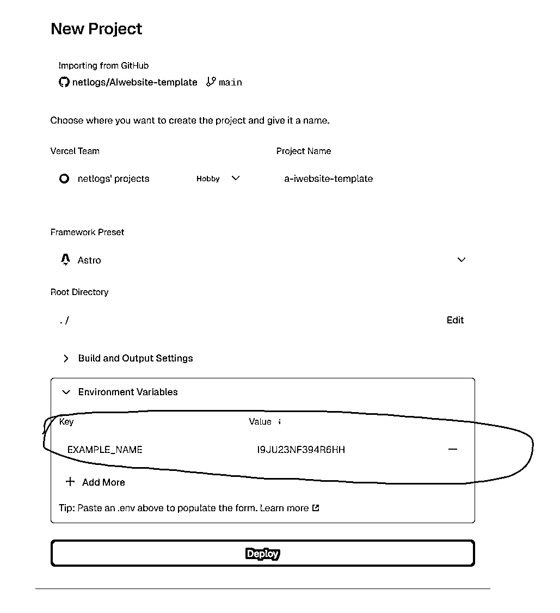

# 利用 Cursor 开发 AI 应用：从零基础到实践分享

> 原文：[`www.yuque.com/for_lazy/zhoubao/vysu5195ox15qiic`](https://www.yuque.com/for_lazy/zhoubao/vysu5195ox15qiic)

## (27 赞)利用 Cursor 开发 AI 应用：从零基础到实践分享

作者： 彩笺

日期：2024-12-06

**朋友们好，这次有幸成为了 Cursor-零基础做软件应用的教练，想拿出来一些好东西分享给大家。**

从最开始使用 Cursor 至今，出于各种目的我已经做了好些个工具或者网站了，有些是好玩、有些是我自己会用到

比如前段时间我自己会用的工具有：批量下载可商用的图片、截图批量保存、公众号批量导出；但是我感觉它们”分量“还不够！

有点像家里比较穷，不好意思拿这些东西出来招待大家。

昨夜突然闪过一个念头，自从亦仁发布超级标以来，YouTube shorts 相关的精华帖不少，同时也有好几个利用 Cursor 结合 Youtube
Shorts 的分享，但是 AI 应用的就太少了，几乎是没有(我没瞅见)。正好我之前有使用 Cursor 制作 AI 工具站模板出来，我觉得这一块或许会有打算做 AI 工具的朋友需要。拿出来分享给大家。同时，作为附带，一些我自己用 Cursor 制作的好用的工具、灵感来源，也一并分享出来，凑个大礼包。

##### 在本文你可以看到：

*   **详细的超级标 AI 应用的模板** ：稍作修改就能使用，对于 Cursor 船员更是近乎 0 难度

*   **更多的 Cursor 工具** ：最近我做的用的比较多的几个工具分享

*   **我是怎么挖掘需求的**

## 超级标 AI 应用模板

AI 应用，包含 AI 网站，AI APP，AI 插件。这里分享 AI 网站的模板；在我看来网站、最简单、容易变现、容易发布、容易有流量。

现在我见到的大多数的 AI 应用，**都离不开一点，那就是给 AI 模型的输入** 。

无论是图片生成、人工智能助手、各种各样的 AI 生成、都需要给 AI 一定的输入内容，然后它返回给你想要的东西。

最常见的形态，就是 gpt、claude 这样的 Chat。

一个多月前，我决定好专心出海的时候，就用 Cursor 制作过一个这样的模板，麻雀虽小五脏俱全，该有的功能都有。我会尽可能的掰开了去描述其中细节。

### 模板示例

为了方便你使用，我已经在模板网站上添加了使用案例：

我创建了使用 AI 制作鸡尾酒的页面，对应文件在`/src/components/cocktail.astro`

#### 示例功能描述：

输入你期望的鸡尾酒的颜色、口味、饮用场景

它会为你生成详细的鸡尾酒风味描述、配料表、制作步骤、酒精度、卡路里和碳水含量、装饰建议



#### 如何使用模板自定义自己的 AI 工具

如果你想自定义你的 AI 工具，你只需要做下面几件事情：

*   准备好你的 AI 工具的 apikey（如果你不懂 apikey 是什么，欢迎询问 Cursor）

*   配置 AI 网站的 api url 链接`baseUrl` 这里我使用了 openrouter 网站的 api 服务，如果你也打算使用这一家，那么你什么都不需要改 如果你打算用其他的网站 api，假设对应网站的 api url 是：[`xxxxx.ai/api/v1/chat/completions`](https://xxxxx.ai/api/v1/chat/completions) 那么你只需要将[`xxxxx.ai/api`](https://xxxxx.ai/api) 这一部分填入到配置文件内就可以了

*   配置`model`模型选择，选择你期望使用的模型

*   配置`temperature` 该参数是控制生成内容随机性和创造性的参数，范围 0-1 不懂问 Cursor

*   配置`maxToekns`配置 AI 使用的 Token 数量。如果你要生成大量内容，这个值要大一些，不然会被截断

一句话概括：用你自己的 apikey，编写你想要功能的提示词，然后用 Cursor 给你生成你想要的页面

#### 如何在本地部署

需要安装的环境有：nodejs、npm、git （如何安装问 cursor）

#### 如何在本地运行

首先将这份代码，拷贝一份到你的 github 账号

打开模板仓库链接：[AI 应用模板](https://github.com/netlogs/AIwebsite-template)



点击图中红线部分，**使用此模板并创建一个新的仓库**



在 1 的位置，输入你的仓库名称，点击 Create repository。他会拷贝一份我的代码到你的 git 仓库。

在这之后点击你仓库的这个位置：



打开你的 cmd 命令行窗口，或者 Cursor 中的 Terminal

`git clone git@github.com:yourname/yourepositoryname.git` 克隆（记得把链接换成你的）

在第一次克隆中，你可能会遇到一些账号问题，让你填写邮箱、等，你可以询问 Cursor：`我第一次使用 git clone 克隆我自己的 github 仓库，需要配置什么`

克隆成功之后，此代码文件夹就在你本地了

在你的代码文件夹下，执行命令`npm i` 安装相关项目依赖（不会操作可以问 cursor，或者按住 shift 在你的代码目录内点击右键，你会看到在此处打开终端等差不多的内容）

执行成功之后，执行`npm run dev` 运行本地测试，如果你执行成功，会看到类似于下图的内容（主要是那个 Local 链接）  

在代码目录创建一个文件`.env`,里面写上`OPENAI_API_KEY="sk-or-v1-97cd94b96xxxxx` 后面那一串是你的 apikey

打开图中的蓝色链接，这是你本地的测试，任何代码的改动，在你保存代码后，都会实时的更新的链接网页内

在项目 readme 中，也有详细描述，都可以看

#### 部署到 vercel

Cursor 航海手册内有对应描述，欢迎查阅，当前已经有朋友根据手册成功部署了自己的网站

唯一需要注意的点是：在下图对应位置，你需要填上你本地`.env`文件里的 apikey



### 技术栈选择

技术栈我选用了 astro，原因有以下几点

*   astro 文件内可以直接写 html，对新手友好，在此模板代码内，鸡尾酒制作页面就是用纯 html 写的（Cursor 写的不是俺写的）

*   当你学会了 html，结合 Cursor 的辅助，你很容易就能大概玩懂 astro，难度曲线很低很低

*   astro 后续可以支持你写更复杂的项目，他有成熟的生态

最后，你可能还会担心，看不懂，没关系，Cursor 航海才开了 2 天，现在看不懂、说不定一周后、两周后、圣诞节，你就能看得懂了

我个人觉得，一步步走完航海手册，就算看不懂代码都没关系了，完全可以用 Cursor
用自然语言的方式告诉你模板项目，哪个地方是做什么的，让他做出如何如何的改动。

甚至，面对未知你不知道如何用自然语言描述，那就把我上面说的内容粘贴过去吧！

### 模板 Prompt

这里就不提供了 prompt 了（过去好久了，我哪知道当时怎么写的：），原因如下：

*   如果你想使用此模板创建自己的 AI 应用，你可以直接拿去用

*   如果你想练手，当前 Cursor 里面有不少练手项目，你也可以根据当前模板的形态，功能，自己尝试写 Prompt

*   我可以打包票的表示：小白也能使用 Cursor 生成此模板，因为我就是用自然语言去描述生成的，并且我压根不会 astro，准确来说我不会任何的前端代码 orz

*   当前 Cursor 航海手册的内容，足以支持你走到这里。

## 更多工具

### 可商用 unsplash 图片下载

**批量动物图片下载:**

*   ACCESS_KEY = "xxxxxxx" 这里的代码需要更改为你自己的 apikey，在 unsplash 官网免费申请

*   JSON_PATH = "animals.json" 批量下载的关键词，需要在同文件夹内新建一个 animals.json，在里面按照 json 格式输入关键词

*   你也可以让 Cursor 将其改变为任何你想要的形态

**prompt：**

让 Cursor 分析该文件的实现逻辑和细节，让他用自然语言描述其过程，你就得到了一份 prompt

如果你想自定义，询问 Cursor 吧！

textjavascripttypescriptcsshtmlbashjsonmarkdownpythonjavaccpprubygorustphpsqlyaml
Copy

```
#multiDownloadunsplashimage.py
import requests
import json
import os
import time
from datetime import datetime

class AnimalImageDownloader:
    def __init__(self, access_key):
        self.access_key = access_key
        self.base_url = "https://api.unsplash.com"
        self.headers = {
            "Authorization": f"Client-ID {self.access_key}"
        }

    def load_animals(self, json_path):
        """
        从 JSON 文件加载动物名称列表
        """
        try:
            with open(json_path, 'r', encoding='utf-8') as f:
                data = json.load(f)
                animals = data.get('animals', [])
                print("加载的动物列表：")
                for i, animal in enumerate(animals, 1):
                    print(f"{i}. {animal}")
                print(f"\n 总共加载了 {len(animals)} 个动物名称")
                return animals
        except Exception as e:
            print(f"读取 JSON 文件时出错: {str(e)}")
            return []

    def download_animal_image(self, animal_name):
        """
        下载指定动物的图片
        """
        # 创建下载目录（如果不存在）
        download_dir = "animal_images"
        os.makedirs(download_dir, exist_ok=True)

        # 构建保存路径
        file_path = os.path.join(download_dir, f"{animal_name}.jpg")

        # 如果图片已存在，跳过下载
        if os.path.exists(file_path):
            print(f"图片 {animal_name}.jpg 已存在，跳过下载")
            return False

        try:
            # 搜索图片
            search_url = f"{self.base_url}/search/photos"
            params = {
                "query": f"{animal_name} animal",  # 添加 'animal' 关键词以提高相关性
                "per_page": 1,
                #"orientation": "square"  # 优先获取方形图片
            }

            response = requests.get(search_url, headers=self.headers, params=params)
            response.raise_for_status()

            results = response.json().get("results", [])

            if not results:
                print(f"未找到 {animal_name} 的图片")
                return False

            # 获取 200x200 尺寸的图片 URL
            image_url = f"{results[0]['urls']['raw']}&w=200&h=200&fit=crop"

            # 下载图片
            image_response = requests.get(image_url)
            image_response.raise_for_status()

            # 保存图片
            with open(file_path, "wb") as f:
                f.write(image_response.content)

            print(f"已下载 {animal_name} 的图片")
            return True

        except requests.exceptions.RequestException as e:
            print(f"下载 {animal_name} 图片时出错: {str(e)}")
            return False

    def download_all_animals(self, json_path):
        """
        下载 JSON 文件中所有动物的图片
        """
        animals = self.load_animals(json_path)
        if not animals:
            print("没有找到动物列表或列表为空")
            return

        print(f"开始下载 {len(animals)} 个动物的图片...")

        success_count = 0
        for animal in animals:
            print(animal)
            if self.download_animal_image(animal):
                success_count += 1
            time.sleep(1)  # 添加延迟以避免 API 限制

        print(f"\n 下载完成！成功下载 {success_count}/{len(animals)} 张图片")
        print(f"图片保存在 'animal_images' 目录下")

# 使用示例
if __name__ == "__main__":
    # 替换成你的 Unsplash API access key
    ACCESS_KEY = "xxxxxxx"

    # JSON 文件路径
    JSON_PATH = "animals.json"

    # 创建下载器实例
    downloader = AnimalImageDownloader(ACCESS_KEY)

    # 执行下载
    downloader.download_all_animals(JSON_PATH)

```

~

### 公众号文章批量导出

见我上一个文章：[`articles.zsxq.com/id_owghd5djd88x.html`](https://articles.zsxq.com/id_owghd5djd88x.html)

### 批量保存截图

有时候需要保存截图，但是需要截图之后，发送到一个聊天框，右键保存，或者用 windows 自带截屏工具，需要手动点击保存，图片多了很麻烦

于是制作了这么一个网站，当你复制图片后，点击网页，ctrl-v 就可以将图片粘贴进去，然后一键保存到本地。

甚至还可以继续优化，比如为批量的图片命名~

[`bulkscreenshotdownload.com`](https://bulkscreenshotdownload.com/)

## 如何挖掘需求

在 Cursor 航海群里，还有昨日花生老师的直播分享中，很多朋友会问如何挖掘需求。

出海一个多月，我将需求分为两种

从我的眼中发现的需求点，可能受众会很小，旨在唤醒我的好奇心

从数据网站挖掘的他人都会有的需求

着重聊一下第一种吧，第二种在出海手册里面都有写，我也会看哥飞的公众号学习，（上面的公众号文章批量导出就是导出哥飞文章来看）

#### 如何自己发现需求

**万能大法：** 写日记

对你没听错，就是写日记。越详细越好。

生财之前有篇帖子，好像是小排老师写的，你看不需求，那是你离得不够近，就像地图上的陆地和海洋的边界，看上去是圆滑的，但是当你凑近了看，你会发现各种各样的锯齿。

很多时候不是我们看不到需求，而是太司空见惯了，我们会下意识的忽略我们耳熟能详的常见事物，**因为我们知道、理解，所以我们远远的看一眼，就知道那是什么** 。

但是，当你把你的思考，经历以文字记录下来之后，他们就会从你的潜意识，真是的跃迁到你的眼前，此时你会对他们具象化

举个例子：

某天和朋友的聊天记录

*   怪物猎人明年要发售新作荒野了，狠狠的期待了

如果我没有把他记录下来，那么我只会收获对新游戏即将到来的喜悦，然后知道大概时间之后去买，去玩。这句话只会在我当前的记忆里停留一秒。

但是当我记录下来之后，我开始**审视每一个字眼，回忆相关的记忆。**

游戏有很多武器、以及大量的技能、配装，不同武器适合不同的技能特性，在之前的游玩时，这一部分是复杂的、有趣的、有时候需要查攻略的，那我是不是可以针对这个新游戏；注册一个 wiki 网站，游戏发售后，将游戏攻略制作出来。这不就是需求吗？

游戏是新发售的，那上 google trends 看一眼吧，果然，游戏名字是个新词，并且热度超高，拿去 google 一下，很多人会问这些问题：游戏是哪一天发售？
游戏是前作的 dlc？还是新作？ 这不就是需求么？大可以提前布局制作网站吃这部分的流量

扩展联想一下，除了这个游戏，还有很多大作，明年都发售，都去搜一下不就是一大把的需求，同时，对于一些老的游戏，也可以上 semrush 等网站搜一下，看看还有没有什么用户关心的，又没有多少竞争的需求点呢？

最有趣的是，我比较懒，一篇日记我都没有写，也就是无聊了翻翻最近的回忆，然后让其中的常见的关键词在我的脑海浮现，相当于闭着眼睛翻阅记忆。

一个月前，我会很头疼于，都是怎么挖掘需求的啊，我怎么一个都找不到，我小时候的好奇心都哪去了，我指定是废了。

现在，我可以清晰的感受的自己的变化，世界好像变得清晰了一些，好奇心好像也回来了一些，有时候甚至会想到一个词，然后废寝忘食的去扒拉相关需求，很多没见过的内容，属于是开眼了。

除此之外：

还需要**多实践多实践多实践** ，重要的事情说三遍，我这一个月做了近 10 个网站，虽然他们几乎全军覆没，但是实践过程中，那种逐渐的把一些方法论刻在脑子里的感觉，妙不可言。

最后，如果你想参与到超级标 AI 应用，欢迎分享基于你的内容优化的网站代码，也非常欢迎去我的模板仓库下提交 Issue 和 Pull Request 来改进这个项目。

* * *

评论区：

卡卡 : 我明天试试

彩笺 : [社会社会]