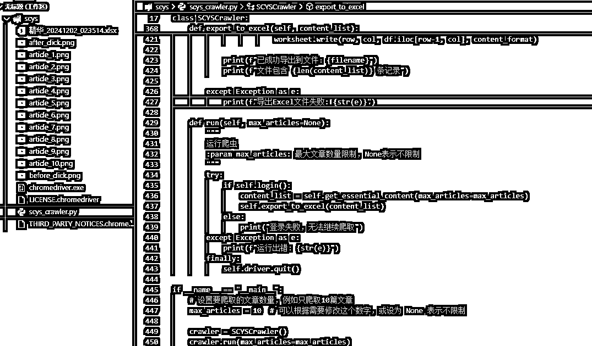
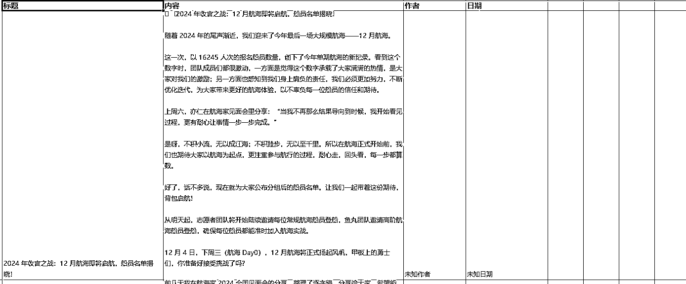
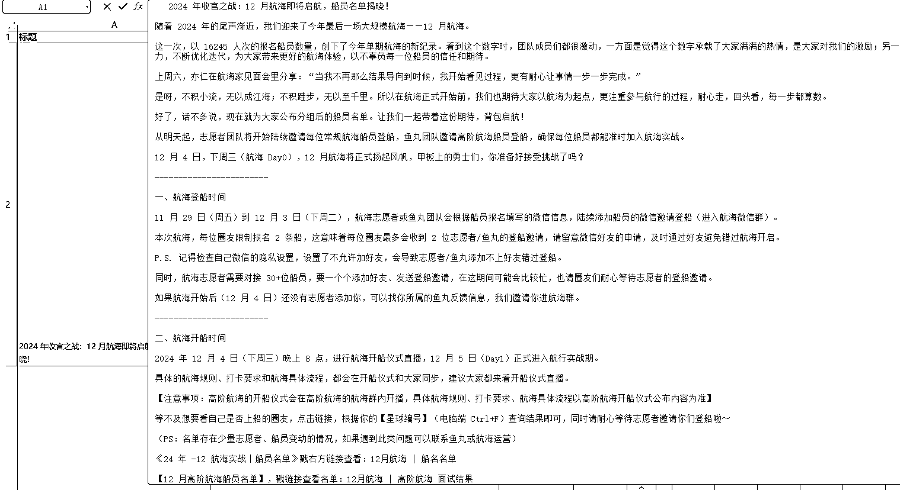
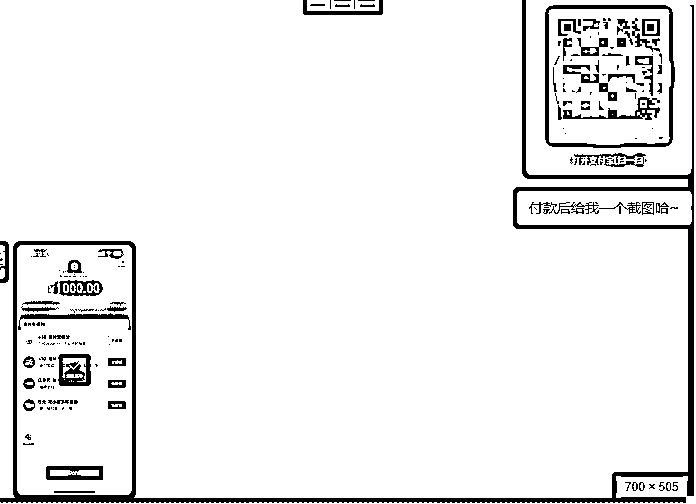

# 重生之我想当程序员，用半天时间学会使用 Cursor 爬了生财有术

> 原文：[`www.yuque.com/for_lazy/zhoubao/bscyhxirb5dd9eu0`](https://www.yuque.com/for_lazy/zhoubao/bscyhxirb5dd9eu0)

## (21 赞)重生之我想当程序员，用半天时间学会使用 Cursor 爬了生财有术

作者： 柒霖

日期：2024-12-02

重生之我想当程序员，用半天时间学会使用 Cursor 爬了生财有术

这可能会没有太多逻辑性，没有太明确的标题~只是提供了我制作 python 爬虫的思路

Cursor 也让我赚到了技术圈的第一块钱~

第一次接触到 Cursor，还是看到了@阿紫说的你问我吴佳文学会没有？

我看完后下载了 Curos，看了码叔编程入门彻底安装好了，我电脑上第一个编程程序~

我想着，我来自生财，那我也用之生财， （仅做测试~大家别模仿）

**亦仁哥点名**

开始 Ctrl+I 按出我的提示框，开始用上我的想法。

我想制作一个爬虫软件，想爬[`scys.com/这个网站，但是会跳出 https://scys.com/conn/web/login`](https://scys.com/这个网站，但是会跳出 https://scys.com/conn/web/login) 这个页面，让我们先进行扫码登录，这要给予 30 秒时间给用户扫码，判断扫码登录，当提示出扫码成功，已确认，等待进入[`scys.com 这个页面，爬取精华分享内容，做成 xlsx 表格导出，导出名字为精华 _ 时间，`](https://scys.com 这个页面，爬取精华分享内容，做成 xlsx 表格导出，导出名字为精华 _ 时间，)

这是我的第一段，提示词，后续会陆续暴雷，因为在没有任何基础的人心理这是简单的流程图。

（没有保存最终页面）

接下来我们换个角度去操作

1.目标网站

2.目标网站是否需要登录

3.登录后进行判断是否登录成功

4.登录成功后找到目标

5.找到目标栏的标题 如：当登录成功后，判定精华分享点击它，再进行获取页面所有文章标题，进行判断文章数量，点击一个采集一个内容，文章数量采集完切换下一页继续判定文章数量继续采集直到无法切换下一页
（span 是 html 我们可以进行 F12 来进行查找）可是还是失败了，不能爬到我想要的内容

提示词进行修改

还是无法找到精华分享 他的 selector 能否用这个来判定点击 #app > div.content-mt > div > div > div >
main > div.leftContainer > div.mixFilter > div > div > div.select.wrap >
div.button.active > span (这里是 selector )

抓到了这个标题栏，精准找到 精华分享

但是精华分享 确定可以之后，但是出现了文章内容抓取的问题

增加提示词进行修改

提取文章内容失败 文章点击进去等待网页加载完毕获取 selector 文章标题#app > div.content-mt > div > main >
header > div.title 获取 selector 内容 #app > div.content-mt > div > main >
div.content.ql-editor

提示出这个 就知道是自己想要的了，已经开始区分出来了

使用新的选择器：

标题：#app > div.content-mt > div > main > header > div.title

内容：#app > div.content-mt > div > main > div.content.ql-editor

但是生财精华那么多，大晚上采要采好久我等不住。

所以又增加了提示词

能否自己设置提取文章数量

主要改进：

添加了参数来控制文章数量

在处理文章时检查是否达到数量限制

添加了文章计数和进度显示

修改了主程序入口，允许设置文章数量

我设置了只爬 10 条。

最终结果

也因为 Cursor 让我赚到技术圈的第一块钱

 ux61Iokx4i)

实际是亏钱~因为第一次接这种单子，不是他是根据关键词来收费的，我只是收费了 1 个关键词的价格，结果他有 5 个关键词

* * *

评论区：

柒霖 : 小透明第一次投稿，希望大家别介意[撇嘴]已经在尽力用文字表达了

亦仁 : 可别乱爬生财有术，已经有一堆“前辈”被封号且不支持解封了。

柒霖 : [生病]第一次抓到，亦仁大哥，结果是不好的评论[流泪]，明白，我不会乱爬，仅测试，测试完就删除[委屈]

蓝弈 : 文章内二维码记得打码[奸笑]

柒霖 : 这还有机会改么[尴尬]

蓝弈 : 文章右上角看看，可以修改[偷笑]

柒霖 : OK OK 我改好啦

佳文 : 爬的风险很高，不止是亦仁老大说的封号风险，有一些网站爬了还入刑，建议别这么大张旗鼓的做。[`mp.weixin.qq.com/s/Te_bfk_qrgQVzB-
RHL8wiA`](https://mp.weixin.qq.com/s/Te_bfk_qrgQVzB-RHL8wiA)