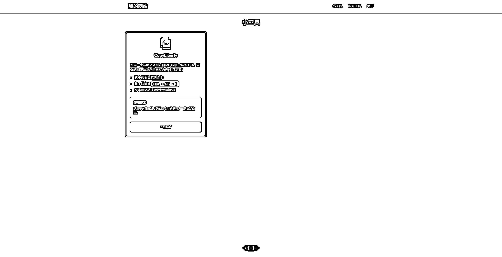

# 如何用 Cursor 一键部署网站

> 原文：[`www.yuque.com/for_lazy/zhoubao/ot34qm7iq5ikyiur`](https://www.yuque.com/for_lazy/zhoubao/ot34qm7iq5ikyiur)

## (20 赞)如何用 Cursor 一键部署网站

作者： 大臣

日期：2024-12-06

圈友们好，我是大臣。

这期航海上了 cursor 的船，并且开发出了第一款能解决我一个小需求的工具。

我想分享这个工具，于是突然想到，我能不能让 cursor 开发一个工具分享的网站，并且教我如何部署上线？

秉着**把手弄脏 实干兴邦** 的原则，我已经成功利用 cursor 搭建出了这个网站并上线。

于是有了现在这篇文章，为了方便圈友们观看，请大家移步飞书 [如何用 Cursor 一键部署网站](https://wm1881zs6s.feishu.cn/docx/YHm9d8S1fom7f1xoQ4Ic4D26n4b?from=from_copylink)

这篇文章能教会你：

1. cursor 的基本使用方法

2. 如何上线自己的网站

下面是我网站的效果图，网址：[[https://my-website-six-drab.vercel.app/]](https://my-website-six-drab.vercel.app/])([`my-website-`](https://my-website-) six-drab.vercel.app) (需要魔法才能访问)

* * *

评论区：

暂无评论