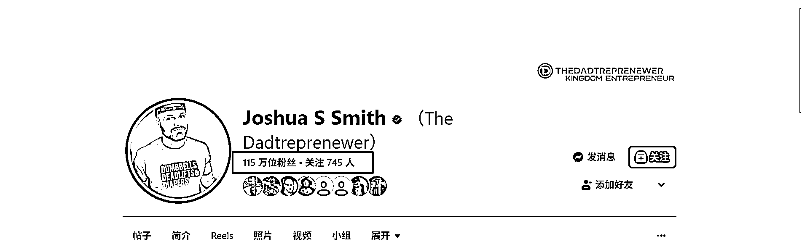
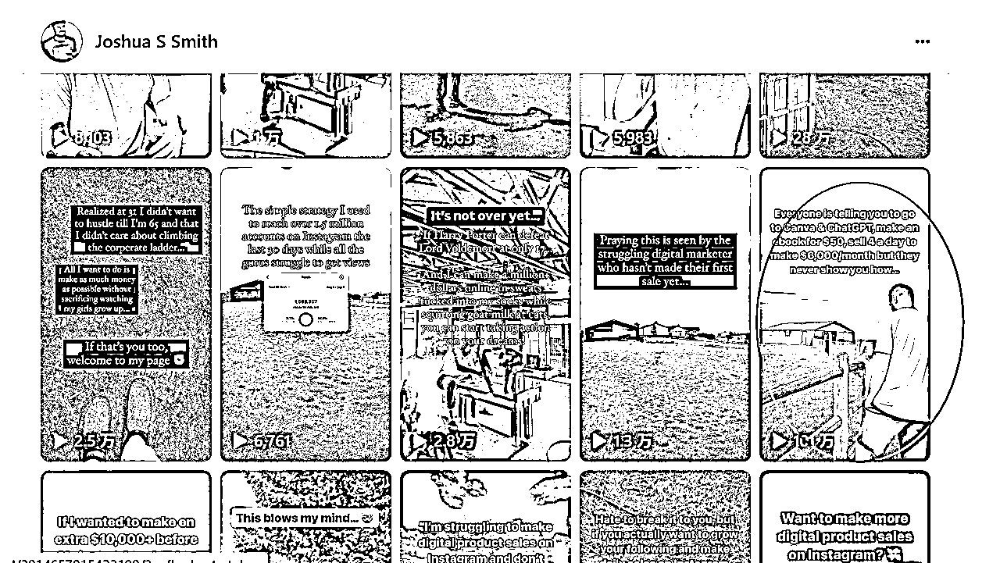
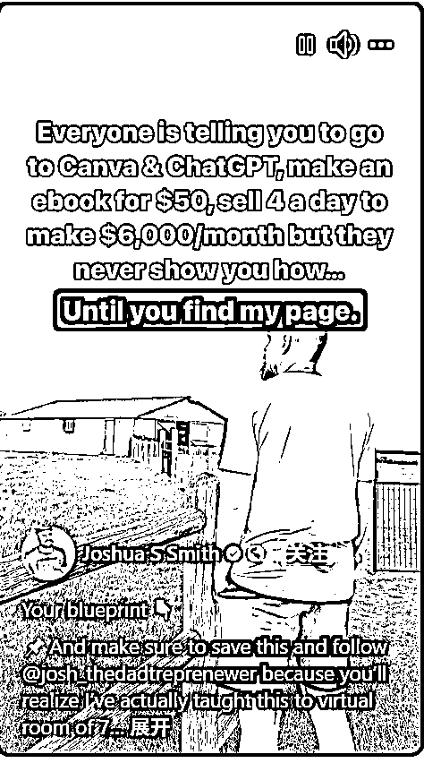
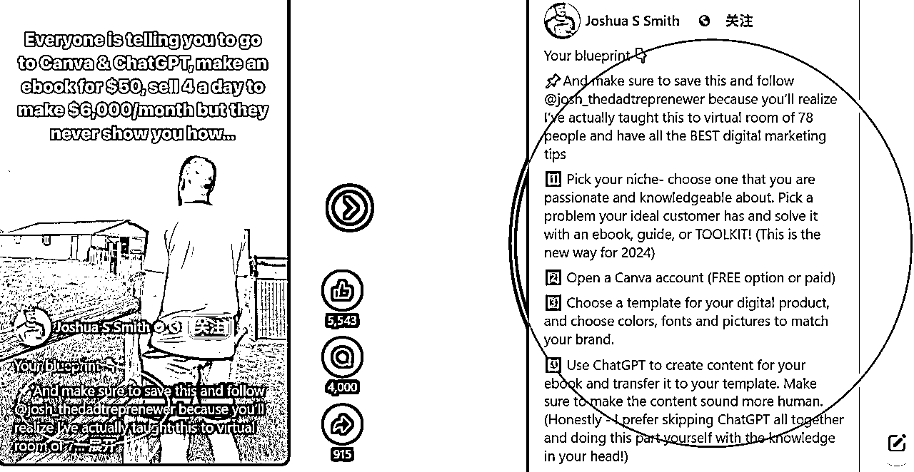
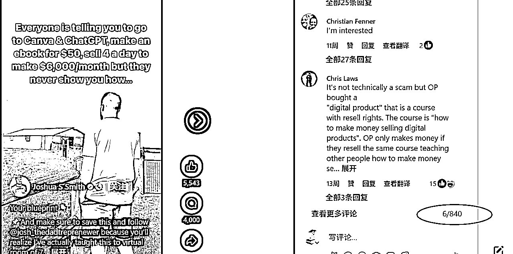

# YouTube Shorts 涨播放量的一个套路

> 原文：[`www.yuque.com/for_lazy/zhoubao/figpy604fheresxo`](https://www.yuque.com/for_lazy/zhoubao/figpy604fheresxo)

## (20 赞)YouTube Shorts 涨播放量的一个套路

作者： 书情小跟班

日期：2024-12-02

这个人有 115 万粉丝 [`www.facebook.com/joshua.s.smith.980/reels/`](https://www.facebook.com/joshua.s.smith.980/reels)

以一个视频为举例，在后面，我会说说他的一个套路

比如说这个视频，我用红色圈圈，圈住的视频

英文如下：

Everyone is telling you to goto canva & chatcPT,make
anebookfor<card type="inline" name="math" value="data:%7B%22code%22%3A%2250%2Csell4adaytomake%20%22%2C%22id%22%3A%22jQxbJ%22%7D">6,000/month but theynever show you how...Until
you find my page.</card>

中文翻译文字如下：

每个人都在告诉你去 canva 和 chatcPT，花 50 美元做一本书，每天卖出 4 本，每月赚取 6,000
美元，但他们从来没有教过你怎么做......直到你找到我的网页。

英文如下：

Your blueprint 👇

📌And make sure to save this and follow @josh_thedadtreprenewer because you’ll
realize I’ve actually taught this to virtual room of 78 people and have all
the BEST digital marketing tips

1️⃣ Pick your niche- choose one that you are passionate and knowledgeable
about. Pick a problem your ideal customer has and solve it with an ebook,
guide, or TOOLKIT! (This is the new way for 2024)

。。。

9️⃣ Promote on Instagram by creating short form video content to drive traffic
to your Stan Store. Make valuable, shareable, inspirational and educational
content.

Now obviously this is just a quick overview…

If you want to learn this process in-depth and how the big time digital
marketers are doing this to make a full time living, while stealing my exact
7-figure tools and setups to get you going even faster…

💥comment: Join and I’ll send you the free blueprint

中文翻译文字如下：

你的蓝图 👇

请务必保存并关注 @josh_thedadtreprenewer ，因为你会发现我实际上已经向 78
人的虚拟房间教授了这一点，并拥有所有最棒的数字营销技巧。

1️⃣選擇你的利基--選擇一個你有熱情和知識的利基。选择你的理想客户所面临的问题，并通过电子书、指南或工具包来解决！(这是 2024 年的新方式）

。。。

9️⃣通过创建短视频内容在 Instagram 上推广，为您的 Stan Store 带来流量。制作有价值、可分享、有启发性和教育意义的内容。

很明显，这只是一个快速概述......

如果你想深入了解这一过程，以及大牌数字营销人员是如何做到这一点，以赚取全职生活，同时窃取我确切的 7 位数工具和设置，让你更快地...

💥评论： 加入我们，我将向您发送免费蓝图

**套路说明:**

他的视频，我通过秒表记录的时间是 4-5 秒左右，但是图片的文字

Everyone is telling you to goto canva & chatcPT,make
anebookfor<card type="inline" name="math" value="data:%7B%22code%22%3A%2250%2Csell4adaytomake%20%22%2C%22id%22%3A%22Cm5Il%22%7D">6,000/month but theynever show you how...Until
you find my page.</card>

就单单去读完都超过 5 秒了，他这里给了一个勾子 Until you find my page. .直到你找到我的网页 ，那么我的网页 有啥呢？

很长很长，看到结尾的时候，他有一个互动 💥评论： 加入我们，我将向您发送免费蓝图，我们看评论有 800 多条的一个评论。

他这个视频这么设计有效地提高了短视频的完播率和重播率。

视频上的文字你都没怎么看，视频就已经放完了，等你全部看完后，他的视频都已经播放好几次了，这其实就是在卡系统的 BUG。

如果你之前做过短视频但播放量不理想，可能就是因为完播率和重播率太低，但是他的这个套路，让看他视频的观众不得不反复的看他的视频。

系统检测到这一点你的视频完播率和重播率高，会被系统误判为你的视频内容质量好。这导致平台会加大对这个视频的流量覆盖。

勾子的设计也是非常的有套路：

💥评论： 加入我们，我将向您发送免费蓝图

引导观众跟他进行评论互动，这一互动，他的视频又无意间又又又播放了

其他爆款视频套路都差不多，其中一个点，能够引发观众的一个好奇心的同时那就是尽可能短，对方没怎么留神，视频已经放完了，完播率和重播率卡住系统推荐的 BUG，大家可以沿着这个套路试一试。

* * *

评论区：

暂无评论