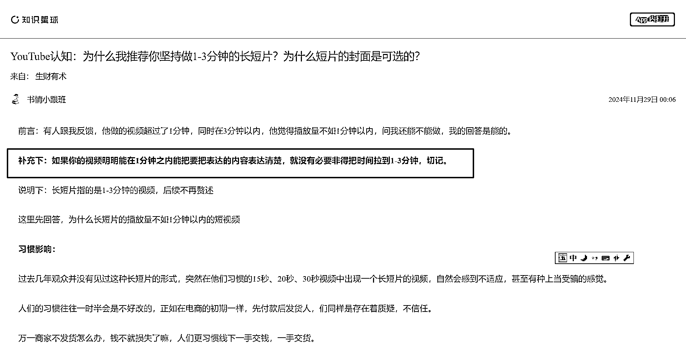

# 短视频时长选择：从 6 秒到 1 小时，平台策略与用户需求的变化

> 原文：[`www.yuque.com/for_lazy/zhoubao/frts02xp0xiqul5l`](https://www.yuque.com/for_lazy/zhoubao/frts02xp0xiqul5l)

## (14 赞)短视频时长选择：从 6 秒到 1 小时，平台策略与用户需求的变化

作者： 书情小跟班

日期：2024-12-04

我在文章中加粗的字

**补充下：如果你的视频明明能在 1 分钟之内能把要把表达的内容表达清楚，就没有必要非得把时间拉到 1-3 分钟，切记。**

**  **

如果你在几秒的短视频的领域取得不错的成绩，那么还是建议你继续做短片，而不是 1-3 分钟的长短片，这篇文章就做一个补充说明。

最初，短视频平台只允许上传 6 秒的视频，随后逐渐扩展到 15 秒、30 秒、1 分钟，再到 3 分钟，甚至 10 分钟。如今，TikTok 允许上传长达一个小时的视频。

这种不断突破平台原有设计初衷和边界的现象，是为了应对竞争的需要。YouTube 这个平台一直以来以长视频为主，曾经抵制短视频。然而，当 TikTok 强势进入市场时，YouTube 不得不推出自己的短视频形式。

YouTube 也面临着挑战。如果不推出短视频，他们将失去用户，YouTube 起初对短视频无所适从，因为这会分流他们的长视频观众。

然而，当 TikTok 下载量不断攀升时，如果不采取行动，YouTube 将无法留住用户。YouTube 最初推出短视频时，显得有些犹豫和被动。尽管如此，由于其庞大的用户基础，从长视频转向短视频是顺应人性的选择，相对容易。

这里说的为什么我推荐你坚持做 1-3 分钟的长短片，主要的点在于，你原来是在做长视频，但是当你明显感受到长视频的播放量不能让你满意的时候，你可以采取的一个行动。

回到短视频本身，它的基因和特征就在于“短”。一个很好的例子是博客演变为微博，成功之处就在于限制了字数，这符合人性。一旦这种符合人性的趋势被打开，就无法逆转。

因此，YouTube 上有一部分观众只看短片，而原本只看长片的观众因为没有选择才去其他平台观看短片。

现在 YouTube 提供了短片服务，使得许多观众无需频繁切换平台，就能在同一平台上观看不同长度的视频内容。

在 YouTube 这个平台上，假设有 20%到 30%的用户不观看短视频，但我们要知道，在 27 亿月活跃用户中，如果超过 70%的人既看长视频又看短视频。其中，接近一半的用户可能只看短视频，因此这个群体的规模是非常庞大的。

理解短视频的精髓在于它的特征和 DNA——“短”。在一个以短视频为主的平台或应用中，你自然期望它们是简洁明了的。

如果前一个视频是 30 秒，而后一个突然变成 3 分钟，观感可能会不太好。当然，如果后者非常精彩，那就另当别论了。但在相同质量下，短视频通常更受欢迎。

在这个网址 [`www.tubebuddy.com/blog/profitable-youtube-niches/，提到了`](https://www.tubebuddy.com/blog/profitable-youtube-niches/，提到了) 15 个最赚钱的
YouTube 利基市场，即什么类型的内容最赚钱？

**1****.** **Making Money Online 1\. 网上赚钱**

Coming in hot with a CPM of $13.52 is content surrounding strategies for
making money online.

围绕在线赚钱策略的内容以 13.52 美元的每千次展示费用 (CPM) 成为热门内容。

**2****.** **Digital marketing 2\. 数字营销**

This topic includes social media marketing and is backed by folks who know
their way around SEO.

本主题包括社交媒体营销，并得到了解 SEO 的人们的支持。

**3****.** **Personal finance 3\. 个人理财**

From debt-reduction to crypto investing, this category runs the gamut. And
advertisers are keen to throw money at an audience seeking out this type of
advice.

从债务减少到加密货币投资，这一类别包罗万象。广告商热衷于向寻求此类建议的受众砸钱。

**4****.** **Educational 4\. 教育**

With a $9.89 CPM, the education bucket includes a very broad range of
tutorials, courses, lectures, teaching inspo, and even nursery rhymes. But
keep in mind, if you’re creating content for kids, you need to meet YouTube’s [quality principles for kids and family
content](https://support.google.com/youtube/answer/10774223) to monetize each
video.

教育类别的每千次展示费用为 9.89 美元，包括非常广泛的教程、课程、讲座、教学灵感，甚至童谣。但请记住，如果您要为儿童制作内容，则需要满足 YouTube [针对儿童和家庭内容的质量原则](https://support.google.com/youtube/answer/10774223) ，以便通过每个视频获利。

比如说排名第 4 的教育类，只有几秒的短片，很显然并不能传递什么信息，这要求你在视频中把你做的长视频的内容精华再精华，尽可能的短，把你发的这个长视频的内容比较精彩的内容剪辑出一个 1-3 分钟的短篇。

其实在长视频有一个指标是前关键的前 30 秒，这个参数在 YouTube 频道后台也是可以看到的，如果你是做的以教育类的频道，做 1-3 分钟的长短片是适合的，同时这也对你做出的挑战，在兼顾内容的传播上，尽可能的短让人有兴趣看。

当然，能看 1-3 分钟的长短片，这类人也不是那么纯娱乐性质的观众，在这么短的时间，你可以分享一个知识点，讲解某一个专业名词。

以上，就是我对于为什么我推荐你坚持做 1-3 分钟的长短片的做的一个补充。希望能给大家带来启发。**  **

* * *

评论区：

暂无评论