# 出海创业：流量获取与支付工具选择的关键挑战

> 原文：[`www.yuque.com/for_lazy/zhoubao/grlg7pgou9emkbix`](https://www.yuque.com/for_lazy/zhoubao/grlg7pgou9emkbix)

## (44 赞)出海创业：流量获取与支付工具选择的关键挑战

作者： 希声

日期：2024-12-05

在国内竞争日益内卷的环境下，“出海搞钱”成为越来越多创业者和从业者的新选择。

无论是做亚马逊、temu、tiktok 等跨境电商平台，还是搭建独立站，或是从事 B2B 外贸、开发 App 或插件，出海赚美金似乎成了摆脱内卷的一条出路。

然而，在出海的过程中，除了流量获取是关键问题之外，如何顺利收款并完成结汇，往往是许多人非常关注并且容易踩坑的地方。

不同于国内的微信、支付宝等统一支付环境，海外市场的支付方式五花八门。

欧美用户习惯用 PayPal 和信用卡，东南亚用户更喜欢现金支付或本地银行转账，南美、日本等地区则有自己的本地支付偏好……

这让许多初入海外市场的创业者感到困惑，不知道该如何选择合适的支付工具。

更别提在实际操作中，还会遇到账户风控、手续费过高、提现结汇复杂甚至资金冻结等问题。

作为一名在跨境电商和独立站领域的从业者，我曾经尝试过各种收款方式，从 PayPal、Stripe 到空中云汇、派安盈等，被封了不少账号，踩过不少坑。

今天，我将从跨境电商、独立站、外贸和开发者四个角度，梳理从收款到结汇的全流程，希望能帮助更多出海创业者避开雷区，少走弯路。

有些渠道我没有做过，所以是查阅了资料之后整理的，如果有误，欢迎指正。

**跨境电商平台的收款到结汇全流程解析**

让我们来看下做亚马逊这一类的跨境电商平台的整个资金的全流程是什么样的：

对于消费者：在亚马逊平台上面选择产品——选择好产品——点击结算按钮——选择支付方式——完成支付。

对于亚马逊平台：亚马逊收到客户的款项——处理款项——资金暂存（通常是 14 天左右，主要是为了处理可能出现的退货、换货、客户投诉等问题）。

对于在亚马逊平台开店的商家：发起资金提现——资金到达支付服务商——结汇——资金进入国内的银行卡。

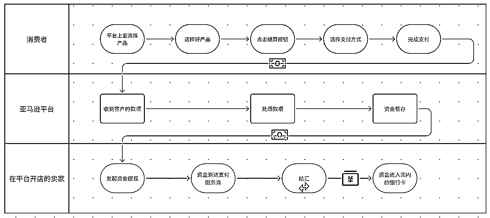

可以看到，在整个过程中，涉及到卖家操作的部分就是“在亚马逊平台上发起提现”和“结汇”两个动作。

当资金过了暂存期后，卖家可以选择合适的提现方式。

一般是通过亚马逊合作的支付服务商（如 Payoneer、万里汇、连连、PingPong 等服务商）进行提现，提现之后，资金就进入了服务商的账户。

因为卖家提现的一般都是外币（如美元），需要将其兑换成人民币才能在国内正常使用。

所以资金到达服务商之后，我们还需要“结汇”。

这一步使用的也是第三方结汇平台（如 Payoneer、万里汇、连连、PingPong 等服务商），这些平台通常在汇率和手续费上有一定的优势，操作也比较简便。

整个过程中，一般资金都是以美元的形式存在，只有经过服务商的结汇操作，美元才能兑换成人民币，进入我们国内的银行卡里。

**独立站的收款到结汇全流程解析**

让我们来看下利用独立站来进行跨境电商销售的整个资金的全流程是什么样的：

对于消费者：在独立站浏览并选择产品 —— 选择好产品 —— 点击结算 —— 挑选合适的支付方式（如信用卡、PayPal 等）—— 完成支付操作。

对于独立站：独立站上需要绑定支付工具来接收客户款项 —— 支付工具对支付信息进行验证（如果支付信息异常则会拒绝这笔订单） —— 款项暂存。

对于独立站商家：当满足提现条件时，在支付工具平台发起提现请求 —— 款项转至商家指定的外币银行账户或支付服务商 ——
若为外币则选择结汇方式（如通过银行或第三方结汇平台）—— 按照结汇流程提交信息 —— 资金兑换成人民币并进入国内的银行卡。

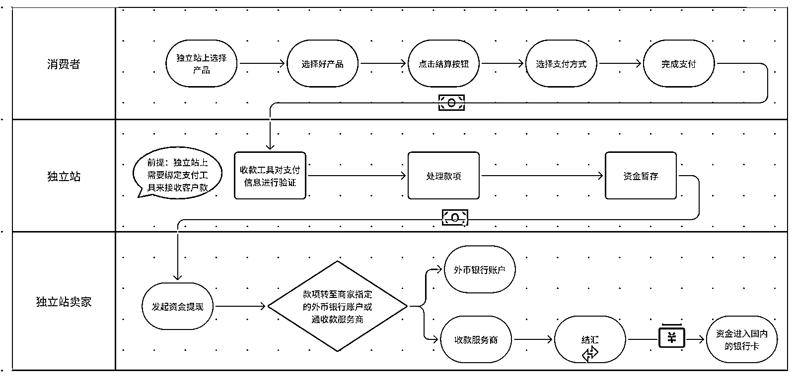

可以看到，大体流程和亚马逊的资金流程是差不多的。

主要是区别是在于，如果我们在亚马逊上开店，那么由亚马逊负责收取客户的资金，但如果我们是自己搭建网站，就必须先找个支付服务商来解决消费者收款的问题。

毕竟海外的消费者不太可能愿意直接把美金直接打到你的银行卡里面，这对海外消费者来说是一件非常麻烦的事情，一般只有外贸的 B 端客户才愿意这么操作。

收取客户资金的这一步，准确来说叫做“收单”。

有许多支付工具可以完成收单，比如 paypal，stripe，派安盈，空中云汇等等。

选择支付工具是很重要的一件事。

因为我们要考虑的事情有很多。

比如不同地区消费者的支付习惯。

欧美地区的用户一般习惯使用 paypal 和信用卡支付。

东南亚的用户一般习惯用现金支付。

南美地区的用户一般习惯用当地的银行卡来支付。

日本的用户一般习惯用便利店和信用卡来支付。

台湾的用户一般习惯用当地的银行卡和信用卡来支付。

……

而且还要考虑产品属性。

比如你销售的产品是软件产品，是订阅类型的软件（类似腾讯视频会员）；或者你销售的产品是高客单的，用户付不起想要分期付款…

而且还要考虑开通资质的要求。

比如 paypal 支持大陆营业执照开户，但 stripe 只支持海外公司开户……

而且还要考虑工具的费率。

比如 paypal 费率一般为交易额的 4.4%+固定手续费，stripe 的费率是 2.9%+固定手续费，某些支付工具还会加收一笔月费或者是开户费…

没有一款支付工具是完美的，是可以满足以上所有要求的。

所以一般都是根据需求，来开通不同的支付工具，全都绑定在网站上，不同地区的用户就可以根据自己的需求来选择合适的付款方式。

收单之后，资金就会进入到我们开设的支付工具账户内。

因为资金是外币，所以一般不能直接提现到国内银行卡（如果你有海外银行卡就可以直接绑定提现）。

所以我们还需要再选择一家结汇的服务商来进行资金的“结汇”操作。

幸运的是，上面提到的派安盈，空中云汇，pingpong，连连等服务商都是支持结汇操作的。

没错，许多这类服务商都是既可以帮你收单，还可以帮你结汇，甚至还可以给你贷款…

所以我们只需要在这类服务商上面开通一个海外账户，然后把这个海外账户填入到负责收单的支付工具内，就可以直接把资金提现入账。

后续就可以在结汇工具上面直接操作结汇，资金就能快速进入我们的人民币账户了。

**外贸收款到结汇全流程解析**

让我们来简单看下外贸收款到结汇的全流程。

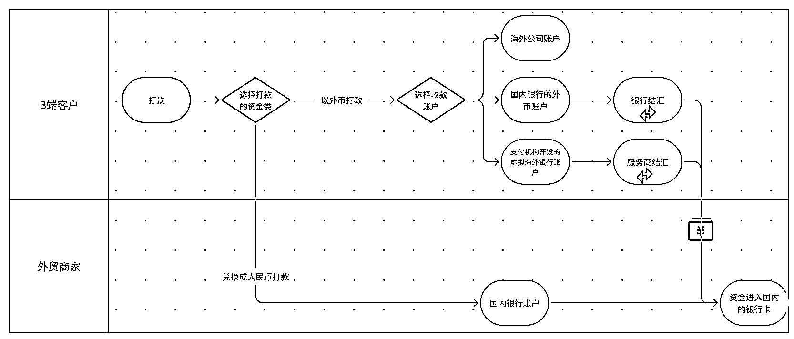

外贸的流程是最简单的，因为面对的都是 B 端客户，理论上来说，你可以要求客户直接打到你的人民币账户。

当然，这样对客户来说是有点麻烦的（因为客户需要先将他的货币兑换成人民币）。

所以常见的情况一般是注册一个香港公司和香港公司的银行账户，再让客户打款，因为香港账户支持外币直接入账。

当然，国内的许多银行也支持开设外币账户，但是当资金进入之后，就必须结汇成人民币。

而现在还有一些支付服务商，用大陆公司，就可以直接帮你开设出海外的银行账户，并且在上面也可以直接结汇。这些服务商相较于传统银行的好处就是开设账户简单，支持的外币账户更多，且结汇手续便捷，常见的服务商比如万里汇，xtransfer，pingpong（是不是很熟悉，又是这几家服务商）…

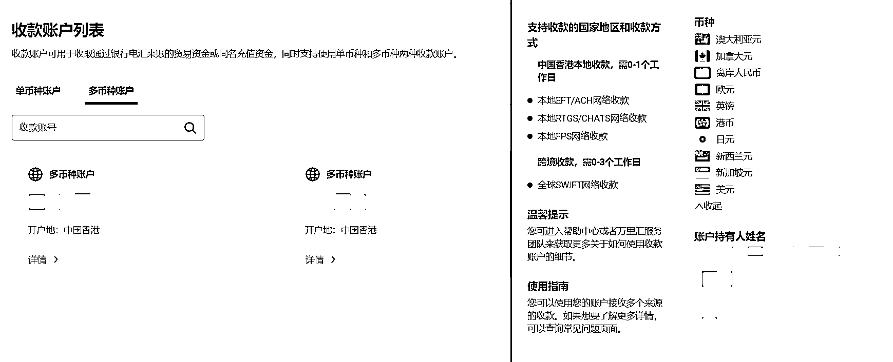

以上只是简单的外贸收入说明，实际外贸操作过程中还涉及到报关、退税等操作。

**开发者跨境收款的全流程**

开发者可开发的产品包括网站（独立站）、App 或浏览器插件，不同的支付场景和产品形态会影响消费者付款方式和收款工具选择。

如果开发的是如 SaaS 产品，就可以参考上面独立站收款和结汇的部分，流程基本一致。

唯一要注意的是，在选择支付服务商的时候，一定要问清楚是否支持你的产品，因为大多数国内支付服务商是不支持软件类的产品。

如果开发的是 app，那么就要根据 Google Play 和 Apple App Store 的要求来设置收款账号。

根据我搜集的资料来看，会收取一个开发者费用，支持大陆的银行卡直接收款，抽佣比例很高（15-30%）。

**其他出海方式收款的流程**

除了以上列举的四种常见的出海搞钱方式下的收款到结汇的流程，还有一些其他的出海搞钱方式。

比如做个自由职业者，在如 fiverr、upwork 等平台接单，。

比如做 youtube 频道，做 tiktok 赚取播放量佣金和广告费分成，可以绑定国内银行账户、海外银行账户、。

比如做一些跨境平台的本土店铺。

……

针对于这些不同的方式，就需要根据平台性质和具体要求来单独搞定收款渠道。

有的是可以绑定服务商账户来直接收款（比如 fiverr 可以绑定 payoneer 账户来收款），有的可以绑定国内银行账户，而有的则要求必须是海外银行账户才能顺利收款。

**独立站常见收款方式/支付工具介绍**

我们可以简单地把不同国家和地区的用户付款习惯方式大概归纳为下面六种：

Paypal、信用卡、本地支付、现金支付、国际汇款、其他付款方式。

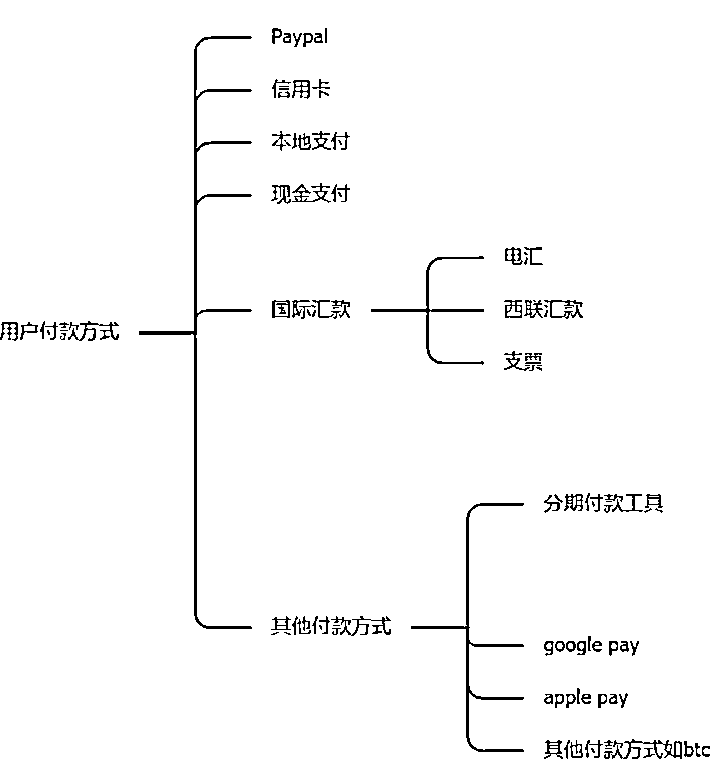

当我们越了解用户的付款方式习惯，同时我们的收款工具能够最大程度满足用户的所有付款方式，那么用户下单的概率就更高。

我们可以想象一下，如果在中国，有人搭建了一个网站来销售产品，但这个网站是不支持微信和支付宝付款，那么这个网站即使做得再好，产品再优秀，也一定不会有太好的转化率。

下面介绍一些常见的收款方式/工具，我们可以根据自己要做的目标国家市场的用户习惯和自己的资料来选择性地开通。

**注意，有许多支付工具是同时支持多种功能的，比如上面案例中罗列出的，可能既可以收单，还可以结汇，又可以绑定电商平台。**

**PayPal**

欧美地区使用非常广泛的一个收付款工具，类似国内的支付宝。

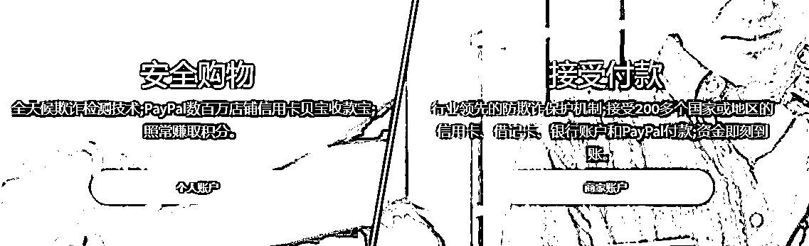

使用中国的企业营业执照就可以开通，没有开户费用，有交易手续费：

3000 美元以下的，费率为 4.4%+0.3 美元；

3,000-10,000 美元的，费率为 3.9%+0.30 美元；

10,000-100,000 美元的，费率为 3.7%+0.30 美元；

100,000 美元以上的，费率为 3.4%+0.30 美元。

优点是开户方便（可以自己在官网提交资料直接开户），缺点是费率比较高，同时因为风控很高，如果客户纠纷比较多、退款率高、虚假交易等其他常见原因很容易导致账号被封。

同时 PayPal 也支持客户使用信用卡直接支付。

所以如果你的目标市场是美国，那么在收款方面一般只需要配置一个 PayPal 账号就足够了。

**Stripe**

Stripe，由爱尔兰兄弟 Patrick 和 John Collison 于 2010 年创立，总部设在美国旧金山。

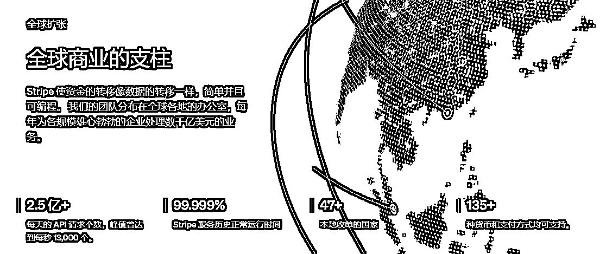

Stripe 的支付流程简便直接，消费者仅需一张信用卡即可完成支付，无需注册或使用其他账户。

Stripe 的收款费率一般为 2.9%+0.30 美元。

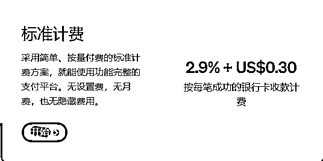

Stripe 的优点是用户付款很方便，且支持主流的信用卡方式。

缺点是需要海外公司才能进行注册，并且风控比较高。

对于有条件的独立站卖家，一般会注册个海外公司，然后开通 stripe 收款渠道，那么再配合 PayPal，做欧美市场就基本没有收款问题了。

**Shopify Payment**

Shopify Payment 是 Shopify 平台内置的支付处理服务，完全集成于 Shopify。

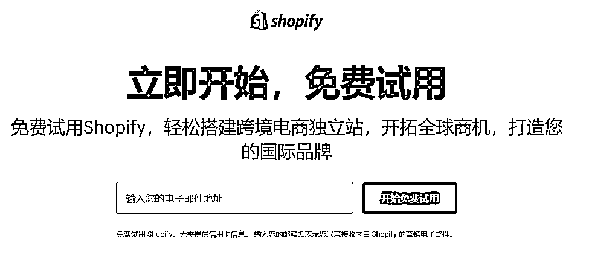

Shopify Payment 的费率大概在 2.9-3.9%之间。

Shopify Payment 的优点：

1.无需支付 Shopify 的佣金（在 Shopify 上使用其他收款工具，Shopify 都会抽取 0.5-2%的佣金）。

2.用户支付流程顺畅。

3.支持信用卡，google pay，apple pay，还有 Klarna、iDEAL 等多种本地支付方式。

Shopify Payment 的缺点是仅限于 Shopify 平台的客户，也就是说如果你的网站不是使用 Shopify 搭建的，那么就无法开通 Shopify
Payment。

同时 shopify Payment 不支持大陆公司注册，并且风控很严格。

**2Checkout**

2Checkout 支持 87 种货币，覆盖达 200 多个国家，由 Alan
Homewood 于 1999 年创立，是一家知名的美国公司，专门提供在线信用卡支付和收款解决方案。

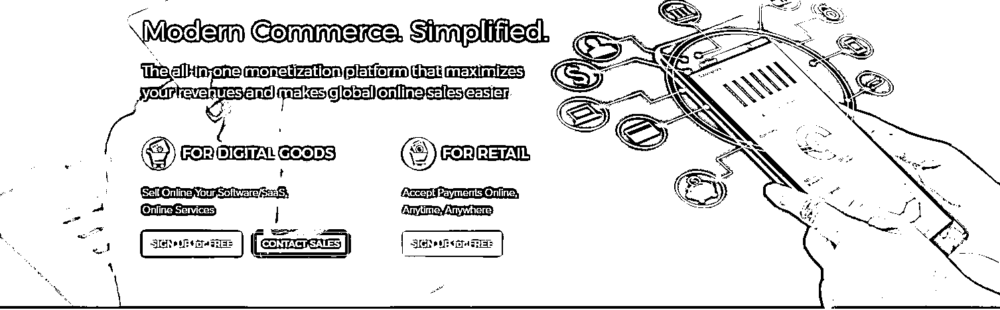

在费用上，2Checkout 对每笔订单销售额收取 3.5%加上 0.35 美元的费用，费率相比于 Stripe 略高。

2Checkout 的优点：

1.与很多国内信用卡收款公司不同，它和 Stripe 一样不收取开户费和年费等额外费用。

2.国内企业信息也可以开户。

2Checkout 目前并不提供中文客服支持。因此，使用 2Checkout 遇到问题时，需要通过邮件与英文客服沟通。

**派安盈（Payoneer）、空中云汇（Airwallex）、Pingpong、连连**

派安盈（Payoneer）、空中云汇（Airwallex）、Pingpong、连连等收款工具都比较类似，一般都支持国际信用卡渠道和不同的本地支付渠道。

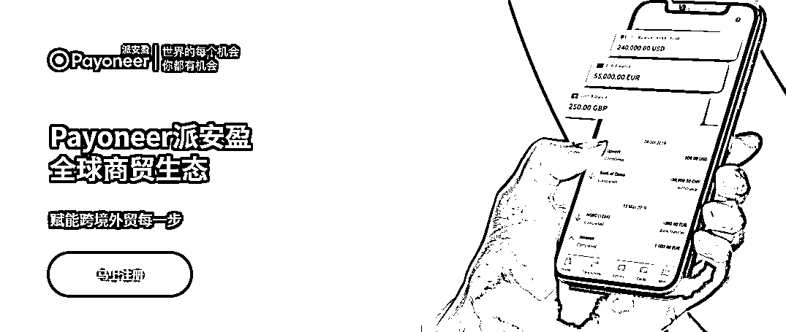

这些收款工具的优势是：有些支持使用国内的企业资料就可以开户，且风控比较低不会轻易封号。

缺点是一般会有比较高的开户费用，同时费率比较高，回款周期也相对较长。

这些工具一般更适合没有海外公司，但是想要开通信用卡支付渠道的卖家。

**Payssion**

Payssion 是一个提供多种支付方式的全球支付平台，它支持超过 200 种本地支付方式，覆盖全球几乎所有的国家和地区。

使用 Payssion 的独立站卖家可以接受来自不同国家和地区买家的支付，包括但不限于银行转账、电子钱包、现金支付等。

如果你要做的国家是比较小众的，比如是中东，南美，日本，俄罗斯，台湾等地区，那么针对这些地区就非常有必要开通相对应的本地支付方式，而在本地支付方面，payssion 是比较专业且有优势的一个服务商。

国内企业可以开户，具体开户的要求和费率根据不同国家和付款方式所决定。

**COD 货到付款**

对于中东和东南亚等部分线上支付不发达的国家，这里的用户更习惯使用现金来支付。

那么如果我们的目标市场是这些国家的时候，我们可以选择 COD（货到付款）的方式来收款。

COD 收款依赖于物流服务商来提供服务。一般我们需要寻找有提供 COD 服务的物流服务商，然后通过物流服务商把货物发出去，同时物流服务商也会在收到款项之后把收来的钱汇给我们。

这种方式的好处是：无需海外公司；更符合当地用户的习惯，同时能增加用户的信任感。

坏处是：费率比较高，同时客户是有拒收的概率。

**国际汇款**

国际汇款是一种传统而广泛使用的支付方式，适用于全球各种交易。

这种方式通常适合于大额交易和传统外贸业务。通过国际汇款，买家可以直接将资金汇入卖家指定的银行账户。

常见的国际汇款方式包括电汇、西联汇款和银行支票。

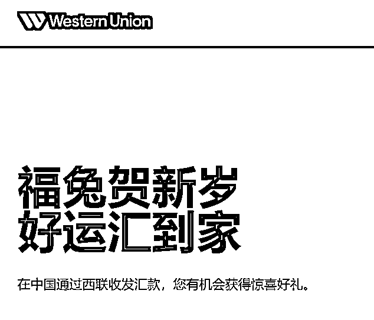

电汇是最常见的一种方式，买家通过自己的银行将款项汇至卖家指定的账户。虽然电汇安全可靠，但处理时间可能较长，通常需要几个工作日。

西联汇款则提供了更快速的汇款服务，特别适合紧急或小额交易。西联的网络遍布全球，转账会更方便快捷。但相较于电汇，西联的费用可能会更高。

银行支票则是一种较为传统的支付方式，适用于那些偏好使用纸质交易记录的买家。

**分期付款**

分期付款是一种越来越流行的支付方式，特别适用于价格较高的商品或服务。

这种支付方式在吸引价格敏感型消费者方面非常有效，同时也能把帮助独立站卖家有提高转化率和平均订单价值。

常见的分期付款服务商有：Klarna、AfterPay、Sezzle、Affirm 等。

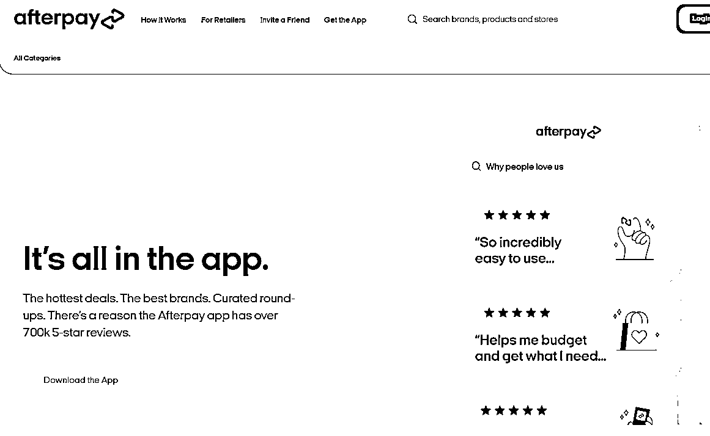

**独立站的收款方式推荐**

1.如果你的用户主要面向欧美用户，那么最简单的方式就是开一个大陆的 paypal 账号，0 成本，支持 paypal 付款和信用卡付款，而且现在 paypal 也支持直接结汇到国内银行卡。

注意要用宽带网络注册，好好养号。

一个 paypal 是支持绑定多个网站的。当然，这样做也有风险，就是如果你有某个网站违规，paypal 被搞废了，那么其他网站也没办法收款了。

2.如果你有海外公司，那么最好开一个 stripe，虽然风控很高，但确实好用，能显著提高用户的付款成功率。

3.如果你想开通分期付款，那么可以使用空中云汇。

**独立站的收款方式总结**

1.在决定选择哪种收款方式/工具之前，重点是要先调研目标市场/国家的用户支付习惯。

2.同时根据公司资料，产品类型，收款费率等再综合来考虑判断。

3.网站上的收款渠道越多，用户的可选付款方式越多，那么就越能提高独立站的转化率。

4.不同的收款工具对于产品类型也会有一定的限制。比如你的网站是销售虚拟类型的产品，那么国内的信用卡收款服务商一般都会拒绝。

5.不管是什么收款工具，都会一套自己的风控措施。

在独立站运营过程中，如果客户经常向收款工具服务商发起投诉和纠纷，当超过风控阈值之后就很容易导致收款账号被封，资金被冻结。

所以要保存好平时的采购发票，物流单据，必要时可以用来申诉。

6.收款账户最好多备 1-2 套，当收款账号异常（被投诉或者被风控无法收款的时候）时至少可以先顶上，不影响生意。

7.如果有条件，可以开设一些海外银行账户，比如香港银行账户（许多银行只要去一趟香港就可以开户），或者是美国银行账户（比如华美银行）……好处是能更加方便地向海外用户收款，还可以用来给客户退款等。

**如果分享对你有帮助希望点个赞哦~**

**————————**

**我在生财的精华文章**

[跨境创业？新手下场前必看的赚钱指南！](https://articles.zsxq.com/id_n97vrpiahx5w.html)

[一个工具管理 100 个 facebook、ins、tiktok 社媒账号？指纹浏览器使用全攻略！](https://articles.zsxq.com/id_u2ub0iv60p1g.html)

[【生财技能】如何分析产品/项目的海外市场体量与机会](https://articles.zsxq.com/id_wwkanemt57gt.html)

* * *

评论区：

蓝大虎 : 很详细，谢谢分享[强][强]

希声 : 谢谢😄

嘉应岛主 : 感谢分享，收款太重要了～

希声 : 😁😁