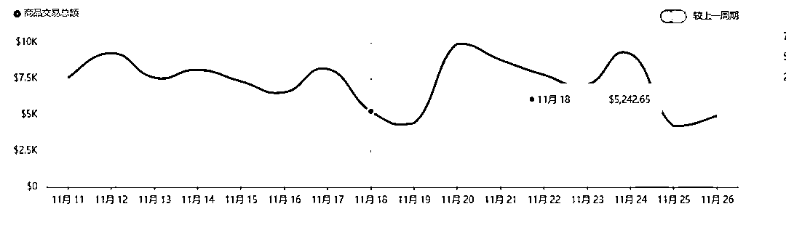

# 黑五热潮下的商家挑战与反思

> 原文：[`www.yuque.com/for_lazy/zhoubao/bn40qv8hi60n0zyr`](https://www.yuque.com/for_lazy/zhoubao/bn40qv8hi60n0zyr)

## (16 赞)黑五热潮下的商家挑战与反思

作者： 梁小伟

日期：2024-12-03

黑五热潮来了，似乎不管是大卖，还是小卖，又或者刚入局的卖家， 都陷入到了旺季的氛围里。黑五是一个转化促销的好机会，但黑五也是一个竞争更激烈的日子

看到的是别人爆单的背后，但仔细梳理，**爆单需要供应链支持，需要持续大批量的达人建联，需要足够充足的广告预算，是战略布局**

你做好爆单的基础了吗？

每天疯狂烧广告，烧完回过头一计算，稍微不注意，噢，白干。

确实，旺季来了，大家都投广告了，自然流也就少了。有人欢喜有人愁

每一个商家其实反复围绕的都是以上这几个流量入口。

我来聊聊，黑五期间，黑五遇到了什么有趣的问题。

这一篇，也是一次复盘的碎碎念随笔。

**团队面对旺季造成的压力以及无效努力**

01

上个周，团队账号代运营的其中一个店铺，团队每天单品上新**10-20 条** 素材。

从**拍摄-剪辑-发布-投流** 整个步骤都是翻倍去做的

每天干到晚上十二点

看起来非常有旺季的感觉，整个团队欣欣向荣，蓬勃发展。

一片大好 就是单量没什么变化

我开始晚上复盘，整个团队的进展。

GMV:**34.2W** 美金 10 月断货了半个月，11 月全力冲刺

**一、广告**

广告盈亏平衡线：2.2 持平 GMV 两个月消耗了**4.7w 美金**

Ads 两个月消耗了**2 万美金**

**达人侧** ：

基本上两个月找了四五个达人。

**直播** ：没有直播板块

**自然流** ：准备了十个号去带。每个账号 3-10 条一天。

**人手** ：我们负责这个店铺的就三个人手。

基本上这三个人手除了带这个店，每天还要管理团队业务，做中视频。

精力有被分散。

慢慢的，大家也遇到了瓶颈。

从 10 月-12 月

定的 100w 美金的目标，截止到 12 月 1 号。只完成了 34w 美金。

我一开始还给大家打鸡血， 没事的，旺季没啥自然流，竞争比较激烈，我们投流拉量拉起来。

这个店铺，从 9 月份开始一天几单运营到现在。

11 月以前的单量 **70%都是视频自然流出单**

11 月开始 广告预算每天**3000 刀-5000 刀。**

但相同的 GMV,多花了 40%的广告成本，没这么多利润了。

我就在想为什么。一个一个的排查。

**总结一：**

**大环境 pipiads** 上面观察，并跟很多商家深度交流，买量最猛的主要集中在

梳理出客户的这个品类，产品类目相对理性，然而淡季更有优势。

**总结二：**

**团队被事情缠身，而不知道梳理和迭代 盲目蛮干**

让我有点意外和生气的是。拍摄数量是上来了，质量下去了。

我偶尔抽查，找到了一堆标题，封面，拍摄光结构，脚本的漏洞。

我就问 sop 下，这么简单的错误都会出现，然后负责人 A 就跟我说

带新人用了很多时间和精力，他也有任务目标。

其实我特别能理解，还一直安慰他们，带新人确实吃力不讨好，但团队要放大就要持续不断的去做，不要用笨方法。要不停的**迭代完善的 sop，统一培训时间+统一的答疑时间** ，给新人研究，去优化方向。

这种时候，更多还是要耐心的继续分享一些新的小技巧

然后告诉方法

注意点：

**冲突不是威胁，而是一种能量源泉** 。这是我们自己的空间站收录的每日推文

我自己又看了一遍，静下心来。去安慰和理解大家。

帮助团队解决问题后，我主要抓几个方向

第一点：重新优化和梳理脚本流程

第二点：优化了拍摄时间和账号内容

第三点：店铺评分

第四点：视频质量优化和升级

很多时候，关于做一个项目到底需要什么 其实真正决定做了，就要想清楚这几个问题。

能做和做好其实是两码事。能做可能刚好商品有需求，又或者竞争没有那么激烈。再加上基础的运营功底，也能支撑一个团队的销售额。我就聊聊细致点的内容，看我最近的启发

**1.关于团队效率与方法论**

我发现大家进入蛮干期，没有了自己的思考后是，最为致命的。

我是怎么发现的。我把他们每天剪辑的素材看了一遍，我发现脚本一直没有迭代。

我就知道大家陷入了一种思维怪圈。

只想做容易做的事情，又或者重复的事情太多进入停顿期。

落到实处，那就是最近市场调研和对标案例分析做得少了。于是我停了所有人的工作，休息一天 做了几个调整调整，

**1.1 每天半小时的刷对标案例并总结**

**1.2 每天开会打开 pipiads 把同行爆的广告素材分析一遍（逐帧）**

我直接逼着让大家开始拿回最基本的事情做到细致

**1.3 更新了一批拍摄景观，做一些布景和光线**

**1.4.测试脚本多样性（故事-产品功能-外观展示-搞笑剧情）**

**1.5.落地的 sop+工作文档**

尤其是工作文档和 sop。如果 sop 没有更新。我就会去骂。因为就证明没有沉淀和积累。

我可以很直观的获取团队的进展和思路。

店铺评分：之前一直是亚马逊仓库发货。。

9 月份评分降到了**2.5 分** ，好家伙，黑五活动都快要报不了了。

我们花了三个星期的时间，做了以下几个调整

1.把亚马逊仓库发货的品全部下架

2.低客单高质量产品刷销量

3.客服回复率提高

拉回来 3.9 的评分，流量上涨。

一系列的调整后 我发现广告降了一半成本，**消耗 2000 刀，也能出 200 单，单量不仅没跌，利润翻了一倍。**

然后呢，又有意思的点来了。

一路发现问题解决问题，我又开始分析店铺流量页面的数据。

商品视频曝光高达**700 万+** ，可是为什么点击率下滑的这么严重。

我一看，好家伙，团队最基本的事情又没有做好。大清早又去骂了几句。

我一看商品卡流量也是，又沉默了

这么大流量，转化率**0.09%** ，辛辛苦苦做这么多流量。结果发现超过**5%** 的同行，真的是铺天盖地的浪费

调整方案：

**1.明年新增 5-10 款 sku 承接流量**

**2.继续优化视频标签**

**3.加强号召引导**

回归到现状，目前团队差不多做了**32 万美金** 的 GMV，不说**100w** 的目标吧。至少要完成**60%** 也就是还有**28w** 是需要 12 月冲刺的

我发现做事情，执行能力强不是单一事物，是对新事物和需要学习的事物才能体现强执行。

关于团队的对标拆解。

我非常推荐去**pipiads** 给团队看

因为团队直接过滤自然流的视频。直接看广告视频会帮助你过滤很多播放高但不出单的视频素材。广告属性强一点的视频或许播放不高，但转化效果可能会更好。

我是梁小伟，咋们下期见，如果你喜欢我的碎碎念，记得点赞+关注~

* * *

评论区：

微信用户 : 分析总结逻辑性很强，从根本出发解决实际问题，学习到了👍🏻

梁小伟 : [呲牙]谢谢认可