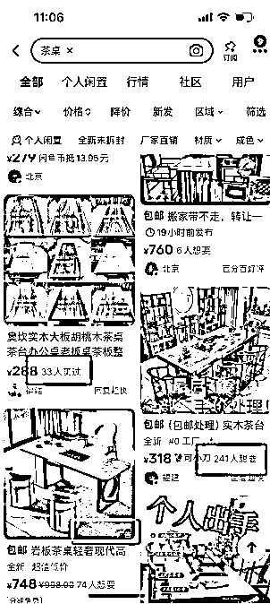

# 闲鱼付费推广实战经验分享：用钱买曝光，转化成交全靠你

> 原文：[`www.yuque.com/for_lazy/zhoubao/tfcagh61kchwcre0`](https://www.yuque.com/for_lazy/zhoubao/tfcagh61kchwcre0)

## (35 赞)闲鱼付费推广实战经验分享：用钱买曝光，转化成交全靠你

作者： 杨小六

日期：2024-12-05

大家好，我是杨小六，一个 2019 年开始做闲鱼的老咸鱼。

最近看到很多圈友对闲鱼的付费推广功能颇有兴趣。我们团队花了两个月时间进行了系统测试，手把手砸钱验证了各种方法论。这次把实战经验打包分享出来，每一条都是“血与泪”换来的硬核干货，适合已经在闲鱼赚到钱想要扩大的朋友。

如果觉得内容有帮助，**点个赞** 支持一下。如果反馈不多，那这次就算是提前“年终总结”了，下次分享就明年见了哈！

## **闲鱼付费推广的核心逻辑**

付费推广的本质就是：用钱买曝光，但点击率和成交能力全靠你！

闲鱼并不直接卖你一个固定的广告位，而是用算法对广告流量进行分配——如果你的产品能转化成交，这个位置会继续给你；否则，直接换人！

换句话说，闲鱼推广的钱只买到了**曝光机会** ，成交完全取决于你的产品优化和运营能力。要赚钱，就得清楚以下公式的每一个环节：

**交易额 = 访客（曝光 × 点击率） × 转化率 × 客单价**

· 曝光：用推广买曝光；

· 点击率：靠封面图、价格吸引；

· 转化率：产品、评价、价格决定；

· 客单价：单品利润和客单价拉高。

接下来，我们围绕这个逻辑分享关键经验。

## **流量来源拆解：搜索流量是核心**

一开始我们以为闲鱼推广流量主要来自“猜你喜欢”的推荐位，但实测发现并非如此！

**流量的主战场其实是“搜索”** ，这也是闲鱼上最核心的用户行为路径。

· **如何辨别是否开了推广：**

o 搜索结果显示“XX 人买过”，这表明是通过付费推广获得的流量；

o 若显示“XX 人想要”，则是闲鱼自然流量；

o 还有少部分结果标注“广告”，这是通过淘宝直通车链接到闲鱼的。

## **2****.** **权重与推广匹配：爆款优先，权重高就行！**

闲鱼的推广逻辑会偏向于“爆款和潜力款”。

当你开通推广后，系统会自动评估你的产品权重，并告诉你哪些产品被标记为“平台推荐”或“潜力款””爆品””新品”。

**为什么有这些，因为，闲鱼不想让一个垃圾的产品占据他的好广告位。**

所以会帮助你打上标签，什么是适合平台的，平台喜欢的产品是什么。你就去推广什么，你只管把爆款交给我，然后钱充上即可。

· 适合推广的品类：

高利润、高转化率的产品；

刚起步的潜力款，用推广引爆市场。

推广并不是万能的烧钱工具，而是为产品起量服务。你的产品有潜力，推广会让它加速爆发；但如果产品问题多，再多的推广也可能只烧钱不见效果。

## **3****.** **推广适用场景：新账户福音**

实测证明，付费推广对**新号、新品** 非常友好。

我们以前用半个月的时间来养号，但通过推广后，养号周期缩短到**3-7 天** ，效果非常显著。

新号可以通过推广快速突破起步难题；

## **4****.** **自然流量提升：带动效果明显**

通过推广获得的流量，除了直接带来成交，还能拉动一定的自然流量增长。

· 数据显示，付费推广流量成交占比约 **70%** ，自然搜索流量占比 **30%** 。

· 这意味着推广不仅带来了成交，还提升了自然搜索的排名权重，形成流量的正向循环。

## **5****.** **成本与利润：精准选品为王**

推广效果因品类而异，不同产品的投入产出比（ROI）有天壤之别。

我们发现以下规律：

· 曝光量大的类目，虽然花钱快，但不一定能赚钱；

· 高转化率的产品，能用更少的钱获得更好的成交效果。

· 如果你能找到曝光率可以大，转化率高的产品，那就赢麻了。

**核心策略：**

· 精选 **转化率高** 的产品做推广，最好搜索后就要购买的；

· 控制单品利润率，确保推广后仍有盈利空间。

· 举例说明，你去买衣服和盐，衣服看不中可能不买，盐是要买回去做菜的。

## **6****.** **基础准备：推广前的必修课**

推广之前，必须把基础工作做到位：

1.  **图片：** 清晰且吸睛，能够在海量产品中脱颖而出；

2.  **文案：** 简洁有力，突出产品卖点和价值；

3.  **价格：** 设置合理，有竞争力；

4.  **评价：** 提前做基础，邀请熟人完成几单，积累信任背书。

**注意：** 推广上线后进入精细化运营阶段，转化率成为唯一衡量标准！

## **7****.** **推广成功的核心：理解平台规则**

闲鱼的推广位置有限，并不是你花了钱就能保住流量。

只有在高点击、高转化的情况下，系统才会持续分配流量给你。

理解这个规则后，我们总结了推广成功的几个关键点：

1. 曝光是花钱买来的，但转化率是关键；

2. 提升点击率的核心是优化图片和标题；

3. 提高成交量的关键是优化价格和评价。

**干货公式：**

· 曝光靠推广；

· 点击率靠图片价格；

· 转化率靠产品与服务。

## **8****.** **玩转推广：单品打法 vs 批量玩法**

通过推广，我们摸索出了两种主要打法：

1.  **单品打法：**

o 选一个高转化率的产品；

o 做好基础优化后，集中预算推广，引爆流量。

**2、批量玩法：**

o 准备多个产品，逐个上线推广；

o 多账户操作，将规模效应拉满。

**终极目标：** 通投全覆盖，彻底跑通模型，“别墅靠海”不再是梦！

闲鱼推广并不是单纯的“花钱买流量”，它更像是一场以点击率和转化率为核心的运营战。

· 如果你的产品基础差，即使砸再多钱也可能颗粒无收；

· 但如果运营扎实、优化到位，推广能让你的业务实现指数级增长。

希望这份干货能帮助大家少走弯路，快速在闲鱼赚到第一桶金！

如果有任何问题或想深入交流，欢迎加鱼丸然后找我，多交流才能有进步，同时谈钱不伤感情～

* * *

评论区：

暂无评论