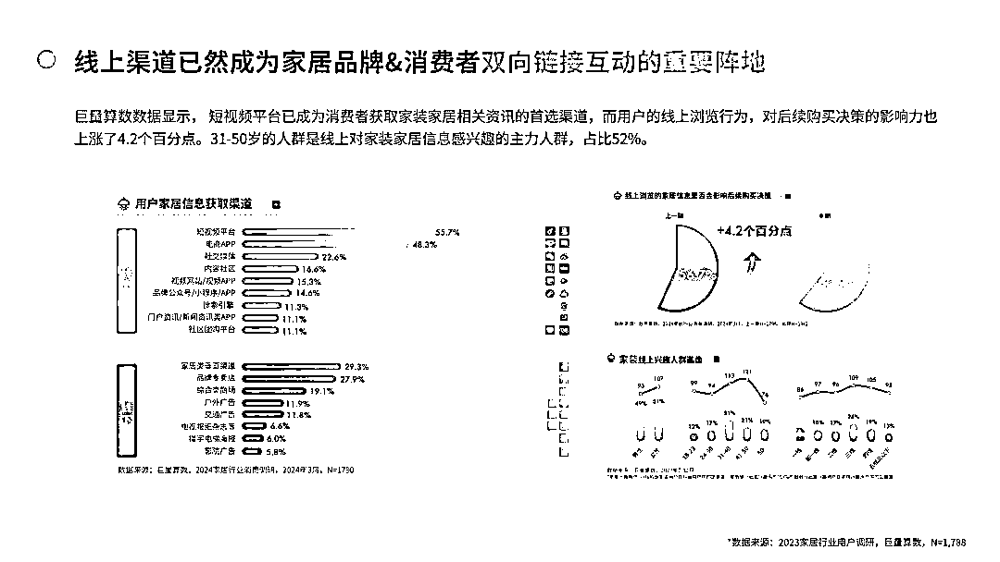

# 低付费打投放大户的赛道：家装公司吃本地生活红利

> 原文：[`www.yuque.com/for_lazy/zhoubao/pyx1n19i0465i4sl`](https://www.yuque.com/for_lazy/zhoubao/pyx1n19i0465i4sl)

## (10 赞)低付费打投放大户的赛道：家装公司吃本地生活红利

作者： 楚川

日期：2024-12-02

**Part1**

**家装行业内卷，急需流量新渠道**

2024 年开始找到楚川的家装公司越来越多，并不是因为我们在家装赛道拿到了大结果，而是这个行业到了极度内卷，不得不变的节点，有能力自救的家装公司都在出来找新的流量洼地和机会。

在跟超过 50 家，且每年交付至少 300 套的家装公司深度沟通才知道这是一个要么被流量裹挟、要么被渠道绑架，想要突破无比艰难的行业。

在豪雅门窗和南北旺全铝家居的服务中拿到阶段性的结果后，但行业其他品牌面对流量响应速度极慢，我们意识到家装赛道在自媒体的二次转型已经慢了一步，导致陷入“价格内卷，成本上升”的困境。

下文将对家装自媒体二次增长做深度分析，一家之言，仅供参考。

此前文章：[建材行业如何找到第二增长点？门窗工厂云连锁增长复盘](https://articles.zsxq.com/id_feb760rkrabg.html)

**Part2**

**我们在分析家装市场环境的时候，认为家装必须拥抱短视频，拥抱自媒体，不然就会无路可走。**

**主要从 3 个层面可以看出家装公司当下的困境。**

**第一，近 3 年有家装存量用户的互联网大平台下场装修赛道。**

以贝壳成立被窝家装，先后收购圣都家装、爱空间，成为首个破百亿营收的家装公司；其次阿里巴巴、字节跳动和京东都在布局和下场家装赛道，瞄准这个千亿以上的蛋糕。所以中腰部家装公司的正常生产空间会在未来 2-3 年被大平台严重挤压，过去简单的买流量生意会很快走到尽头。

**第二，互联网获客成本上升，短视频本地生活流量处于绝对红利期。**

楚川了解到家装公司正常拓客渠道基本上分为线上（百度、抖音、小红书、腾讯系等平台信息流和表单）、线下（公交车、电梯和广告牌等户外广告），以及少部分电台、电视频道的布局，其中三线及以上城市的单个成交成本在 1.5 万元以上，并且这个成本会逐渐上升。

广州无忧美装的公交车广告

在跟华东、华南区域的家装公司老板交流的结果是：

他们都知道自媒体的下半场是真正做内容的拼杀，但团队受限于专业度、没有耐心的问题，一直无法下定决心在短视频中有突破。

目前做信息流为主的商业化流量投放是很简单的线索买卖，当下还能做，到后面这条路不通再想其他办法。

**这其中断层的信息差在于家装公司的老板和团队没有真正意识到抖音为主的平台，推出的本地生活的红利点。过去靠信息流投放的痛点是无法形成品牌势能，只能用实体广告来做品宣。**

**不少老板在做 IP 的阶段也已经发现流量太泛，本区域的流量占比过低，营销效率大打折扣。**

**然而抖音本地生活是以区域流量为核心的算法，天然适合“线上导流、线下成交”的逻辑。**

据统计，2024 年一季度，短视频平台已经成为获取家装家居资讯的首要渠道，**用户比例超过 60%。**

今年上半年，“家装家居”关键词在短视频平台的搜索量同比上涨 6 倍，“全屋定制”的话题内容播放量更是高达 231.3 亿次。这些数据增长的背后，不仅有用户兴趣习惯的改变，更离不开家装家居品牌厂家丰富的内容创作。

**这个细微的变化可带来的行业巨变没有进入到家装品牌老板的视野，未来增量极度性感。**

**第三，家装消费人群发生变化，必须要在自媒体平台触达用户。**

家装家居消费群体在 35 岁以下占比超过 60%，在自媒体平台获取装修信息超过 70%，年轻一代已经成为中国家居消费的主流客户群体，在自媒体触达用户这已经不是要不要做的问题，而是必做项。

也就是说，短视频正在成为家装家居品牌和消费者“双向奔赴”的最主要阵地。

**Part3**

**家装公司的成交成本逐月上涨，过去闭眼赚钱的时代已经过去。**

**用户获取家装家居信息透明化的时代，就代表要真正以用户为中心，降低营销成本和提高成交效率，这是核心突破点。**

**第一，从大环境看消费降级的群体会捂紧钱包、谨慎消费，直接导致毛利缩减。**

从营销逻辑上看就无法从简单的互联网买线索来做这个生意，因为短视频和表单触达到的人群需求是不精确的，那会直接导致成交效率下降，营销成本也上升，让生意没法持续。

家装公司要切本地生活的流量原因也在于此，从区域开始做营销，人群数有上限、流量存在 2-3 年红利、打法更匹配，成本可控。

**短视频矩阵铺天盖地做人群覆盖，自然流量和搜索流量筛选出高精准客户，之后在区域海量内容的基数上用本地推和直播放量，****基本上能把成交成本降低到原有的 50-60%，甚至更低。**

本地生活基于门店定位的流量推荐机制，在短视频累积到 2 万条以上后能有 1 年以上的长尾效果，对于家装公司属于非一锤子买卖的流量。

**第二，家装家居消费新群体有独特消费需求，短视频触达方式和内容是生意命脉。**

过去消费者对装修有信息差，面对货不对板和服务前后差异基本都息事宁人。当下家装家居消费群体基本上为互联网原住民，可接触到海量的装修信息和资讯，会快速判断家装公司的实力和服务，也具备其他候选公司的能力。

**所以在短视频的内容上要真正下功夫，而非简单投放了事。**

我们在服务 6000 多家实体企业的时候发现抖音付费用户有 80%以上是新用户，就代表这是在图文时代、付费短视频阶段没有触达到的用户。

**抖音本地生活流量中，品牌面对都是全新的客户，对家装品牌完全陌生的用户，只能靠短视频去判断公司好坏，那就说明品牌要在自媒体跟这群人对话，投射你们的服务和产品力！**

**把过去在线下广告和销售的能量放到本地生活流量池** ，真正打动用户，让他们知道你们的产品和服务是能够给到他们确切答案。

**解决这两个问题，家装公司能在本地生活赛道中再次腾飞。**

**Part4**

**家装公司要在本地生活中真正用短视频拿到结果，未来 2-3 年有可持续增长，就必须要全员拥抱短视频。**

**怎么理解全员转型、拥抱短视频？**

过去短视频信息流投放、品牌 IP 只代表我们在做抖音，这件事大概率跟 90%人没关系，持续拿结果的可能极低。

随着本地生活流量权重的提升，不少公司都建立全员营销发短视频的体系，那就说明家装公司必须是从老板、高管、设计师、工程部都要拥抱短视频，参与做短视频、发短视频，与消费者建立长期线上的链接和沟通。全员进入消费者的阵地，消费者在哪里，服务者就应该在哪里。

**举例一个 100 人的家装公司，****每人每天发短视频 5 条，半年的视频量就是 9 万条，播放量必定是千万级，** 用这种铺天盖地的方式在区域 *持续让人知道你是谁，能提供什么样的产品和服务，消费者选择你的可能性就提升了。*

**抖音是一个无限发传单的媒介，这是品牌持续有占有率的第一站；小红书和哔哩哔哩是在单平台增长平稳额外拓展的平台，吃余利。只有这样家装公司才能抓到自媒体平台下半场红利。**

**最后，人会重新回到实体店，所以线上-线下一体化，流量信任的货币要到线下体验店做到持续传递。**

我们在自媒体平台的海量信息取得消费者的信任后，能够邀约到店就代表要充分尊重客户，避免线上-线下的落差。

这个过程线下的成交场域，如销售、展厅、环境、合同等都要做到丝滑才能真正让成交成本下降。

* * *

评论区：

暂无评论