# 美元换 RMB 攻略：100 刀换 900+毛爷爷，实操测试无手续费，汇率优秀

> 原文：[`www.yuque.com/for_lazy/zhoubao/etyw7m3iwc2vbz6o`](https://www.yuque.com/for_lazy/zhoubao/etyw7m3iwc2vbz6o)

## (34 赞)美元换 RMB 攻略：100 刀换 900+毛爷爷，实操测试无手续费，汇率优秀

作者： 国民弟弟的跨境十年

日期：2024-12-05

太牛了，白赚 200,100 刀换 900+毛爷爷

美元换 RMB 攻略，已经试过，很靠谱~

偶尔还是会有给中国家人或朋友发钱的需求，也试过不同的平台，大部分汇率不怎么好或者不安全。

最近看到有人用 lemfi 觉得不错，自己转了一次，白嫖了 200+，后续有需求也能用的上。

实操测试汇款 100 美金到国内支付宝，真的是一分钟入账，而且没有任何手续费，汇率也非常优秀，100 美金实际到账支付宝 733.26 元，如下图所示。

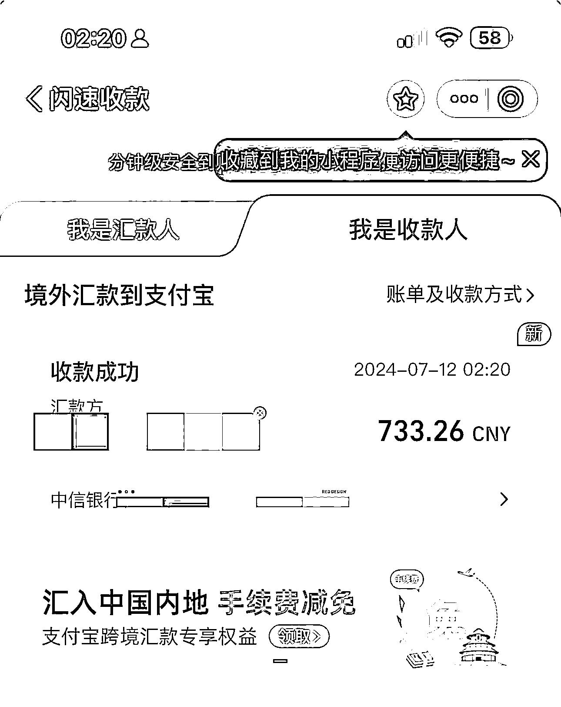

然后在汇款 100 美金完成后，第二天还得到了官方的 30 美元奖励，顺便也直接汇款到支付宝了，如下图所示。

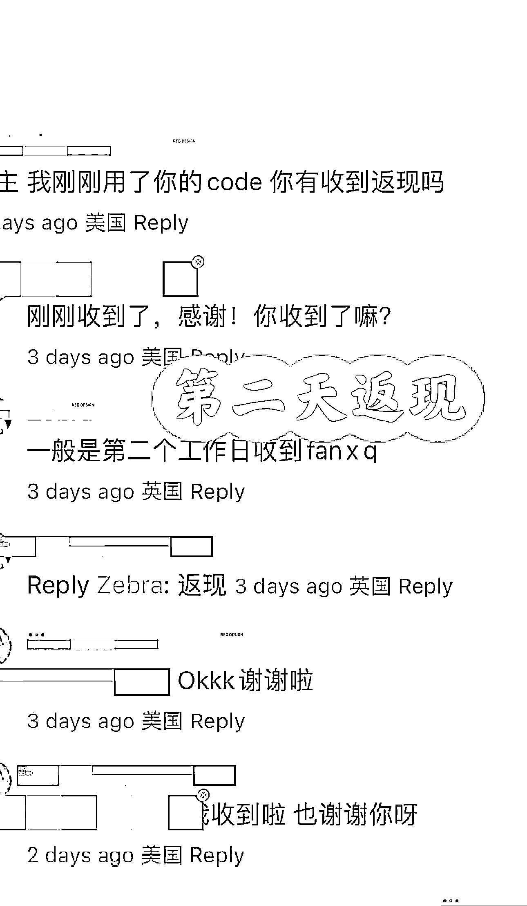

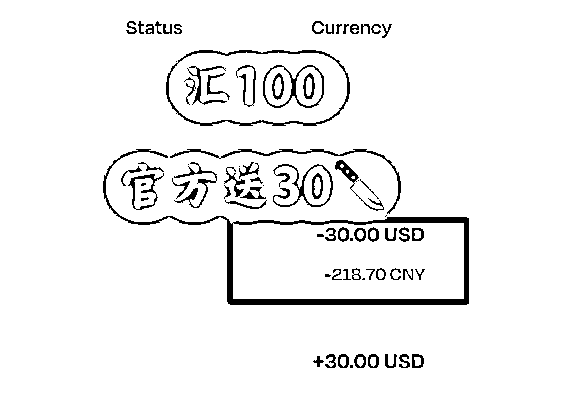

操作也是非常的简单，中国大陆身份就可以；不需要美国个人税号 ITIN、SSN 等等~

**整体体验如下：**

1-汇率超级好，比谷歌汇率还高 0.02

2-无手续费

3-官方入账，安全稳定

4-一分钟入账

5-用我推荐 CODE 送 30 刀

**操作流程**

手机复制下方链接在浏览器打开，或者手机上直接下载 lemfi 的 APP 软件，苹果手机需要海外的苹果 ID。

[`lemonadefi.app.link/Xo8jr1tg4Ob`](https://lemonadefi.app.link/Xo8jr1tg4Ob)

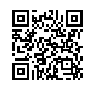

电脑版

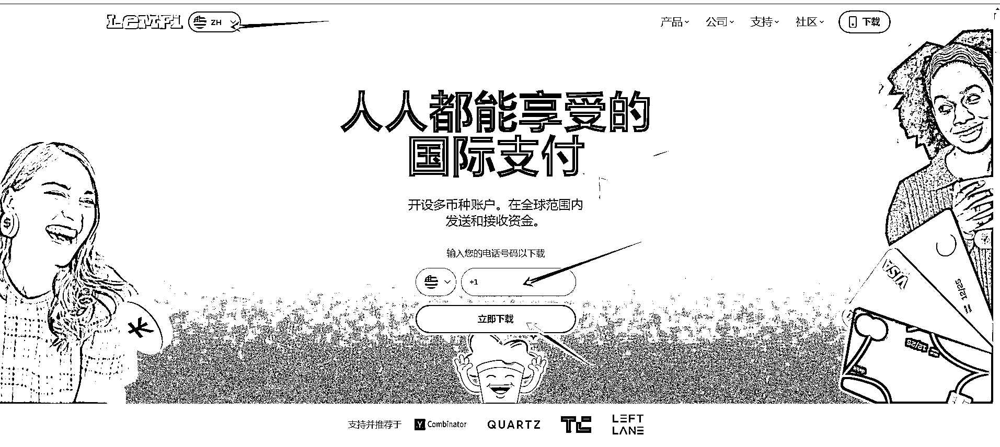

手机版

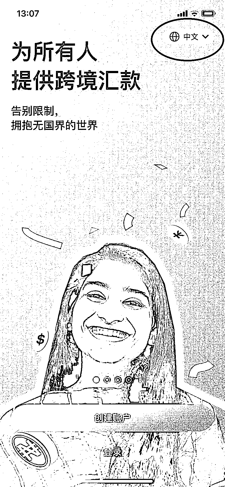

接着打开手机上下载安装好的“lemfi”的 APP 软件，如上图所示可以把右上角的语言设置为中文，这样大家可能看着更方便一些。

**第一步：** 选择国家，输入该国家的手机号，这里就用我的美国实体电话卡演示，建议用自己海外实体电话卡。​

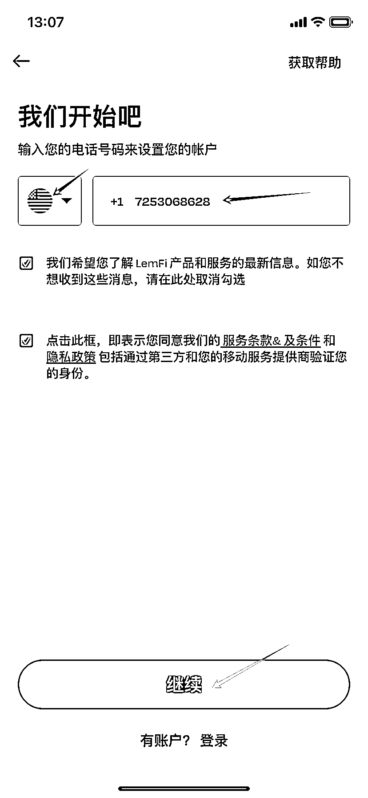

接收输入短信验证码。

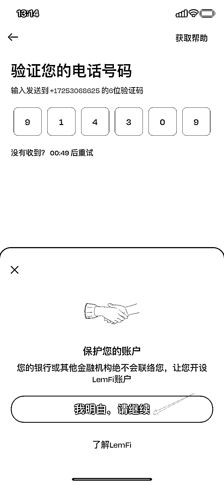

**第二步：** 输入我们的一些基本信息。

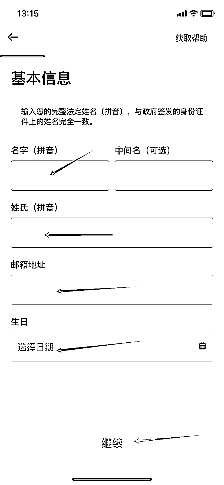

**第三步：** 输入我们的地址，我这里就输入我美国居住的地址信息了（目前是无需地址证明的）。

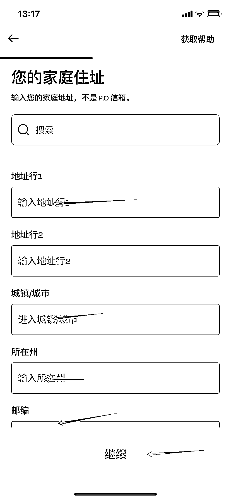

**第四步：** 设置我们的账号密码。

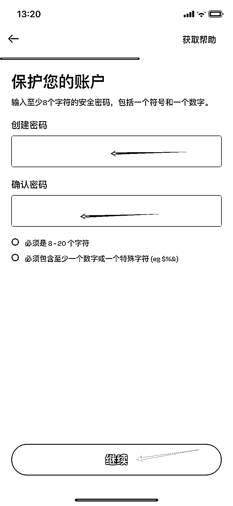

**第五步：** 也是非常重要的地方！！！

一定要记得填写**邀请码“SIRYULQV”** ，这样在首次汇款 100 美金后，才有 30 美金的现金奖励。

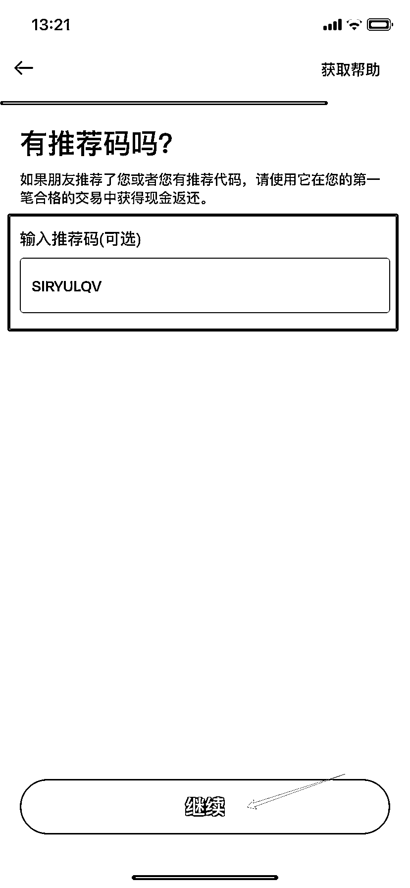

**第六步：** 选择一下我们经常把款汇往哪个国家或地区，我这里选择的是中国区。

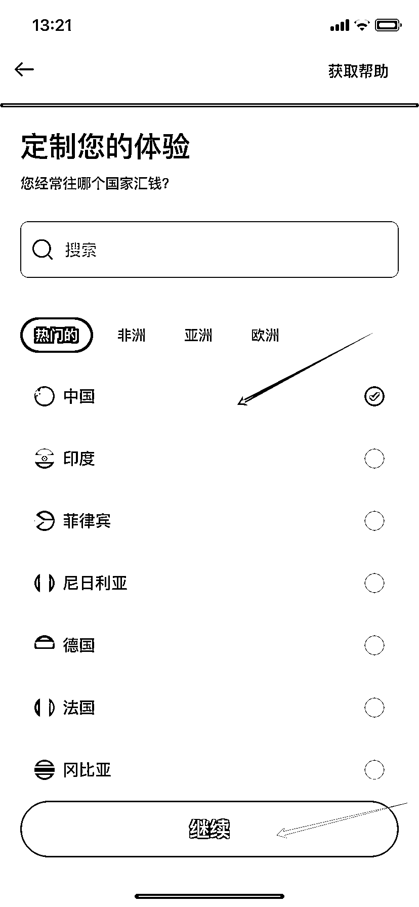

**最后一步：** 验证一下我们的邮箱，去邮箱找到验证邮件，点击里面的链接即可，非常简单。

这样账号的初步注册完成了~

接着我们再验证一下我们的身份信息，弄完这个就可以进行汇款操作了，也非常简单，配合扫描护照，完成一个简单的人脸验证就可以了。

工作日等待大概 24 小时就会审核通过了，如果你是下午傍晚提交的，审核可能会快一些，时差原因，基本上都是美国工作时间才有人审核。

**如何汇款**

审核通过后就可以开始汇款操作，每个月的汇款额度为 1000 美元。如果当月汇款金额超过 1000 美元，就需要补充提供美国个人税号（ITIN）才能继续汇款。这是为了符合美国税务规定，保障资金合法合规汇出。如果暂时没有 ITIN，建议提前申请或合理规划每月汇款金额，避免因为超额而耽误资金转账。

其实大部分人可能一个月不会超过 1000 美金，所以不补充 ITIN 也够用了。

我们要汇款的话，需要先把款项充值到这个 lemfi 里面，如下图所示点击“充值”按钮，用借记卡就可以。

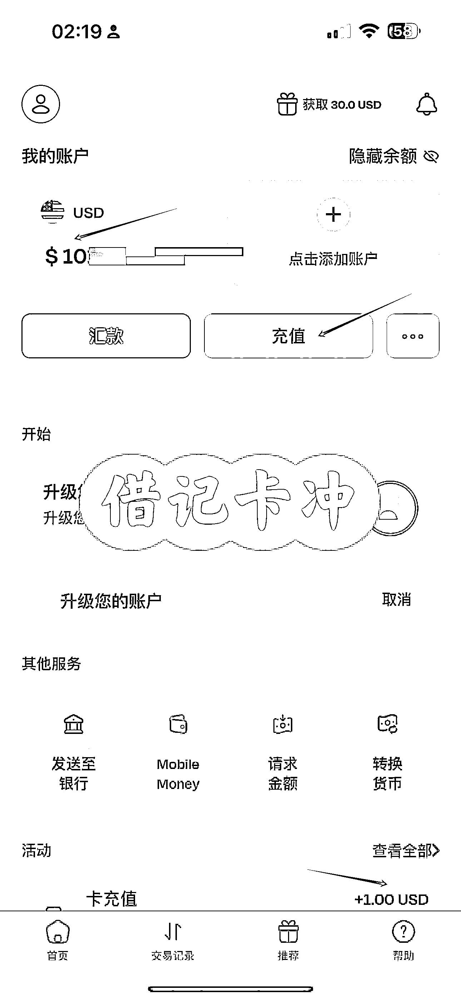

充值成功后，接着我们开始进行汇款，这里按汇款 100 美元到国内我的支付宝账户为例演示。

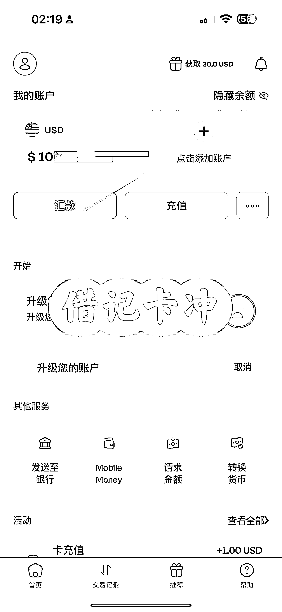

按照提示添加收款人信息等，10 秒就能完成汇款。

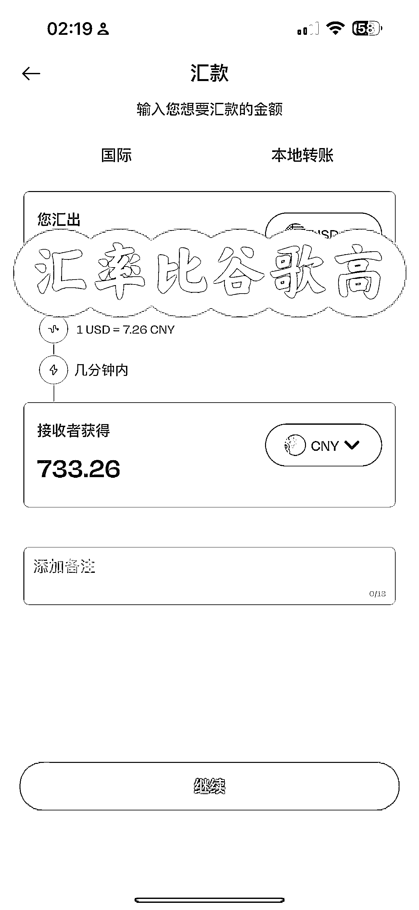

接着我们立马就会收到支付宝的跨境到账短信，首次需要我们去支付宝手动设置一下收款人信息，以后就会自动入账到我们支付宝余额。

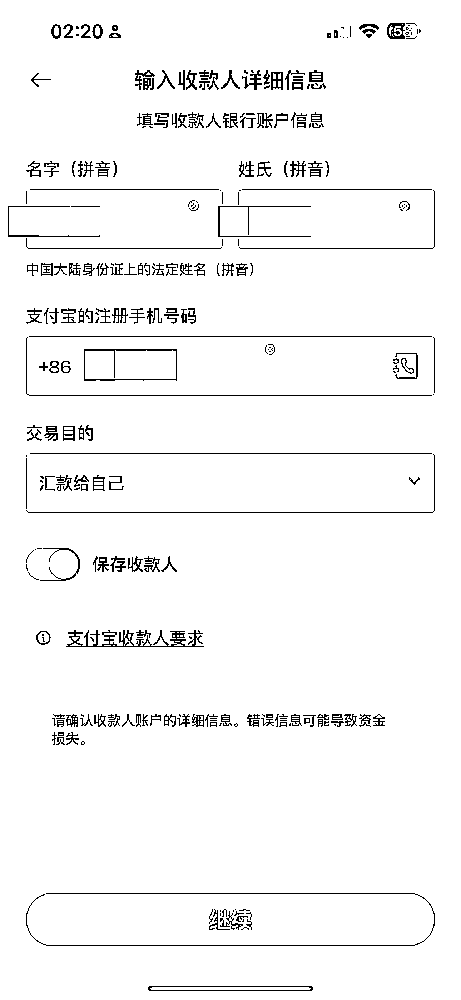

进入支付宝搜索“闪速收款”，就可以查账了。

汇款 100 美金达到任务要求后，最晚第二天也会收到官方返现 30 美金的奖励，这是实打实的奖励，直接把 30 美金直接继续免费汇款到我国内的支付宝。

这就是大概的整个操作过程，整个门槛还是相当低的。

以上~

**国民弟弟相关创业的故事文章推荐：**

[`articles.zsxq.com/id_8n2o7gax71fr.html`](https://articles.zsxq.com/id_8n2o7gax71fr.html)

* * *

评论区：

Yankee 阳基 : 怎么弄一张国外实体电话卡呢

公子李 : 怎么弄一张国外实体电话卡呢

Grace : 万能的淘宝

Grace : 万能的淘宝，搜索“美国紫卡，月租 3 刀每月”

国民弟弟的跨境十年 : 某宝搜索“跨境 2024”dian

国民弟弟的跨境十年 : 在某宝搜索“跨境 2024”Dian

Queenie : 这是 lemfi 广告主吗[666]