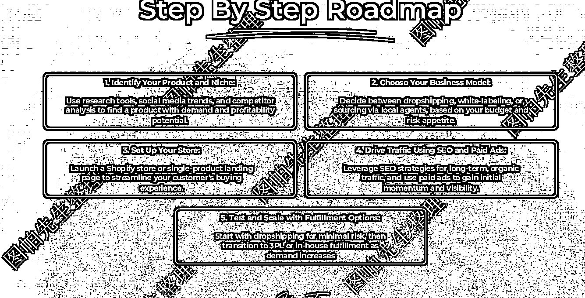
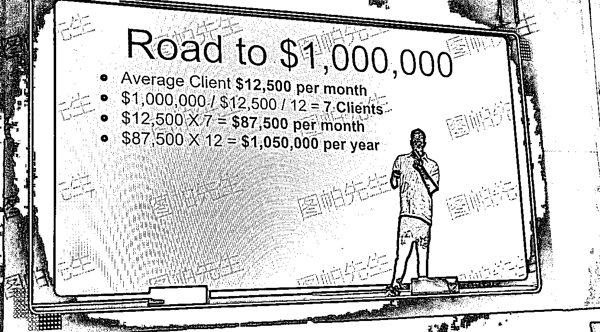

# 年度 CMSEO 大会回顾：Kyle Roof 探讨蝴蝶记忆与 SEO 优化

> 原文：[`www.yuque.com/for_lazy/zhoubao/otrhu9gq2rf4g41g`](https://www.yuque.com/for_lazy/zhoubao/otrhu9gq2rf4g41g)

## (23 赞)年度 CMSEO 大会回顾：Kyle Roof 探讨蝴蝶记忆与 SEO 优化

作者： 图帕先生

日期：2024-12-03

年一度的 CMSEO 大会已经过去了，跟 2023 年的大会总结一样，图帕先生给大家介绍下大会讲了什么，还有分享嘉宾的 PPT。一万多字，废话不多说，上菜！

ps: 不知道是灯光、手机还是字体原因，拍的相片都很模糊，所以中间会照片+ppt 来分享内容（有些嘉宾 ppt 不公开的就没有了）

### **Kyle Roof：Does The Butterfly Remember? Training Your Brain For Better

SEO Outcomes**

Kyle 是老朋友了，同样一贯他测试狂的风格，分享了很多有趣的测试结果，有些连他自己都吓一跳，而且一些测试结果也打了自己的脸。

自从养了长头发后，有人说他像 jack black（功夫熊猫的配音演员），看看其实还挺像

首先他劝我们不要陷入一个迷思：

**①为什么要做 XX？**

**因为我说了，别人也这么说**

这种思维属于逻辑上的“权威诉求”，即只因某位权威人物或专家如此说，就认为这一说法是对的。这种论据缺乏必要的实证支持，不论是谷歌的发言、行业大佬的声明，还是某个著名公司的案例分析，都需要经过验证、测试和多维度分析。单纯的信任权威并不能帮助我们了解事物的真正本质或趋势。

**举例** ：一个谷歌算法更新发布后，许多 SEO 专家会说“更新之后，SEO 排名规则彻底变化了。”但实际上，这种声明并不代表真实性，除非通过深入的分析与数据对比来支持这一论点。我们应该质疑背后的证据，而不仅仅是听从某个专家或公司所说。

**还有不要迷信个例，幸存者偏差大家都听过吧。**

个例有其局限性，无法代表普遍规律。比如一个商家说“我采用了某个 SEO 策略，网站流量增长了”，这种单一案例无法有效推断该策略在所有情况下的有效性。

很多 SEO 论坛上，用户分享他们的成功经验，这些是有价值的参考，但并不能成为广泛适用的结论。我们可以通过测试、数据分析来验证这些轶事，看看它们是否能在不同的行业或网站类型中取得类似的效果。

开篇就已经两次提到了测试的重要性。

还有例如，某个 SEO 人，或者说网站吧，在某一段时间内遭遇排名波动，立即将其归因于谷歌算法更新，而没有考虑其他可能因素如网站内容质量、外部链接等。

再比如 2019 年的“core
update”后，许多同行说自己流量又大幅度的流量波动。虽然很多人将这一波动归因于更新，但通过他精确的实验分析，发现并不是所有的网站都受到了相同的影响，某些网站依然保持较为稳定的排名。这说明单一的算法更新无法全面解释网站表现的波动，可能还涉及到网站本身的内容和技术层面的优化。

像他去年分享的，他通过一些低预算的实验网站（如最经典的 Lorem
Ipsum 内容站点）进行长时间的跟踪测试，可以发现，即使在大范围的 Google 算法更新后，某些简单的站点（未优化的内容）仍能维持较好的排名。

SEO 并非一成不变，它受到多方面因素的影响。

#### **②标签与思维局限**

我们基本都会用标签来管理我们的文档、用户，甚至给自己和别人打标签。

虽然标签帮助我们对事物进行快速分类和整理，但它也容易导致思维的狭隘。例如，当我们给自己或他人贴上“SEO 专家”的标签时，往往会局限于一个特定的领域，而忽视了跨领域的潜力和机会。

他举例 Taylor
Walker 就是一个打破标签限制的典型例子，起初他在 SEO 领域表现突出，但后来他也涉足 YouTube 内容创作，并取得了很大的成功。他没有让“SEO 专家”这个标签束缚自己的发展，而是根据市场需求和个人兴趣做出了转型。

行业内的许多人始终活在自己的标签中，例如某些“企业咨询师”可能固守传统的市场定位，而忽视了新兴的商业模式或技术。通过开放自己的思维，结合新的商业趋势，他们或许能够发现新的增长点。

#### **③好奇心与批判**

批判的态度有时会导致我们过早放弃新事物的探索，特别是当一个新的理念、工具或技术出现时。批判过多往往源于对未知的恐惧，而好奇心则能够推动我们深入探索，从中发掘潜在的机遇。

Kyle 曾经对 CRO（转化率优化）持批判态度，认为这只是传统 SEO 的延伸，然而通过深入学习和实践，后来他发现 CRO 实际上与 SEO 并不冲突，反而能够为网站带来更高的转化率。

可能有人会挑刺，啊，怎么有人还不会关于 CRO？其实嘛，人总得学习心得东西，特别在互联网领域，变化特别快，一年前自己坚信的东西今年可能就打自己脸。但这不是坏事，证明自己是在不断地更新知识库，让自己的认知更加宽广。

在一些团队或公司内，批判态度可能会形成一种文化，导致创新受到抑制。例如，某些公司可能会批判 AI 写作工具的有效性，但 AI 确实能够帮助我们提升效率并找到更多创意内容源。如果没有保持开放的心态，我们可能会错过这一技术带来的进步。

甚至是结构化数据，他测试过结构化数据对排名影响不大。

这也是一个很重要的思维，比如有人说结构化数据有多重要，说的人有测试过吗？自己有测试过吗？测试的时候有控制好变量吗？等等。

人家找茬是自己去测试验证，有些人找茬是在敲键盘，哪种做法更能让人信服，不言而喻。

虽然他的测试结果不绝对，但这个思维对我们在流量和网站的优化上是十分重要的——主打一个严谨。

#### **最后提下他的演讲主题：毛毛虫与蝴蝶的隐喻**

蝴蝶会记得自己曾经是毛毛虫吗？或者蝴蝶还保留毛毛虫时的记忆吗？

毛毛虫最终蜕变成蝴蝶的过程，象征着一种深刻的变化，这种变化可能是痛苦的，但却是自然的，也是成长的必要过程。这一过程也同样适用于个人职业生涯的转型，不论是从 SEO 领域到内容创作，还是从传统业务到新的电子商务模式，转型和突破往往伴随着挑战。

这也是一个挺哲学性的思考。

约翰·洛克写过个人身份的连续性依赖于记忆的连续性。

如果蝴蝶没有毛毛虫的记忆，那么它们是否还算是同一个“自我”？或者，它们是否在蜕变的那一刻就已经“死亡”，而新生的蝴蝶是一个新的存在？

大家晚上睡不着也可以思考一下~

而生物学上的论文我也找了一篇，还挺有趣，分享一下

[`journals.plos.org/plosone/article?id=10.1371/journal.pone.0001736`](https://journals.plos.org/plosone/article?id=10.1371/journal.pone.0001736)

这里再分享一下个人的想法，Kyle 今年的分享节奏和演讲状态感觉都比去年要要差，有种说不出的违和感。后面终于知道了，他说他离了婚，还有了轻度抑郁，在接受心理治疗。

他也说了，seo 可能是一个很孤独的行业，很多 seo 从业者都是默默的做事、默默承受算法带来的压力，虽然收入是不错，在外面也做演讲嘉宾，但不代表心理就是健康的，当然其他行业也很可能是这样。他鼓励观众如果有什么事想倾诉的，可以随时找他。

我觉得这是 Kyle 非常有人情味的一小段分享，因为我们其实都承受着不同的压力，哪怕自己在别人面前展示得有多自在。而且心理疾病就像发烧感冒，是非常正常的病，不需要妖魔化，也不需要自欺欺人，如果觉得自己有不适，真的需要去看看专业医生，不能畏疾忌医。

**Koray Tugberk：Patents, Leaks & Rankings: Decoding The Blind Librarian**

Koray 也是测试狂，但更偏向技术，从演讲主题可见一斑：涉及谷歌专利和排名泄露的分析。这里也就简单介绍下，因为里面涉及的专利和文档暂时没时间去一一探讨。而且他的 ppt 不公开，记笔记的时候也因为全心在理解上下文，错过了拍照时机，所以只能发几张挺模糊的照片凑数，但通过笔记图帕先生还是尽可能地总结出里面有意思的部分。

也由于没有他的 ppt，我无法找到对应的谷歌文档去加强理解，而且也不能保证完全理解 Koray 提到的专业术语，所以笔记部分肯定会有跟嘉宾原意有出入，后面看看能不能再找到。

这部分请大家多多见谅。

对他的风格感兴趣，有条件的可以蹲蹲他的课程：[`www.topicalauthority.digital/`](https://www.topicalauthority.digital/)

为优化排名，Koray 尝试过多种方法，甚至对竞争对手进行 ddos 攻击。

但发现攻击竞争对手反而提升了他们的排名，攻击自己时，自身排名也提高了

——听着的时候我也觉得哭笑不得

他提出谷歌其实无法理解网页内容，就像一个盲人图书馆，其功能是将书（网页）正确摆放在书架上（排序算法）。

而翻查谷歌专利的意义就在于它们能帮助我们理解搜索引擎工作方式。

对关键词优化与索引优化都有直接的启示。

比如测试下新页面放在不同的位置，效果是否有所不同：

#### **检索成本与排名：**

多主题内容的网站会因高检索成本被降权。单一主题网站更容易获得排名优势。

——也就是建议网站内容不要太杂。

他将一个有 5000 万个 URL 的网站被精简后，网站性能显著提升，响应时间控制在 100 毫秒内，而且排名也有改善。

减少网站冗余，能明显提高整体效果。无需发布新内容，通过提高响应时间获得更高排名。

#### **谷歌的专利也明确，用户行为与 seo 的关系巨大：**

1.  谷歌通过监控用户行为（点击、滚动、鼠标移动等）评估内容质量。

2.  但短时间的点击不一定是负面信号，视用户意图而定。

3.  而且会评估页面核心部分的质量（如前 400 字符）。

4.  谷歌不仅看内容的最新版本，还会往前滚，看前 19 个版本的内容质量。

### **内容策略：**

1.  高质量的内容应当集中呈现。

2.  避免无关主题干扰网站整体排名。

3.  使用内部链接优化页面间的信号传递。

4.  通过隐藏不必要的链接减少谷歌抓取负担。

5.  遵循“持续发布”原则，每次更新保证高质量与相关性。

6.  平衡短期热点内容与长期内容的产出。

7.  同时优化外链与内链权重分布，创造更稳定的排名基础。

8.  减少冗余操作（如无效链接和不必要页面生成），避免触发惩罚机制。

9.  优化现有内容而非无限扩展页面数量。

后面发现好多相片都和很糊，放了等于没放，就直接展示成文字版了

### **Tim Soulo：Long Time No See. Here's What's New At Ahrefs**

直接看 ppt 吧，赞助商 ahrefs 的布道时间，不多介绍了

【腾讯文档】Tim-Soulo-CMSEO2024

[`docs.qq.com/pdf/DSHpNWEtVTFVHVHZV?`](https://docs.qq.com/pdf/DSHpNWEtVTFVHVHZV)

### **From Clicks To Commerce: How SEO Experts Can Dominate eCommerce**

Steve 的内容，hmmm，怎么说了，可能因为我本来就是在电商领域，所以他说的东西个人感觉是太基本了，而且没多少涉及真正关于电商 seo 的具体操作或测试结果。这里简单带过吧

选品思路：

季节性产品、趋势驱动型产品（可以在 tiktok、facebook、抖音上找）

一些趋势产品，比如指尖陀螺，也有 seo 机会

扩量就是广告+SEO

电子商务模式：

dropshipping：无需持有库存，直接从供应商发货给客户。

白牌：从供应商订购产品，贴上自己的品牌标签销售。

产品研究与选择：

利用 AliExpress、亚马逊、TikTok、pipi ads、mines spy 等平台工具进行产品研究。

营销与路线图：

确定产品和商业模式，设置商店，增加流量，用广告测试产品市场契合度，长期流量做 seo。

**Nick Eubanks: How To Build Digital Assets I Can't Wait to Buy**

Nick 是 semrush owned media 的 VP，分享了他收购其他公司业务的心得，也分享了一些如何抓住业务机会的思路。

内容通俗易懂，就没怎么做笔记了，大家可以直接看看 ppt

【腾讯文档】Nick-Eubanks-CMSEO2024

[`docs.qq.com/pdf/DSHNqVG93T3RyWnp1`](https://docs.qq.com/pdf/DSHNqVG93T3RyWnp1)

**Koen Bongers： SEO Game Theory: Parallels Between SEO & Poker**

Koen 老哥上台拿着瓶啤酒边讲边喝，十分豪迈。这份豪迈感觉不少是因为他的经济自信，chill 得不得了，在最后展示自己联系方式的时候，也是大方说明加他后不要推销自己的任何服务，可以简单打招呼或投个简历，因为他在招人。

Koen 把扑克和 seo 结合在一起，是个十分有趣的类比和思路

#### **1****.** **SEO 与扑克的相似点**

● **概率思维** ：提前预判可能的结果及其对应收益——seo 里我理解为关键词难度的判断和投产比的计算。

● **决策树分析** ：评估每个决策带来的影响，并选择最优路径——seo 里我理解为内容、外链、网站优化的优先级。

● **抗压能力** ：面对波动时保持冷静，重新调整策略——就是算法波动你 hold 不 hold 得住。

#### **期望值计算（EV）在 SEO 中的应用：**

在扑克中，"期望值（EV）"公式帮助玩家判断是否值得下注。同样，在 SEO 中，这种计算框架可以用来评估以下问题：

● 是否值得进入一个全新的市场？

● 特定关键词的竞争是否带来更高的转化率？

● 页面优化的投入是否能带来预期收益？

例如，当一个网站的流量趋势逐步下滑时，与其盲目投入资源，正确的选择可能是停止该项目，转而优化其他资源。

### **SEO 中的常见误区与优化策略：**

#### **1****.** **“玩得太松” vs. 专注优化**

SEO 中的“玩得太松”表现在：

● **内容泛滥** ：大量发布低质量内容，而非专注于核心页面优化。

● **项目分散** ：同时操作过多网站，资源分配失衡。

**解决方案** ：

● 聚焦更新高价值页面，例如年度流量贡献最大的 10%页面。

● 制定清晰的内容更新计划，确保内容的时效性与相关性。

#### **2****.** **“赌注太高” vs. 理性投入**

比如：

● 在竞争极为激烈的领域启动新网站，却没有明确的流量或收入基础。

● 继续投资已经没什么希望的项目，但沉没成本过高导致自己不想放弃。

**优化策略** ：

● 通过核心数据（如 Google Trends、人口和 GDP 指标）评估市场潜力，优先布局高性价比的目标区域。

● 根据网站健康状态，及时剔除表现差的页面或子项目，将资源转向增长潜力大的领域。

#### **3****.** **不适应游戏规则**

SEO 规则如同扑克的游戏模式，变化随时发生，及时调整策略至关重要。例如：

● 针对谷歌的算法更新，密切关注权威性、内容相关性及用户信任度指标。

● 对于社交媒体流量源的突然排名变化，快速响应，例如利用 AI 生成内容抢占短期优势。

### **高效执行与团队扩展：**

#### **1****.** **小细节的效率提升**

在 SEO 工作中，微小的时间优化也能带来显著的长远回报：

● 提高打字速度，每年可节省**数十小时** 用于核心任务。

● 利用浏览器书签和插件自动执行常用操作（如 Ahrefs 域名检查）。

#### **2****.** **自动化与仪表盘管理**

通过数据可视化提升决策效率：

● 将 GA（Google Analytics）和 GSC（Google Search Console）数据导入 BigQuery，实现一键更新报告和自定义报表。

● 甚至是实现跨域名的排名追踪、流量增减及内容表现的报表。

#### **3****.** **团队分工与外包**

他从单人团队到 170 人规模的跨国团队，核心在于：

● 相信同事的工作：减少对开发、内容编辑等基础事务的直接干预。

● 招聘专业人才，专注于自己领域核心增长和优化的岗位，其他的可以外包都外包。

最后他分享了他对 SEO 的未来趋势的看法

谷歌的算法正朝着**整体权威** 方向发展，这意味着：

● 权威性强的平台（如《福布斯》、《华尔街日报》）将更具竞争力。

● 小型网站应以**垂直化、专业化** 为突破口，通过高质量内容与用户信任度实现突围。

SEO 的成败在于衡量每项投入的回报，避免盲目扩张，减少资源浪费。

要打造自己竞争壁垒，就算花钱买客座博客、提高网站权重，还是比较容易被追赶，建立好品牌知名度，想办法提高利润率才是最高的壁垒。

可以根据自己不同情况去提高自己的竞争力，比如：

低预算想激进：AI 内容、买过期域名、关键词匹配的域名；

低预算又想积极做点什么：做寄生虫外链、打长尾词、运营下功夫

高预算想激进：PBN

高预算想积极点：品牌建设、做产品 SEO

Koen 这种交叉学科思维我是非常喜欢的，而且也不妨大胆的说，自己也挺擅长这种思维。

比如之前分享的我是如何不用一条外链把关键词排到第一

里面我就说，seo 跟健身非常像，seo 无非是内容和外链，而健身无非是锻炼和吃，人人都听得懂，但不是人人都能坚持下去。seo 有快速的灰帽或白帽玩法，而健身也各种激素来加速成效，但后果还是得自己承受。

## **Travis Jamison：How To Stay Rich**

Travis 教你如何理财。

他是投资者、Smash Digital 的创始人

顾名思义，是对于真正 rich 的老板的演讲，对于我们这种还在上班、还房贷车贷的小弟弟，算是看个乐呵。当然，像 Koen 把打牌和 Seo 结合去思考，我们也可以把财富管理的思路运营到自己的业务里面。

先说演讲内容：

开场他说在场多数人已实现或即将实现财富积累。

发财后，保持财富是更重要且少被提及的技能。他也看到过很多凭运气赚钱但靠实力亏钱的案例。大致的流程会像这样：

创业初期的不确定性、长时间投入、导致身体和心理压力>

公司成功后实现财务自由的欣喜>

一个错误的决策可能导致财富归零。

他分享了一个警示性非常大的案例：

一位朋友因听信内幕信息，将积累的 1100 万美元投资于 Terra Luna 项目。

结果：项目崩盘，财富归零。

● 教训就是：

发财和保持财富是完全不同的技能。

而错误决策和过度自信是财富损失的重要原因。

### **那该如何保持财富？**

#### **多元化投资**

● 但多元化投资也有不适用的时候，比如：

○ 过度依赖单一领域或相关性高的资产（如商品类投资）。

○ 例如，巴西富豪艾克·巴蒂斯塔因商品市场波动破产。

而我们的流量或者运营也需要多元，不能死磕一种渠道，或者死磕一种运营模式

#### **投资策略框架**

● **避免集中风险** ：

○ 不要将资产过度集中于一个国家、行业或个人技能相关的领域。

● **分散到非相关领域** ：

○ 例如：将线上业务（如 SEO、FBA）扩展到线下（如房地产、农业、制造业）。

● **杠铃策略** ：

○ 在高风险和低风险之间平衡，避免中等风险的投资。

○ 例如：部分资金用于“保本”，其余资金冒险性投资。

而在经济下行时期，如果我要投入到避险资产（如黄金、债券），就要先分析它们在不同经济周期中的表现。

### **Ross Hudgens: Data-Driven Lessons From 12+ Years Of Content-Led SEO**

Ross 是我个人非常喜欢的部分，因为是最贴切自己的业务，可操作性也非常高。

对于新手，可用性非常高，对于老手，也能在对自己已有的知识点进行补充。

### **顶部导航优化**

● **Sticky Navigation 设计即** 一种固定导航条的方式，通常应用于网页顶部。用户在浏览页面时，无论如何滚动，导航条都能保持在视窗内。该设计通常有助于提高网站的易用性，尤其是在内容较长的页面中，用户无需滚动回到顶部就能继续进行操作，如跳转到其他页面或点击某些按钮。

例如，**电商网站** 上，购物车按钮、搜索框和分类菜单常常设计为粘性小睡形式。这样，当用户浏览产品时，始终可以方便地进行搜索或查看购物车，从而提升转化率。

● **导航优化与用户体验** ：固定导航不仅仅是为了方便用户操作，还是为了提高用户粘性。他可以让用户在进行多步操作时（例如从首页到产品详情页，再到结算页面）能保持清晰的操作路径。比如一个购物网站，当用户在产品页面时，购物车和支付按钮始终可见，就能大大提高用户完成购买的几率。

● **CTA** ：设计时要确保**CTA 按钮** 具有高可点击性。通过调整按钮的**大小、颜色、文字内容** 和位置，能够有效地吸引用户进行互动。例如，如果是一个促销活动页面，按钮上可以写上“立即抢购”或“限时折扣”，并放置在页面的显眼位置，如右上角。这样能有效提高用户点击的概率，进而提高转化率。

### **站内导航和内容整合：**

● **博客与主站内容的关联** ：如果没有在主站导航中突出博客内容，搜索引擎可能会忽视博客的 SEO 价值。博客的内容丰富，且更新频繁，这对提升网站的权重非常有利，因此，将博客内容与网站的其他部分整合，能够提升整个网站的 SEO 表现。

比如，一个提供金融咨询服务的网站，如果将其“最新动态”或“知识库”部分放入网站顶部导航栏中，用户可以更容易地看到相关的文章或指南，这有助于提高页面的索引率并增加内容的曝光率。

● **内链和内容互联** ：博客内容与主站其他页面之间的内链也非常重要。通过在博客文章中嵌入指向服务页面、产品页面的链接，能够有效提升相关页面的权重。例如，在讲解某个金融投资策略的博客文章中，可以链接到网站的“投资服务”页面，既能提供有价值的信息，又能增加相关页面的流量和 SEO 排名。

● **关键词整合** ：在博客内容中合理嵌入关键字，并确保每篇文章都有指向主站其他相关页面的内部链接，能大幅度提升该页面的 SEO 价值。优化时，关键词要自然嵌入文章中，避免过度优化和关键词堆砌，以免被搜索引擎判定为“关键词填充”而遭到惩罚。

### **主图的使用：**

● **主图的作用** ：主图通常是网页上最大或者在第一位展示的图片，它能够在第一时间抓住用户的注意力。很多网站会将主图作为一个“情感触发点”或“视觉引导”，来吸引用户继续探索网页上的内容。对于电商网站，主图可以是某个热销产品或促销活动的宣传图片；对于博客类网站，可以是一个吸引人的封面。

● **图片优化** ：虽然主图能够有效吸引注意力，但过大的图片会显著影响页面加载速度，尤其是在移动设备上。为了减少影响，对图片进行**压缩** 和**优化** ，图片能够快速加载，同时保持良好的视觉效果。

● **响应式设计** ：主图需要适应不同屏幕尺寸，因此**响应式设计** 变得尤为重要。在不同设备（桌面、平板、手机）上，图片大小和显示比例需要动态调整，确保其在各设备上都能完美展示，避免图片失真或加载过慢。

● **SEO 图片优化** ：除了图像的质量和加载速度，图像的**alt 标签** 也是 SEO 优化中的一个重要因素。为每张主图添加相关的 alt 标签，并自然嵌入关键词，能帮助搜索引擎理解图片的内容。

### **内容推荐**

● **内容推荐逻辑** ：设置一个良好的内容推荐逻辑能够根据用户的行为推送相关内容，从而提高用户停留时间，提高网站的粘性。常见的推荐方式包括基于**相似内容** 推荐（如“相关文章”）、**个性化推荐** （如“你可能喜欢”）以及基于**热度** 推荐（如“热门文章”）。

● **推荐内容的准确性** ：通过分析用户的点击行为、浏览历史、以及对不同内容的互动情况，可以有效推测用户兴趣，以便推荐相关内容。例如，电商网站可以通过分析用户的购买历史来推荐类似的商品；博客网站则可以根据用户之前阅读的文章推荐相关主题的内容。

● **避免过多推荐** ：尽管推荐内容很有用，但**推荐内容过多** 反而可能导致用户感到信息过载，从而影响体验。因此，在设计推荐模块时，应该确保推荐内容的数量适中。一般来说，推荐内容的数量不宜超过**5-6 个** ，避免让用户感到选择过于繁琐。

● **内链优化** ：通过**内链** 的形式将页面与其他相关页面连接起来，也是提高 SEO 的一种有效方法。比如，在一篇文章的结尾部分，加入“阅读更多”或“相关链接”来引导用户浏览更多内容。这不仅有助于用户继续探索网站，也能够增加页面的权重，提高搜索引擎的抓取效率。

### **优化内容的可见性**

● **重要内容的突出显示** ：不仅仅是在首页放置最新和最重要的内容，还要通过**内容排序** 和**标签系统** 将重要的内容推送给用户。比如，在页面顶部或侧边栏展示"“推荐文章”**、** “热销产品”"等模块，可以增加这些内容的曝光度。

● **强调核心内容** ：根据用户的需求和页面的目的，强调网站的核心内容。例如，在一个教育网站上，最重要的内容可能是“课程”或“注册”，而在一个电子商务网站上，核心内容可能是“商品”或“购物车”。通过将这些内容放置在网站的显眼位置，可以确保用户在浏览时不会错过关键信息。

● **内容分发** ：通常一提到内容分发，都会只想到外链、社媒发帖，但站内的内容展示，也是有效分发的一种。

### **关键词研究**

● **长尾关键词的运用** ：长尾关键词通常搜索量较少，但竞争相对较小，且能够精确锁定目标用户。例如，一个卖健康食品的品牌，如果能针对如“无糖高蛋白健身食品”这样的长尾关键词进行优化，可以吸引到更精准的潜在顾客，这类顾客更可能转化为实际购买者。

● **关键词的多样性** ：在关键词研究时，除了关注搜索量高的主关键词，还应关注一些竞争较低但有潜力的**副关键词** 。这些副关键词虽然流量较小，但能吸引到更加精准的目标受众。

● **关键词的自然嵌入** ：关键词嵌入要自然流畅，避免过度优化。尤其是在写作博客文章时，过度重复某个关键词可能导致内容显得不自然，同时也可能被搜索引擎判定为“关键词堆砌”，从而影响 SEO 效果。

### **关键词研究的误区**

● **过度依赖搜索量** ：很多人在进行关键词研究时，只看搜索量。实际上，关键词的**竞争程度** 和**转化潜力** 更加重要。即使某个关键词的搜索量很高，但如果它竞争激烈，而且与目标受众的需求不匹配，那么它可能并不会带来很好的转化效果。

**忽视用户意图** ：在选择关键词时，不仅要看搜索量，还要了解搜索者的**意图** 。比如，用户搜索“如何减肥”可能是寻找减肥技巧，但搜索“减肥食品购买”则意味着用户已经准备好进行购买。因此，明确用户意图，有针对性地选择关键词，能提高转化率。

这点跟去年 Cyrus Shepard 的内容十分吻合

### **内容布局**

文章开篇建议使用 APPB 公式，即

引起注意、效果、预览、好处

这点其实 brian dean 用的老溜了

还有排版：

以前谷歌文档的排版也是很老套，但现在，他们也意识到了要使用不同的字体去展示

还有一个博客互动基准的参考值：

ppt 的内容更丰富，建议搭配食用。

**Stan LeLoup：Cracking YouTube For Fun & Profit In 2025**

小弟很久之前就写过 youtube seo 优化攻略，大家不妨结合来看

Stan 一开始也是说为什么要重视 youtube，什么第二大搜索引擎 bla bla，重点总结：

**YouTube 的推荐机制** ：YouTube 的推荐算法更加注重观众的观看行为，比如“观看时长”和“点击率”。如果一个视频被点击后，观众看得较久，YouTube 会认为该视频的质量较高，并向更多人推荐。

### **内容创作与观众心理：**

● **吸引点击** ：制作的视频需要一个具有吸引力的标题和缩略图，以提高点击率（CTR）。缩略图和标题的设计需要引发观众的好奇心或情感反应，比如“揭秘”、“不可错过”、“惊人”之类的词汇往往能激发观众的好奇心，增加点击率。

● **保持观看兴趣** ：视频内容本身需要足够吸引人，使得观众愿意观看下去。简单来说，就是视频的质量、节奏和吸引力要能够让观众停留更长时间，这对于 YouTube 的推荐算法非常重要。

### **油管的推荐算法与 SEO 策略的对比：**

● **推荐策略** ：

○ 推荐算法依赖于通过点击吸引观众。一旦用户点击了视频，YouTube 会根据其观看行为（如观看时长、互动等）决定是否将该视频推送给更多观众。

○ **要点** ：标题和缩略图设计至关重要。内容的创意要能够迅速抓住观众的注意力，产生强烈的情感反应（如惊讶、好奇、愤怒等），进而激发他们点击并观看。

○ 这类策略的成功往往会迅速吸引大量观众，但也可能是“短暂”性质的，流量在短期内快速增长，随着时间的推移可能会减弱，特别是在没有稳定观众群的情况下。

● **SEO 策略** ：

○
通过关键词优化，制作符合观众搜索习惯的视频内容，从而在 YouTube 的搜索结果中排名靠前，吸引有意图的观众。这类策略侧重于通过积累长期流量来获取稳定的观众群体。

○ **要点** ：SEO 策略不仅包括视频标题和描述的关键词优化，还涉及对内容的规划，如使用合适的标签、内容框架以及视频的发布频率等。通过优化关键词和标签，使视频出现在观众的搜索结果中，从而获得持续的观看量。

○ SEO 策略的好处在于它能够为你的视频提供长期的流量支持，尽管刚开始可能没有立竿见影的效果，但随着时间推移，视频的观看量会逐渐增加，稳定性较高。

### **成功的 YouTube 频道案例：**

● **MrBeast** ：作为全球最大的 YouTuber 之一，MrBeast 的成功在于他非常理解观众的心理需求，并不断调整自己的内容策略。他通过大规模的挑战和赠品活动吸引观众，使得这些视频能够迅速获得大量观看。

● **Sam Sulek** ：另一个成功的案例是 Sam
Sulek，他制作的视频不复杂，但抓住了观众的兴趣点，如健身、挑战等领域。通过对话题和关键词的精确选择，他的视频逐渐积累了大量的观众群体。

### **关键词和话题的选择：**

● **关键词优化** ：为了让视频出现在相关的搜索结果中，你需要选择正确的关键词，并在标题、描述、标签中合理安排这些关键词。这一过程中需要考虑观众可能使用的搜索词，确保视频能够在用户搜索时被优先推荐。

● **话题 hastag 选择** ：选择受欢迎且有足够受众的主题也是成功的关键。无论是时下流行的趋势，还是解决用户实际问题的内容，话题的选择决定了视频的吸引力。如果话题过于冷门或过于宽泛，可能难以吸引到精准的观众群体。

### **编排技巧**

开头的引起好奇心已经提到过，而视频里面，建议没 3 分钟就出现一个“迷”，节奏加快，让观众一直看下去

## **Jared Codling：Growth Hacking To Supercharge Your Profit**

Jared 的演讲在电商的应用也是十分契合，比起 seo，他的内容更多是偏向广告和运营层面的测试。

他的背景：

创建了多家年收入达到七位数的公司。

多家初创公司在短时间内达成百万美元年经常性收入目标。

在澳大利亚和南美市场推出减肥公司，90 天内实现年收入超过 110 万美元。

**他对于增长黑客的定义** ：

关键在于通过科学测试优化所有环节。

目的是以低成本、高效率实现业务增长。

**核心方法** ：

以科学的态度对一切思路进行测试。

他举了一个很具体的策略

他与健美网红齐兹销售电子书

○ 初期的邮件主题吸引力不足（如“有一个好主意”）。

○ 导致收不到回复，发现很多邮件未被打开。

而后面成功的关键优化在于：

○ 改进主题，如“我给你 50 美元，听听我的想法”。

○ 在邮件中直接留下电话号码，吸引对方立即联系。

○ 最后，电子书发布后首月销售收入达 2 万美元。

### **低成本漏斗构建策略**

● **他也做了一个测验漏斗** ：

○ 提供一个卡路里的测验：用户输入数据后，结果通过电子邮件发送。

○ 在等待结果期间，将用户引导至销售页面。

○ 成果：转化成本从每条线索 50 美元逐步降低至 0.09 美元。

● **迭代优化广告素材** ：

○ 测试不同格式（如 30 秒视频、方形视频、图像广告）。

○ 通过持续优化，实现每个获客成本的显著下降。

### **优化问卷长度**

● 原问卷为 8 个问题，但成本高、转化率低。

● 之后延长至 35 个问题，用户需要投入更多时间和精力，转化率反而提高。

● 总结就是：用户自己的高投入感，会增强了产品信任度，从而提升转化。

那如何指定科学测试的流程呢

● 头脑风暴，列出业务最薄弱环节（如页面设计、结账流程）。

● 然后列出可以测试的点子，无论好坏都记录下来。

### **优先级的评估：**

● **三项标准** ：

○ 影响力（Impact）：改动能否显著提升关键指标？

○ 信心度（Confidence）：对改动是否有效有多大信心。

○ 易用性（Ease of Use）：实现难度和所需时间。

● **评分公式** ：优先测试高分组合（Impact × Confidence × Ease）。

### **进行科学测试：**

○ 小规模 A/B 测试（如广告文案、登陆页面设计）。

○ 大规模结构测试（如改进页面流程、导航布局）。

他又多举了几个例子

### **广告优化举例：**

● 使用 MidJourney 和 Figma 工具快速生成多种广告素材来提高测试效率。

● 测试广告的变体，最后成本从最高 2.5 美元降至最低 0.17 美元。

还介绍了一个 ai 工具： *makeugc.ai* 制作素材

### **EDM 邮件策略：**

● 针对不同受众（页面浏览量、购买意向群体）分别定制邮件策略。

● 而且通过短信通知即 SMS 提高转化率。

### **测试其他环节的优化：**

● 调整页面结构：删除或添加导航栏，根据用户信任度测试效果。

● 提升结账体验：使用推荐信和评论增强用户信心。

● 产品漏斗优化：通过重复测试不同流程，确定最佳配置。

最后他建议我们培养长期增长的思维

**持续测试** ：

每日测试：小至广告文案，大至用户漏斗结构，保持不断优化。

累积微小改进带来的长期收益。

**跨领域应用** ：

涉及营销、电子商务、SEO 优化、定价策略等多方面。

**结果评估与决策** ：

用数据说话，抛弃低效点子。

**快速行动** ：

及时将测试想法付诸实践，不拖延。

**优化资源配置** ：

进行高影响、高信心、低难度的测试。

**科学决策** ：

利用统计显著性验证测试结果，确保改进有效。

### **Jason Hennessey：How To Scale Your SEO Agency To Eight Figures**

Jason 分享了他的 seo 服务扩张的经验，和他对成功的定义：**时间与金钱的平衡**

● Jason 提出，成功不仅仅是赚多少钱，更重要的是如何平衡时间和金钱。

赚到足够的钱后，成功的标志是你是否能买回你的时间。

如果能让公司独立运作，那自己就能把时间花在旅游和家人身上。

大会过后的一天，图帕先生正好碰上对应的情景。我在清迈体验当地风土人情的时候，就遇到一辆中国牌的汽车

深深的 respect！同时也羡慕他所能拥有的时间。

他能自驾出国，除了过程中所产生的支出费用，更重要的时候他能腾出这么长的时间来驱车旅游。如果是某二代，那没得说，如果是一般人，那很可能已经有了一套很成熟的生意体系，能让自己不在场的时候也能产生收益。

Jason 早期为了支付大学学费，加入了美国空军，1996 年退役后，搬到拉斯维加斯，开始做 SEO，逐渐转向 SEO 行业。他也是通过阅读 SEO 相关书籍，开始自己的事业。

到 2024 年，公司年收入为 175 万美元，净利润率为 24%。而前面几年，净利润连 10%都不到

而前几年他是故意降低利润，提高公司运行效率，来让自己腾出更多时间去生活。

一开始他通过制作一本 seo 指南，专门吸引亚特兰大的律师事务所。

而获得了第一个客户后，就尽量将客户转化为长期合作的案例，以此为案例来吸引更多客户——这也是做乙方的标配了，用案例拉案例。

● 而与客户沟通的时候，不要仅仅是单纯推销，而是教育客户，并帮助他们做出最佳决策，同时也是筛选客户。

● 他不会提前发报价，而是通过电话深入了解客户需求，再给出多个选择，确保客户理解服务的价值。有点像定制服务。

强调公司发展到一定规模后，团队建设和系统化运营就变得很重要。团队建设最快捷的办法就是招聘比自己聪明的人来管理和运营。而系统化则是建立自己的 BI 系统，这样就能自定义非常多的数据模板，一来方便自己追踪数据，二是方便客户更直观地看懂数据

● 业务扩张关键是调整客户价格和增加客户数量。

● 提升平均客户单价，以减少客户数量，降低工作量并提高利润。

强调公司发展到一定规模后，团队建设和系统化运营就变得很重要。团队建设最快捷的办法就是招聘比自己聪明的人来管理和运营。而且对员工也要有关怀，员工有安全感和幸福感，就会全力为你工作

而且对待客户，也是当朋友一样关心：客户女儿出生了专门寄一张贺卡和一份礼物

而且公司的要发展得快，就要加上自动化。比如要搭建自己的 BI 系统，他的公司自己搭建的后台，可以做 SEO
audit、追踪关键词排名、看到每个页面的流量、管理内容创作和外链建设各种任务的追踪等等。无论是内部的管理还是对外对客户的数据展示，也是非常便利。

#### **成功的秘诀：不怕失败**

● 他提到许多小型企业在这个阶段面临困境，可能会选择放弃，但应该从错误中汲取教训。

● 不要害怕失败，而是要从失败中获得经验和动力。

* * *

评论区：

蓝弈 : 感谢分享[社会社会]