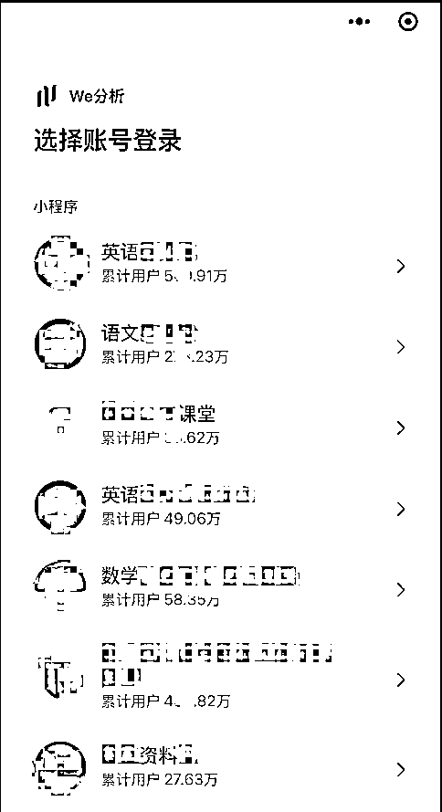

# 教育科技公司创始人分享千万级用户项目经验

> 原文：[`www.yuque.com/for_lazy/zhoubao/lxrz7b1bvzsp75le`](https://www.yuque.com/for_lazy/zhoubao/lxrz7b1bvzsp75le)

## (22 赞)教育科技公司创始人分享千万级用户项目经验

作者： 十一

日期：2024-12-03

各位圈友大家好，我是十一，深圳一家教育科技公司的创始人，专注中小学教育赛道（非教培，不受双减政策影响），公司目前做了两个**千万级用户** 的项目，分别对应中小学老师群体和家长/学生群体。

21 年加入生财到现在已经快 4 年了，除了发了几条资源对接的帖子外一直在默默的潜水。生财对我而言更多是一个了解新玩法的前沿阵地，在生财里看到了很多大佬的分享，受益匪浅；也跟几个圈友进行了或深或浅的合作，拿到了一些结果。

公司去年开了一条新的业务线，一年多的时间也从零做到了千万级的用户数。

这个项目可玩性和上限都很高，我们尝试了很多玩法：分销、知识付费、引流、低转高、社群等等，有些拿到了结果，有些只是跑通了链路但还没有精力去规模化。我把之前的尝试做了个梳理，算是抛砖引玉，欢迎大家多跟我交流，希望能链接更多有资源、有能力的圈友一起放大。

详细请移步飞书： [`yxlg5m8r086.feishu.cn/docx/WSz3dKv2nodwOOxELAkcFaYVnJg?from=from_copylink`](https://yxlg5m8r086.feishu.cn/docx/WSz3dKv2nodwOOxELAkcFaYVnJg?from=from_copylink)

* * *

评论区：

暂无评论