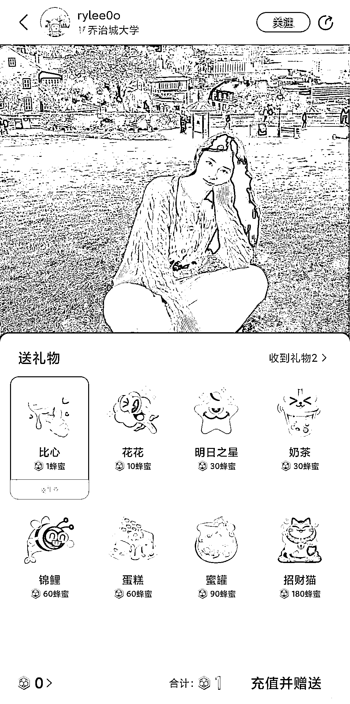

# 以“小黄书”为例，来分析一个新平台，当下是否值得入场！

> 原文：[`www.yuque.com/for_lazy/zhoubao/yhg5hifb9lnbhogx`](https://www.yuque.com/for_lazy/zhoubao/yhg5hifb9lnbhogx)

## (15 赞)以“小黄书”为例，来分析一个新平台，当下是否值得入场！

作者： 古辛

日期：2024-12-02

为什么古辛一直认为，做电商选品很重要呢，因为选品就是选赛道，不过做电商选赛道，不仅仅包括选具体的品类，还包括选平台。古辛经常给兄弟们分享选品的方法论，和具体的细分品类，很少给大家分享，如何选平台。

因为一直以来都是古辛测完一个平台后，觉得可以做，就直接跟兄弟们说，某个平台能搞，然后就开始针对这个平台分享选品方法和对标号，忽视了给大家分享，如何测一个平台，今天咱们就以“小黄书”为例，给大家分享一下，发现一个新的平台之后，如何去确认，这个平台当下是否值得入场？

小蜜蜂是网易出的一个对标小红书的内容平台，因为 app 颜色是黄的，所以就称他为“小黄书”，目前版本更新到 1.2，平台相当的新。

看一个平台当下是否值得入场，古辛主要看两个指标，第一个指标，是流量是否够大，就是看用这个平台的人多不多，我们做生意自然是希望在人多的平台做生意，人越多越好；第二个指标，是能否变现，就是我们能否在这个平台赚到钱，无论是在平台开店，还是引流到微信，都可以。

**流量是否够大？**

**1****.** **下载量**

国内的手机应用市场很分散，几乎每个手机厂家都有自己的手机应用市场，光看单个手机应用市场，没法确认该 app 的体量到底有多大，但作为参考数据，古辛认为是够用的。

比如小蜜蜂目前是小米应用市场的下载量是 8000+，单位是次，不是万次，即使这个数据不是小蜜蜂的真实下载次数，但我们也能从中看出一些东西来，就是目前下载这个 app 的人，不是很多。

**2****.** **内容点赞量**

小黄书是一个内容平台，看一个内容平台的流量大不大，古辛认为看平台内容的点赞量即可。把小黄书往下翻几页，你发现点赞量最多的几个帖子，只有 80 多个赞，说明，目前玩小黄书的人确实不多，流量太少。

如果担心推送的不精准，无法反应小黄书的真实流量，那么也可以通过搜索几个大词，比如“美食”，“美女”来验证一下流量。

“美食”，“美女”等词，无论放在哪个内容平台，都是流量数一数二的词，如果这些词搜索出来的内容流量还是很少，说明咱们的判断是没有问题的。

其实，做完第一步，验查流量，咱们就发现小黄书目前流量太小，当下不适合入场，但作为教学案例，咱们得把流程走完，继续走第二步，验查变现方式。

**3****.** **中青年女性占比是否够大**

这一点对于做电商的人来说，至关重要。因为电商的购买主力，就是中青年女性，如果一个平台中青年女性占比越大，电商就会越好做，如果一个平台男性占比过大，对于电商人来说，慎入。

小红书为啥现在这么值钱，惹得微信，抖音，网易等等巨头们眼馋，都要搞一个“小 X 书”，其中一个原因就是中青年女性占比很大。

但凡是大一点的平台，都会有第三方数据机构出该平台的用户性别占比分享；当然，大家也可以通过内容的评论来看，简单粗暴点的，就是搜美女，然后点开头部的帖子，看评论。

女性多的平台，美女笔记下面的评论是这种；

男性多的平台，视频下面的评论是这种，辨识度非常之高。

想要赚正经的钱，平台的中青年女性的占比，一定要高。

**是否能够变现？**

**1****.** **是否能够开店？**

小黄书目前不能开店，目前想要在小黄书通过直接卖货变现，行不通。

**2****.** **是否能够引流？**

古辛一般看一个平台能否引流，一般会搜索“课”，因为卖课程的人，肯定需要引流，这波人无论在哪个平台，都是研究引流最深刻的一批人，想要知道一个平台是否可以引流，直接看他们的号就行。

当然，小黄书目前流量太少，没有引流的必要。

**3****.** **是否有其他变现方式？**

变现方式有很多，除了卖货，引流，还有接广告，打赏等等，虽然小黄书目前既不能卖货，也不能引流，但这个平台有打赏功能。

这个是和小红书不一样的点，可能也会成为小黄书的破局点。

能变现，就能给用户带来创作的动力，打赏这个功能，不仅仅是小黄书和小红书的差一点，同时也是小黄书和其他小红书模仿者们的差一点。

流量验查完毕，变现方式验查完毕，我们就能得出结论，现在不是入场小黄书的最佳时机，小黄书目前还处于非常早期，不存在流量红利，现在入场小黄书的投资回报率太低，因为这个平台都不一定能活下去，需要再等他成长一段时间，再做判断。

* * *

评论区：

更绪 : 直接从公司的逻辑判断，网易的产品就大概率不值得做

朱小童 : 我觉得也是，丁三石的产品活下来都挺难

px : 网易家的 app 就直接放弃吧