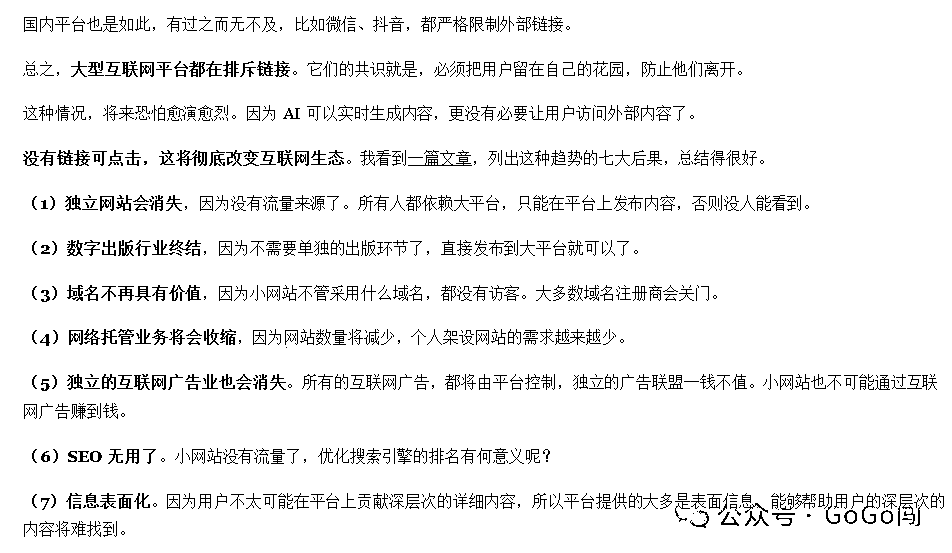
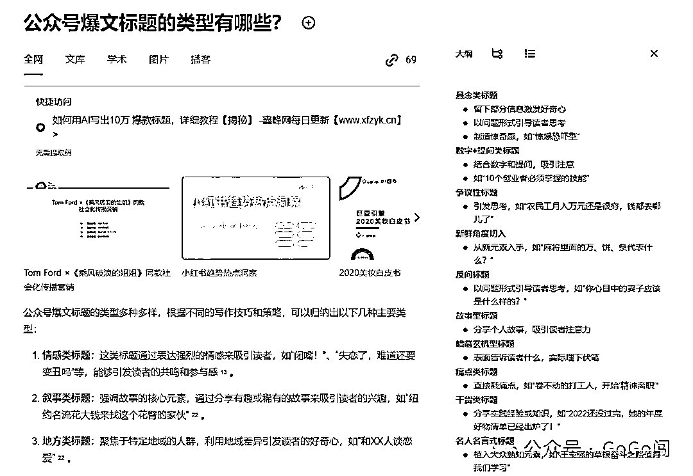
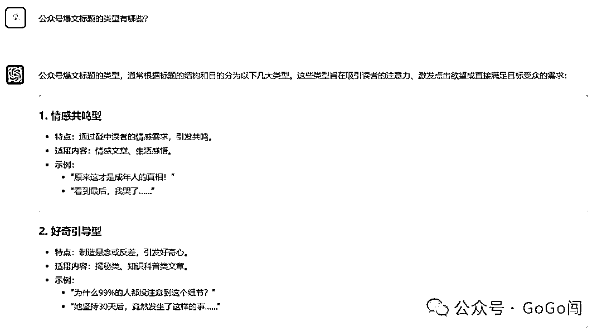
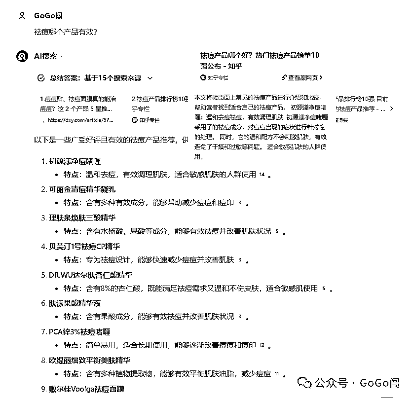
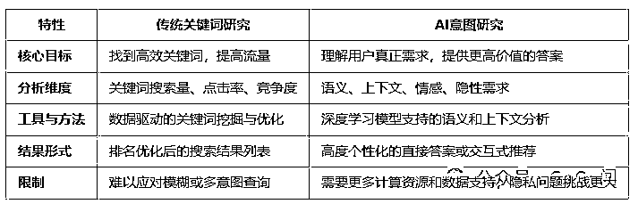

# AI 搜索引擎崛起对 SEO 的影响：流量分发机制的剧变

> 原文：[`www.yuque.com/for_lazy/zhoubao/qydif1zqsmi5zly9`](https://www.yuque.com/for_lazy/zhoubao/qydif1zqsmi5zly9)

## (8 赞)AI 搜索引擎崛起对 SEO 的影响：流量分发机制的剧变

作者： 白杨 SEO

日期：2024-12-03

**GoGo 闯：**

**1、有个歪果仁说 SEO 要完蛋了**

阮一峰的《科技爱好者周刊》最新一期 *没有链接的互联网*_

表明了一个观点，这个观点是歪果仁写的

总结下就是：

因为 ChatGPT 这类对话类 AI，及基于 LLM（大语言模型）衍生出的各类 AI 搜索引擎（如[http://](https://link.zhihu.com/?target=http://metaso.cn)[metaso.cn](https://link.zhihu.com/?target=http://metaso.cn)），可以直接提供答案，而无需提供具体链接。各大互联网平台对此感到恐惧，通过各种手段限制用户跳出自己的平台，同时也加快各自 AI 平台的建构，培养用户习惯，跑马圈地。

这意味着以往的** *「流量分发机制」*** 开始产生了剧烈的变化，那 SEO 作为其中的小环节，也会产生剧烈影响。

1.  AI 类应用，逐渐分走流量，且可以不提供链接 ➡️ AI 搜索里，不存在 SEO 排名

2.  非 AI 类平台，限制用户跳出，且流量供给向自有产品倾斜 ➡️ 领地保护越来越强

由此引申出一个问题：

1.  *当前国内 AI 搜索，还是提供链接的，此情况下的 SEO，与百度/Google SEO 有什么不同。*

**2、试着回答**

**2.1、排名的概念消失**

> 直接给出答案，弱化链接存在，甚至不存在

*秘塔 AI 搜索*_

*ChatGPT-4o（链接？不存在的）*_

在传统搜索引擎中，网页排序因子主要依赖：

1.  网页 title ➡️ SEO 基础

2.  网页体验（可读/可访问 + 用户互动数据）➡️ SEO 基础

3.  网站权威可信（备案 + 官方机构/知名大型网站/可信任特征...）➡️ 内容可靠/规避风险

4.  流量分发的优先级（合作白名单/自家产品）➡️ 高净值的流量

在这 4 个因子中，

1.  前 2 个，常规 SEO 可以操作

2.  第 3 个，个别 SEO 可以操作，通过模板修改让搜索引擎误以为权威可信，黑帽的最爱

3.  第 4 个，SEO 无法干预！

在 AI 搜索中，前 2 个重要性大幅降低了，因为用户看不到 title，打开链接的概率也不大，所以排名的概念彻底消失。

**2.2、大部分个人网站 SEO 消失**

> 只有针对平台的 SEO 才能存活

但后两个重要性（网站权威可信 & 流量倾斜优先级）仍然存在。

国内 AI 搜索，先联网读取文档，再总结成回答。联网读取的文档，链接在回答中，有角标展示的。从这 2 年的搜索中，基本读取的都是大型知名网站的链接（比如知乎超高频率的出现）。

这可能意味着，AI 模型为保证数据的可靠性，只获取知名网站的数据，众多小网站直接过滤了。

因此如果要在 AI 搜索推广具体产品的话，自建网站，可能根本无法获得曝光。

**3、网页正文的重要性，将高于网页 title**

> 搜索意图研究，替代关键词匹配研究

> 正文意图匹配，替代 title 关键词匹配

传统搜索引擎，依赖网页 title、正文和其他元标签的数据，与用户输入的搜索词进行匹配，而基于倒排索引，**title** 在参与召回、召回速度、相关性排序中，都发挥非常重要的作用。

AI 搜索的场景，与传统搜索有很大不同。

1.  第一，用户 query 可以很长，几百字都是很正常的

2.  第二，AI 会理解用户可能的意图，并返回匹配这种意图的回答（包括引用链接）

举个例子：

我语音跟 AI 搜索说：“今天跟女朋友吃完，打算跟她求婚，给我推荐八王坟附近一个合适的餐馆”

那么 AI 根据上述信息，判断我可能需要一个“八王坟附近，安静、浪漫、有小资情调、私密性较好，适合男女朋友约会的饭店”，然后找出正文中能够体现以上特征的网页，并生成回答。

这意味着，网页 title 的 {饭店名称} 并不重要，网页正文中出现「浪漫、约会、安静、私密性、朋友求婚...」等特征，会让 AI 认为更能符合用户意图。

**3、延伸**

每一次「流量分发机制」的改变，都是一次红利，而每一次红利都是财富再分配的过程，虽然这是大概率是在存量基础上进行局部的财富再分配。

虽我认为是一个机会，但鉴于我过于平滑的大脑皮层，想象不出来过几年会产生怎样的变化。

不过我认为，前提是 AI 需要走入千家万户，先有「流量价值」在过渡到「用户价值」。

流量需要有一个入口承载，因此真正的转变，可能需要能够有「操作系统级 AI」的诞生，我悟了，梭哈「APPL、GOOGL、MSFT」！

**白杨 SEO：**

上面是 GOGO 闯写的，如果从网站 SEO 技术优化角度，我确实比不上他。他对“SEO 无用了”这个看法，部分认同，部分有不同看法。看完你也可以留言说说。

**1、大部分个人网站 SEO 会消失，这点认同。**

因为个人网站不管是从平台获得权重还是盈利都非常难，哪怕是做出海谷歌 SEO，因为未来一定是协作团队式。现在 AI 搜索及 AI 慢慢普及，我们普通人确实更应该去做平台 SEO，而网站可以做为一个最后自己的自留地，我目前就是这样做的。

**2、排名的概念会消失，这点不大认同。**

为什么？因为排名不只是在搜索引擎平台里有。比如电商，比如短视频平台等，有一个基本逻辑，除非用户主动搜索不存在，除非各个平台都变成一个 AI 软件，否则永远有排名。

在百度或谷歌搜索引擎里，我们说的 SEO 排名指网页排名。但在淘宝，微信，抖音，小红书等等，这里面的排名有商品，有公众号，文章，短视频，笔记，即使他们会推 AI 智能回答，也不会改变用户自主的挑选逻辑。比如微信端，我之前写过：微信搜索新变化，推出 AI 问答，那些搞长尾词流量还能做吗？

**3、SEO 不只是网站搜索引擎优化这个概念** ，现在 SEO 早已经扩展到全平台均可做 SEO，SEO 也不仅限于是一个技术，更是一个 SEO 思维。四年多前我写过的一篇《白杨 SEO：我们说的 SEO 思维到底是什么？详细举例【推荐】》，如果没有看过的朋友，可以再去搜索看看。

**4、仅从当下来说，AI 还没有走入千家万户** ，还有很远的路要走！

你可以随便问你身边的朋友，或者问问你自己，你目前 AI 使用频率如何？更别说很多人还没用。

上次参加航海家活动，了解到目前 AI 领域创业项目，不管是 AI 培训还是 AI 写作主要营收还在大学生群体为主，国内各个 AI 更是在疯狂抢用户。国外呢？发展再快，也只是一小部分人先用起来而已。

**5、还有很多人认为 SEO 无用了，是因为 SEO 的效率太慢了。**

SEO，原意就是指通过优化方法去免费获取自然搜索流量，从流量角度获取，本来就比投放见效慢。更别说当下因为短视频，直播的火爆，推荐流量成为了主流，所以 SEO 这种搜索流量更加被人觉得可有可无，认为无用了！

但在白杨 SEO 看来，SEO 这种搞用户主动搜索流量，搞精准流量的，永远是最有价值的，尤其 TOB 业务。当然很多一些比如培训，美容等 TOC 高客单业务同样是搜索转化更好。

最后，

SEO 无用了，如果你信了，我就哈哈哈了。就如我以前说过“剩者为王”，在内容和产品过剩，流量红利没有了的背景下，谁能够搞来精准流量，谁能够做好私域流量运营，谁才能真正活下去，并且活好！

**晴修伞，饱带粮，不管他人如何说，只看自己有无用** 。

要想在竞争中让自己能够活下来，更应该学习，实战！加油！

* * *

评论区：

暂无评论