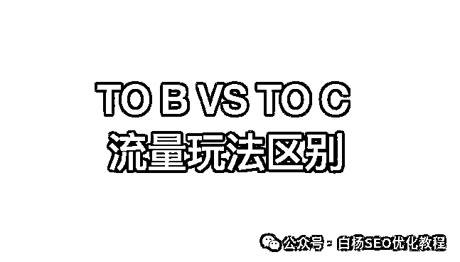
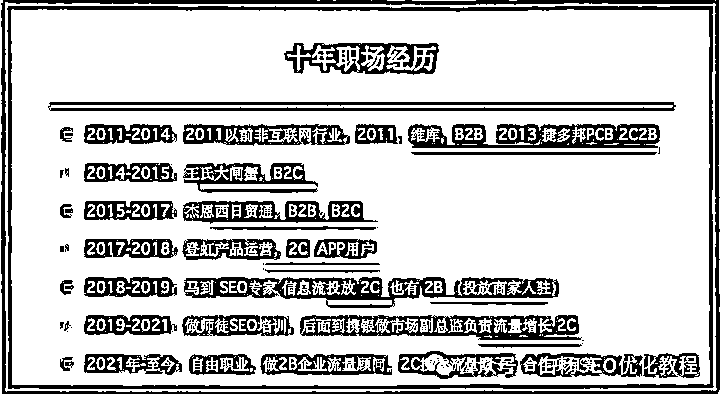
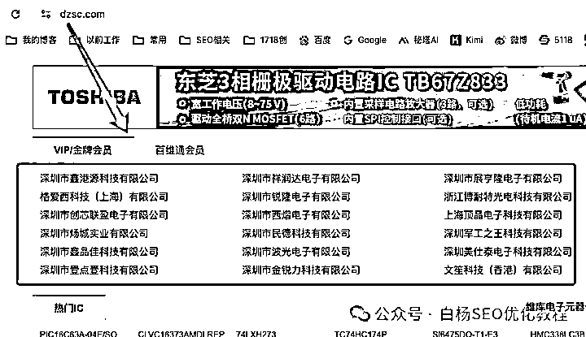
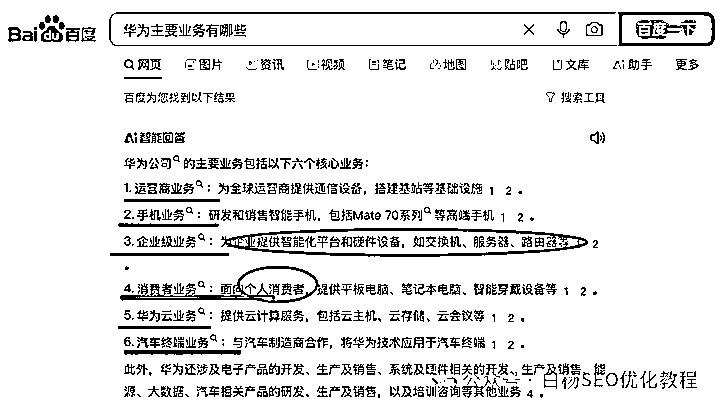
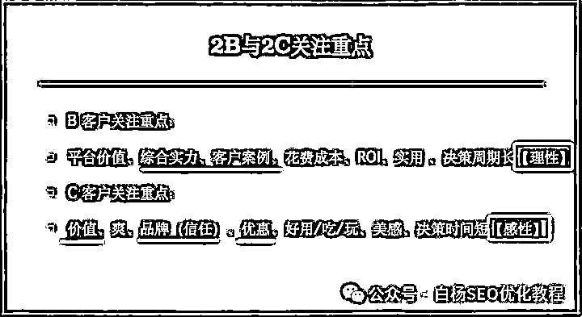
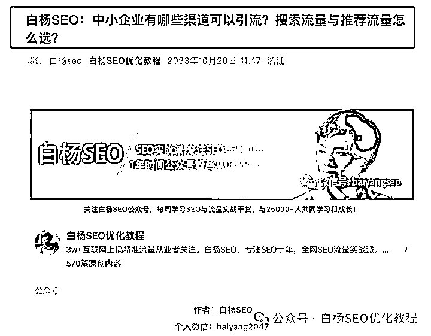

# 企业 TOB 与 TOC 业务推广平台选择指南

> 原文：[`www.yuque.com/for_lazy/zhoubao/qon33mb9d77563ac`](https://www.yuque.com/for_lazy/zhoubao/qon33mb9d77563ac)

## (6 赞)企业 TOB 与 TOC 业务推广平台选择指南

作者： 白杨 SEO

日期：2024-12-06

前言：这是公众号白杨 SEO 原创第**571** 篇。为什么想到写这个？因为经常有朋友加我微信过来问，自己做 XXX 业务，去哪个平台推广更适合之类，所以写出来方便分享，欢迎大家收藏。

文章大纲：

1、为什么白杨 SEO 可以聊这个话题？

2、企业 TOB 与 TOC 业务有什么区别？

3、TOB 与 TOC 客户各自关注重点有哪些？

4、TOB 与 TOC 客户流量增长区别有哪些？（重点）

**1、为什么白杨 SEO 可以聊这个话题？**

很多人以为白杨 SEO 只是做 SEO 的，甚至还停留在只做网站优化排名。其实从十年前开始，我就不再只是做 SEO 了，SEO 只是我工作中以及现在做自由职业中一个技能而已。

为什么我可以聊 TOB 和 TOC 这个话题？因为我有十年工作经历，一直在做 TOB 或 TOC，或 TOBTOC 都做的工作，如图。

进入互联网，最开始我是做销售的，后面才转到了网络推广部做外链，做网站 SEO，淘宝 SEO，做到项目主管，2014 年进王氏大闸蟹做运营经理。

哪怕现在做了近四年自由职业，你也可以理解成一个人创业，他们说的一人 CEO，每周都能接触各类 TOB 或 TOC 业务咨询怎么搞精准流量等。不管是从理论还是实战都有很丰富的经历，所以可以来聊哈。

不管你是在企业打工，还是自由创业，还是企业老板，均可以看看。

**2、企业 TOB 与 TOC 业务有什么区别？**

先说下 TOB 业务是什么？跟 B2B 有什么关系？

所谓 TOB 业务，简单理解就是你的业务服务对象是企业。再白话一点，是企业给你付钱！

比如白杨 SEO 最早进入互联网公司维库，我们卖给商家的维库电子市场金牌会员，钻石会员，包括后面在日贸通卖的日贸通会员，这些都是 TOB 业务。

再比如现在很多代运营公司（不管是百度还是抖音还是哪个平台，不管是做推广还是付费投放）他们都是做 TOB 服务的。白杨 SEO 给企业做流量顾问，这个也是 TOB 的。

TOB 跟 B2B 有什么关系？B2B 是电子商务概念，一般我们指 B2B 平台。比如我老家维库电子市场就是电子行业 B2B 平台，比如阿里巴巴就是综合 B2B 平台。而 TOB 只是指业务是对企业的。

如果说有关系的话，你可以简单理解，很多 TOB 业务的企业会去 B2B 平台上推广，比如去阿里巴巴开店，因为很多潜在客户如果要批发进货，也知道去阿里巴巴这个 B2B 平台去找。

再说下 TOC 业务是什么？

所谓 TOC 业务是指简单理解就是企业对个人服务，白话一点就是个人为你付费。

比如我后面在王氏卖大闸蟹，我们在天猫上卖，我们在网站上卖，这些线上卖主要就是 TOC 个人中秋国庆送礼买的。比如我在登虹做【和目】APP 产品运营，我们的客户就是那些买了云存储看视频的，他们都是个人用户。

再比如白杨 SEO 运营了快七年的 SEO 流量圈付费圈子，大部分进来交流的朋友，还是个人用户居多。

企业里 TOB 业务跟 TOC 业务只能有一个吗？

不是的，很多企业可能 TOB 和 TOC 都有。比如百度，他有 TOB 的百度推广服务，他也有比如企业产品百度文库会员 TOC 的个人服务。比如华为，你看他华为手机是 TOC 个人的，但华为 TOB 服务很多，如图。

很简单，如果你是上班的，不管你是哪个岗位，你去了解下公司的产品或服务你就知道你们公司的业务是 TOB，TOC，还是 TOBTOC 都有了。

**3、TOB 与 TOC 客户各自关注重点有哪些？**

如图，TOB 客户关注重点，也就是是否选择你，为你付钱，他会看重，你们的实力，你们的案例，在你这里能得到的价值，价格与服务等。如果非要说重点，就是谁用了你们，然后你们服务好不好！

TOC 客户关注重点，分两类，有实力和品质追求的客户追求价值和品牌，一般普通人更看重是不是优惠，划算。比如京东和拼多多上的主要消费者关注重点就不一样。

不管如何，TOC 的客户比 TOB 的客户更感性一些。比如像直播带货为什么这么火，除了看似“便宜”（直播中的东西，你去拼多多搜，拼多多会更便宜）外，就是直播时候还提供了情续价值，直播更直观！

白杨 SEO 还要补充一点：**TOB 服务决策时间长，理性原因是因为企业选择一笔费用支出都要有一个合理的理由** ，并且如果不是老板亲自买，都还会有各种流程等等。最重要的，现在企业花钱会更加谨慎，因为花钱都是为了赚钱而花，不是像 TOC 消费花，明白了吗？

**4、TOB 与 TOC 客户流量增长区别有哪些？（重点）**

TOB 客户流量增长方法：

如果是线上，如果你的业务是 TOB，如果是商品类，传统的 B2B 平台如阿里巴巴可以去开店铺推广。如果你是服务类，传统的如百度可以去做推广，不管是付费还是免费。当然，TOB 服务，抖音平台千万不要漏掉！

如果是线下，线下你行业的展会，你的行业线下会议都是做客户增长的好地方。

TOB 客户增长方法还有最最最传统的电销（电话销售），现在很多都用 AI 智能打电话筛选了。还有比如老带新，客户转介绍，这些都是方法。

如果从推广角度看，企业中最好要有一个懂推广的人来负责。比如我徒弟在温州某游乐设备公司负责整个推广运营，不管是各平台付费投放，还是各平台自然搜索优化都懂。

如果你的企业没有，要么招人，要么内部人员去培养，去学习。也有的企业说我外包，外包只能解决一时，长期来说，还是要自己养团队更好。

TOC 客户流量增长方法：

TOC 客户流量增长的方法，这个最快的方式就是花钱投放，不管是投信息流广告，还是投关键词搜索广告。

当下 TOC 客户最大流量主要就是微信，抖音跟小红书，像微信有广点通投放，可投公众号文章底部广告，朋友圈广告信息流，也可以投微信搜一搜广告。抖音，小红书都有信息流投放和关键词投放。

如果是投信息流投放，你要关注的重点是投放素材和广告文案优化；如果是投用户搜索关键词投放，你要关注的重点是找到有价值的关键词以及素材匹配度。前者很多信息流投放优化师+设计可以搞定，后者要一个懂搜索流量的人配合更好。

如果你是想走不投钱的方法推广，可以用网络推广，也可以用直播方式。网络推广分推荐流量玩法和搜索流量玩法，到底需要哪个，可以看我之前写过那篇，如图。

当然，你说我用社群，裂变啥的可以吗？当然可以。但有一个前提，你社群的种子用户哪里来？不还得推广吗？

TOB 与 TOC 客户流量增长方法的区别，主要就是平台选择的区别。如果是 TOB 业务，主要选百度跟抖音，如果是 TOC 业务主要选微信，抖音，小红书等。

如果 TOBTOC 都有，像抖音，知乎都可以。当然，最重要的是根据你的产品或服务的潜在客户主要在哪个平台来选择！

**作者介绍：**

白杨 SEO，专注 SEO 十年，全网 SEO 流量实战派，对互联网精准流量有深入研究。

* * *

评论区：

暂无评论