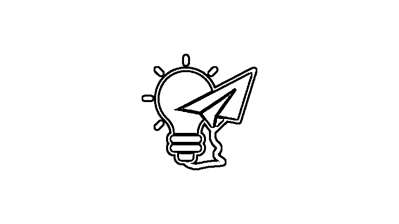
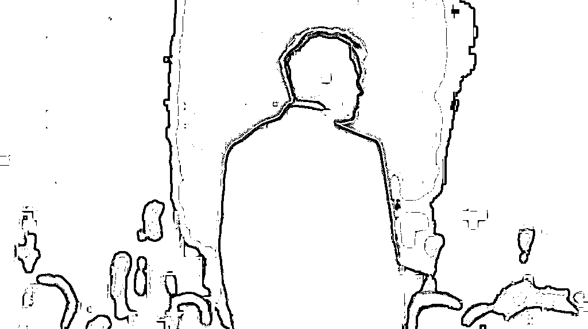
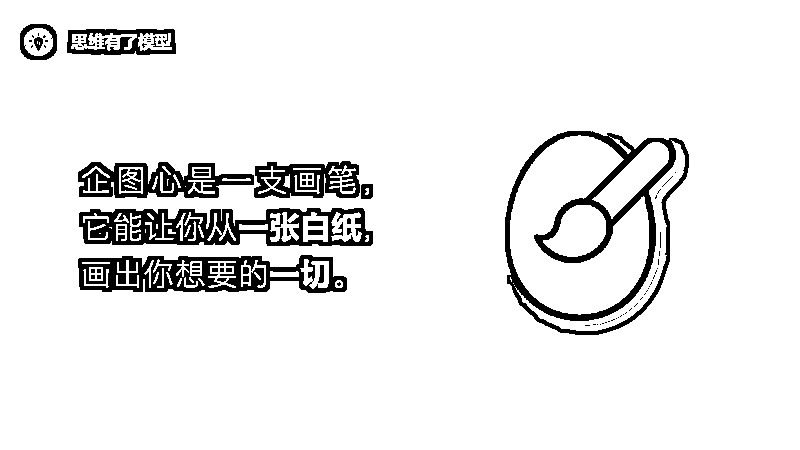
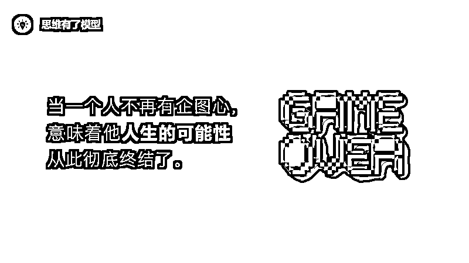
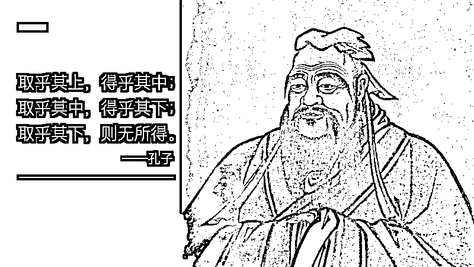
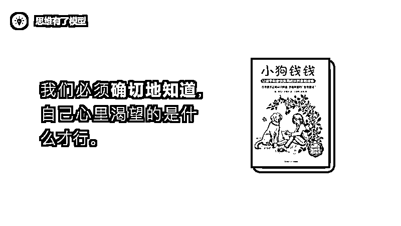
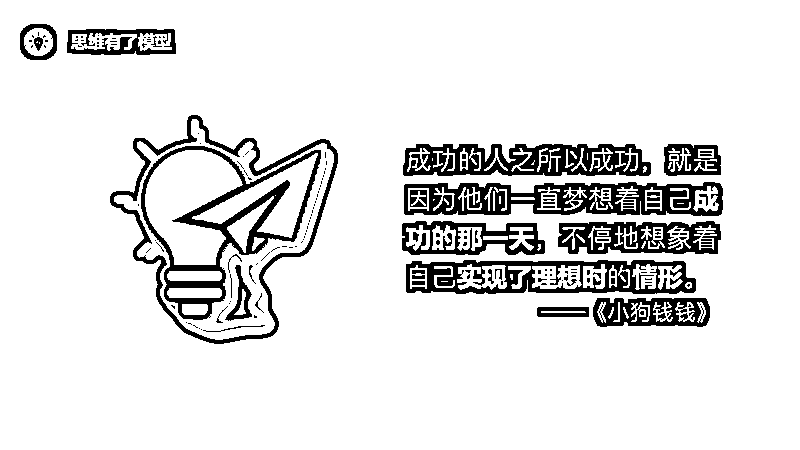
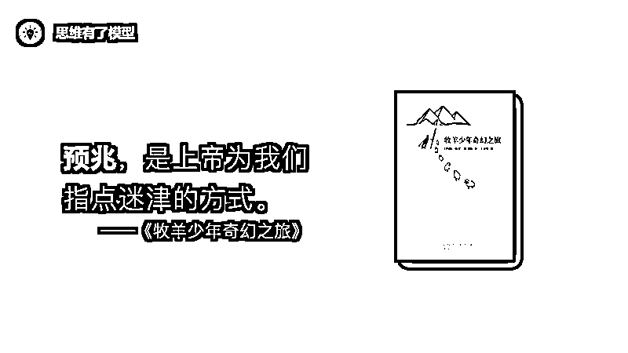
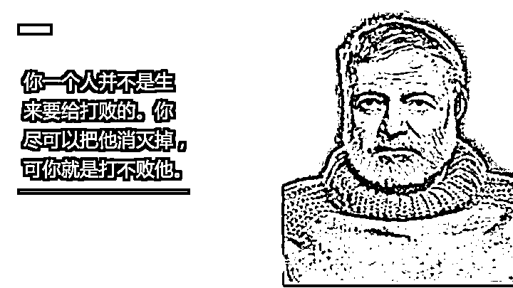

# 企图心：关于成功，最基本的一项品质

> 原文：[`www.yuque.com/for_lazy/zhoubao/bi4zelv7ar9e4sdo`](https://www.yuque.com/for_lazy/zhoubao/bi4zelv7ar9e4sdo)

## (21 赞)企图心：关于成功，最基本的一项品质

作者： 兰陵王

日期：2024-11-25

一篇文章讲透梦想的本质、命运的一切。

2021 年 4 月 10 号，我好像突然顿悟了成功之道，或者说巨人之路，并在朋友圈写下了这样一条公式：

**巨人之路****=****企图心****(意愿)×******生态位**(战略)×**模型**树****(能力)**

其中企图心是前提，对应我们经常所说的意愿，一个人首先要有做某件事的强烈意愿，接下来一切才会开始。我们常常所说的努力、坚持、激情等，也都包含在里面。

其次是生态位。光有企图心还不够，有多少人在北上广努力着、奋斗着，他们是最想改变命运的一群人，然而现实很残酷，大多数人终其一生也都无法在北上广拥有自己的一套房。

究其本质是因为，努力并不等于成功，只有在正确的事情上努力，才能取得成功。

选择比努力重要。

一个人的未来如何，努力本身最多只占 50%，在我眼里，努力和辛苦是廉价的。在一线城市的写字楼里，谁不加班？谁不努力？谁不辛苦？关键看你的选择，有没有活在趋势里，有没有在正确的赛道上，有没有在风口上努力。——《写作是最好的自我投资》

最后是模型树。有了想改变的意愿，有了正确的生态位，仍然还不够，我们还必须具备相应的能力和认知。而模型树，就是通往这一切的钥匙。

如此，企图心+生态位+模型树，就完成了一个优美的闭环。这就是成功之道，或者说巨人之路。

其实我在大学那阵也感悟了类似的公式，当时的想法是：**成功=努力×方向×能力** 。

努力就是我们所说企图心，不过企图心远不止努力，还包括坚持，还包括激情，还包括很多东西；

方向就是我们所说的生态位，不过那阵还不懂什么是生态位，否则我会比现在厉害得多；

能力对应的就是今天的模型树，不过我那时也没感悟模型树，否则我也会比现在厉害得多。

生态位我已经写过了，《[成为第一](http://mp.weixin.qq.com/s?__biz=MzUzNTExNjk2Mw==&mid=2247486118&idx=1&sn=8300c56be18627f34205014db6d0ba92&chksm=fa8b276acdfcae7c55f6822d8f0f995912728e155598beee8d652022ca15db7ec590e58ebf7e&scene=21#wechat_redirect)》《[深耕细作](http://mp.weixin.qq.com/s?__biz=MzUzNTExNjk2Mw==&mid=2247486230&idx=1&sn=0def356d3b910eb29cdb6de5b75af49a&chksm=fa8b26dacdfcafcc8a96c2affc399ad2969aced167d643077d1016568ce666bbe28ae3d60fc3&scene=21#wechat_redirect)》《[与众不同](http://mp.weixin.qq.com/s?__biz=MzUzNTExNjk2Mw==&mid=2247486299&idx=1&sn=862f29df0ba9698d8bb05517e0235f82&chksm=fa8b2697cdfcaf819974e4a52efb303625f5ffe670e981b3cbbf25bd40537103ab857383d8a6&scene=21#wechat_redirect)》《[生态位](http://mp.weixin.qq.com/s?__biz=MzUzNTExNjk2Mw==&mid=2247487609&idx=1&sn=6f47d37110bcb1851739bdcdfc764969&chksm=fa8b3db5cdfcb4a31edbdc2c62b2fdc6a3aea418558638363dd7fc95efc3758fc9c6b749e4d3&scene=21#wechat_redirect)》那几篇文章就是讲生态位的；今天这篇文章，我们来讲讲「企图心」。

## **为什么要有企图心**

当我写下“为什么”这三个字的时候，好多往事浮上心头，我的经历可以说就是企图心最好的例子。

**一、企图心能带来你所需要的一切**

企图心就像一支画笔，有了它，一切的东西都可以长出来。

都说「寒门难出贵子」，这话我不完全否认，但我想说，命运总有漏网之鱼，只要你拥有一颗强烈的企图心，一颗远超他人的企图心，一颗永不熄灭的企图心。

跟你讲讲我的故事吧。

我出生在一个贫困的农村家庭，6 岁，当其他孩子都在享受美好童年的时候，我母亲生了一场大病，并从此一直瘫痪不起。为了给母亲治病，花掉了父亲前半生辛辛苦苦积攒的所有积蓄。

对于一个农村家庭来说，这简直就是毁灭性的打击。如果你是农村人就会知道，农村人根本不敢生病，基本上一场大病就会夺走这个家里的一切。

所以，我几乎是在 6 岁就开始就体会到了人世间的一切辛酸苦辣。有的人是 18 岁以后才成年的，而我的成年礼在 6 岁那年就完成了。

邻居会欺负你，他们会经常找你茬，找各种理由骂出各种难以启齿的话；他们还会发动周围所有邻居组成一个“联盟”，一个类似农村精英阶级的联盟，他们聚在一起，通过欺负老实人获得成就感；他们还会杜绝自己的子女跟你做朋友，我曾经的朋友们，因为经常偷偷跑出来跟我玩，都会被他们的家长骂……

这仅仅是我童年的冰山一角。

如果你在我 6 岁的时候遇见我，你会相信，一个出生贫寒，父母也没念过书的人，将来会变得很厉害吗？

如果你在我高中的时候遇见我，你会相信，一个无论怎么努力都考不进班上前五，最后还差 7 分才能够到一本线的人，将来会变得很厉害吗？

如果你在我复读的时候遇见我，你会相信，当时我和宇环站在学校的天台上，天真的说，将来有一天我们要去改变世界，你会相信今天我们真的在接近那个梦想吗？

如果你在我大一的时候遇见我，你会相信，一个看似普通，没有任何特长的男生，将来他写的文章会被上市公司打印出来发给员工阅读吗？

……

你不会相信，也想象不出来，就连我自己当时也不知道我将来会变成什么样。

但是我一直有一个珍贵的东西——企图心。虽然我不知道我将来会做什么，会变成什么样，但是我知道，我将来一定会成为一个厉害的人，我会改变世界，我会让世界变得更美好。

就是这个东西，让我从一张白纸，逐渐变成了一张风景画；让我从一个零认知的人，不断阅读、思考、实践，最终变成一个有极高认知的人。

很神奇，企图心似乎知道我要什么。我喜欢创业，于是它让我感悟了知识树，让我具备快速学习任何知识的能力；光有努力和能力还不够，选择大于努力，于是它让我感悟了生态位，让我刚大学毕业就找到人生的方向。

这就是企图心的重要性，即使你现在什么也没有，但只要你心中有一颗强烈的企图心，你就能慢慢长出你所需要的一切。

**二、企图心是一切改变的前提**

有句话说「你永远叫不醒一个装睡的人」，其实这句话不够准确，准确来说应该叫做「你永远叫不醒一个没有企图心的人」。

以前我总是想帮助身边每一个朋友，想告诉他们阅读的重要性，想告诉他们生态位的重要性，想把我的知识树分享给他们。

但后来逐渐发现，根本就做不到。

因为他们对此没有企图心，他们并没有那么想要改变。

我有一个好朋友，她妹妹的成绩不是很理想，问我有什么办法没有。我是研究学习方法的，很想给她妹妹推荐知识树高中版。但我最后没有那么做，因为她妹妹对学习方法没有强烈的企图心。

同样，我身边很多好朋友，有厉害的，也有不厉害的，他们想改变现状，想具备跟我一样的认知，可是当我给他们推荐书籍、推荐知识树的时候，他们却将我的建议拒之门外。

我就知道了，其实他们所谓的想改变，并不是那么的想。

所以我现在不再好为人师，因为我开始意识到，企图心是一切改变的前提，如果他对此毫无企图心，那么不管你再怎么想帮助他，他的内心都是毫无波澜。

**三、企图心是一切平庸的根源**

最近突然感受到了一种更大的无奈。

如果一个人长时间没有企图心，最终这个人将彻底被击溃，淹没在残酷的现实和汹涌的人潮中。

很多人大学毕业，进入社会工作一两年后，很快就会意识到一件事情“这个社会远比我们想象的更现实，像我这样的人，一没背景，二没能力，三没机缘，注定这一生大概也就是这样了。算了，就这样吧，努力工作，争取找个好老婆/好老公，将来买个房子（首付），买个车子（首付）”。

如果你去观察他们，你会发现，他们已经没了激情和目标。生活中除了无聊和郁闷，似乎再也没有别的色彩了。看着别人的成功也觉得无所谓了，麻木了。

虽然几年前还有那么一丝艳羡，还有个崇拜的偶像，但现在什么感觉都没有了。每天的生活就是麻木地工作、闲聊、发呆、看无聊的电视或沉迷于网络。

心酸吗？心酸。这就是大多数人最后的归宿。

其实我心酸还不是他们最后的归宿，我心酸的，是他们早早的就向命运妥协了，对这个世界不再抱有任何的企图心。

就像马戏团的大象，小的时候因为被驯兽师用锁链拴住，从来没有挣脱过，等他们长大，即使换上细绳，也不再试图逃跑了。

这就是我们常常所说的“认命了”。

用更准确的话来表述就是“不再对这个世界抱有任何的企图心了”。

这是一个人跟现实交手之后，发出的最后宣告，宣告完之后他的人生就被判上了死刑。

## **什么是企图心**

那什么是企图心呢？

简单来说就是**“一个人对做成某件事情的意愿”** 。

这里面有两个关键词“某件事情”和“意愿”，它们分别对应着企图心的大小和强弱。

如果这件事比较小或比较容易，比如“我要减肥”，我们把这种企图心叫做**愿望** ；如果这件事比较大或者不容易实现，比如“我要改变世界”，我们把这种企图心叫做**野心** 。

如果这个意愿比较微弱，比如“我要是能瘦下来就好了”，我们把这种企图心叫做**想法** ；如果这个意愿比较强烈，比如“我一定会瘦下来的”，我们把这种企图心叫做**渴望** 。

这是比较专业的解释。

但是我更喜欢另外两个解释，一个叫做**“吸引力法则”** ，一个叫做**“天命”** 。它们分别来自两本书，一本叫做《秘密》，一本叫做《牧羊少年奇幻之旅》。

一直以来我们都以玄学的角度去看待《秘密》以及里面提到的“吸引力法则”，好多人因此误入歧途，觉得只要我向宇宙下订单，宇宙就会带给我想要的一切。

像极了我一个信教的邻居。她经常跟我们说，只要煮饭前祷告一遍，米饭就会增多。

我寻思，这玩意儿还能违背能量守恒定律？

其实这也不怪她，很多人看完《秘密》之后也是这样想的。我无意批评这种行为，但我想提供给你另一种看待“吸引力法则”的角度。

其实吸引力法则不是向宇宙下订单，那是忽悠人的鸡汤，你不是块磁铁，想啥就能吸引来啥。吸引力法则讲的是，你要时刻保持强烈的企图心，也就是对做成某件事保持强烈的意愿。

当你对某件事有了强烈的企图心，你就会一直朝着它前进，你会充满动力和热情，你会坚持很久。

这个过程中，你成功的概率会逐渐增大，并因为你在这件事情上的投入，会吸引来很多人……最终，你会有很大概率做成这件事。

类似稻盛和夫所说的**「心不唤物，则物不至」**
。如果你连想都没有想过，那肯定不会成功；但如果你开始想了，那么会有一定的概率成功，并且随着你的行动、成长，成功的概率会逐渐增大。

但并不是 100%会成功，比如我高中的时候想考厦门大学，这个意愿强烈到我会在我一切能写字的地方，都刻上了“厦门大学”这四个字，但我最终并没有考上厦门大学。

因为意愿（企图心）只是前提，后面还有方向（生态位），还有能力（认知、技能……）。有能力并且在正确的方向上努力，才能获得成功。

这就是《秘密》这本书对企图心的理解，他们把它叫做“吸引力法则”。另外还有一个解释我也很喜欢，是《牧羊少年奇幻之旅》里提出来的，他们把企图心叫做“天命”。

每个人生下来都有属于自己的天命。有的人不相信自己的天命，不敢追逐自己的天命；有的人后来抛弃了自己的天命，忘记了自己的天命。

这就是《牧羊少年奇幻之旅》这本书想告诉我们的哲理。

在书的开篇，圣地亚哥做了一个奇怪的梦，他梦见埃及金字塔下面埋着一个宝藏。解梦的老妇人告诉他那是真的，并建议圣地亚哥应该立马启程去寻找那个宝藏。

但圣地亚哥并没有相信老妇人的话，正如我们不敢相信我们曾经一闪而过的梦想一样。

幸运的是，圣地亚哥又遇到了一个老人，老人告诉他，很多人以为自己无法选择自己的命运，这是最大的谎言，人应该勇敢去追寻自己的天命。

圣地亚哥好奇地问：“什么是天命？”

老人告诉他：

天命就是你一直期望去做的事情。人一旦步入青年时期，就知道什么是自己的天命了。在人生的这个阶段，一切都那么明朗，没有做不到的事情。人们敢于梦想，期待完成他们一生中喜欢做的一切事情。但是，随着时光的流逝，一股神秘的力量开始企图证明，根本不可能实现天命。

并说出了那句经典的话**「万物皆为一物，当你想要某个东西的时候，整个宇宙都会合力助你实现愿望」** 。

听完老人的话，圣地亚哥决定启程寻找自己的天命——去埃及金字塔。

路途中遇到了很多挫折与诱惑，几次差点放弃。但男孩最终坚持了下去，并找到了自己的天命。

这个过程中，作者把我们在追寻梦想的过程中会遇到的东西，通过故事一一道来，比如挫折、运气、预兆、行动、诱惑、知识……

这就是《牧羊少年奇幻之旅》想告诉我们的，要勇敢的去追寻自己的天命。我曾经一直用它来帮我做重大的决策，后来事实证明，几乎每次都是正确的。

但我一直没有太懂这背后的机制是什么。直到最近我好像突然有所顿悟，所谓天命，就是那些曾经在我们脑海里一闪而过的梦想，也就是我们所说的企图心。

当这些一闪而过的梦想出现时，大多数人都把它否定掉了，只有少部分人选择相信，并为之付诸行动。

这就是书中所说的“相信天命，尊重预兆，付诸行动”。

其实它跟《秘密》那本书所说的东西是一样，都是在讲要相信自己的梦想，并立马付诸行动，只不过《秘密》这本书讲了很多玄学的东西在里面。

以上就是企图心的各种解释，它有很多名字，比如意愿、愿望、渴望、梦想、野心、天命……不同名字对应的企图心大小不一样，强弱不一样。

## **如何培养企图心**

那么懂了企图心，我们应该怎么做呢？如何去改变我们的命运呢？

**一、建立企图心**

前面我们说，企图心就是“一个人对做成某件事情的意愿”。

企图心有大小之分，有强弱之分。所以一个好的企图心，一定是一个很大、很强的企图心。

正如星云大师在他的《自在：人生哲学》中讲道「做人要有做好人、做大人、做伟人、做专家学者的企图心；要有希圣希贤、成佛做祖的企图心，如此才不会空到人间走一遭」。

那么如何体现企图心的大小呢？我认为它需要一个参考指标，也就是现实。

比如一个亿，对王健林来说就是一个小目标，而对普通人来说就是野心。所以企图心一定是跟你当下的现实挂钩的。

由此，我们可以得到一个公式：**意愿－现实＝企图心的大小**

但遗憾的是，很多人已经不再对生活抱有希望，年纪轻轻就已经变得很佛系，所以很难建立一个大的企图心。这种情况应该怎么办呢？

从我个人的经验来说，**一个人想要改变的意愿，取决于“他想要的”跟“他的现实之间”的差距，所以重点在于，如何刺激这个差距。**

我总结出来一共有两种方法：

一种是内在的刺激。这种刺激比较难，需要他找到自己的天命，然后这个天命会驱动着他去前进。

比如我的天命就是，让更多人用知识树学习，帮中国解决应试教育的困局，为中国培养 10000+巨人，为时代开启知识革命。

一种是外在的刺激。比如一个男生原来并不注重自己的身材，突然有一天他的世界闯入了一个女生，看着对方那么优秀，而自己这么挫，意愿与现实的差距就出现了。

这种方法的好处是，它比较简单。只要你不宅，多出去看看外面的世界，多见见优秀的人，你就会产生企图心。

但坏处也比较明显，它不够持久。除非你能不断地接触优秀的人，不断地看到更大的世界，否则就会容易三分钟热情。

所以我建议，前期可以通过外界来刺激自己，但最终你要找到自己的天命，你要发自内心的渴望某件事，而且这件事一定要远远超出你的现实，如此才能不断的激励你前行。

正如孔子所说**「取乎其上，得乎其中；取乎其中，得乎其下；取乎其下，则无所得矣」** 。

刘邦、项羽之所以能有后来的成就，得益于他们从小就有着极大的抱负。一个小小的亭长，居然有着一统天下，号令群雄的野心；一个小屁孩看到秦始皇出游的盛大场面，居然会口出狂言“彼可取而代之”。

当然，企图心也不总是一开始就要立志远大，它也是会成长、调整的。

比如曹操，他并不是一开始就想挟天子以令诸侯，他原本是打算为朝廷卖命，做个大臣，后来因为刺杀董卓失败，加之一系列事情，使他看到了号令群雄的可能性，才诞生了极大的企图心。

但不论哪种，我都希望大家是一个永远对美好事物有企图心的人。如果哪天，你不再对这个世界抱有企图心，就是你彻底对这个世界妥协的时候。

**二、强化企图心**

企图心除了有大小之分，也有强弱之分。

比如同样的两个穷人，他们都想出人头地，其中一个人愿望很强烈，另一个人可能就要佛系很多；比如同样在一个公司，有的员工就很有进取心，有的员工则要佛系很多。

造成这种现象的，就是各自的企图心强弱不同。强弱的不同，最后会导致各自的努力程度、做事的热情都会有所不同。

那么如何加强我们的企图心呢？

**1、企图心要足够明确**

很多人的企图心是模糊的，这会降低企图心的强度。

望梅止渴这个故事应该都听过：

曹操在行军途中找不到水源，士兵们都非常口渴，于是他传令道：" 前边有一片梅子林，结了很多果子，梅子酸甜可以解渴。"
士兵听了后，嘴里的口水都流了出来，曹操利用这个办法促使部队尽快赶到了前方，找到了水源。

在这个故事中，水就是模糊的企图心，梅林就是明确的企图心。

模糊的企图心会让人逐渐失去信心和耐心，明确的企图心会人坚定不移、充满动力。

大多数人并不清楚自己想要的是什么，他们只知道，自己想得到更多的东西。你可以把自己的生活想象成一家很大的邮购公司。如果你给一家邮购公司写信说’请给我寄一些好东西来’，你肯定什么都得不到。我们的愿望也是一样。我们必须确切地知道自己心里渴望的是什么才行。——《小狗钱钱》

尽可能的把你的企图心具体化，这能立马加强你的企图心。

**2、企图心要视觉化**

第二种方法是，把你的企图心视觉化。

《小狗钱钱》《秘密》《牧羊少年奇幻之旅》等书中都提到了同样的东西“想象它已经是你的了，把它视觉化，去感受你已经拥有它时的感觉，你甚至可以把它打印出来，这样每天都能看到它、强化它”。

我曾经把乔布斯的海报挂在我的书桌对面，这样每次我学习的时候都能强化自己的企图心。事实证明这是有用的，它能激励你不断朝着自己的梦想前进。

假装它已经为你所有。——《秘密》

视觉化是成功的大秘密。每天闭上眼睛几分钟，去视觉化你已经拥有你想要的事物，并去感受“已经拥有它”的感觉。——《秘密》

建议你拿一本相册作为你的梦想相册。收集一些与自己的愿望有关的照片，把它们贴在相册里，然后每天看几遍。我们要通过图片来思考。人们把这种行为称作’视觉化’。成功的人之所以成功，就是因为他们一直梦想着自己成功的那一天，不停地想象着自己实现了理想时的情形。——《小狗钱钱》

这就是视觉化的魅力，它能极大的帮你加强你的企图心。

**三、立马行动**

企图心不是阿拉丁神灯，你想要的东西它不会自己走到你身边。

这个道理虽然浅显，但是真正懂得它真谛的人却是不多。

正如我们好多人学完知识树，就一直在幻想着自己拥有极高认知的样子，却从来不去实操。这怎么可能成为厉害的人呢？

不要原谅自己，看到好的时机就一定要去做，我心里想的跟行为是一致的。我们这样坐着一定没有什么好运会来的啦。——蔡志忠

宇宙喜欢快速行动。不要拖延、不要猜测、不要迟疑，当有机会、有冲动、有内在灵感推动的时候，行动吧。——《秘密》

炼金术士回答说，“你需要学会的一切，这次旅行都教给你了。只缺少一样，那就是行动。”——《牧羊少年奇幻之旅》

但行动真的是很难，毕竟人生来懒惰；或者，有时候我们容易犹疑不决，不知道该不该行动，比如要不要跳槽？这个时候我们应该怎么办呢？

答案就是：**遵循预兆，相信直觉** 。

直觉的强大要远远超乎你的想象，心理学研究发现，我们潜意识大约占了 90%以上，它就像一个隐形的超级处理器。而我们的直觉，就是这种超级处理器最后计算出来的结果。

虽然它没有一个清晰的逻辑，只有一个经过复杂运算后的结果，但它的准确性却是极高的。很多时候，我们依据直觉做出的决策，事后证明都是正确的决策。

而预兆，就是直觉在提醒你，可以行动了。

相信你的直觉。那是宇宙在启发你，那是宇宙以接收的频率在与你沟通。当你产生了本能或直觉，就跟随它，你将会发现宇宙正如磁铁般，把你引领到你想要的事物那儿去。——《秘密》

上帝在我前进道路上布下预兆，男孩想，并对自己的想法感到吃惊。在这之前，他一直把预兆视作凡间的事情，就好像吃饭或睡觉之类的事情，他从未想过，这是上帝给他指点迷津的方式。——《牧羊少年奇幻之旅》

我很难说这种预兆的本质是什么，我只能说我经常照此行事，它可能是一种直觉，人的直觉远比我们想象的强大。

**四、永不妥协**

其实我们每个人都有过企图心，我们把它叫做梦想。

小的时候，老师问“你将来长大想做什么？”我们会回答“科学家、宇航员……”但是当我们长大以后，我们不再相信梦想，觉得那幼稚、荒唐、可笑。

我们把那些遥远而不可及的梦，用匣子锁了起来，并用铁链包裹着，沉到了深不见底的海里。只是在偶尔午夜梦回的时候，会突然闪过一个念头——曾经我也有过梦想。

就像《牧羊少年奇幻之旅》的开篇所写道的：

男孩看出父亲也想云游四方，这个愿望一直存在，尽管几十年来他一直将这个愿望深埋心底，为吃喝而操劳，夜夜在同一个地方睡觉。

关于这个问题，我曾经跟朋友讨论过。为什么有的人走着走着，就不再有梦想了？

最后我们发现，梦想并不是一夜之间就突然消失的。它是在我们与现实交手的过程中，被慢慢地、一点一点地磨灭的。

被磨灭的原因，是因为他从中无数次感到了挫败，最终绝望、妥协了。

正如马戏团里的大象，小的时候被锁链拴住，挣扎过很多次，但没有一次成功过，后来也就不逃了，被同化了。

关于此，我想告诉你一个哲理：**没有人可以打败你，除非你同意。**

这是我非常喜欢的作家海明威，在他的《老人与海》中所要阐释的哲理。原话是这么说的**「一个人并不是生来要给打败的。你尽可以把他消灭掉，可你就是打不败他」**
。

海明威所要阐释的关于“败”的定义，跟军事战略家鲁登道夫所阐释的“败”的定义完全如出一辙。

鲁登道夫在他的《总体战》这本书中对战争有一句定义，我认为点出了战争的本质**「战争以一方失去战斗意志为结束」** 。

翻译一下就是，真正的失败是意志上的失败。

不论你遇到过多少挫折，此刻正在经历怎样的磨难，那都不叫失败。只有当你放弃挣扎，彻底向现实妥协那一刻，你才真正失败。

否则，没有人可以打败你，即使是死亡。

推荐电影：《肖申克的救赎》《当幸福来敲门》《马戏之王》

推荐书籍：《牧羊少年奇幻之旅》《小狗钱钱》《褚时健传》《老人与海》

* * *

评论区：

暂无评论