# 「概率思维：掌握因果，洞悉一切的必然性」

> 原文：[`www.yuque.com/for_lazy/zhoubao/ghv6w0ntb8fiahu5`](https://www.yuque.com/for_lazy/zhoubao/ghv6w0ntb8fiahu5)

## (40 赞)「概率思维：掌握因果，洞悉一切的必然性」

作者： 兰陵王

日期：2024-11-27

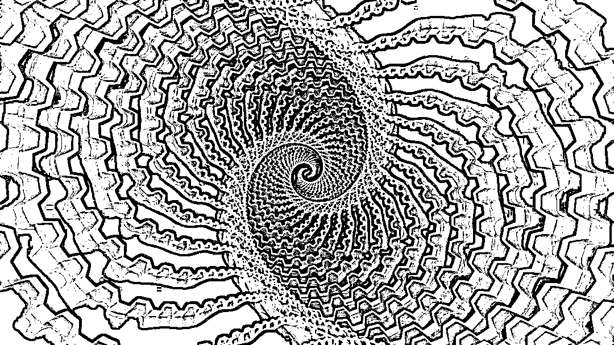

**这个世界的一切，都可能是被因果所支配的。**

而所谓运气，只是因为你还没有掌握到所有的因果。等你掌握了所有的因果，所有事情对你而言，都是必然。

## **概率-运气-因果**

我曾经在北辰青年实习的时候，负责打磨过一个课程，其中有一个模型，令我记忆尤为深刻，这个模型叫做**「概率思维」** 。

分享这个模型的人是一家上市公司的老总，当时我们联系到他，想请他来分享一下对他影响最大的模型是什么，他分享的模型就是概率思维。

我现在还记得他的原话，大意是说「从我过去几十年的经验来看，有一个模型尤为重要，这个模型就是概率思维，一切都是概率，如果你明白了这个道理，世上的一切事情都非常清晰了」。

从那时起，我就一直在思考「概率思维」在实际生活中的运用案例，以及其背后的本质。

但是很长一段时间，我都没有得到我想要的答案。

但是又隐隐觉得概率好像跟我们常常在提的运气有关，或者说，概率就是运气本身，这两个其实就是一回事。

所以我又开始思考，运气的本质是什么？

关于运气，大家听得最多的就是**「很多成功人士最后都会说，我能有今天的成就，只是因为我运气比别人好」** 。

是的，很多人经常把这句话挂在嘴边，用来合理化自己的平庸——**我之所以还没成功，是因为我运气不好。**

**  **

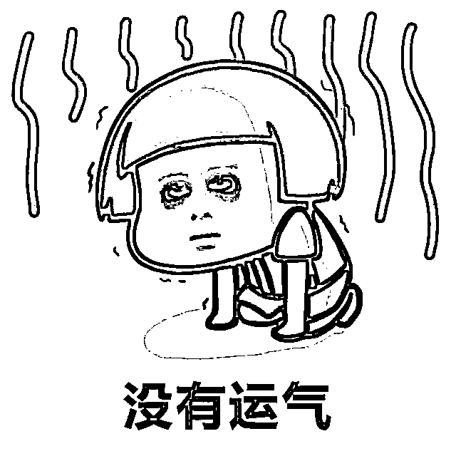

对于这种观点，我实在不敢苟同。

诚然，运气是存在的，但是那些成功的人，他们之所以会成功，绝对不仅仅是因为运气好，他们大多数都有很多人不曾具备的品质，比如抓住机遇的能力，比如执行力，比如社交能力，比如认知能力，比如思维方式等等。

为什么这么说？我举个例子：

比如我经常跟朋友说，有些人我看一眼就知道这个人此生不会有太大的成就了。

为什么这么说？这背后其实就是基于某些基本的成功素质的。

比如企图心，那些有成功潜质的人，他们会抓住一切机会学习、思考和工作，而有些人即使每天有一堆空余时间，他们也从来没有想过要利用这段时间来做点什么，全部都拿去玩手机、打游戏、刷剧了。

比如好奇心，很多人是拒绝接受任何新事物、新观念的，比如我就曾想帮助过一些人，我想把模型树、生态位等东西分享给他们，但是他们拒绝接受，也不愿意花一个小时去尝试一下。

除此之外还有很多品质，他们都不具备，反正你按照他们当下的认知状态、工作状态、资源状态，就几乎可以断定，这个人将来不会有太大的成就了，即使有机遇，他也抓不住。

所以，成功绝对不仅仅运气好就可以的。

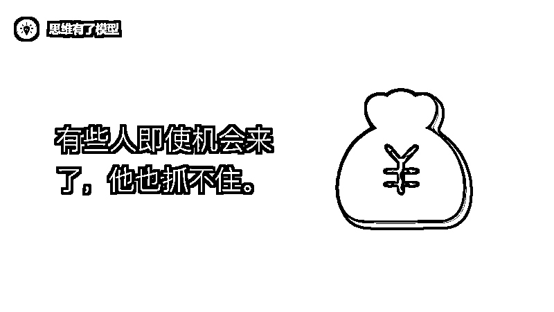

但是，运气确实也是存在的，只是它不像我们想象中那样——是个玄学。

**运气的本质，其实就是概率。**

比如，你明天心血来潮，去买一注福利彩票，突然中了一千万，你把这解释为运气，其实你也可以把它解释为概率。

而成功的人，因为他们一般都具备某些品质，比如企图心、好奇心、执行力、高认知等等，所以他们成功的概率更大。

普通人成功的概率可能只有百万分之一，而成功的人因为他们的某些品质，成功的概率可能提高到了千分之一、百分之一、十分之一、二分之一，甚至是无限接近于百分之百。

那么概率的本质到底是什么呢？

我在打磨第六期训练营，写到第五课《结构思维》时，因为要研究知识本身的结构到底是树状结构还是网状结构，涉及到了**因果律** 这个东西。

于是我开始对因果展开了深入的思考和研究，这一研究，我好像突然把很多事情都想通了，其中就包括运气和概率。

运气的本质，概率的本质，其实都来自于因果的缺失。

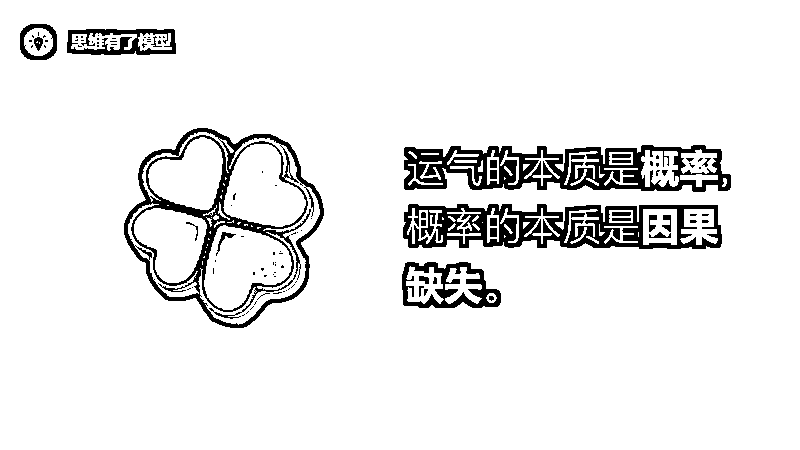

## **一切都可能是因果**

一切都可能是因果，一切都可能是被决定的。

如果你要做事情 A，事情 A 做成的因 B 可能有 X 个，那么你只要掌握了这 X 个因，你就能百分之百做成事情 A。

这里面不存在运气，也不存在概率。

日常生活中会出现运气和概率，都是因为我们并没有掌握到做成一件事所有的因果。

**而没有掌握到的这部分因果，就被我们解释为运气或者概率** 。

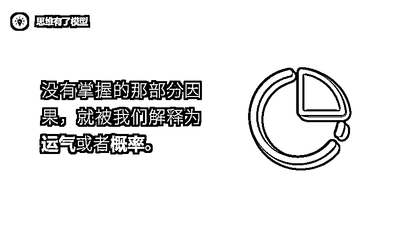

但是这个洞察能够成立需要一个前提，就是“这个世界真的是被因果所统治的吗？”、“这个世界真的是被决定的吗？”

这是一个重大的哲学问题，古往今来有太多科学家和哲学家都在探讨这个问题，但一直没有拿出一个确切的答案。

跟**「决定论」** 相生相伴的还有另一个重大的哲学问题**「自由意志」** ，人有自由意志吗？

就这个问题，很多哲学家的观点是，这个世界是被决定的，即决定论。

持这个观点的哲学家有一个强有力的帮手，那就是物理学，从物理学的世界观来看，一切事物都在按照某种宇宙法则而运转，这种世界观也被称为**「机械论」**
，即世界像一架精美的机器一样在运转。

但也有一些哲学家认为人是有自由意志的。

他们认为人的大脑有实体之外的东西存在，比如灵魂，或者某种不受物理法则驱使的东西，这种东西使得我们拥有一定的自由意志。

但这种猜想是无力的，尤其是在脑神经科学诞生以后，科学家们发现人类所有的思维活动都依赖于我们的记忆，而记忆其实就是某种物理信息、化学信息。

所以很可能，人是没有自由意志的。

但好消息是，现在的脑神经科学还没有完全研究透我们的大脑，所以我们还可以期待，人是有自由意志的。

但到此为止，我们基本可以下一个阶段性的结论了：

**1、宇宙法则是客观存在的。** （这一点经验和科学已经证明了）

**2、我们可能有自由意志，也可能没有自由意志。** （更大概率可能是没有）

所以对于这个世界是否是被决定的，我个人持有这样的意见：

我偏向于决定论，但在彻底知道自由意志是否存在之前，我个人保留一种稍微折中的观点——**即宇宙法则是客观存在的，但是人也可以拥有自由意志，这两者实际并不冲突。**

**  **

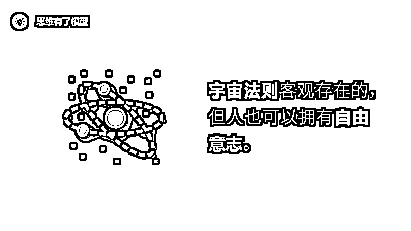

举个例子，比如三天不吃饭人就会饿得慌，但我仍然可以选择一直不吃饭，直到饿死。

**①宇宙法则是客观存在的：** 不吃饭人就会饿，这是宇宙法则，人要存活就需要能量的持续供应。

**②人也可以拥有自由意志：** 但我仍然可以选择不吃饭直到饿死，这是我的自由选择，即自由意志。

当然，这种自由意志也可能是被决定的，即“即使饿了也不吃饭”这个念头也是被决定了的。

当然，这是一种更大意义上的决定论。

这种更大意义上的决定论是否存在，可能只能等脑神经科学来解决了。

但在此之前，我们至少可以得到一个十分确切的结论「**宇宙法则是存在的」** 。

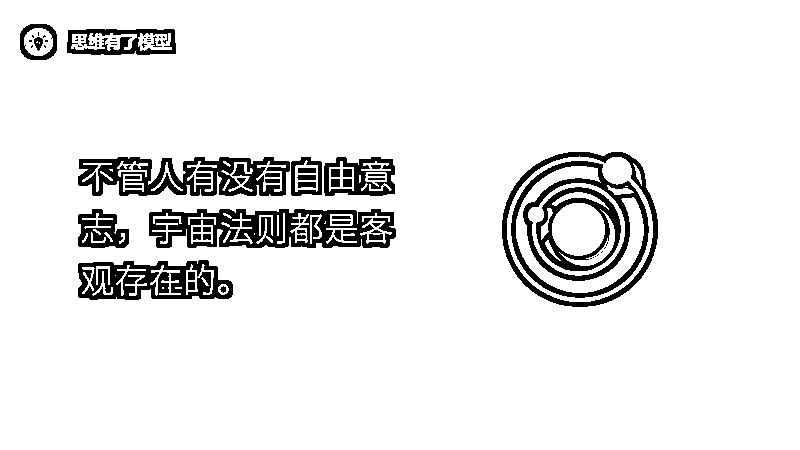

这一点，我想应该不用证明了。

如果宇宙法则并不存在，如果所有东西都是孤立地被创造的，那么如今我们所学的一切知识都将失去意义，包括哲学、物理学、生物学、化学、心理学、经济学、管理学、营销学……

关于这一点，如果我们再深入探讨一下，其实就得到了知识的第一原理。

这也是我在第六期训练营里的一个哲学性洞见，即学习不仅仅是记忆，还需要契合知识本身的特点，即我们的学习，到底学的是什么？

我的答案是，我们所学的所有知识都可以被分为两类：**一类是宇宙法则型的知识，比如人性、科学；一种是人为创造的知识，比如单词、汉字。**

对于后一种知识，它的逻辑一般比较混乱，有的甚至根本就没有逻辑，这种知识直接利用记忆术强行记忆就可以了。

而对于前一种知识，则完全不一样了，因为这些知识都是宇宙法则本身。而如果是宇宙法则本身，那么它一定具有某种特点，这种特点是什么呢？

**我称之为第一原理的线性发散。**

比如，我们如今一切的力学知识，都是万有引力公式和牛顿三大定律的线性发散。

**但这，需要基于一个大前提，即因果是存在的，因为宇宙法则需要作用于实体。**

但因果真的存在吗？

## **因果真的存在的吗？**

要谈因果，就一定绕不开一个鼎鼎大名的哲学家，大卫·休谟。

在大卫·休谟之前，很多人都把因果作为一种基本常识，比如把一个鸡蛋从十米高的地方扔下去（假设地面是坚硬的），你就知道它一定会被摔碎，这就是因果在起作用。

所以很多哲学家们都自然地认为，**宇宙就是根据因果律而发生的一连串事件。**

亚里士多德还据此提出了他的四因说：即质料因、形式因、动力因、目的因。

后来托马斯·阿奎那还根据亚里士多德的宇宙论，把四种因按照等级进行了排序：即目的因>动力因>质料因>形式因。

然而，后面有一个哲学家横空出世了，这个哲学家就是大卫·休谟。休谟犀利地指出「**因果可能是不存在的，它可能只是人类的一种错觉** 」。

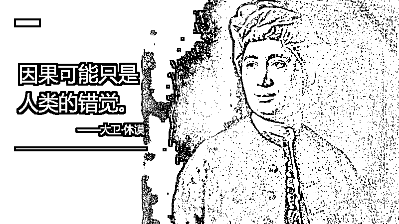

休谟的理由是，我们能观察到的永远只是前后两件事情，我们观察到它们总是前后相继地出现，所以我们就认为这两件事物之间必然存在某种关联，这种关联就是因果关系。

但休谟接着说，我们**并没有观察到** 这两件事物之间的关联，我们只是自然而然地猜测这两件事物之间存在关联，但我们**无法证明** 这两件事之间是一定存在这种因果关联的。

休谟说，这只不过是我们的一种思考习惯，为了某种生存本能，总是喜欢期待一件事情伴随着另一件事而来，总是喜欢把前后相继的两类客体联系起来。

所以休谟得出结论，因果关系可能是不存在的。

休谟的这个推论从逻辑层面来说，确实说得通。但我认为这里面存在一个漏洞，这个漏洞是什么呢？就是解读因果关系的角度。

休谟论证因果关系可能不存在的角度，我们可以把它称之为一种**自下而上** 的角度，即**从事件本身反推** “我们根本无法观察到因果“，进而得出因果可能是不存在的。

但如果我们换一种角度，我把这个角度称之为**自上而下** 的角度，即**从设计者、从造物主、从宇宙法则的角度出发去推理** 。你就会发现，因果是必然存在的，否则这件事情会变得无比荒谬。

我们假设这个宇宙有个设计者，或者按照哲学家们的话来说，假设这个宇宙有个造物主，那么他会怎么去设计这个世界呢？

根据物理学的研究成果来看，这个设计者可能会创造两个东西：

**①物质和能量**

**②决定物质和能量的法则**

那么关键来了，如果法则是存在的，那么它必须作用于实体才有意义，否则这个法则是没有意义的。

而法则作用于实体的过程，其实就是因果关系的本质。

我们打个比方，比如你是一个孩子王，为了让大家玩起来，于是你设计了一套游戏规则。但这套游戏规则，如果没有一个人遵守，那么这套规则就是没有意义的。

宇宙也如此，如果宇宙法则不能作用于实体，那么它就是无意义的。

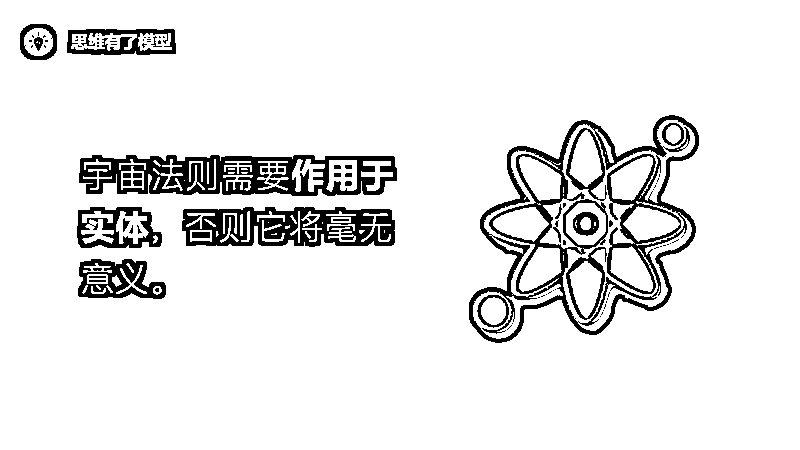

但显然，如果真有一个全知全能的设计者，真有一个全知全能的造物主，它一定不会如此愚蠢，创造一套毫无意义的宇宙法则出来。

因此，我们可以得出一个推论：只要宇宙法则是客观存在的，那么因果关系就是必然存在的。

那么问题来了，宇宙法则是真实存在的吗？

我认为这个点也很好论证。首先给出结论，我认为宇宙法则很大概率是存在的。

这点物理学已经给出了答案，不论是牛顿的万有引力公式，还是麦克斯韦的麦克斯韦方程组，还是爱因斯坦的质能方程式，还是杨振宁的规范场论，都可以看出宇宙法则存在的证据。

但还有可能有个可怕的事实，就是今天所有的知识都是假的，物理学也好，生物学也好，都是假的，那么我们还能证明宇宙法则是存在的吗？

我的答案是，仍然可以得知宇宙法则是存在的。

**因为如果宇宙法则不存在，那么宇宙就必须是静止的，不会存在物质和能量的流变。**

但显然，宇宙不是静止的，物质和能量一直在流变，宇宙在膨胀，行星在运转，植物在进行光合作用，人会经历生老病死……

因此，必然有法则在支撑着一切。

这也很好解释，如果有造物主，假设他能创造出宇宙这么美妙的东西出来，那么它一定不会蠢到，不创造规则让物质和能量自由流变演替，而非要自己亲自动手，每时每刻都要创造无数的孤立物体出来，而且还要负责旧物质的消亡……

这也太辛苦了，就算是驴，也得停下来吃点黄豆才能继续拉磨吧？

开个玩笑，这个点其实还是很好理解的。如果真有设计者，真有造物主，那么它创造宇宙的过程，大概跟我们创造人工智能的方式是相似的。

我们创造人工智能是怎么创造的呢？就是提供一套算法，让其自由演化。而宇宙法则，就是宇宙的算法。

我之前看过一个纪录片，具体叫什么突然给忘了，它讲的就是人类通过计算机模拟造物主的过程，程序员们一开始创造了一些“程序小人”，以及一套算法，这套算法有点类似于自然选择，运行几遍，这些“程序小人”就开始学会了正常走路，而且还学会了攻击其他程序小人。

而宇宙法则跟这个是非常类似的，宇宙法则就像计算机里的算法，物质和能量就是那些基础代码，点击运行，这些基础代码就能在程序员的算法之下自主运行。

当然，你也可能会说，造物主可能是不存在的，那么这个世界还会存在自然法则吗？

当然，而且是更有必要存在，因为没有造物主，也没有自然法则，那么物质和能量就必然是静止的。

**因此我们得出一个结论，不论怎样，自然法则都是应该存在的，而自然法则一旦存在，那么因果就是必然存在的，否则自然法则就是无意义的。**

那么得到这个结论，对我们有什么意义呢？

**意义大了去了，从此以后你将明白，一切都是被因果所支配的，一切都是被自然法则所支配的。**

你将明白知识的重要性，思考的重要性，学习的重要性，复盘的重要性，概率思维的重要性，坚持的重要性……

这里我们只展开讲几个小点，其他的大家自己去思考。

## **坚持的重要性**

如果要问做成一件事的要素有哪些，那么其中的一个核心要素一定是坚持。

为什么说坚持对于做成一件事来说异常重要呢？

要明白这个问题，我们先得定义清楚「怎样才能做成一件事」，根据前面的推论，这个世界是被因果所支配的，所以只要我们能够掌握到这件事的所有因果，那么我们就能百分之百做成这件事。

但问题就在于，我们很难掌握到做成一件事的所有因果，或者说，由于某种认知的局限，我们几乎不可能掌握到做成一件事的所有因果。

**因此，概率就产生了。**

打个比方，假设做成事情 A 需要 10 个要素（假设每个要素的权重都是一样的），而你只知道其中的 5 个要素，其他 5 个不知道，所以只能靠蒙。于是对你来说，那未知的 5 个要素对你来说就是一个概率事件。

假设蒙对的概率是 10%，这 10%的成功概率，就是我们常常所说的“运气”。

那么坚持，在这里面充当的角色是什么呢？

就是对运气的对冲。

**坚持的本质就是对运气的对冲。**

**  **

为什么说「坚持是对运气的对冲呢」？

道理很简单，还是上面那个案例，假设只要成功一次就算成功，那么如果你只重复 1 次，你成功的概率就是 10%；但是如果你重复 2 次，那么你成功的概率就会变成 19%……

你会发现，重复得越多，你成功的概率就越大，重复得足够多之后，这个概率就会接近于 100%。

也就是说，当数量很小的时候，就会存在概率，也即运气；当数量很大的时候，成功就会接近于必然。

而坚持的意义，就是把运气变成必然。

**坚持，就是对运气的对冲！**

这有点像掷骰子，假设掷出“点数为 6”一次就算赢，那么你只掷 1 次，成功的概率就只有六分之一；而如果你掷 2 次，成功的概率就是三十六分之十一。

你会发现，掷的次数越多，你成功的概率就越大，只要你一直掷，一直掷，总有一次点数会为 6，总有一次会成功。

注：赌博不同，它不是中一次就算成功，除非你能设计出这样的策略。赌博是条不归路，普通人请踏踏实寻找生态位，在里面深耕细作。

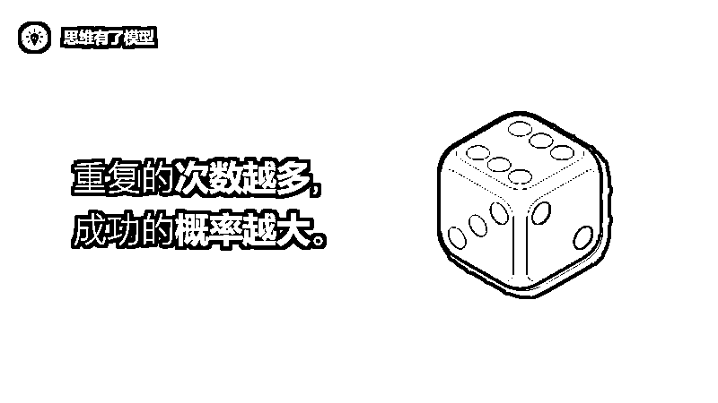

明白这一点之后，我非常兴奋，因为它使我更加懂得了坚持的意义。

举个例子，比如做小红书，我就惊人地发现了坚持在里面的意义。

同样的写作技巧，为什么有的文章爆了，而有的文章没有爆呢？当然，这可能跟选题有关，但是我发现，这里面其实也隐藏着因果关系和概率思维。

比如，一篇文章刚发出去之后，因为系统是随机推荐的，所以它可能把我的文章推荐给了不感兴趣的人，所以一开始，文章的阅读量很差，点赞的人也很少，于是系统就判定这篇文章不行，就不再给我推荐了。

但我并没有沮丧，我仍然坚持写，结果突然有一篇文章，系统在随机推荐的时候，刚好推荐给了对这篇文章感兴趣的人，于是点赞、收藏、关注的人非常多。

而这些关注我的人进而又去看了我那些没有爆的历史文章，觉得好看，给我点了赞，进而被平台再次推荐给了更多人，结果大数据就对冲了概率，使得我的文章恢复了正常的推荐状态。

你看，这里面有一个非常核心的东西，叫做阅读的人数，人数就是对概率的对冲。

而坚持的意义，也是为了这个。

前几天我把我的这一洞察分享给了一个朋友，他也在做小红书，但是一直没爆，我怕他丧气不做了，于是就告诉他，坚持是对概率的对冲，一定要继续坚持下去，你的方向是对的，坚持下去一定会等到爆发的那天。

结果不出所料，过了两天，他的一篇文章就爆了，随之而来，他的其他文章也被更多人看到，也开始在呈现出一种爆款的趋势。

你看，这就是概率、运气、坚持之间的关系，如果在以前，你可能只会肤浅地概括为运气就完了，完全不懂这背后的底层逻辑，同时也不知道坚持的意义为何。

但如果你懂了因果律，你就知道，原来坚持是对运气的对冲。

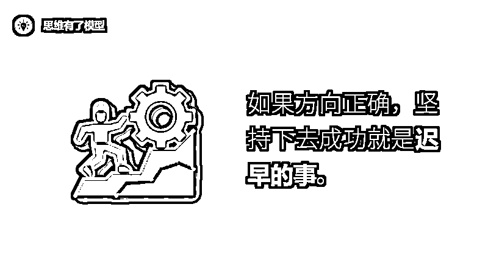

## **认知的重要性**

但这件事绝对不仅仅是一个简单的坚持就完了。

你还需要不断去掌握更多的因果，从而提升成功的概率，减少不确定性，减少坚持的时间，减少重复的次数。

而这，就是认知的意义。

我们为什么要不断学习？我们为什么要不断复盘？我们为什么要不断提升我们的认知？认知的本质到底是什么？

认知不是知识，知识只是认知的另一个表象名字。

**认知的本质是因果，你所掌握的因果总和就是你此刻的认知水平。**

**  **

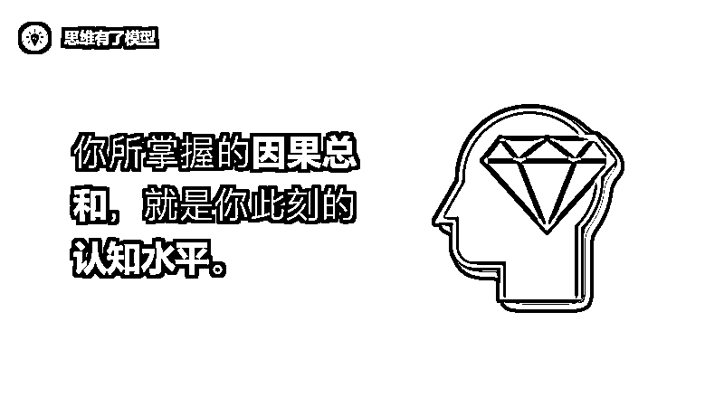

只是，不同的人掌握的因果有所差别：有的人掌握着更高级的因果，即第一原理层面的，能一眼看穿事物本质；有的掌握着更多的因果，即多元思维模型层面的，看待问题更加全面。

所以他们成功的概率更高。

**而不断学习、不断复盘，掌握更高级、更多元因果的过程，就是认知提升的过程。**

人们常说「你无法赚到你认知范围之外的钱，即使凭运气赚到了，也会凭实力亏光」。

这句话的意思其实是，你无法赚到“你没有掌握的因果“之外的钱，**因为你没有掌握这些因果，所以你只能凭运气赚钱。**

而运气是个概率事件，所以你终有一天会拿到失败的那个概率。

这就是认知的意义，认知不是一种虚无缥缈的东西，认知就是事物之间的因果关系。

认知越高，说明你掌握的因果关系越底层、越完备。因此你在做一件事的时候，做成的概率就越大，试错的成本就越小，只需要坚持很短的时间就能立马看到正反馈。

而学习的意义，复盘的意义，就是为了提升认知，从而掌握更加底层、更加完备的因果关系。

由此，我们得出了一个非常有意义的认知**「坚持，绝对不是简单的、傻傻的坚持。坚持的过程中，一定要不断学习和复盘，寻找做成这件事背后所有的因果关系，进而提升自己的成功概率」**
。

我举个例子，我那位做小红书的朋友为什么这两天突然写出了一篇爆文？

不仅仅是因为他的坚持，还因为他不断在补全做成这件事的因果要素，比如他开始改选题、改标题、改内容、改图片、改介绍、改昵称、改头像……

每改一样，他成功的概率就增加一点。

然而大多数人的坚持却不是这样，**很多人的坚持，都只是低水平的重复** ，他们懒得从经验中复盘，懒得去像巨人学习，懒得去思考背后的成功要素。

所以他们成功的概率，几乎一直都没有怎么变化过。

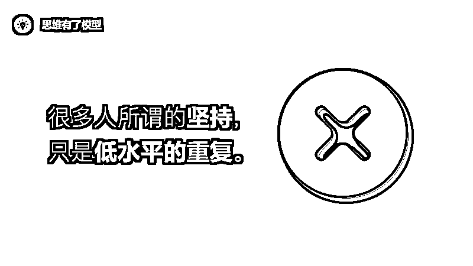

## **控制变量法**

那么具体如何才能提升认知呢？

提供两个大方向：一个是跟别人学，一个是跟自己学。

跟别人学就是我之前讲到的**「巨人思维」**
，学习方法我之前也分享过了，你可以采用我的学习方法去学习，它能快速帮你吸走任何巨人的精华认知，这个学习方法叫做**「模型树」** 。

关于这点，这里就不再详细展开讲了，因为之前已经讲得太多了，我们主要讲讲如何跟自己学。

跟自己学的核心是什么呢？

有几个比较重要，一个就是我们常常所说的复盘，从成功中复盘，从失败中复盘。

很多人是完全不做复盘的，这很可惜；还有些人是经常复盘但是不懂复盘，这更可惜。

我经常跟朋友说一句话**「不复盘的经验，意义不大；不提炼模型的复盘，意义不大；不放进模型树的模型，意义不** 大」。

所以，要想充分发挥经验的意义，你就得做好复盘。

那么如何才能做好复盘呢？有两个东西非常重要：**第一，要把复盘结果提炼为模型；第二，要把提炼好的模型放进模型树** 。

具体如何操作，这里就不再多讲，下次有缘咱们单独拿一篇文章来详细展开讲。

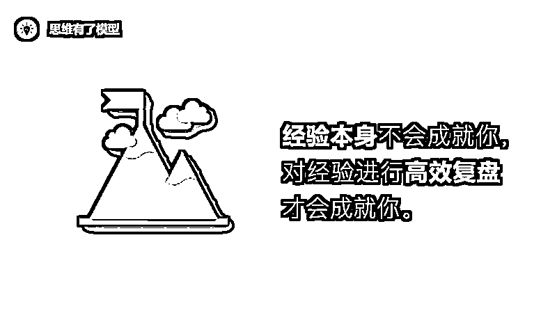

那么除了复盘，还有其他更厉害的东西吗？

还有一个，这个东西叫做**「控制变量法」** 。

严格意义上来说，控制变量法也属于复盘的一种形式，不过这种复盘的方式比较独特，因为它从一开始就设定好了目标，以及需要复盘的内容。

厉害的是，这种复盘方式把寻找事物之间的因果关系发挥到了极致。

传统的复盘，主要通过成功来确定哪些因果是正确的，然后通过失败来确定哪些因果是错误的。

但问题是，这种确定是**很模糊** 的，你无法完全确定某个要素就是正确的或者就是错误的，你只能**大致确认** 。

像「事后诸葛亮」、「幸存者偏差」等这些词，就表达了人们对于事后复盘这件事的怀疑。

这种怀疑其实是有道理的，我们确实无法通过普通的复盘，来**精确确定** 事物背后的因果关系。

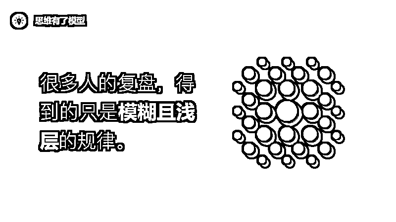

那么如何才能通过复盘，来精确寻找事物背后的因果关系呢？有没有一个简单而强大的方法？

有，这个方法就是一直被我们所忽视的**「控制变量法」** 。

控制变量法一直被科学家们用来寻找事物背后的**精确因果关系** ，我们从初中学习生物、化学、物理开始，就接触了这个寻找事物背后精确因果关系的方法。

**然而很遗憾的是，一旦我们离开课堂，走出学校，却完全把它给遗忘了。**

这实在令人感到可惜。我在想，为什么人们会抛弃这么强大的一个寻找因果关系的工具呢？

可能原因有两个：

**①人们可能不知道复盘的本质，是在寻找事物背后的因果关系，从而拿出解决问题的方法论。**

**②人们可能不知道控制变量法，是一个非常简单而且强大的，用来精确寻找事物背后因果关系的工具。**

那么什么是控制变量法？

简单来说，就是把其他所有要素都固定住，仅留一个要素来变化，然后观察这个要素对整个事情的影响。

比如小时候学的一个生物学实验，如果我们要观察光照对植物生长情况的影响，就得保证其他一切条件，比如水分、养料、土壤等等，都是一样的，仅留光照这一个条件来变化，从而就能精准确定光照对整个事情的影响。

发现了吗？

这其实就是精确寻找因果的一个很好的工具，通过控制变量，来精确观察某个要素对整件事情的影响。

然而，我们走出校门之后，却把它遗忘在了学校里。

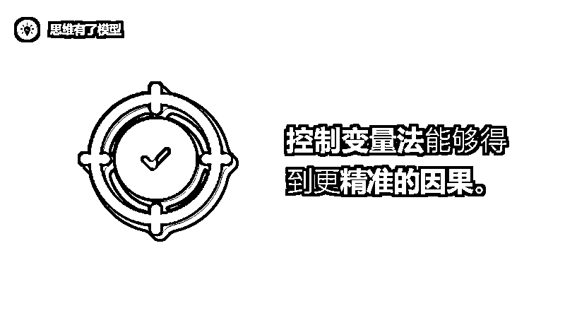

**其实，如果我们能在一些事情上稍加运用，很快就能提升我们对一件事情的认知，很快就能寻找到事物背后的因果关系。**

打个比方，我是怎么快速而精准地寻找到爆款文章背后的因果关系的呢？除了我对人性的深刻洞察，还有一个方法就是控制变量法。

比如我发现，同样句式的标题，同样的写作技巧，同样深度的文章，为什么有的文章读者就很喜欢，而有的文章读者就不喜欢呢？

我把过去的文章拿来分析之后就发现，原来问题出在选题上。一篇文章爆不爆，从选题上几乎就已经注定了。

再比如，我在做自媒体的时候，为了确定标题的重要性，我就对一篇文章反复进行标题的修改，内容不动、封面图不动，仅仅只是修改标题，然后我就发现，标题不同，最终的阅读量差别太大了。

于是我就坚定了一件事情，在选题无敌的基础上，标题也是其中的核心要素，因此应该多花点时间去取一个好的标题。

再比如，我在做小红书的时候，小号「学习有了方法」爆了，但是大号「思维有了模型」一篇都没有爆，于是我猜想，可能是小红书的用户不太喜欢我大号的某些选题。

但我怎么确认是选题出了问题呢？

很简单，我把我小号的两篇爆款文章复制到大号，看看情况怎么样，结果果然不出所料，那两篇文章都爆了，于是我便知道，大号没爆的原因之一，可能是选题出问题了。

你看，这就是控制变量法，它能帮我们快速且精确地确定事物背后的因果关系。

当然，我上面对控制变量法的运用，还没有达到科学实验那样的要求，没有严格做到控制所有变量，但即使是如此，它就已经足够强大了。

这个方法分享给你们，其实严格意义上也不叫分享，毕竟你们之前都学过了，算是提醒你们，提醒你们控制变量法很强大，而且它也可以在日常的生活和工作中用起来，它能快速地帮你们寻找到事物背后的因果关系。

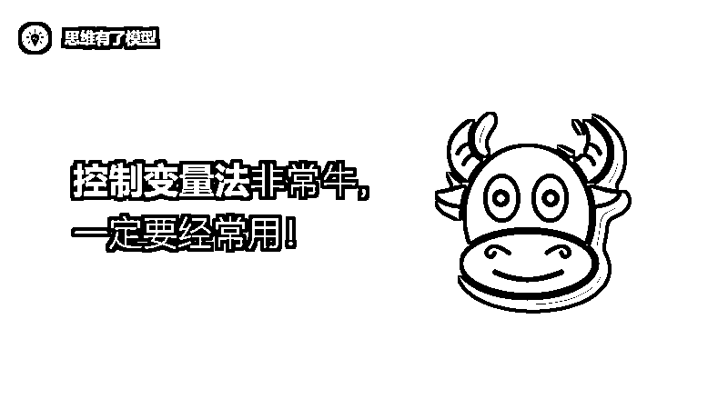

OK，这次的思维模型就分享到这里。

其实因果律是一个非常非常底层的思维方式，某种意义上来说，一切都是被因果所决定的。

所以，要想成为一个厉害的人，要想做成一件事，你就要尽可能地**寻找到事物背后的因果关系** 。

以上，就是我最近最大的感悟之一，与大家共勉。

* * *

评论区：

米拉在西班牙 : 厉害的人，通过表象看本质，中间就是不断的刻意练习！

努力努力再努力 : [强]

兰陵王 : [强]