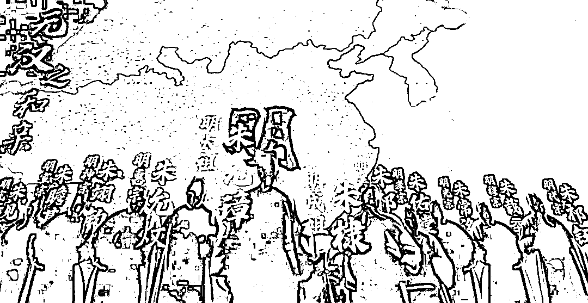
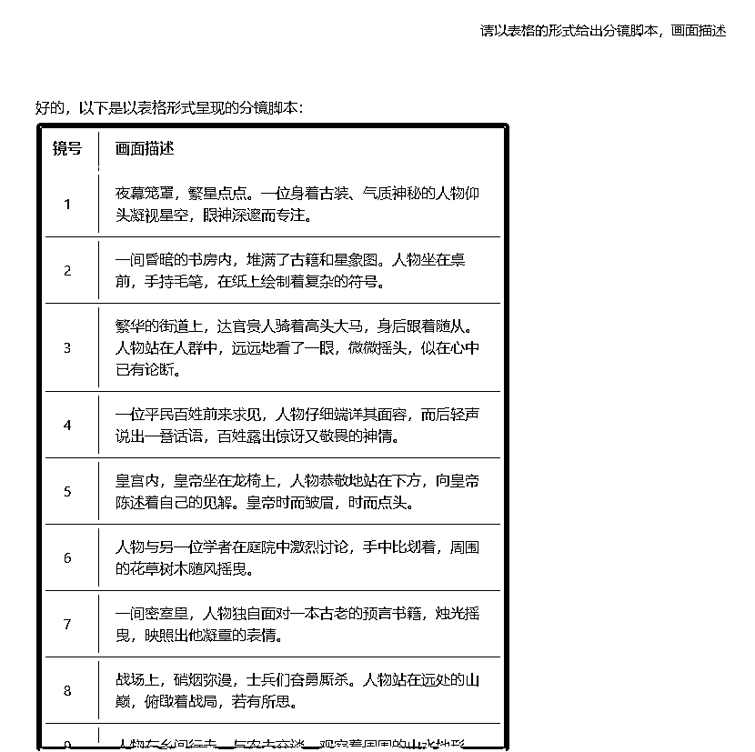
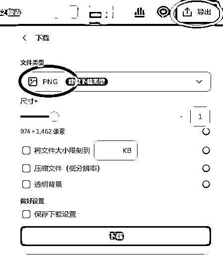

# 借助 AI 做历史解说大片，单月变现 4 万，附保姆级教程

> 原文：[`www.yuque.com/for_lazy/zhoubao/tbm0swybskgrd5l7`](https://www.yuque.com/for_lazy/zhoubao/tbm0swybskgrd5l7)

## (90 赞)借助 AI 做历史解说大片，单月变现 4 万，附保姆级教程

作者： 高鹏圈

日期：2024-11-27

大家好，我是高鹏。

今天继续分享一个热门玩法。

最近这种震撼的历史解说短片的流量太猛了。

感受一下每条视频的数据，注意看到的是它的点赞数据，并不是播放数据，是非常厉害的。

这种视频它是怎么做出来的呢？其实全程用 AI 就可以搞定。

这种视频的文案讲的是历史的大事件，或者某一个历史名人的奇闻趣事，话题的关注度本身就是比较高的。

视频的画面是由前景的人物还有暗色的背景共同组成的，通过加上一些动画和特效，还有前景和背景的强烈的色彩对比，就形成了视觉上的强烈反差这样的一个震撼效果。

配的背景音乐一般都是古风的纯音乐，跟画面和内容是相呼应的，也增加了视频的代入感。

接下来给大家具体拆解，怎么样借助 AI 做出这种高质量的历史解说的视频。

首先要借助 AI 写出来超有意思的文案，还有旁白的配音。

提示词需要借助一款智能体，这个智能体提前都已经训练好了，文章结尾会给大家提供。

我给这个智能体投喂的第一条指令是这样的，我说：一口气看懂袁天罡，不少于 500 字，开头先不要透露是谁，说一些它的独有特点，增加神秘的色彩，最后才抛出主人翁是谁。

这条指令由三个部分组成，第一部分相当于任务的下达，就是让 AI 解读袁天罡这个人。

第二部分就是给他规定一个字数。

第三部分就是给它做一个设定，就是前面应该怎么样，后边应该怎么样。

这条指令我投给 AI 之后，他就按照我的要求，给出了这样的一段袁天罡的大概 500 字的介绍。

而且 AI 非常聪明的是，它不是一开始就说，谁谁谁出生于什么时候，哪儿的人。

而是先说这个人有什么样的独特特点，做了什么样的让人很钦佩的事情，最后再说那这个人就是谁谁谁。

文案符合爆款短视频的一个逻辑，效果还是不错的。

有了文案之后，人工大概的再润色一下，就可以用配音工具直接配音了。

建议大家挑选一个中年男性比较浑厚的配音风格，这样配音会更加有历史的厚重感。

接下来要解决画面的问题，首先要做的一个工作就是得到分镜的提示词。

我们还要借助刚才这个智能体，我们再给它一个指令，告诉它先以表格的形式给出分镜的脚本，画面的描述。

这样 AI 就 123456 列出来很多镜头的画面描述，也就是分镜的脚本。

但是每一条的字数比较短，就是一个大概的场景的描述，是没有办法直接投喂给 AI 绘画工具生成图片的。

所以还要做一个工作，用一款 AI 绘画描述词扩展的智能体。

直接把上一步它给到的简短的分镜提示词投喂给这个智能体，然后他就补充了很多细节和扩充，这个描述词就可以拿来进行 AI 绘画了。

接下来第三步 AI 文成图，用到的是垫图功能。

先找一张我们认为比较符合感觉的一张图片，比如说我找到了这样的一张人物垫图。

打开之前我给大家分享的这款功能超强的 AI 绘画工具，里边有一个上传图片的选项，我们点一下。

接下来把垫图上传之后，在绘画描述词的框里边，把刚才分镜头的描述词直接粘到这儿，点下边的生成。

然后 AI 就给了两幅它生成的图片，我觉得还是非常有感觉的，跟咱们想象的袁天罡的这种形象还是比较相符的。

接着再用到一款抠图工具，这个操作就非常简单了，上传后直接点抠图，它就能够把人物从画面里面抠出来。

抠完了之后，点右上角的导出，注意一定要导出 PNG 格式的图片。

我们用同样的垫图方式，来生成一些相关古代宫殿以及山水的一些背景图。

最后一步就是剪辑成片，把刚才得到的每个分镜头的背景图，以及人物还有旁白的配音，全部导入到剪辑工具里。

再添加一些文字的特效，人物入场的特效、背景缩放平移的动画效果。

最后加一个古风的背景音乐，还有字幕，这个视频就制作完成了。

这种号做起来之后，商业化模式有这么几种。

第一种可以做橱窗带货，像一开始给大家展示的号，它主要就是做橱窗带货和星图商单。

它的橱窗带货，一个月销出去 1300 多件，单价几十，还是比较香的。

第二个也是它的核心板块，就是星图商单。

第三个可以去吃一些流量效益，参加各种分成计划，现在很多平台都有这个活动，尤其是一些海外的平台，给的效益也还是比较高的。

而且现在海外基本上还没有人做，属于一个空白期。

好，今天的分享就到这里了。

关于刚才提到的几款 AI 提示词的智能体，以及用到的各种工具，统一放到文档里了：[`svj4gxvm0v3.feishu.cn/docx/LgvSdKE8qodsVtxQy87cc2UZnwe?from=from_copylink`](https://svj4gxvm0v3.feishu.cn/docx/LgvSdKE8qodsVtxQy87cc2UZnwe?from=from_copylink)

我是高鹏，深耕网创 9 年，这是我拆解的第 695 个落地项目玩法，更多项目玩法，欢迎找我聊聊呀~

* * *

评论区：

嘉应岛主 : 分享拆解得很细，还有工具 AI 提供，厉害了[强]。我今天先刷一下生财的帖子，明天实际操作一番后，补充评论[强]

华龙 : 好文

船长 : 这个就比较厉害了

阿卡 : 最近有刷到视频号在直播讲历史（画面就一张简单的动态图，周边弄了央视直播风格）、挂车卖历史书📚

小郭 : 感谢分享

Safe1868 : 只看懂了那是画江湖之不良人大帅[微笑]

0 封 : 智能体跳转不了

晨晨 : 感谢分享