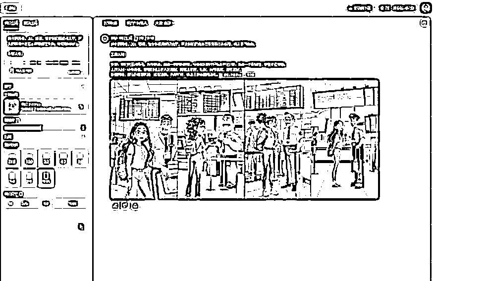

# AI 实用英语场景对话视频的惊人涨粉现象

> 原文：[`www.yuque.com/for_lazy/zhoubao/unsgk0mzg2hwqzkh`](https://www.yuque.com/for_lazy/zhoubao/unsgk0mzg2hwqzkh)

## (54 赞)AI 实用英语场景对话视频的惊人涨粉现象

作者： 大鹏

日期：2024-11-29

大家好，我是大鹏。

最近发现一类账号，专门用 AI 做这种实用英语场景对话的视频，超级简单，但，涨粉惊人！

下面这个号用 15 条内容涨粉 1.2 万，还有这个号用 44 条内容就涨粉 5.5 万!

**怎么变现？**

常见的变现方式就是卖虚拟资料，把这些常用对话整理一下放在网盘里，有人下单后自动发货。

或者带一些别人的英语教学课程、书籍赚取佣金

最重要的是，**这种账号的粉丝价值极高。**

这种视频吸引的一般都是准备出国或者已经出国的人群，这个人群里高净值用户含量极高

积攒一波这样的粉丝到私域里， *把后端机构对接一些，比如出国留学服务机构、英语培训机构，赚取 cps 也很香！*

**视频怎么做？**

非常简单，全程用 AI 就能搞定！

**接下来我一步一步带着你操作一遍：**

**1、搞定文案**

这一步交给 AI 就可以了，先把这段提示词喂给 AI，告诉他的角色、任务和要求等等

之后咱们直接从他提供的选题里面选一个告诉他，比如我直接选第 4 个，它会自动生成对话文案，文案这一块就这么搞定了

把提示词存好，每次想做内容跑一遍就行。

**2、英文配音怎么做？**

建议用这个微软配音工具，免费还好用。

打开软件后在左侧框中输入其中一个角色的台词，右侧上方选择语种，这里面内置了很多国家的语言英语、日语、韩语、西班牙等等好多

如果做其他国家的语音对话也是可以的，譬如做日韩留学的号，就可以改成日语韩语，这里我们直接选英语

因为我们要生成的是对话，所以句子之间的停顿最好设置的长一些，可以点开“高级设置”，把停顿设置为 800ms 以上，出来的句子会比较适合我们做剪辑。

生成后下载到本地即可，另一个对话同样这么生成后下载。

**3、制作配图**

这个同样也可以用 AI 搞定，但是画图得用提示词，如果不会写提示词怎么办？

不用担心，可以让 AI 帮你写，把这段提示词喂给 AI，他就会给你索要场景，直接告诉他场景和人物 AI 就能自动帮你生成提示词了

然后拿着这些内容，打开即梦 AI，选择 AI 生图功能，把前面生成好的提示词填进去点击生成，出图效果非常不错，挑选一张效果最好的下载保存就好了.

**4、视频剪辑合成**

最后一步，把前面生成的音频和图片素材导入到剪映里面做剪辑，两个音频导入后按照句子错开，根据对话做排列，图片长短根据音频调整一下

最后点击识别字幕功能，识别两次：第一次"翻译语言"那块空着，会出来英语字幕；第二次勾上“翻译语言”，会出来中文字幕，这样双语字幕就做出来了

好了，以上就是这种 AI 英语场景对话类视频玩法的全流程了

总体来说还是很简单的，感兴趣的抓紧操作起来吧~

另外，前面提到的提示词、工具和详细制作教程都打包整理好了

[`ucuu4d5tq2.feishu.cn/docx/Nh8KdQe9aobnk9xgKZcc6Ry7nTg?from=from_copylink 我是大鹏，深耕网创多年，更多项目玩法，欢迎找我聊聊呀`](https://ucuu4d5tq2.feishu.cn/docx/Nh8KdQe9aobnk9xgKZcc6Ry7nTg?from=from_copylink 我是大鹏，深耕网创多年，更多项目玩法，欢迎找我聊聊呀)~

* * *

评论区：

柒柒🎈 : 很简单的实操项目。

劳模姐 : 看起来不难，周末赶紧试试

大鹏 : 很简单

大鹏 : [坏笑]

小熊 : 留学和出国考试的人员数量断崖式下降。所以各家都在抢这部分流量。

Harris : 真不错

黄大妖 : 学到了，立马试试，谢谢圈友！