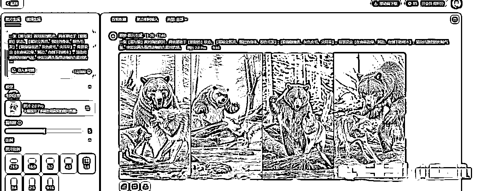

# AI 视频玩法：动物融合创造战斗力爆表的怪兽

> 原文：[`www.yuque.com/for_lazy/zhoubao/blq349cdx4yu1gbf`](https://www.yuque.com/for_lazy/zhoubao/blq349cdx4yu1gbf)

## (43 赞)AI 视频玩法：动物融合创造战斗力爆表的怪兽

作者： 大鹏

日期：2024-11-26

大家好，我是大鹏。

今天再给大家分享一个最近非常热门的 ai 视频玩法--**动物融合**

想象一下把两只常见的动物合体变成一只战斗力爆表的怪兽有多震撼！

看个视频案例：

[`www.douyin.com/user/MS4wLjABAAAAABf3xA_uWzcRXeF3GRZWrlqA3rcF5_i8XjroyQYN1aQ?from_tab_name=main&modal_id=7431212318735748363`](https://www.douyin.com/user/MS4wLjABAAAAABf3xA_uWzcRXeF3GRZWrlqA3rcF5_i8XjroyQYN1aQ?from_tab_name=main&modal_id=7431212318735748363)

一条这种视频前后也就十几秒，但流量是真的爆炸！

下面这个账号发这种视频条条大热门，点赞都是好几万，这个点赞量，后台播放量基本都得破百万了

这要是参加了流量分成计划，一条视频怎么着也得有三四位数的收入了。

其实这东西做起来一点也不难

**制作原理：** 就是先生成一张合成前两只动物的图片，然后再生成一张两个动物融合后的图片

之后再利用可灵的图片转视频功能把两张图片变成视频

**接下来我一步一步带着你操作一遍：**

**第一步，生成合成前两只动物的图片**

打开即梦 AI，选择 AI 作图功能

输入提示词：一张【熊与狼】面对面的图片，两者都处于【愤怒的】状态。【熊站立挥爪，强壮的身体、棕色毛发】;【狼匍匐前进，灰色皮毛、尖耳朵】。背景设定【在森林边缘，河边，有倒下的树木】，渲染出激烈的对峙气氛，突出这两头强悍动物的力量对抗感。

选择一下图片生成比例，点击生成，他这里会直接给你生成四张图片，挑一张效果最好的下载保存就行了

**第二步，生成两只动物融合之后的图片**

输入提示词：一只融合【熊与狼】特征，非常恐怖的怪兽，外观凶狠且无缝融合，这只怪兽拥有【熊的体型与狼的耳朵，熊的力量与狼的狡猾】，表情凶狠，露出尖牙，目光兇悍，背景是【在森林边缘，河边，有倒下的树木】，闪电，增强其危险且令人敬畏的气氛。

生成好之后，挑一张效果最好的下载保存

**第三步，图片生成视频**

打开可灵 AI，使用这个 AI 视频功能，把这个**增加尾帧** 按钮点开，然后把两张图片分别拖进去

输入提示词：狼和熊相互靠近，融合成了一只怪兽，天空电闪雷鸣。

点击生成，稍等一会儿视频就生成好了。

**不要和我杠可灵收费的问题** ，每次生成花 10 个灵感值，每天登录送 66 个值，可以做 6 个，再借一下周围朋友的手机账号薅几次羊毛：

假设你需要 5 个号，就下五个浏览器：chrome、edge、360、firefox、sougou……每个浏览器都登录一遍可灵，只需要在首次的时候扫一下码，后续每次都会自动登录。

每天 300+个灵感值，做几只怪兽，压根儿霍霍不完好吗~

**第四步，剪辑合成**

把生成好的视频和变身前的图片一起导入剪映，添加上入场动画、背景音乐、特效，一条怪兽变身的视频就搞定了。

有老铁说想生成其他动物，但不会写提示词怎么办？

很简单，点开这个表格：

[`ucuu4d5tq2.feishu.cn/docx/CWKkddQ6mowAWAxYJalcfV1cn2c?from=from_copylink`](https://ucuu4d5tq2.feishu.cn/docx/CWKkddQ6mowAWAxYJalcfV1cn2c?from=from_copylink)

你只需要把上面提示词【】里面的内容按照这个表替换掉就可以了，一行一个变身，保你不带重样的。

**变现方式：**

**1、赚流量费**

这些视频同步到视频号和抖音，开通创作者分成计划后，就能躺着赚流量费了，不过最好的赚流量费的地方是 TK 和 youtube，现在 youtube 上的 shorts 也能开通 YPP（广告分成）计划，这两个平台的流量分成是要比国内的高不少的.

**2、小红书商单**

小红书千粉之后就能开通蒲公英，就可以接商单赚钱了，千粉账号每单 150-300 左右。

**3、收徒**

跑通闭环之后，就可以把这个玩法教程打包卖铲子收徒，但前提是自己一定跑通了，赚钱没问题，但不能抱着割韭菜的心态去收徒。

好了，以上就是这种 AI 动物融合视频玩法的全流程了

总体来说还是很简单的，感兴趣的抓紧操作起来吧~

我是大鹏，深耕网创多年，更多项目玩法，欢迎找我聊聊呀~

* * *

评论区：

皇帝凌乱了 : 你的成品视频可以看看吗

万航宇 : 还挺好玩儿的，明天试试[破涕为笑]

大鹏 : 没发传视频啊……

大鹏 : [强]

上上签 : 挺有意思

万航宇 : 请教一下，图片转视频，有的时候两只动物不融合咋办呀，直接切镜头到尾帧了[捂脸]

大鹏 : 加点细节，比如两只动物逐渐相互靠近，融合成了一只具有狼和熊特征的怪兽。还有就是多生成几次，这个有随机性

万航宇 : 好的，谢谢。