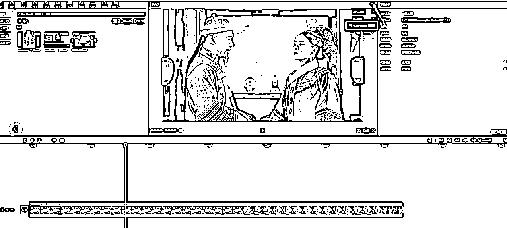
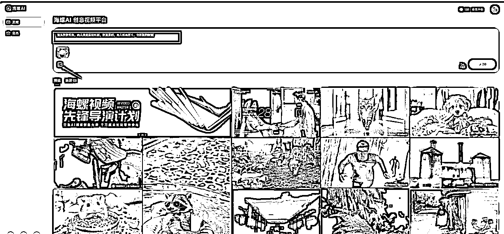
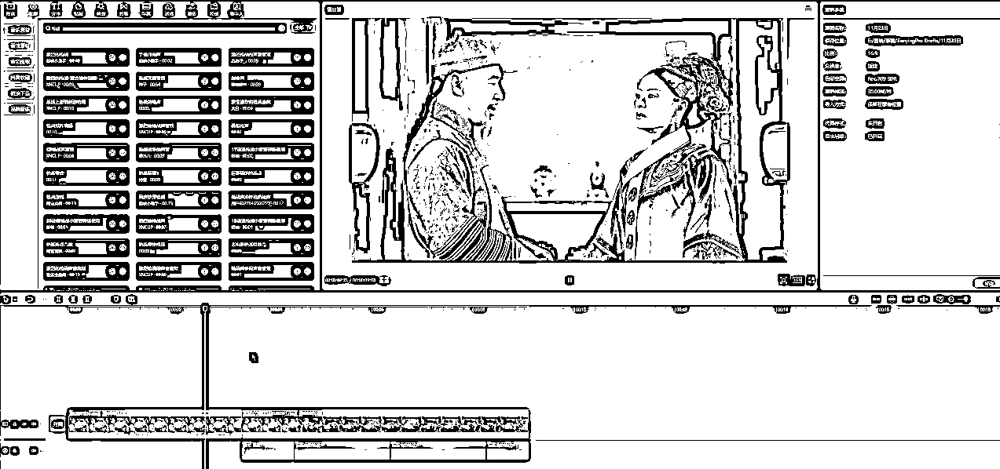
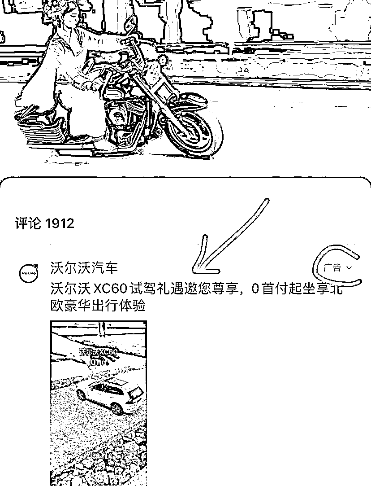

# AI 魔改抽象整活儿视频，半月狂吸 10w 粉，好玩又实用，保姆级实操教程

> 原文：[`www.yuque.com/for_lazy/zhoubao/il5ik73gtedbgal0`](https://www.yuque.com/for_lazy/zhoubao/il5ik73gtedbgal0)

## (43 赞)AI 魔改抽象整活儿视频，半月狂吸 10w 粉，好玩又实用，保姆级实操教程

作者： 大鹏

日期：2024-11-25

最近大家应该经常刷到过这种 AI 版甄嬛传视频吧？

“甄嬛掏枪”、“甄嬛打架”、“妃子们骑摩托车”等等 images.zsxq.com/FgspdhZGn7sU0JjUN4EoWFsap5pe)

正式庄重的古装剧，突然冒出各种无厘头的画面，新奇，好玩，吸引眼球~

最近这种短视频数据非常火爆， *点赞量轻轻松松几万上十万*

有的账号起号短短半个多月，粉丝就已经涨到了 10w+，光是流量带来的创作者分成收益都给这些创作者们带去了不少收益。

**这种视频怎么制作？**

最近就有粉丝问我这种 AI 恶搞的抽象视频是怎么制作的？

方法其实很简单，今天就给大家拆解一下：

**第一步，准备素材**

去网上搜一段影视剧视频，导入到剪映里面（直接截图也可以）

比如我找的这段甄嬛传的视频，把视频导入到剪映里面，找到两人同框的画面暂停，点击右上角三条杠，点击这个“导出静态帧画面”，可以选择下保存位置，保证自己能找到就可以了。

**第二步，图片转视频**

打开海螺 AI，点击这个海螺视频功能，把刚才保存的图片上传上去，接下来就可以发挥你的想象输入一下提示词，提示词还是比较关键的，会直接影响视频的生成效果

比如我输入的关键词：“镜头较快转换，两人突然拔枪对射，快速暴利，两人殊死搏斗，电影版的辉煌”

输入完成后点击生成，稍等一会儿视频就生成好了，如果生成的效果不好可以重新修改下关键词再次生成就行了，直到你满意为止。

**第三步，视频拼接剪辑**

打开剪映，把我们刚刚用 AI 生成的视频放到导出关键帧的地方，然后把原视频后半段删掉，这样视频就拼接好了，最后再配上背景音乐，就可以导出发布了。

除了这种枪战的视频，还有打架的、接吻、骑车的等等很多形式，制作原理都是一样的，无非就是关键词不一样，大家可以发挥一下你的想象力，说不定就有出其不意的效果。

**这种视频除了好玩还能变现？**

**1、接广告商单**

只要有流量的地方就可以有广告位，有广告位就可以收广告费。

我看到有不少这类视频已经插入了广告，本来无厘头的 AI 片段突然出现已经很让人意外了！

再出现一些创作者自己剪辑的广告，就更有反差感了，效果真的非常好，短视频是真的被他们玩明白了。

**2、知识变现**

这种视频本身是很新奇的，很多人都有学习需求，或许是因为好玩，或许是装逼需求~

不管拿来做什么，有需求的地方就有钱赚，只要你学会了这种玩法，再去教会别人，那你做的事情就是有价值的，你可以有偿教学，自然而然就可以变现了。

3、**创作者分成计划**

创作者分成收益可以说是短视频创作者最容易获得的一种收益，当你的短视频得到曝光后，附带的广告也就容易得到曝光和用户点击，创作者就可以得到相应的广告收入。

好了，以上就是这种 AI 恶搞的抽象视频玩法的全流程了

总体来说还是很简单的，就是个信息差

感兴趣的抓紧操作起来吧~

操作过程中需要用的提示词我整理了个文档，有需要的自行下载：

链接： [`pan.quark.cn/s/48dc3e20165e`](https://pan.quark.cn/s/48dc3e20165e)

我是大鹏，深耕网创多年，更多项目玩法，欢迎找我聊聊呀~

* * *

评论区：

心净亦如心镜 : 必须用电脑吗

大鹏 : 用电脑方便点