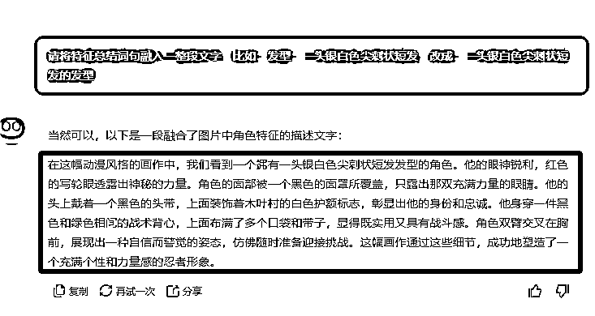

# 30 天 收入 13 万，AI 出海新机会，3D 仿真动漫视频玩法攻略

> 原文：[`www.yuque.com/for_lazy/zhoubao/uvkwy183sp2rhy61`](https://www.yuque.com/for_lazy/zhoubao/uvkwy183sp2rhy61)

## (36 赞)30 天 收入 13 万，AI 出海新机会，3D 仿真动漫视频玩法攻略

作者： 高鹏圈

日期：2024-11-26

大家好，我是高鹏。

今天继续分享一个热门玩法。

用 AI 做逼真的 3D 动漫，比如下面这个油管的号就凭借发这种动漫图片，看上去很简单的操作，但是一个月能搞六位数。

有的小伙伴可能比较疑惑了，这种动漫图不是满大街都是吗？能做起来就是运气好而已。

我研究了一下，还真不是。

仔细看他的作品，会发现他发的作品都是知名度比较高的动漫 ip 的形象，图片很像真人的效果，但是看上去又不是 cosplay。

这种图与下面的普通 cosplay 的图，或者手办图片有很大的区别，当然更不是像原著里边纯动漫的图片。

这种号商业化模式也很简单。

第一个就是做出海的流量效益，比如上面那个就是油管的号，我们都知道油管的效益还是比较高的。

第二种就是做国内的动漫图片，参加一些平台的分成计划等等。

第三个就是可以手办带货，带一些手办的商品。

今天给大家详细的拆解这种 AI 逼真 3D 动漫的图片是怎么做出来的。

首先就是要得到 AI 绘画的描述词，我给到 AI 的第一个指令是这样的，就是由三大板块组成。

第一个是任务，我说：我要用 AI 绘画软件，制作一张火影忍者里边谁谁谁的图，现在需要绘画的描述词。

接下来是素材，我会提供一张这个人的图，请你详细分析这张图。

最后是要求，请你详细分析这张图，给出我直接可以做图的描述词。

投喂给 AI 之后，AI 说：当然可以，请你上传这张图。

然后我就把这张图上传上去了。

接下来它就给了很多这个图片的特征的描述，比如说他的发型是什么样的，头戴、眼睛、面部服饰等等。

但是它虽然把每个部分都给出了描述，而实际上作为 AI 绘画提示词，我们要的是一大段，不会这样去区分。

所以我继续给了 AI 一个指令，这个指令有两个部分组成。

第一部分就是我告诉 AI 任务，请将特征总结词句融入一整段文字。比如说发型，一头银白色尖刺状短发改成一头银白色尖刺状短发的发型。

我给它这样一个改写的示例，然后 AI 就把原来分开的各个部分的描述，给汇总成了一整段，这样一整段就可以作为绘画的描述词了。

接下来就是利用 AI，根据刚才的文字生成图片。

用到的还是 rec raft 的这款工具，在刚刚过去的一周被评为综合能力比 MJ 和 SD 还要厉害的一款 AI 的工具。

把刚才得到提示词粘贴到左边这个框里面，直接点生成，它就会生成两个很接近真实效果的形象。

这个指令要注意一下，在输入这个提示词之后，后边一定要加一个要真实风格，不要卡通风格这样的话，这样才能生成看上去很逼近的真人效果的图片。

接下来就是第三步，让这张图片动起来，有 3D 的感觉。

用到的就是 leia pix 这个工具，来到它首页，点左上角有个 upload，也就是上传图片的意思，点一下这个按钮，然后接下来按提示上传刚才得到这张图片。

然后在图片的右侧会出现一些选项，选择第二个，就是让图片横向水平的旋转，实现 3D 化的感觉。

这样的话这张图片就有了 3D 来回旋转的感觉，把它导出备用。

最后一步就比较简单了，就是剪辑成片。

我们把一个一个的人物形象导入到剪映里，然后添加转场，多个片段进行拼合。最后添加一个 BGM，就是这个动漫它当年经典的 BGM 添加进去，视频就制作完成了。

好，今天的分享就到这里了。总的来说并不复杂，只不过这里边涉及到很多工具，还有它的使用的一些细节。

关于刚才提到的 AI 绘画描述词生成的提示词，以及 AI 绘画的工具，图片转 3D 的工具，统一放到文档里了：

[`svj4gxvm0v3.feishu.cn/docx/JBjndmajNoMnr6xAMHKcV4m8nVh?from=from_copylink`](https://svj4gxvm0v3.feishu.cn/docx/JBjndmajNoMnr6xAMHKcV4m8nVh?from=from_copylink)

我是高鹏，深耕网创 9 年，这是我拆解的第 694 个落地项目玩法，更多项目玩法，欢迎找我聊聊呀~

* * *

评论区：

白也 : 请问案例账号叫什么？

毛豆 : 我也想问，这截图都截了，还把账号名隐藏了[憨笑]