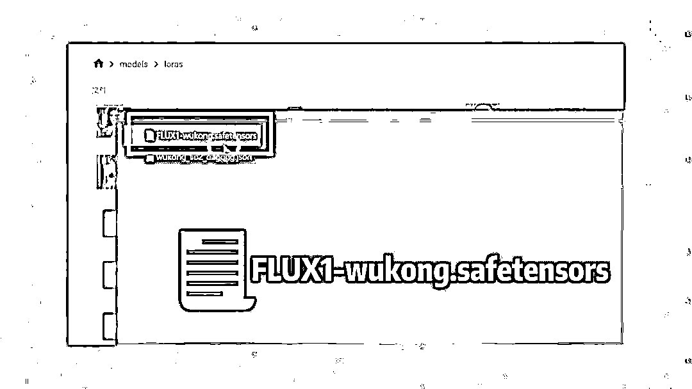

# AI 原创影视解说新玩法，1 条视频 100 万播放，保姆教程来了

> 原文：[`www.yuque.com/for_lazy/zhoubao/ud381ubtnla4rdkz`](https://www.yuque.com/for_lazy/zhoubao/ud381ubtnla4rdkz)

## (38 赞)AI 原创影视解说新玩法，1 条视频 100 万播放，保姆教程来了

作者： 高鹏圈

日期：2024-11-28

大家好，我是高鹏。

今天继续分享一个热门玩法。

借助 AI 做经典影视剧的二创，比如这条作品跑出了非常高的播放量。

因为我们知道传统的影视解说，现在是比较卷的。

但是像这种基于经典的影视剧，借助 AI 生成的二创作品，看上去新奇有趣。尤其是像四大名著这样的 ip 自带流量，目前做的人还不多。

今天就给大家详细的拆解，怎么样借助 AI 来做这种经典影视剧的二创，也算是一种最新形式的借助 AI 的影视解说作品了。

首先我们要做二创，不是把原剧进行解说，跟我们原来做影视解说的思路完全不同,我们的整体思路就是用原剧里的 IP 重新创作一个故事出来。

所以需要解决创作灵感的问题，这个就要借助 AI 了，我们这儿用到的是豆包，指令由三个部分组成。

首先是我会告诉 AI 我的目标是什么，我想做一个 60 秒的 AI 小短片。

然后告诉他主题，是关于贾宝玉和林黛玉之间的爱恨情仇故事。

接下来是要求古代的场景，跳出原著，请你帮我想一点情节和对话。

然后 AI 就生成了对应的镜头，以及每个镜头对应的时长，还有每个镜头描述的情节是什么样的，画面是什么样的，功能还是非常强大的。

第二步就是要得到分镜的对话和配音，因为我们视频里会用到贾宝玉和林黛玉他们之间的人物对话。

所以在原来的指令的基础上，再继续给他指令，说：不错，那每个镜头请再补充一些人物的对话。

这样的话他把刚才的每一个镜头后边都加上了一组人物的对话。

比如说第一个初遇惊鸿，贾宝玉说这世间竟有如此脱俗之人，仿若仙子下凡。林黛玉就很害羞的说，哪来的登徒子这般直勾勾的瞧人。

这个对话有了之后，用之前我给大家分享的 AI 配音工具，把这个对话配音，后边视频剪辑的时候会用到。

接下来第三步就是用 AI 来文字生成图片。

首先要做的工作就是得到每一个分镜头所对应的 AI 绘画的提示词。

我继续用刚才的 AI，我说继续根据每个镜头的情节部分转换成一段 SD 的提示词。

它就把每个镜头对应的提示词都整理出来了，而且把它写成了可以直接投喂给 SD 的英文提示词。

这些提示词看上去都比较长，大家做一些筛选，把重要的导演视角的动作场景以及描述人物之间的互动，他们的姿势服饰等等，这些关键的信息保留下来。

接下来我们要用到 comfy ui，文生图的一个工作流。

这个我不太建议大家在本地直接用自己的电脑的做，因为它对配置要求非常高，我们可以借助端脑云。

打开它首页之后，找到这个 comfy ui 的选项，我们点进去。

这个地方，我们直接用它的轻量版就 ok 了，没必要用高级版。

然后在弹出的页面里边选择文件管，然后选择 models，接下来在下一级文件夹里边选择 Lora。

然后一步步上传我给大家准备好的这个 lora 的模型。

然后回到这个页面，再点击这个 comfy ui。

进去之后，在左上角会看到一个 import，导入工作流的选项，我们选择第一个。

接下来按照提示把我给大家准备好的这款工作流直接上传上去。

上传之后，打开这个工作流，你会发现可能看上去比较复杂，但实际上我们需要改的地方就两个。

一个就是这个 Lora 的加载器，选择刚才上传好的这个 Lora 模型。

第二个就是工作流的加载器，加载一下我们刚才上传好的这个工作流，就这两步。

接着把我们上一步得到的分场景的提示词，粘贴到文本编辑器里，然后点右侧的添加提示词队列，这样它就生成了对应的图片。

接下来就是要把图片转成视频了，在这儿我用到的工具呢是 runway，当然大家也可以用可灵即梦等等，把静态的图片变成动态的视频。

有了分镜头的视频之后，接着就是剪辑成片了。

把刚才得到的在每一组镜头的视频画面，还有对话的配音同步导入到剪映里，添加一些转场特效，再加一些音效，还有背景音乐，视频就制作完成了。

这种号做起来之后，商业化模式也有很多。

最常见的就是吃流量的效益，参加一些分成计划。

再就是可以去接一些商单广告，现在 AI 相关的广告还是比较多的。

好，今天的分享就到这里了。

关于刚才提到的云端的 comfy
UI 以及它的各大工作流，还有 Lora 模型，统一放到文档里了：[`svj4gxvm0v3.feishu.cn/docx/Q3CjdOaSuo2DOgx4rMjcvGpkn5f?from=from_copylink`](https://svj4gxvm0v3.feishu.cn/docx/Q3CjdOaSuo2DOgx4rMjcvGpkn5f?from=from_copylink)

我是高鹏，深耕网创 9 年，这是我拆解的第 696 个落地项目玩法，更多项目玩法，欢迎找我聊聊呀~

* * *

评论区：

燕子 : 手把手喂饭，谢谢

弃天 : 照着大佬的方式一步步实操了下，结果出图的人物全是黑神话悟空的脑壳~~