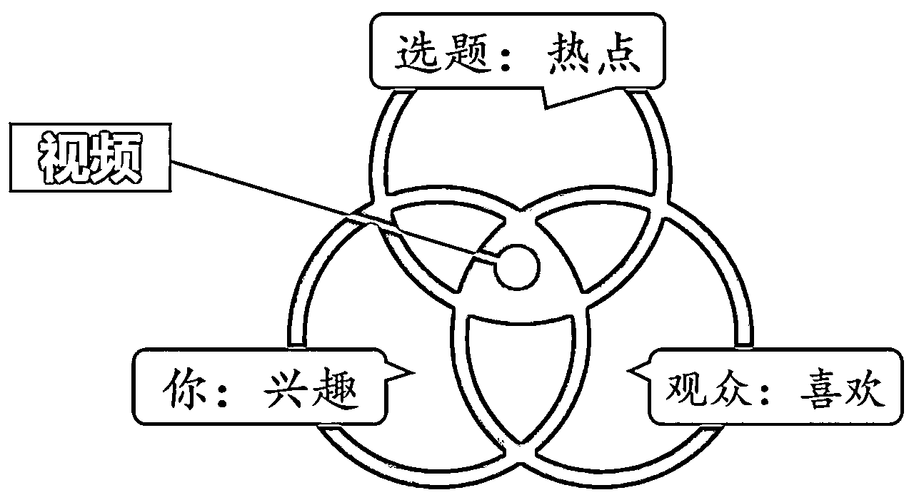

# YouTube 赚钱，我应该做什么？如何选赛道？分享我的观点与看法

> 原文：[`www.yuque.com/for_lazy/zhoubao/qzq896nltuqk2sg1`](https://www.yuque.com/for_lazy/zhoubao/qzq896nltuqk2sg1)

## (64 赞)YouTube 赚钱，我应该做什么？如何选赛道？分享我的观点与看法

作者： 书情小跟班

日期：2024-11-27

有一个圈友，问了我一个不是三言两语能解答的问题，这里就专门写一篇文章好了，她问的问题如下

关于选赛道，文档没写完，到时候补上，我先回答一些更底层的认知吧

文章接下来围绕下面这张图展开

再啰嗦一下，这个帖子她估计没看，你要抄，要靠流量赚钱，先看看别人加入了 PYY 没有啊，你要搞清楚，你是纯纯的通过流量赚钱，还是你只是在 YouTube 上引流

我在点评儿童赛道就有说过

好了，回到正题，我们看图说话

自媒体选题指南：三条腿凳子的平衡

所有做自媒体的人应该把上面这样一个图放在脑子里，永远不要忘记，这是你的指南针，它是如此重要。

下面我来给大家讲解一下。这就像一个凳子的三条腿，你可以想象，一个凳子如果只有一条腿是坐不稳的，两条腿就像拄拐杖，三条腿才是稳定的。

这三条腿代表你、选题和观众之间的关系，它们要达到一个平衡。也就是说，这三者同样重要。一个凳子三条腿差不多长度，所以用这种形式来表现它们之间的相互关系。

我们首先解决选题的问题。**在热点中选题，首先能保证观众对你这期节目的兴趣，基本的播放量就会有所保证，因为这是一个热点。**

那么什么是热点？大家感兴趣的就是热点。

**举一个公司的案例**

某知名品牌，某杜，我还特意进行了打码

你说某杜营销玩得这么溜，在它的领域占有一席之地也是很好理解了吧，还是正经一点吧，下面举一个专业人士的高端操作

**举一个个体的案例**

美国禁止中国芯片，卡我们的脖子。你看李永乐老师，他从美国打压中兴这个事件入手，做了一期节目，解释为什么他们可以打压我们，为什么芯片难做。他展示的是专业知识，但他蹭的热点是中美关系的国际博弈。

热点是热点，你是你，你能不能蹭得上，还是得看你自己，你太重要了。

整个世界虽然是客观存在的，但我们作为个体来体验这个世界，中心就是你。

**你可以做任何方向，以任何形式去做。兴趣无比重要。**

虽然你可以勉强自己抓热点，解决观众的问题，做到一个能养活你或者赚点小钱的频道，但是你会变得不快乐，做得很痛苦，越做越痛苦。

**一定要做自己感兴趣的东西。如果不知道自己的兴趣，坚决要找到它，哪怕一年、三年、五年才能找到。从你找到兴趣那一刻起，你做的都是兴趣。**

注意，这个兴趣不是找到后就一辈子干那个事情。你找到时，这个兴趣可能只维持一年，你就认真快乐地干一年。第二年，兴趣转变了，你干别的东西去，没毛病。

兴趣解决了，那么持续输出的问题就解决了

感兴趣的东西要全力以赴去做，全力以赴把它当做一个生意来做。生意要有客户，在油管和自媒体世界里就是观众。你要追逐热点，因为观众喜欢，你也应该喜欢。追逐热点不是为了讨好观众，而是因为你对某个专业的兴趣，通过热点看到这个东西和你的专业相关。

兴趣解决了，持续输出也没有问题，接下来要考虑的点就是观众，你不能自嗨，自己唱独角戏，眼里没有观众。

下面列举眼中有观众的案例与思考

1、真正厉害的诺贝尔物理学家给初中生讲物理，一定比初中的物理老师讲得好。他不会说我要讲的物理只有博士生、博士后才能听得懂。

既然你出来做，就必须尊重观众，而不是迎合他们。你得知道观众是谁，比如初中生，我是一个物理学家，我要给初中生讲物理，没有必要摆高级，不要讲得他们听不懂。

**你要清楚地知道对什么样的观众讲什么样的内容，尽最大努力让你的目标观众听得清楚、明白，还觉得有趣、放松。**

2、费曼学习法的核心就是把复杂的东西讲到不会的人也能懂。你可以在网上搜搜看，有讲量子物理给 5 岁小孩、初中生、家庭妇女的多个版本，都可以讲。

**值得警惕的一个点：**

**我们要做观众喜欢的内容，但如果做不好，就会变成迎合观众，被观众绑架。**

所以你要坚持自己的兴趣，不要堕落到只是迎合观众或取悦他们的低级趣味。在这个过程中要时时刻刻检讨这三条腿，义正词严、光明正大地蹭热点，坚守你的兴趣和鲜明的个性，坚定的三观。

然后，跟谁都能说上话，了解主要观众的心理，把视频的精华内容以他们喜闻乐见的方式呈现。

还是回到这个图

如果这是一个平面，从立体角度看，哪个是最基础的呢？**就是你，你是整个事业、项目、频道的根基。没有你，整个项目就不存在。**

**在一个小白刚开始做的时候，一定是先从个人的兴趣入手，这个时候，忘记观众，别去看涨粉，别去看观看量。这时根本不需要考虑观众的问题。**

**当他的兴趣、形式、内容方向全部确定时，再花时间琢磨自己的视频如何才能让观众喜欢。**

你做视频就在这个中心区域里头去做。有没有蹭热点？是不是你感兴趣的东西？以自媒体的专业人士的修养来要求自己。

既然出来做，就把它做好，做到别人看的人逻辑清晰，生动活泼，看完以后有所教益，最起码是一个快乐的被陪伴的时光。

拿我自己来举例，我从去年分享 YouTube 相关的内容，这个时候，没人要求我要分享啥，写了也不会有精华，为什么要分享？

因为是刚好在做，也就顺手写了相关帖子，写这些帖子，是从我自我的兴趣出发。

我是程序员，一些最新的技术，是用英文来写的，那么就避免不了上网，避免不了上网，就避免不了顺手看 YouTube,看着看着，就顺手做了 YouTube。

关于蹭热点这事，也是纯属偶然，我去年写帖子的时候，没几个人看，现在有人看，说明有热点嘛，这个热点的来源自于生财在推 YouTube,我在生财发关于 YouTube 相关的内容其实就是间接就蹭了热点了。

小结一下：

1、我先是自己有兴趣，做自己感兴趣的事，分享自己感兴趣内容

2、生财恰好在推 YouTube，我写的帖子就刚好蹭了热点有人看

很多东西，你只有长期泡在某个领域才能了解到这个领域的一些外人不为人知的常识，比如说，我不说海外住宅 IP，如果是外行人，根本就不知道有这个东东。

你说你要疯狂上杠杆，你要多账号做，上矩阵，但是呢，你的 IP 有问题，有些人甚至用免费的节点来做，就是图省钱，做得累死累活，回头发现白做了。

如果用免费的节点，有些人用这些免费的节点做点啥不好的事，那么你用的这个节点就被标志为风险 IP，你在这个有风险的 IP 上猛做，大做，特做，想着接下来有回报
，这里就给你泼一个冷水，让你清醒下，你就是活在梦里，所做的一切都是徒劳无功。

我写的帖子，你之所有耐着性子花时间看，那是真的为你好，让你少走弯路，之前在生财写的帖子，我都记录到这个飞书文档，这样，你就不用一个个去翻了，这一点也是从观众的角度考虑，给你们方便。

做 YouTube 的一些常识 [`rlwxa0zgke.feishu.cn/docx/P2DYduGbkoW0nqxcRZgcL6xKn7I`](https://rlwxa0zgke.feishu.cn/docx/P2DYduGbkoW0nqxcRZgcL6xKn7I)

* * *

评论区：

shirley : 好早，真的是越棒的人越努力哦[玫瑰]

嘉应岛主 : 已收藏，感谢分享，重点去看了 You to
be 的常识[强]。我特别喜欢文中：这个兴趣不是找到后就一辈子干那个事情。你找到时，这个兴趣可能只维持一年，你就认真快乐地干一年。第二年，兴趣转变了，你干别的东西去，没毛病。一定要做自己感兴趣的东西。如果不知道自己的兴趣，坚决要找到它，哪怕一年、三年、五年才能找到。从你找到兴趣那一刻起，你做的都是兴趣。

希声 : 先赞后看

小高 : 1

一卒 : 感谢，正好在思考这个问题，帮到我了

目光 : 挺有启发的，我最近一直在看有什么赛道是值得做得，看着看着才发现，我漏了考虑自己的兴趣

书情小跟班 : 恭喜你